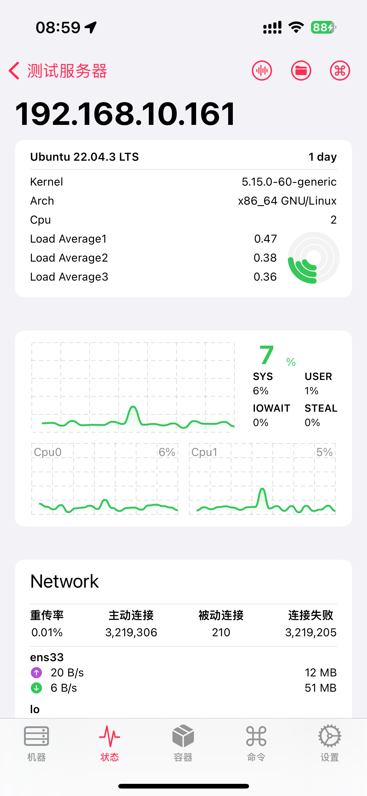

# ASP.NET Core+Systemd部署至Ubuntu #

> 介绍如何在 Ubuntu 20.04.3 LTS 服务器上设置生产就绪 ASP.NET Core 环境。

{data-zoomable}

## Systemd ##

`systemd` 可用于创建服务文件以启动和监视基础 Web 应用。 `systemd` 是一个初始系统，可以提供启动、停止和管理进程的许多强大的功能。

### 创建服务定义文件 ###

```bash
sudo vim /etc/systemd/system/admin-api.service
```

### ini 服务文件 ###

```bash
[Unit]
Description=SunnyService.NET Admin Web API App running on Ubuntu
After=network.target

[Service]
WorkingDirectory=/var/sunnyservice/apis_test/admin
ExecStart=/home/wux/dotnet/dotnet /var/sunnyservice/apis_test/admin/WebAPI.dll
Restart=always
# Restart service after 10 seconds if the dotnet service crashes:
RestartSec=10
KillSignal=SIGINT
SyslogIdentifier=sunnyservice-admin
User=wux
Environment=ASPNETCORE_ENVIRONMENT=Production
Environment=DOTNET_PRINT_TELEMETRY_MESSAGE=false

[Install]
WantedBy=multi-user.target
```

在前面的示例中，管理服务的用户由 User 选项指定。 用户 (www-data) 必须存在并且拥有正确应用文件的所有权。

使用 `TimeoutStopSec` 配置在收到初始中断信号后等待应用程序关闭的持续时间。 如果应用程序在此时间段内未关闭，则将发出 SIGKILL 以终止该应用程序。 提供作为无单位秒数的值（例如，150）、时间跨度值（例如，2min 30s）或 infinity 以禁用超时。 TimeoutStopSec 默认为管理器配置文件 (systemd-system.conf, system.conf.d, systemd-user.conf, user.conf.d) 中 DefaultTimeoutStopSec 的值。 大多数分发版的默认超时时间为 90 秒。

```bash
# The default value is 90 seconds for most distributions.
TimeoutStopSec=90
```

Linux 具有区分大小写的文件系统。 将 `ASPNETCORE_ENVIRONMENT` 设置为 `Production` 时，将搜索配置文件 `appsettings.Production.json`，而不搜索 `appsettings.production.json`。

必须转义某些值（例如，SQL 连接字符串）以供配置提供程序读取环境变量。 使用以下命令生成适当的转义值以供在配置文件中使用：

```bash
systemd-escape "<value-to-escape>"
```

环境变量名不支持冒号 (:) 分隔符。 使用双下划线 (__) 代替冒号。 环境变量读入配置时，环境变量配置提供程序将双下划线转换为冒号。 以下示例中，连接字符串密钥 `ConnectionStrings:DefaultConnection` 以 `ConnectionStrings__DefaultConnection` 形式设置到服务定义文件中：

```bash
Environment=ConnectionStrings__DefaultConnection={Connection String}
```

`After=network.target` 是`systemd`服务单元文件中的一个设置，它指定了服务单元应该在哪个系统目标（target）之后启动。在这种情况下，`network.target` 指的是网络服务的启动。这个设置确保了在网络服务启动之后，才会启动你的服务单元。这是因为在某些情况下，你的服务可能需要依赖于网络服务。这个设置可以确保你的服务在网络服务可用时启动，避免了启动服务时出现问题的可能性。

### 启用服务 ###

```bash
sudo systemctl enable admin-api.service
```

### 查看服务 ###

```bash
sudo systemctl start admin-api.service
sudo systemctl status admin-api.service
sudo systemctl stop admin-api.service
```

## 查看日志 ##

使用 `Kestrel` 的 Web 应用是通过 `systemd` 进行管理的，因此所有事件和进程都被记录到集中日志。 但是，此日志包含由 systemd 管理的所有服务和进程的全部条目。 若要查看特定于 `kestrel-helloapp.service` 的项，请使用以下命令：

```bash
sudo journalctl -fu admin-api.service
```

有关进一步筛选，使用时间选项（如 `--since today`、`--until 1 hour ago`）或这些选项的组合可以减少返回的条目数。

```bash
sudo journalctl -fu admin-api.service --since "2016-10-18" --until "2016-10-18 04:00"
```
