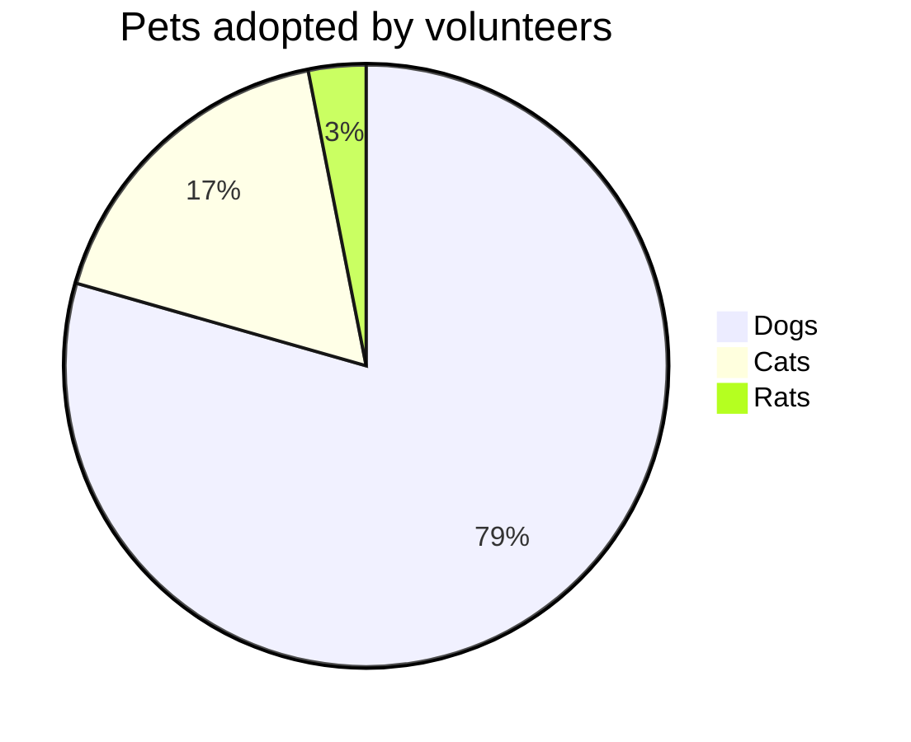
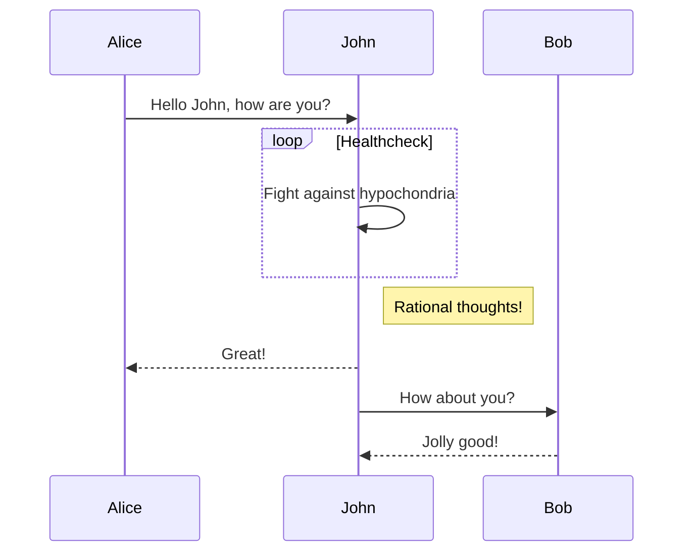

$\sqrt{3x-1}+(1+x)^2$

测试脚注 [^1]

[^1]: 脚注出处

$$\begin{array}{c}

\nabla \times \vec{\mathbf{B}} -\, \frac1c\, \frac{\partial\vec{\mathbf{E}}}{\partial t} &
= \frac{4\pi}{c}\vec{\mathbf{j}}    \nabla \cdot \vec{\mathbf{E}} & = 4 \pi \rho \\

\nabla \times \vec{\mathbf{E}}\, +\, \frac1c\, \frac{\partial\vec{\mathbf{B}}}{\partial t} & = \vec{\mathbf{0}} \\

\nabla \cdot \vec{\mathbf{B}} & = 0

\end{array}$$

::: info
This is an info box.
:::
::: tip
This is a tip.
:::
::: warning
This is a warning.
:::
::: danger
This is a dangerous warning.
:::
::: details
This is a details block.
:::
::: details 查看源码
This is a details block.
:::
