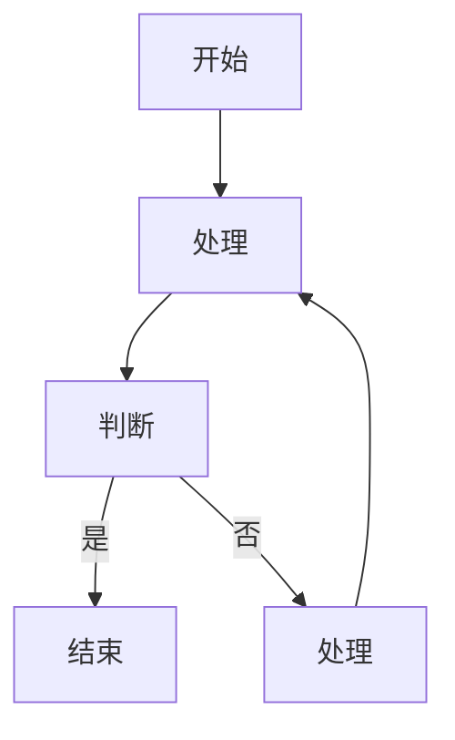
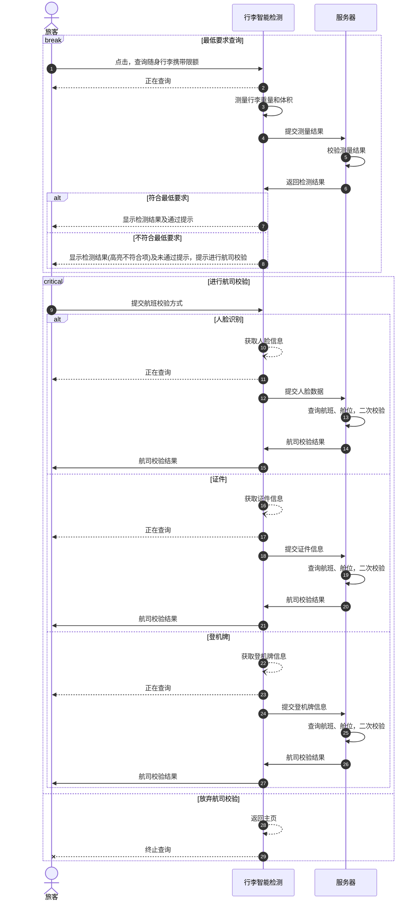
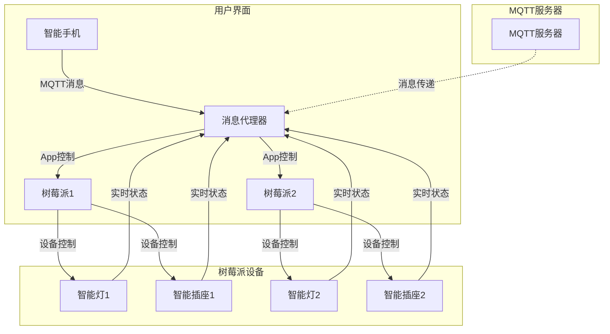

## 项目目标 ##

为从无锡硕放机场出发的常旅客提供随身行李限额检测，避免用户值机时错误预估行李尺寸而在安检时要求办理行李托运带来的不良影响，提升无锡硕放机场地面服务整体水平、维护良好形象。

## 系统要求 ##

- Windows 10 X64 及以上版本
- DOTNET 8 Runntime
- 人脸识别、证件识别、登机牌识别等相关硬件要求环境依赖

## 业务流程 ##

## 操作流程 ##

## 硬件交互 ##

## 功能页面 ##

{data-zoomable}

{data-zoomable}

{data-zoomable}

{data-zoomable}

{data-zoomable}

{data-zoomable}

## 横版设计 ##

{data-zoomable}

{data-zoomable}

{data-zoomable}

{data-zoomable}

{data-zoomable}
