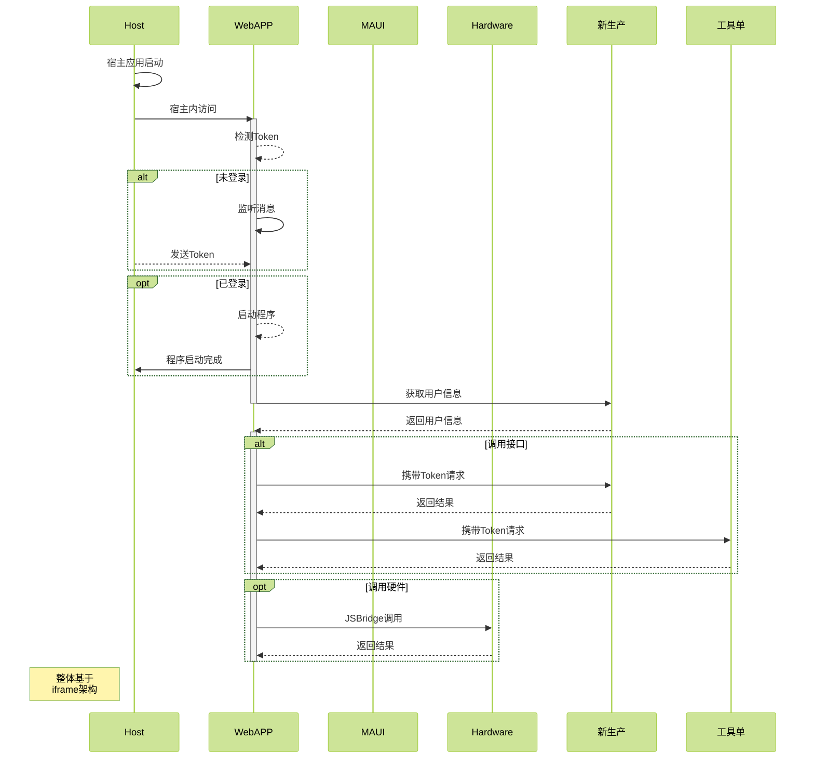

## 简介 ##

基于 Maui 实现跨平台的 Hybird 应用平台，通过 `iframe` 和 `jsbridge` 的封装，完成子系统的嵌套及系统通信。

## 架构 ##

{data-zoomable}

<RoughMermaid>

```mermaid
%%{init: {'theme':'forest'}}%%
sequenceDiagram
	participant A as Host
	participant B as WebAPP
	participant C as MAUI
	participant D as Hardware
	participant E as 新生产
	participant F as 工具单

	A->>A:宿主应用启动
	A->>B:宿主内访问
    activate B
	    B-->>B:检测Token

        alt 未登录
            B->>B:监听消息
            A-->>B:发送Token
        end
        opt 已登录
            B-->>B:启动程序
            B->>A:程序启动完成
        end
        B->>E:获取用户信息
	  deactivate B
    
    E-->>B:返回用户信息
      activate B
        alt 调用接口
          B->>E:携带Token请求
          E-->>B:返回结果
          B->>F:携带Token请求
          F-->>B:返回结果
        end

        opt 调用硬件
          B->>D:JSBridge调用
          D-->>B:返回结果
        end
      deactivate B

	%% left or right
	note left of A:整体基于<br>iframe架构
```

</RoughMermaid>
