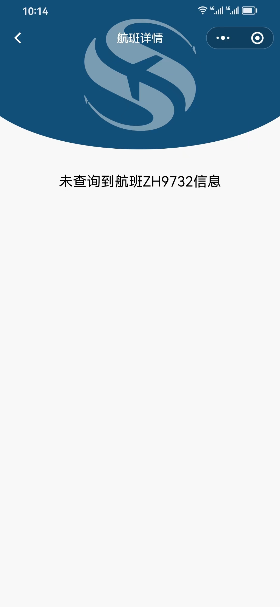

---
---

::: info
This is an info box.
:::
::: tip
This is a tip.
:::
::: warning
This is a warning.
:::
::: danger
This is a dangerous warning.
:::
::: details
This is a details block.
:::
::: details 查看源码
This is a details block.
:::


## 预览图 ##

{data-zoomable}

## 使用说明 ##

### 引入npm 包 ###

```bash

    npm i wx-navigation-bar

```

### 页面或全局引用 ###

```json

    "usingComponents": {
      "my-navigation-bar": "wx-navigation-bar/navigation-bar"
    }

```

### 页面使用 ###

```html

    <my-navigation-bar title="{{title}}" backgroundcolor="var(--td-brand-color)">
        <t-icon slot="arrow-left" color="#fff" name="chevron-left" size="56rpx" />
    </my-navigation-bar>

```

## 属性配置 ##

| Tables        | Are           | Cool  |
| ------------- |:-------------:| -----:|
| col 3 is      | right-aligned | $1600 |
| col 2 is      | centered      |   $12 |
| zebra stripes | are neat      |    $1 |
