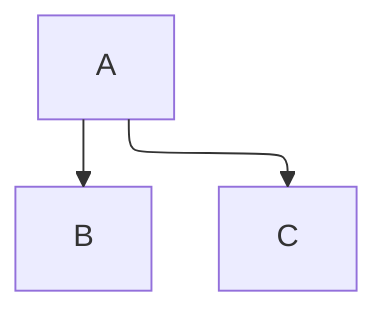
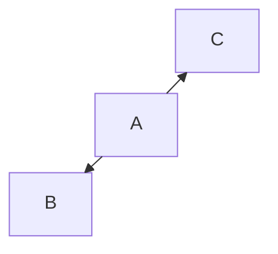
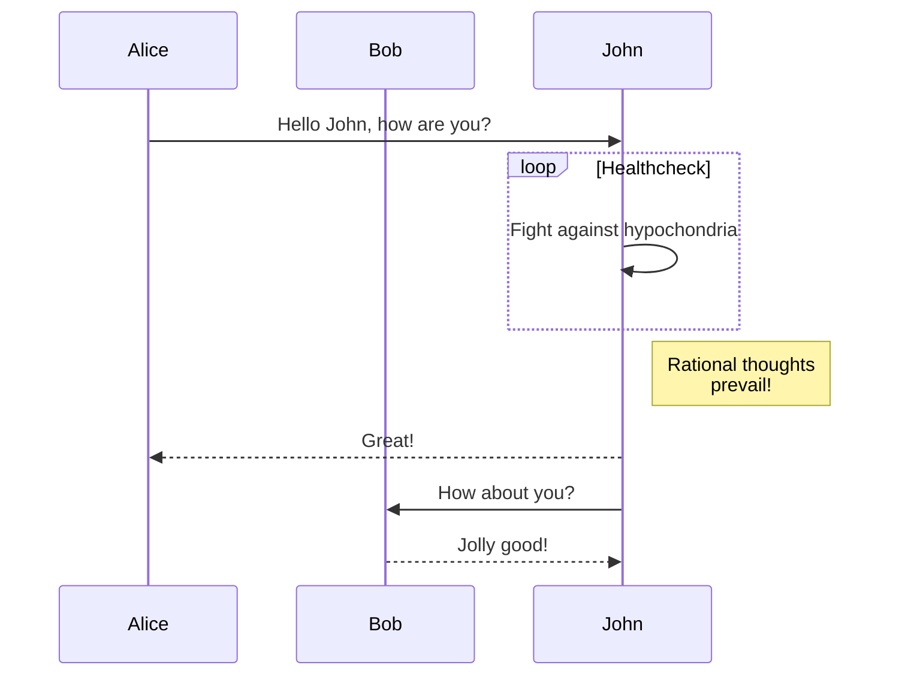
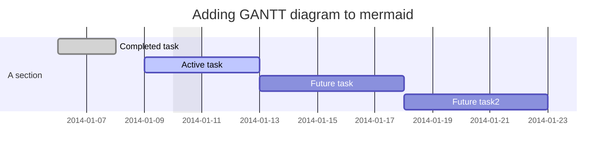
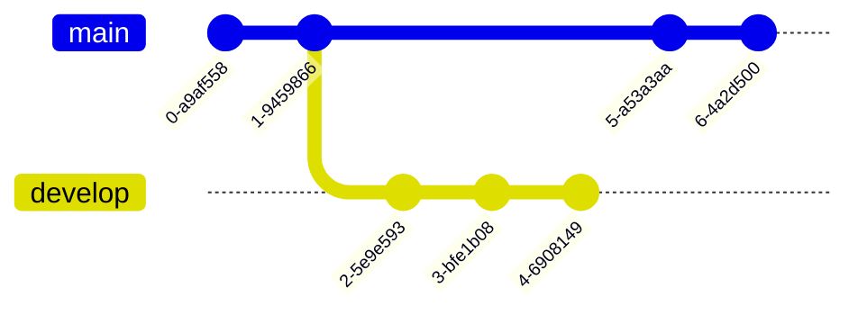
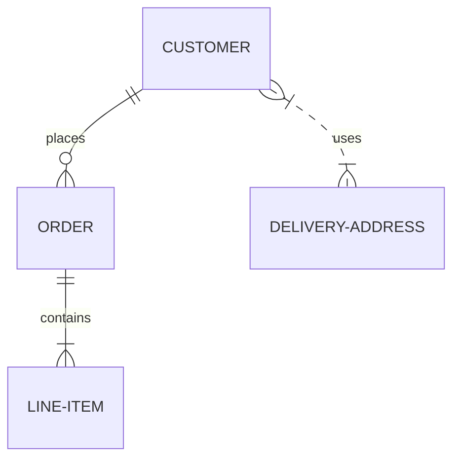
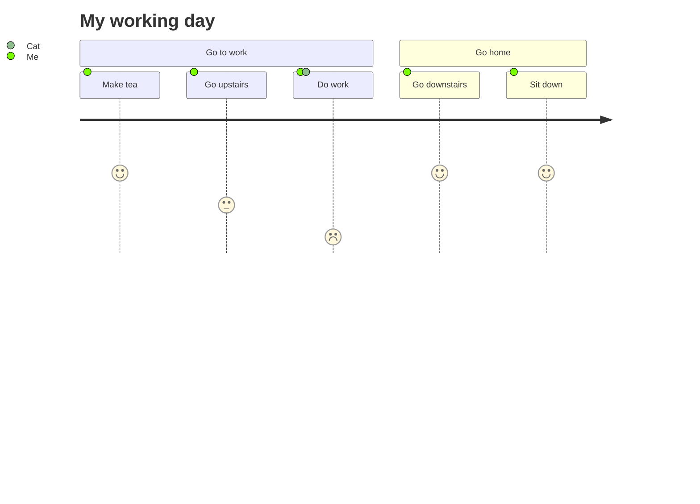
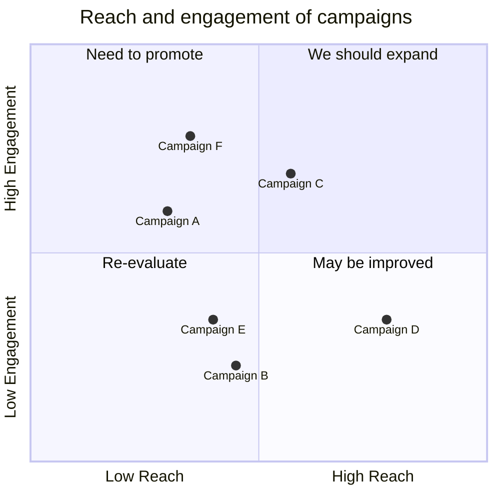
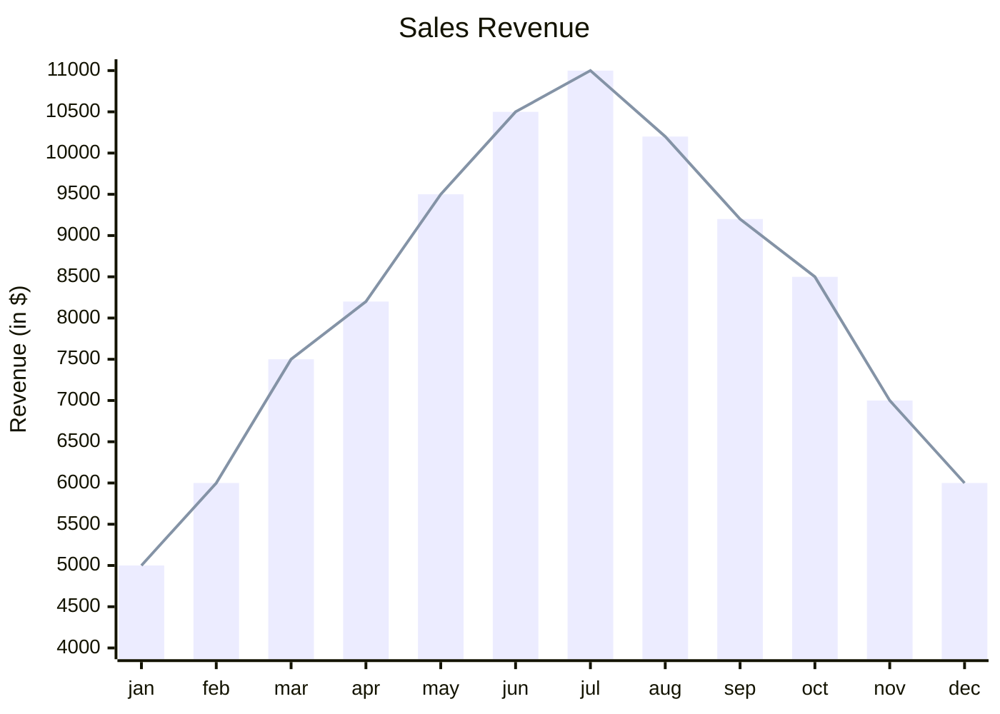

# Mermaid：Markdown绘图神器 #

Mermaid 是一种强大的基于 JavaScript 的图形工具，让创建和修改复杂图表变得更加轻松。它采用了类似 Markdown 的语法，允许用户用简易的文本定义来构建图表，进而实现将复杂的图形信息简化为直观易懂的视觉表现。

Mermaid 的核心特性是照顾到了当今开发环境下的需求，即为快速发展的项目提供了适应的文档支持。传统的图表制作与文档编写通常会消耗大量的开发时间，而这在快节奏的开发流程中是不可接受的。 Mermaid 的解决方案是让用户可以生成和修改图表，免去了在绘图软件中重复创建和修改的繁琐步骤。而且，由于 Mermaid 图表能直接嵌入脚本和其他代码中，它为编写丰富的技术文档提供了广泛的可能性，例如设计文档、API 文档和用户手册等。

Mermaid 不仅提供了一组预定义的图表类型（如流程图、序列图和甘特图等），还允许用户通过自定义 CSS 来控制图表的颜色、线条样式和布局。这意味着，与许多其他工具相比，Mermaid 提供了更大的图表定制能力，可以满足对数据图表有着高度个性化需求的用户的需要。


## 图表类型 ##

### 流程图 ###

```text
flowchart TD;
  A-->B;
  A-->C;
  B-->D;
  C-->D;
```








### 序列图 ###

```text
        sequenceDiagram
        participant Alice
        participant Bob
        Alice->>John: Hello John, how are you?
        loop Healthcheck
            John->>John: Fight against hypochondria
        end
        Note right of John: Rational thoughts <br/>prevail!
        John-->>Alice: Great!
        John->>Bob: How about you?
        Bob-->>John: Jolly good!
``` 



### 甘特图 ###

``` txt
        gantt
        dateFormat  YYYY-MM-DD
        title Adding GANTT diagram to mermaid
        excludes weekdays 2014-01-10

        section A section
        Completed task            :done,    des1, 2014-01-06,2014-01-08
        Active task               :active,  des2, 2014-01-09, 3d
        Future task               :         des3, after des2, 5d
        Future task2               :         des4, after des3, 5d
``` 





### 类图 ###

``` txt
        classDiagram
        Class01 <|-- AveryLongClass : Cool
        Class03 *-- Class04
        Class05 o-- Class06
        Class07 .. Class08
        Class09 --> C2 : Where am i?
        Class09 --* C3
        Class09 --|> Class07
        Class07 : equals()
        Class07 : Object[] elementData
        Class01 : size()
        Class01 : int chimp
        Class01 : int gorilla
        Class08 <--> C2: Cool label
``` 

``` mermaid
        classDiagram
        Class01 <|-- AveryLongClass : Cool
        Class03 *-- Class04
        Class05 o-- Class06
        Class07 .. Class08
        Class09 --> C2 : Where am i?
        Class09 --* C3
        Class09 --|> Class07
        Class07 : equals()
        Class07 : Object[] elementData
        Class01 : size()
        Class01 : int chimp
        Class01 : int gorilla
        Class08 <--> C2: Cool label
 ``` 

### Git 图 ###

``` txt
        gitGraph
           commit
           commit
           branch develop
           commit
           commit
           commit
           checkout main
           commit
           commit
``` 



### 实体关系图（Er模型） ###

``` txt
        erDiagram
            CUSTOMER ||--o{ ORDER : places
            ORDER ||--|{ LINE-ITEM : contains
            CUSTOMER }|..|{ DELIVERY-ADDRESS : uses
``` 



### 用户旅程图 ###


``` txt
        journey
            title My working day
            section Go to work
              Make tea: 5: Me
              Go upstairs: 3: Me
              Do work: 1: Me, Cat
            section Go home
              Go downstairs: 5: Me
              Sit down: 5: Me
``` 



### 象限图 ###

``` txt
        quadrantChart
            title Reach and engagement of campaigns
            x-axis Low Reach --> High Reach
            y-axis Low Engagement --> High Engagement
            quadrant-1 We should expand
            quadrant-2 Need to promote
            quadrant-3 Re-evaluate
            quadrant-4 May be improved
            Campaign A: [0.3, 0.6]
            Campaign B: [0.45, 0.23]
            Campaign C: [0.57, 0.69]
            Campaign D: [0.78, 0.34]
            Campaign E: [0.40, 0.34]
            Campaign F: [0.35, 0.78]
``` 



### XY Chart ###

``` txt
        xychart-beta
            title "Sales Revenue"
            x-axis [jan, feb, mar, apr, may, jun, jul, aug, sep, oct, nov, dec]
            y-axis "Revenue (in $)" 4000 --> 11000
            bar [5000, 6000, 7500, 8200, 9500, 10500, 11000, 10200, 9200, 8500, 7000, 6000]
            line [5000, 6000, 7500, 8200, 9500, 10500, 11000, 10200, 9200, 8500, 7000, 6000]
``` 



