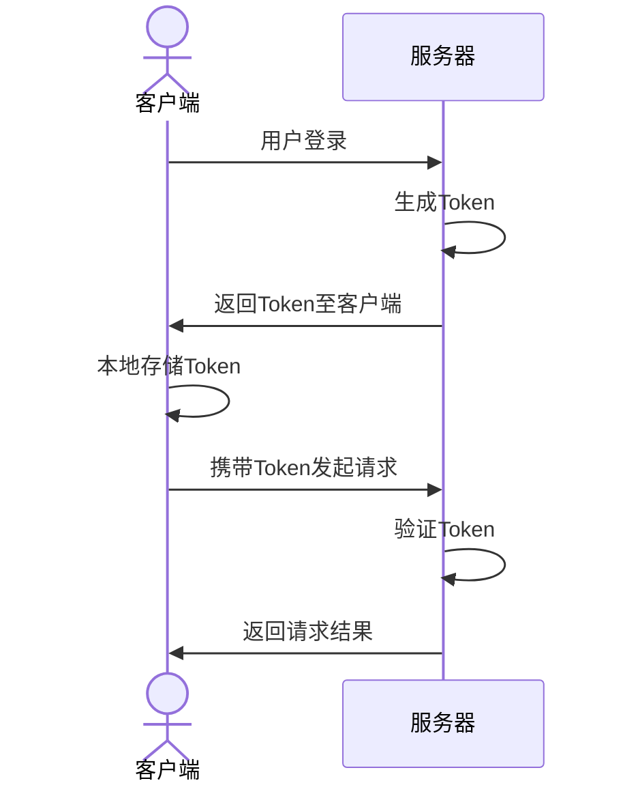

# 什么是 JWT？它是如何工作的？ #

在 Web 开发中，JWT 已成为一种流行且安全的方法，用于身份验证和信息交换，在这篇文中，我们将深入探讨JWT 的概念、工作流、优势和使用的注意事项。

## 什么是JWT? ##

JWT，全称 JSON Web Token，它是一种基于 JSON的开放标准（RFC 7519），用于在各方之间作为 JSON 对象安全地传输信息。由于其数字签名的特性，JWT通常用于身份验证和信息交换。

**JWT由三部分组成：**

1. Header（头部）
2. Payload（负载）
3. Signature（签名）

这三部分通过点（.）分隔，比如下面为一个JWT值：

```text
eyJhbGciOiJSUzI1NiIsImtpZCI6IkYxREREQ0NCODNGQjZBOEVCRTk5MUU1QzE0N0YwMTkxNUZCMUI2OEIiLCJ0eXAiOiJKV1QifQ.
eyJodHRwOi8vc2NoZW1hcy54bWxzb2FwLm9yZy93cy8yMDA1LzA1L2lkZW50aXR5L2NsYWltcy9zaWQiOiIzM2ZmMDE0ODI3ZjQ0YzJhYjFkZjk0NDQ3ZmI3Y2IyZiIsImh0dHA6Ly9zY2hlbWFzLnhtbHNvYXAub3JnL3dzLzIwMDUvMDUvaWRlbnRpdHkvY2xhaW1zL25hbWUiOiJTdXBlckFkbWluIiwiYXVkIjpbIlN1cGVyQWRtaW4yMDI0LzgvMSAxMToyMjowOSIsIlN1cGVyQWRtaW4yMDI0LzgvMSAxMToyMjowOSJdLCJpc3MiOiJDYXJlcyIsImlhdCI6IjE3MjI0ODI1MjkiLCJodHRwOi8vc2NoZW1hcy5taWNyb3NvZnQuY29tL3dzLzIwMDgvMDYvaWRlbnRpdHkvY2xhaW1zL2V4cGlyYXRpb24iOiIyMDI0LzgvMSAxMjoyMjowOSIsImh0dHA6Ly9zY2hlbWFzLm1pY3Jvc29mdC5jb20vd3MvMjAwOC8wNi9pZGVudGl0eS9jbGFpbXMvcm9sZSI6Ik5ld0xpZmU6U1VQRVJfQURNSU4iLCJuYmYiOjE3MjI0ODI1MjksImV4cCI6MTcyMjQ4NjEyOX0.
D_MEKuj0BaztoVr5Sq3H1Dak_blHCoEybeerBVicS2hVxRW7gd6pzsrQfl9u7EccNe-wfFjsEqh26ZXtjZ00lX9Bu0OoJ4Cv2Cp5aSjAoAYa4FluRMF-IWfIgyDEnzvLUtTFxi_jAXlPZraOhSnI6VKkK1KzJVl4Mx7S1fC8ooX4UN74qYpnkDeZ5_msjvv0ButWN8laZ5Y1aaCP8h9A0ccscaqrz_w5yRv2B7jAXXNLXfdTtc7NqakDB2HhhcULcETD5i_nq98Dy7u0Xcfk0SDLkGkeZ-HvsQrCrObxiqEgJEW4nttIhOLRxZY470cmtnEBXTpmcMSw-9Nr1DTftA
```

### Header ###

`Header`标头通常由两部分组成：JWT类型和正在使用的签名算法，例如 HMAC SHA256 或 RSA。

```json
{ 
   "alg": "HS256", 
   "typ": "JWT"
}
```

### Payload ###

`Payload`包含声明，这些声明是关于用户或其他数据的陈述。声明可以分为三种类型：注册声明、公共声明和私人声明。

```json
{
  "sub": "test",
  "name": "Lance Chang",
  "iat": 1516349022
}
```

### Signature ###

`Signature`用于验证消息在传输过程中未被篡改，签名是通过对 Header 和 Payload 进行编码后，再加上一个密钥并使用指定的算法生成的。

```typescript
HMACSHA256(
  base64UrlEncode(header) + "." + base64UrlEncode(payload),
  your-256-bit-secret
)
```

## JWT 工作流 ##

关于 JWT的工作流，可以使用下面的示例进行说明：

1. 当用户登录或尝试访问受保护的资源时，服务器会在身份验证成功后生成 JWT（JWT需要设置失效时间） 并返回给客户端；
2. 客户端存储此令牌，通常存储在本地存储或 cookie 中；
3. 对于后面每个需要身份验证的后续请求，客户端都会在请求 header中发送 JWT；
4. 服务器通过检查 JWT验证合法性，以确保用户的真实性和授权性；
5. 如果 JWT有效，服务器执行后续业务操作，如果 JWT无效，服务器可以抛 401无效权限错误；
6. 客户端可以定时向服务器发送更新 JWT的请求。

整个流程可以表示为下面的流程图：

<RoughMermaid>



</RoughMermaid>

## JWT的优势 ##

- 无状态：由于 JWT 本身包含所有必要的信息，因此服务器不需要维护会话信息。这使得 JWT 是无状态的，从而减少了服务器负载并简化了可伸缩性。
- 紧凑高效：由于其紧凑的尺寸，JWT 适合通过网络传输，并且易于被客户端解析。
- 安全性：JWT 经过数字签名，可确保数据完整性并防止篡改。使用加密算法可以进一步增强安全性。
- 跨域通信：JWT 可以跨不同的域或微服务使用，因为它们不依赖于 cookie 或服务器端会话。

## JWT 的使用场景 ##

- 安全存储：将 JWT 存储在仅限 HTTP 的 Cookie 中，以防止来自 JavaScript 的访问，从而降低 XSS 攻击的风险。
- 令牌过期：在 JWT 上设置合理的过期时间，以限制可能滥用的时间窗口。
- 令牌吊销：具有撤销或将受损令牌列入黑名单的机制，以增强安全性。
- 使用HTTPS：确保客户端和服务器之间的所有通信都使用 HTTPS，以防止窃听和中间人攻击。
- 不存储敏感数据：避免在 JWT 有效负载中存储敏感数据，因为一旦 base64 解码，有效负载就很容易读取。

## JWT的注意事项 ##

**安全性**

不要在 JWT中存储敏感信息，尽管它们是经过签名的，但它们是可解码的。
使用强大的加密算法和足够长的密钥。

**过期时间**

一定要使用exp声明设置 JWT的过期时间，确保令牌不会无限期地有效。因为 JWT 一旦生成，服务端没办法失效它，除非等到它自身过期，所以如果 JWT被别人拿到，一直可以使用到 JWT失效 。

**验证**

接收方必须验证JWT的签名和声明（如过期时间、受众等），确保其合法性和有效性。

**跨域问题**

如果在跨域环境中使用JWT，确保正确处理CORS（跨域资源共享）配置。

## 安全争议 ##

有人说 JWT是不安全，因为 JWT 一旦生成，服务端没办法失效它，除非等到它自身过期，所以如果 JWT被别人拿到，一直可以使用到 JWT失效 。

首先，JWT 可以进行签名（HMAC、RSA、ECDSA 等），以确保数据的完整性和认证。它还可以进行加密（JWE），以确保数据的机密性，所以 JWT 是安全的。

至于说 JWT被别人拿到了，那属于信息泄漏的问题，即便再安全签名，如果信息被泄漏了也存在安全风险，说所以通过这点来说 JWT 不安全是不成立的。

如果真的有必要，可以实现一个黑名单机制，以便在需要时撤销特定的 JWT。

## 总而言之 ##

JWT 是一种强大而灵活的工具，用于各方之间的安全身份验证和数据交换。它们的简单性、安全性和无状态性使它们成为现代 Web 应用程序的理想选择。通过了解结构和最佳实践，开发人员可以有效地实施 JWT，以构建安全可靠的身份验证系统。但是，与任何安全机制一样，JWT 应与其他安全实践结合使用，以确保应用程序的可靠性和弹性。
