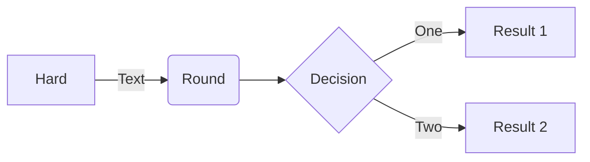
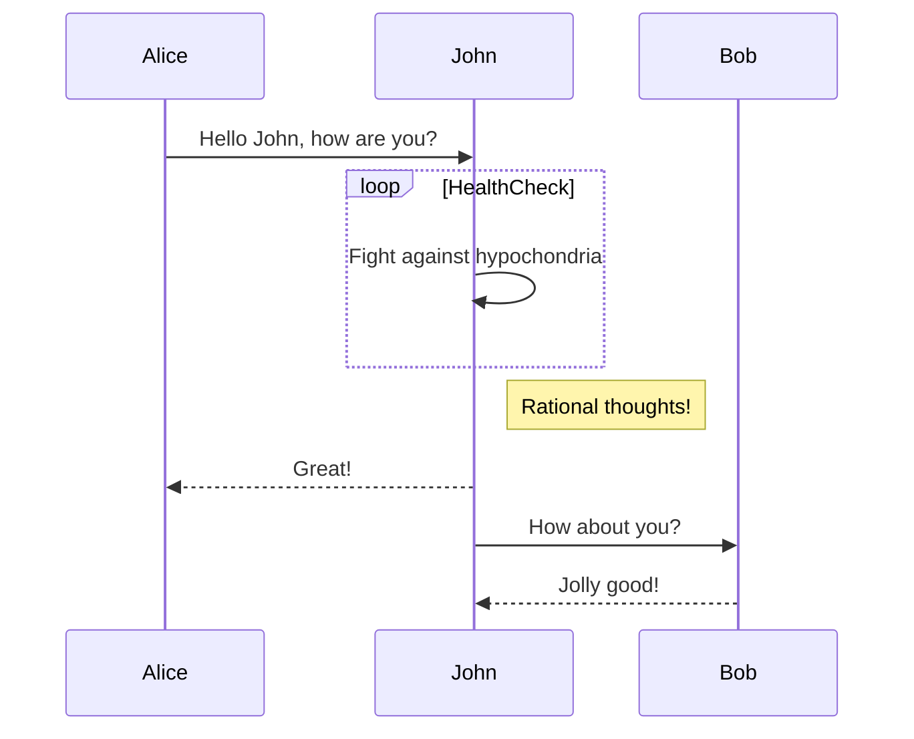
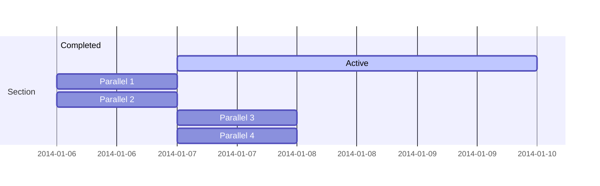
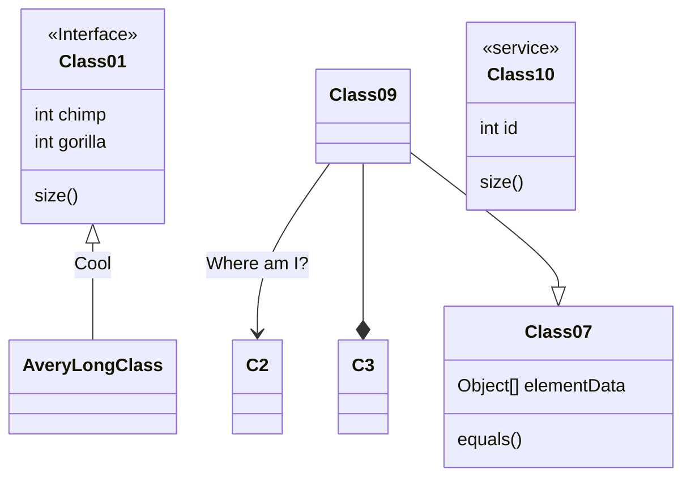
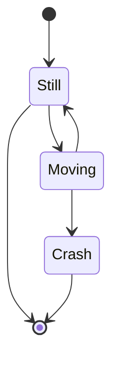
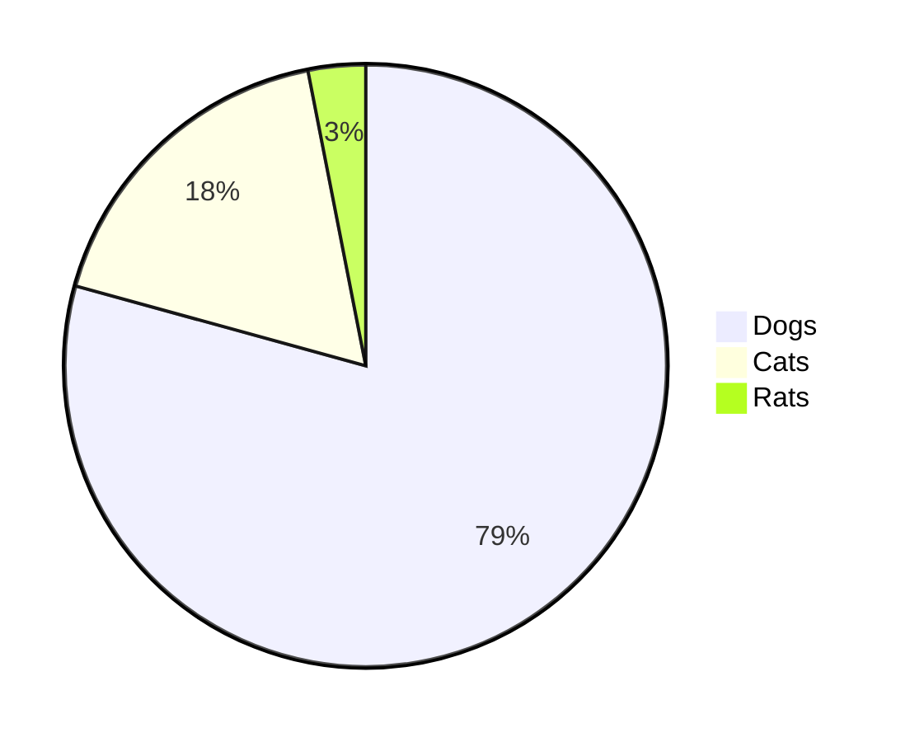
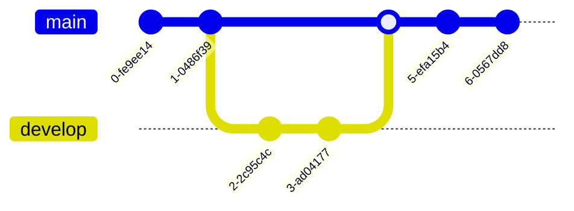

# Markdown 画出各式各样的流程图 #

> Mermaid 是一个基于 JavaScript 的图表绘制工具，它使用类似 Markdown 的文本定义语法，通过渲染器将文本转换为精美的图表。它支持多种类型的图表，包括流程图、时序图、甘特图、类图、状态图、饼图、Git 图、条形图和用户旅程图等。

## 特色优势 ##

- 简单易学：Mermaid 的语法简单易懂，即使没有编程经验的用户也能快速上手。
- 高效便捷：通过文本定义图表，可以轻松地创建、修改和版本控制图表。
- 可集成性强：Mermaid 可以集成到各种应用程序中，例如 Markdown 编辑器、文档工具和代码库等。
- 丰富的功能：Mermaid 支持多种类型的图表，并提供了丰富的配置选项，可以满足各种需求。

## 应用场景 ##

- 文档编写：在技术文档中插入图表，帮助读者理解复杂的概念和流程。
- 代码注释：在代码中使用 Mermaid 绘制图表，解释代码逻辑和功能。
- 项目规划：使用甘特图规划项目进度和任务分配。
- 教学演示：在课件中使用 Mermaid 绘制图表，帮助学生理解知识点。
- 数据分析：使用饼图、条形图等图表展示数据分析和可视化结果。
- 技术博客：在技术博客中使用Mermaid生成图表，使文章更加生动，易于理解。
- 会议记录：在会议记录中使用甘特图来跟踪项目进度。

## 使用方法 ##

### 安装 Mermaid ###

Mermaid 可以通过 npm 安装：

```bash
npm install mermaid
```

### 在 HTML 中使用 Mermaid ###

在 HTML 文件中引入 Mermaid 的 JavaScript 库和 CSS 样式文件：

```html
<script src="https://unpkg.com/mermaid/dist/mermaid.min.js"></script>
<link rel="stylesheet" href="https://unpkg.com/mermaid/dist/mermaid.min.css">
```

在 HTML 文件中添加一个容器元素，并使用 `mermaid` 标签定义图表：

```yaml
<div class="mermaid">
    graph LR
    A[Hard] -->|Text| B(Round)
    B --> C{Decision}
    C -->|One| D[Result 1]
    C -->|Two| E[Result 2]
</div>
```

<br />



## 在 Markdown 中使用 Mermaid ##

使用Mermaid.js非常简单，你只需要编写类似Markdown的文本，然后Mermaid.js会解析这些文本并生成相应的图表。以下是一些基本的使用方法：

## 流程图 ##

```yaml
flowchart LR
    A[Hard] -->|Text| B(Round)
    B --> C{Decision}
    C -->|One| D[Result 1]
    C -->|Two| E[Result 2]
```

<br />


### 序列图 ###

```yaml
sequenceDiagram
    Alice->>John: Hello John, how are you?
    loop HealthCheck
        John->>John: Fight against hypochondria
    end
    Note right of John: Rational thoughts!
    John-->>Alice: Great!
    John->>Bob: How about you?
    Bob-->>John: Jolly good!
```

<br />



### 甘特图 ###

```yaml
gantt
    section Section
    Completed :done,    des1, 2014-01-06,2014-01-08
    Active        :active,  des2, 2014-01-07, 3d
    Parallel 1   :         des3, after des1, 1d
    Parallel 2   :         des4, after des1, 1d
    Parallel 3   :         des5, after des3, 1d
    Parallel 4   :         des6, after des4, 1d
```

<br />



### 类图 ###

```yaml
classDiagram
    Class01 <|-- AveryLongClass : Cool
    <<Interface>> Class01
    Class09 --> C2 : Where am I?
    Class09 --* C3
    Class09 --|> Class07
    Class07 : equals()
    Class07 : Object[] elementData
    Class01 : size()
    Class01 : int chimp
    Class01 : int gorilla
    class Class10 {
        <<service>>
        int id
        size()
    }
```

<br />



### 状态图 ###

```yaml
stateDiagram-v2
    [*] --> Still
    Still --> [*]
    Still --> Moving
    Moving --> Still
    Moving --> Crash
    Crash --> [*]
```

<br />



### 饼图 ###

```yaml
pie
    "Dogs" : 386
    "Cats" : 85.9
    "Rats" : 15
```

<br />



### Git图表 ###

```yaml
gitGraph
      commit
      commit
      branch develop
      checkout develop
      commit 
      commit
      checkout main
      merge develop
      commit
      commit
```

<br />



## 同类项目 ##

- PlantUML：一个基于 Java 的图表绘制工具，支持多种类型的图表，包括时序图、用例图、类图、活动图、组件图、部署图等。
- Graphviz：一个开源的图形可视化工具，可以将文本转换为各种格式的图形文件，例如 PNG、SVG、PDF 等。
- D3.js：一个 JavaScript 库，用于在网页中创建交互式图表和可视化效果。
- Command Line Interface ：Mermaid的命令行接口，允许用户在命令行中快速生成图表。
- Live Editor ：Mermaid的实时编辑器，用户可以实时预览图表的生成过程。
- HTTP Server ：一个HTTP服务器，用于托管Mermaid图表，使得用户可以通过Web访问和编辑图表。

## 总结 ##

Mermaid 是一个功能强大、简单易用的图表绘制工具，可以帮助你轻松地创建和修改各种类型的图表。它具有丰富的功能、灵活的配置选项和良好的可集成性，可以满足各种应用场景的需求。
