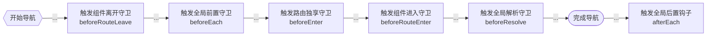

# Vue3路由守卫详解：掌握导航控制的6个核心钩子 #

## 背景 ##

路由守卫是Vue Router的核心功能之一，它允许开发者在路由导航的不同阶段插入控制逻辑。本文将深入解析Vue3中的6种路由守卫，并为每个守卫提供典型的使用场景示例。




## 路由守卫类型 ##

| 守卫类型        |      执行时机      |  使用场景 |
| ------------- | :-----------: | ----: |
| 全局前置守卫      | 路由跳转前 | 身份验证/权限检查 |
| 全局解析守卫      | 路由确认后，组件渲染前 | 数据预加载 |
| 全局后置守卫      | 导航完成后 | 页面访问统计 |
| 路由独享守卫      | 进入特定路由前 | 路由专属校验 |
| 组件进入守卫      | 组件被激活前 | 组件级权限验证 |
| 组件更新守卫      | 路由参数变化时 | 参数变化处理 |
| 组件离开守卫      | 离开当前组件时 | 表单未保存提示 |

## 全局守卫详解 ##

### 全局前置守卫 (beforeEach) ###

使用场景：用户身份验证

```javascript
const router = createRouter({ /*...*/ })

router.beforeEach((to, from, next) => {
  const isAuthenticated = localStorage.getItem('token')
  
  // 需要登录但未登录的页面
  if (to.meta.requiresAuth && !isAuthenticated) {
    next('/login')
  } else {
    next()
  }
})
```

典型应用：当用户尝试访问需要登录的页面（如个人中心）时，检查本地是否存在有效token。

### 全局解析守卫 (beforeResolve) ###

使用场景：权限最终校验

```javascript
router.beforeResolve(async (to) => {
  if (to.meta.requiresAdmin) {
    try {
      await validateAdminPrivileges()
    } catch (error) {
      return '/no-permission'
    }
  }
})
```

典型应用：在管理后台路由中，最终确认用户是否拥有管理员权限。

### 全局后置钩子 (afterEach) ###

使用场景：页面访问统计

```javascript
router.afterEach((to) => {
  analytics.trackPageView(to.fullPath)
})
```

典型应用：收集用户的页面浏览数据用于分析用户行为。

## 路由独享守卫 ##

### 路由独享守卫 (beforeEnter) ###

使用场景：付费内容访问控制

```javascript
const routes = [{
  path: '/premium-content',
  component: PremiumContent,
  beforeEnter: (to, from, next) => {
    if (!userStore.isSubscribed) {
      next('/upgrade')
    } else {
      next()
    }
  }
}]
```

典型应用：限制未订阅用户访问付费专区内容。

## 组件级守卫 ##

### 组件进入守卫 (beforeRouteEnter) ###

使用场景：数据预加载

```javascript
export default {
  beforeRouteEnter(to, from, next) {
    fetchInitialData(to.params.id).then(data => {
      next(vm => vm.setData(data))
    })
  }
}
```

典型应用：在文章详情页加载前预先获取文章内容。

### 组件更新守卫 (beforeRouteUpdate) ###

使用场景：动态参数处理

```javascript
export default {
  beforeRouteUpdate(to, from) {
    this.productId = to.params.id
    this.loadProductData()
  }
}
```

典型应用：商品详情页中切换不同商品ID时刷新数据。

### 组件离开守卫 (beforeRouteLeave) ###

使用场景：表单保存提示

```javascript
export default {
  beforeRouteLeave(to, from, next) {
    if (this.unsavedChanges) {
      const confirm = window.confirm('有未保存的修改，确定离开吗？')
      next(confirm)
    } else {
      next()
    }
  }
}
```

典型应用：在文章编辑页面离开时提示保存修改。

## 守卫执行顺序图解 ##

```text
开始导航
↓
触发组件离开守卫（beforeRouteLeave）
↓
触发全局前置守卫（beforeEach）
↓
触发路由独享守卫（beforeEnter）
↓
触发组件进入守卫（beforeRouteEnter）
↓
触发全局解析守卫（beforeResolve）
↓
完成导航
↓
触发全局后置钩子（afterEach）
```

## 最佳实践建议 ##

- **权限校验链**：全局守卫进行基础校验 → 路由独享守卫进行特定校验 → 组件守卫进行最终校验
- **异步处理**：在守卫中使用async/await处理异步操作时，要确保正确调用next()
- **性能优化**：避免在全局守卫中执行耗时操作，必要时可结合路由懒加载
- **调试技巧**：使用router.onError()捕获导航过程中的异常

## 常见问题排查 ##

- Q：为什么守卫中next()被多次调用？
  - A：确保每个代码路径只调用一次next()
- Q：如何中断当前导航？
  - A：在守卫中返回false或返回新的路由地址
- Q：组件守卫不生效怎么办？
  - A：检查组件是否通过路由渲染（需使用渲染）

掌握这些路由守卫的使用场景和最佳实践，将帮助您构建更安全、更健壮的Vue3应用。建议根据项目实际需求选择合适的守卫组合，在保证安全性的同时兼顾用户体验。
