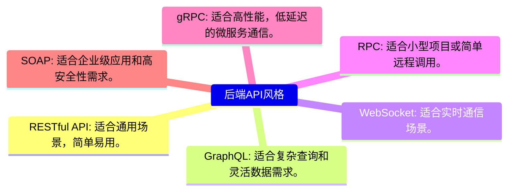
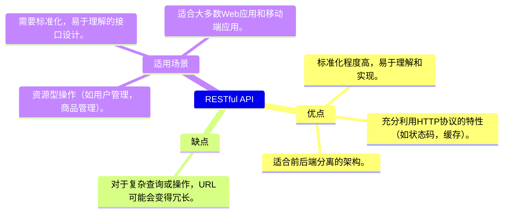
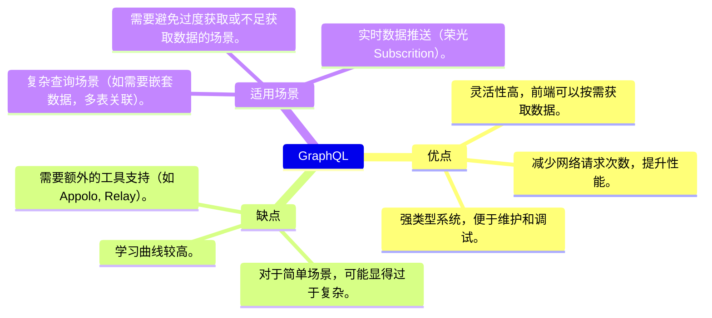
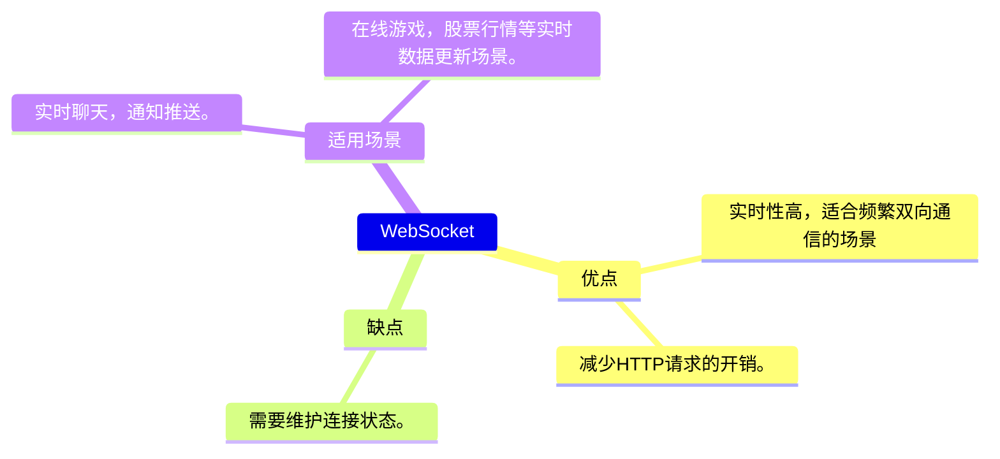
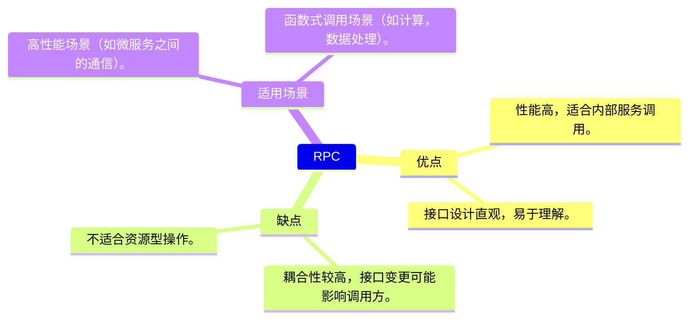
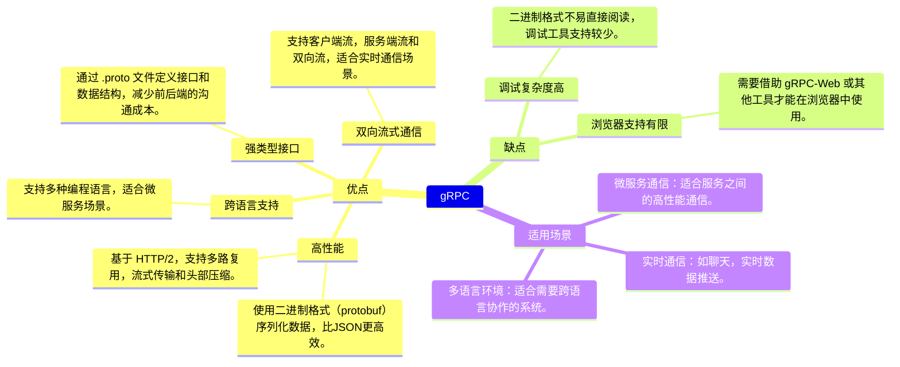
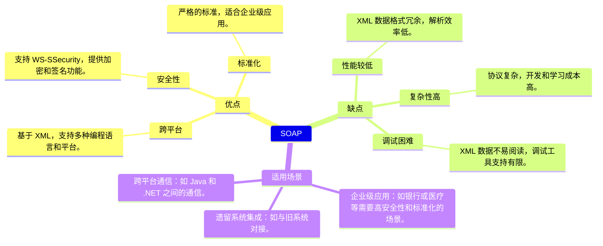
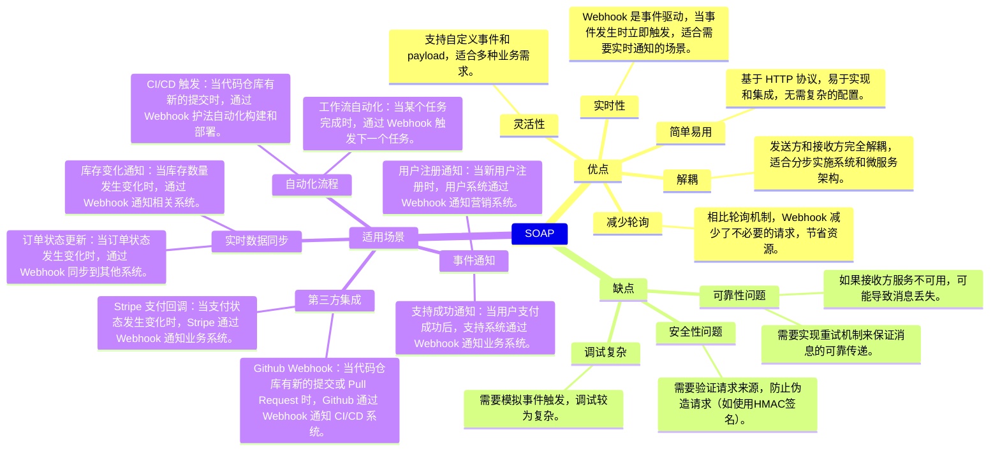

# API 风格选对了，文档写好了，项目就成功了一半 #

在前后端开发中，API文档和API风格设计是提高开发效率、减少沟通成本、确保系统稳定性的关键环节。一个清晰、易用的API文档可以帮助前端开发者快速理解接口的使用方法，而完善的测试则能尽早发现潜在问题，避免上线后出现故障。接下来，我们将从 **API风格设计** 和 **API** 文档 两个方面，详细探讨如何提高开发效率。

## API风格设计 ##



## RESTful API ##

RESTful API 是基于 REST（Representational State Transfer） 架构风格设计的API。它使用HTTP协议的标准方法（GET、POST、PUT、DELETE等）来操作资源，资源通过URL标识，数据通常以JSON格式传输。



### 前后端对接 ###

**URL设计**：使用名词表示资源，动词由HTTP方法表示。

- 获取用户列表：GET /users
- 创建用户：POST /users
- 更新用户：PUT /users/{id}
- 删除用户：DELETE /users/{id}

**数据格式**：通常为JSON，字段命名建议统一（如小驼峰或下划线）。


## GraphQL ##

GraphQL 是一种查询语言和运行时环境，允许前端按需获取数据。它通过一个统一的入口（通常是 `/graphql` ）处理所有请求，前端通过查询语句指定需要的数据字段。



### 前后端对接 ###

**Schema定义**：使用GraphQL的类型系统定义数据结构。

```typescript
type User {
  id: ID!
  name: String!
  email: String!
}

type Query {
  users: [User!]!
}
```

**查询语句**：前端通过查询语句指定需要的数据字段。

```typescript
query {
  users {
    id
    name
  }
}
```

**响应数据**：后端返回与查询语句匹配的数据。

```typescript
# 返回数据
{
  "data": {
    "users": [
      { "id": 1, "name": "Alice", "email": "alice@example.com" },
      { "id": 2, "name": "Bob", "email": "bob@example.com" }
    ]
  }
}
```

## Websocket ##

WebSocket 是一种全双工通信协议，适合实时性要求高的场景。它通过建立长连接，支持客户端和服务端之间的双向通信。



### 前后端对接 ###

**建立连接**：前端通过 `new WebSocket(url)` 或者第三方 `websocket` 进行建立连接。

**消息格式**：可以是JSON、二进制等。

**事件监听**：前端监听 `onmessage`、`onopen`、`onclose` 等事件。

## RPC  ##

RPC 是一种远程过程调用方式，通过调用远程函数来实现通信，通常基于 HTTP 或 TCP 协议。接口通常以动词命名，表示具体的操作。



### 前后端对接 ###

- 使用统一的接口定义语言（如 Protobuf）。
- 定义清晰的请求和响应数据结构。
- 统一错误码和错误消息格式。

## gRPC ##

gRPC 是一个高性能、开源的远程过程调用（RPC）框架，由 Google 开发。它基于 `HTTP/2` 协议，使用 Protocol Buffers（protobuf） 作为接口定义语言（IDL）和数据序列化格式。




### 前后端对接 ###

**定义`.proto`** 文件：

前后端共同维护 `.proto` 文件，定义服务、消息类型和 RPC 方法。

```typescript
syntax = "proto3";
package example;

service UserService {
  rpc GetUser (UserRequest) returns (UserResponse);
}

message UserRequest {
  int32 id = 1;
}

message UserResponse {
  int32 id = 1;
  string name = 2;
  string email = 3;
}
```

**生成代码**

- 使用 `protoc` 工具生成客户端和服务端代码。
- 前端使用 gRPC-Web 或类似工具生成客户端代码。

**错误处理**

使用 gRPC 的状态码（如 `OK`、`INVALID_ARGUMENT`）和错误消息。

**安全性**

- 使用 TLS 加密通信，确保数据安全。

## SOAP ##

SOAP（Simple Object Access Protocol）是一种基于 XML 的协议，用于在分布式环境中交换结构化信息。它通常与 WSDL（Web Services Description Language）结合使用，描述服务的接口和数据格式。



### 前后端对接 ###

**定义 WSDL 文件**

使用 WSDL 描述服务接口和数据结构。

```xml
<definitions name="UserService"
  targetNamespace="http://haijun.com/UserService"
  xmlns="http://schemas.xmlsoap.org/wsdl/">
  <message name="GetUserRequest">
    <part name="userId" type="xsd:int"/>
  </message>
  <message name="GetUserResponse">
    <part name="user" type="tns:User"/>
  </message>
  <portType name="UserService">
    <operation name="GetUser">
      <input message="tns:GetUserRequest"/>
      <output message="tns:GetUserResponse"/>
    </operation>
  </portType>
</definitions>
```

**生成客户端代码**

使用工具（如 `wsimport` ）生成客户端代码。

**错误处理**

使用 SOAP Fault 返回错误信息。

**安全性**

使用 WS-Security 进行加密和签名

## Webhook ##

Webhook 是一种基于 HTTP 的回调机制，允许一个系统在特定事件发生时，主动向另一个系统发送通知。它广泛应用于事件驱动的架构中，是实现实时通信和系统集成的关键技术之一。




## API 文档 ##

### 为什么要引入API 文档？ ###

- **降低沟通成本**：前后端开发者无需频繁沟通，通过文档即可了解接口细节。
- **提高开发效率**：前端开发者可以提前基于文档进行开发，无需等待后端接口完成。
- **便于维护**：清晰的文档可以帮助新成员快速上手项目。

### API 文档具有哪些内容呢？ ###

- **接口描述**：接口的功能、适用场景。
- **请求方法**：GET、POST、PUT、DELETE 等。
- **URL**：接口的完整路径。
- **请求参数**：包括参数名称、类型、是否必填、示例值等。
- **响应格式**：包括状态码、响应字段、示例响应。
- **错误码说明**：列出可能的错误码及其含义。
- **示例请求**：提供完整的请求示例。
- **版本信息**：接口的版本号及变更记录。

### API 文档工具 ###

#### Swagger/OpenAPI ####

- 通过注解或配置文件自动生成API文档。
- 支持在线测试和调试。

#### Postman 接口文档 ####

- 支持手动或自动生成API文档。
- 提供团队协作功能，方便共享文档。

#### API文档的最佳实践 ####

- **保持文档与代码同步**：使用工具自动生成文档 或者 配置Swagger注解自动生成，避免手动更新。
- **提供示例**：每个接口都应提供请求和响应的示例。
- **版本控制**：文档应明确标注接口版本，避免混淆。
- **团队协作**：使用支持团队协作的工具（如Postman），确保文档的实时更新。

## 总结 ##

在本文中，我们从 API 风格的选择到文档的编写，详细探讨了如何选用API设计和构建高效的API文档，来达到提供协作效率。希望这些内容能为你提供实用的指导，帮助你在实际项目中更好地落地 API 设计与文档管理。
