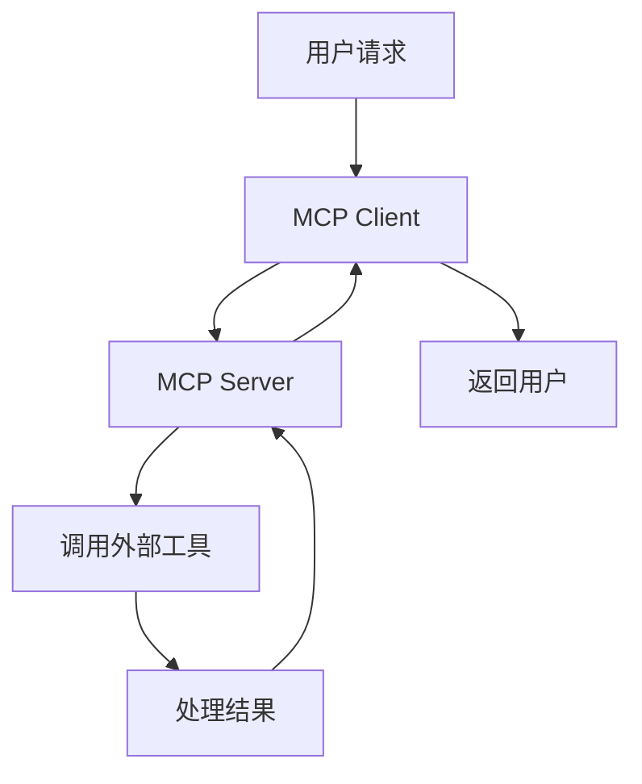
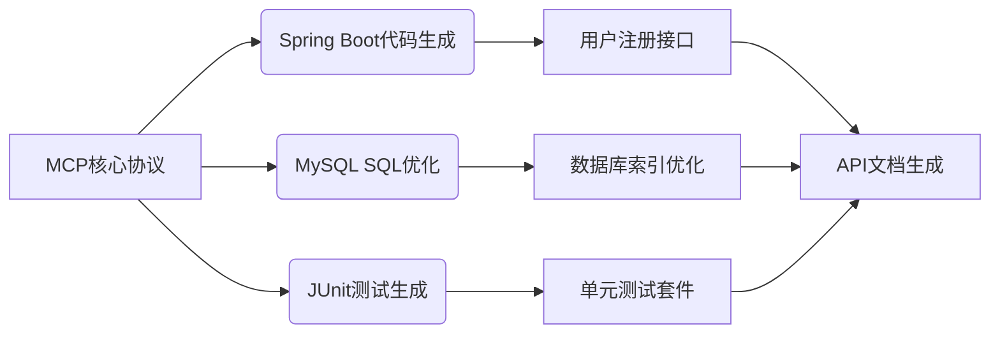

# MCP（Model Context Protocol）技术与项目集成指南 #

## 一、MCP核心架构与协议规范 ##

### 协议定位与核心价值 ###

MCP是由Anthropic主导的*开放标准协议*，旨在解决大模型（LLM）与外部工具、数据源的*标准化集成难题*。通过统一的请求/响应格式（JSON Schema定义）和通信机制，MCP让LLM能够实时获取项目专属上下文（如代码库、业务规则、数据库），并调用专业工具完成复杂任务，实现从"通用对话"到"领域精准协作"的跨越。

#### 核心组件 ####

- **Context Adapter**：连接LLM与外部数据源（如MySQL、Git仓库、Swagger文档）
- **Protocol Schema**：标准化的请求/响应格式（JSON Schema定义）
- **Tool Connector**：预定义的工具集成接口（如Spring Boot、PyTorch）

### 技术架构与通信机制 ###

MCP采用*客户端-服务器架构*：

- **MCP Client**：集成于LLM应用（如Claude Desktop、Cursor IDE），负责解析用户请求并调用MCP Server
- **MCP Server**：暴露具体工具或数据源，通过标准化接口响应Client请求
- **通信协议**：基于JSON-RPC 2.0，支持同步/异步请求、流式响应及安全认证（OAuth 2.0）

#### 数据流转示例 ####



## 二、MCP项目集成全流程 ##

### 环境搭建与SDK接入 ###

#### 安装MCP SDK ####

::: code-group

```bash [java]
# Java项目
mvn install com.mcp.sdk:core:1.0.0
```
```bash [python]
# Python项目
pip install mcp-sdk-python
```
:::

#### 初始化上下文管理器 ####

::: code-group

```java [java]
// Java示例：连接代码仓库与数据库
ContextManager contextManager = new ContextManagerBuilder()
    .withGitRepo("https://github.com/your-project/repo")
    .withDatabase("jdbc:mysql://localhost:3306/project_db")
    .withTool("spring-boot", "3.2.0")
    .build();
```
```python [python]
// Python示例：加载本地业务规则
from mcp_sdk import ContextManager
context_manager = ContextManager(
    code_repo="path/to/local/repo",
    config_files=["src/main/resources/business-rules.yaml"]
)
```
:::

### 上下文建模与配置 ###

#### 结构化上下文定义 ####

```json
{
  "tech_stack": {
    "framework": "Spring Boot",
    "database": "MySQL"
  },
  "business_rules": [
    {
      "rule_id": "password_policy",
      "description": "密码需8-32位，包含大小写字母和数字"
    }
  ],
  "existing_code": [
    "src/main/java/com/example/dto/UserRegisterRequest.java"
  ]
}
```

#### 典型配置示例（用户注册接口） ####

```yaml
# mcp_context.yaml
tech_stack:
  framework: Spring Boot
  version: 3.2.0
  security: BCryptPasswordEncoder
database:
  type: MySQL
  schema: user_db
  tables:
    - user_info: UserEntity.java
business_rules:
  - id: password_policy
    description: "密码需8-32位，包含大小写字母和数字"
```

### 代码生成与验证 ###

#### MCP增强型提示词 ####

```txt
@context: mcp_context.yaml
用Spring Boot开发用户注册接口，要求：
1. 输入参数校验使用@Valid注解
2. 密码加密使用BCryptPasswordEncoder
3. 异常处理返回统一错误码格式
```

#### 调用MCP生成代码 ####

```java
McpClient mcpClient = new McpClient("https://mcp-api.com");
GeneratedMessage request =GeneratedMessage.builder()
    .prompt("用户注册接口生成")
    .contextRef("mcp_context.yaml")
    .tool("spring-boot-code-generator")
    .build();
GeneratedMessageResponse response = mcpClient.generateCode(request);
```

#### 上下文一致性校验 ####

```bash
# 校验代码是否使用指定加密工具
mcp validate --rule "BCryptPasswordEncoder" --path UserController.java

# 检查数据库表映射
mcp validate --rule "UserEntity@user_info" --path UserEntity.java
```

## 三、核心技术特性与行业实践 ##

### 技术特性 ###

- **跨语言支持**：兼容Python/Java/Go等主流语言，适配多云环境（AWS/Azure/华为云）
- **安全可控**：支持OAuth认证、数据加密传输，满足企业级合规要求
- **动态上下文**：支持运行时环境动态加载上下文（如开发/生产环境切换）
- **多工具协同**：串联多个工具完成复杂任务（如代码生成+数据库优化+测试）

动态上下文示例

```python
def load_context(env: str):
    context = {
        "tech_stack": {"framework": "Django", "version": "4.2.3"},
        "database": {"type": "PostgreSQL", "schema": "prod_db"}
    }
    if env == "dev":
        context["existing_code"] = ["src/dev_specific_rules.py"]
    return context
```

### 行业应用场景 ###

- **AI编程工具**：Cursor/Trae等IDE通过MCP读取项目依赖，生成贴合业务的代码
- **智能数据分析**：LLM调用Excel/Python库处理实时数据，自动生成可视化报表
- **企业级知识库**：客服机器人通过MCP访问内部文档，提供精准解答
- **自动化工作流**：串联CI/CD流水线、API网关等工具完成端到端任务

多工具协同示例：



## 四、生态与社区资源 ##

### 官方资源 ###

- **技术白皮书**：Model Context Protocol（Anthropic官方公告）
- **GitHub仓库**：modelcontextprotocol（开源SDK与示例代码）
- **文档中心**：MCP Documentation（协议规范与开发者指南）

### 第三方工具与服务 ###

- **客户端工具**：Cursor（IDE）、Cline（VS Code插件）、Claude Desktop
- **服务器市场**：Smithery（3000+ MCP服务器）、PulseMCP（3228+服务）
- **企业级方案**：阿里云百炼（一键部署MCP服务）、Block（金融支付集成）

### 社区支持 ###

- **技术论坛**：MCP Community
- **Stack Overflow标签**：mcp-protocol

## 五、最佳实践与性能优化 ##

### 安全合规配置 ###

```yml
# mcp_security.yaml
security:
  data_access:
    - source: git_repo
      permissions: read-only
    - source: database
      auth:
        type: oauth2
        client_id: ${MCP_DB_CLIENT_ID}
        client_secret: ${MCP_DB_SECRET}
  code_generation:
    sensitive_data:
      - field: password
        encryption: BCrypt
```

### 性能优化策略 ###

- **上下文缓存**：对常用上下文配置（如技术栈、业务规则）进行本地缓存
- **增量更新**：仅同步变更的上下文内容（如新增的数据库表结构）
- **异步调用**：对耗时的上下文加载任务使用异步接口

异步加载示例：

```java
CompletableFuture<Context> contextFuture = mcpClient.loadContextAsync("complex_project");
contextFuture.thenApply(context -> generateCodeWithMcp(context));
```

## 六、常见问题与解决方案 ##

|  问题场景  |  解决方案  |  MCP特性支持  |  描述  |
|  :---  |  :----:  |  :---  |   :---  |
| 上下文冲突 | 使用`context_priority`字段指定加载顺序 | 协议级优先级配置 |  |
| 工具兼容性 | 调用`tool-adapter-generator`生成适配代码 | 自动化工具适配 |  |
| 生成代码不符合规则 | 在提示词中增加`@validate: business-rules.yaml` | 实时规则校验 |  |

## 结语：构建上下文感知的智能开发体系 ##

MCP通过标准化协议打破了大模型与外部世界的隔阂，使开发者能够将项目专属的技术栈、业务规则、现有代码转化为LLM可理解的上下文。建议从高频使用的模块（如API接口、数据处理工具）开始试点，逐步构建覆盖需求分析、代码生成、测试部署的全流程MCP工作流，最终实现AI与人类开发者的高效协同。
