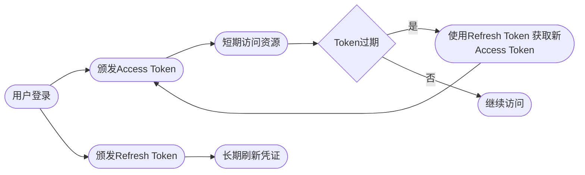
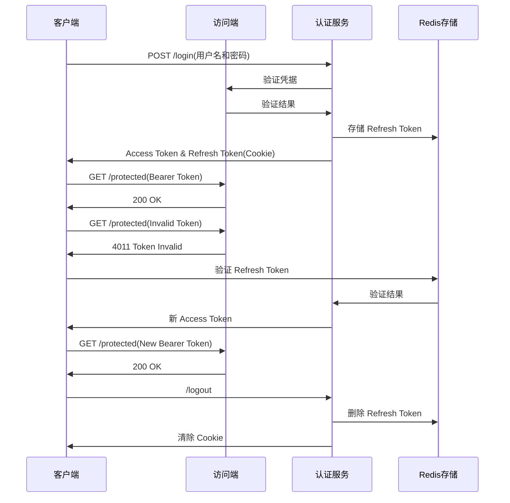

# 双 Token 认证机制详解与完整 #

## 双 Token 机制核心原理 ##

双 Token 机制是现代认证系统的主流方案，通过分离访问凭据和刷新凭据实现安全与用户体验的平衡：



### 核心组件对比 ###

| 特性        |      Access Token      |  Refresh Token |
| :------------- | :-----------: | :----: |
| 有效期        |      短（15分钟-2小时）      |  长（7天-30天） |
| 用途        |      访问受保护资源      |  获取新的Access Token |
| 存储位置        |      客户端内存/本地存储      |  HttpOnly Cookie |
| 传输方式        |      Authorization Header      |  自动Cookie发送 |
| 安全风险        |      中（可能被窃取）      |  高（长期有效） |
| 失效方式        |      自动过期      |  服务端主动吊销 |


## 完整实现 ##

### 前端实现（基于Axios） ###

```js
// src/utils/auth.js
import axios from 'axios';

// 创建 API 实例
const api = axios.create({
  baseURL: process.env.REACT_APP_API_URL
});

// 存储 Access Token
let accessToken = localStorage.getItem('access_token') || null;

// 获取当前 Access Token
export const getAccessToken = () => accessToken;

// 设置 Access Token
export const setAccessToken = (token) => {
  accessToken = token;
  localStorage.setItem('access_token', token);
};

// 清除 Token
export const clearTokens = () => {
  accessToken = null;
  localStorage.removeItem('access_token');
};

// 登录函数
export const login = async (credentials) => {
  try {
    const response = await api.post('/auth/login', credentials);
    
    // 设置 Access Token
    setAccessToken(response.data.access_token);
    
    // Refresh Token 会通过 HttpOnly Cookie 自动存储
    return response.data;
  } catch (error) {
    throw error;
  }
};

// 刷新 Token 函数
export const refreshToken = async () => {
  try {
    const response = await api.post('/auth/refresh', {}, {
      withCredentials: true // 发送 HttpOnly Cookie
    });
    
    setAccessToken(response.data.access_token);
    return response.data.access_token;
  } catch (error) {
    clearTokens();
    window.location.href = '/login';
    throw error;
  }
};

// 请求拦截器
api.interceptors.request.use(config => {
  if (accessToken) {
    config.headers.Authorization = `Bearer ${accessToken}`;
  }
  return config;
});

// 响应拦截器 - 处理 Token 过期
api.interceptors.response.use(
  response => response,
  async error => {
    const originalRequest = error.config;
    
    // 检测 401 错误且未重试
    if (error.response?.status === 401 && !originalRequest._retry) {
      originalRequest._retry = true;
      
      try {
        // 尝试刷新 Token
        const newToken = await refreshToken();
        
        // 更新请求头
        originalRequest.headers.Authorization = `Bearer ${newToken}`;
        
        // 重试原始请求
        return api(originalRequest);
      } catch (refreshError) {
        return Promise.reject(refreshError);
      }
    }
    
    return Promise.reject(error);
  }
);

export default api;
```

### 后端实现（Node.js + Express） ###

```js
// server.js
require('dotenv').config();
const express = require('express');
const cookieParser = require('cookie-parser');
const jwt = require('jsonwebtoken');
const bcrypt = require('bcrypt');
const app = express();

app.use(express.json());
app.use(cookieParser());

// 模拟数据库
const users = [
  {
    id: 1,
    username: 'user1',
    password: bcrypt.hashSync('password1', 10)
  }
];

// 密钥配置
const ACCESS_TOKEN_SECRET = process.env.ACCESS_TOKEN_SECRET || 'access_secret';
const REFRESH_TOKEN_SECRET = process.env.REFRESH_TOKEN_SECRET || 'refresh_secret';

// 登录端点
app.post('/auth/login', async (req, res) => {
  const { username, password } = req.body;
  
  // 查找用户
  const user = users.find(u => u.username === username);
  if (!user) {
    return res.status(401).json({ error: 'Invalid credentials' });
  }
  
  // 验证密码
  const validPassword = await bcrypt.compare(password, user.password);
  if (!validPassword) {
    return res.status(401).json({ error: 'Invalid credentials' });
  }
  
  // 生成 Access Token (15分钟过期)
  const accessToken = jwt.sign(
    { userId: user.id }, 
    ACCESS_TOKEN_SECRET, 
    { expiresIn: '15m' }
  );
  
  // 生成 Refresh Token (7天过期)
  const refreshToken = jwt.sign(
    { userId: user.id }, 
    REFRESH_TOKEN_SECRET, 
    { expiresIn: '7d' }
  );
  
  // 设置 HttpOnly Cookie
  res.cookie('refresh_token', refreshToken, {
    httpOnly: true,
    secure: process.env.NODE_ENV === 'production', // 仅HTTPS
    sameSite: 'strict',
    maxAge: 7 * 24 * 60 * 60 * 1000 // 7天
  });
  
  res.json({ access_token: accessToken });
});

// 刷新 Token 端点
app.post('/auth/refresh', (req, res) => {
  const refreshToken = req.cookies.refresh_token;
  
  if (!refreshToken) {
    return res.status(401).json({ error: 'Refresh token missing' });
  }
  
  try {
    // 验证 Refresh Token
    const decoded = jwt.verify(refreshToken, REFRESH_TOKEN_SECRET);
    
    // 生成新的 Access Token
    const newAccessToken = jwt.sign(
      { userId: decoded.userId }, 
      ACCESS_TOKEN_SECRET, 
      { expiresIn: '15m' }
    );
    
    res.json({ access_token: newAccessToken });
  } catch (error) {
    res.status(403).json({ error: 'Invalid refresh token' });
  }
});

// 受保护资源端点
app.get('/protected', authenticateToken, (req, res) => {
  res.json({ message: `Hello user ${req.user.userId}!` });
});

// Token 认证中间件
function authenticateToken(req, res, next) {
  const authHeader = req.headers['authorization'];
  const token = authHeader && authHeader.split(' ')[1];
  
  if (!token) {
    return res.status(401).json({ error: 'Access token missing' });
  }
  
  jwt.verify(token, ACCESS_TOKEN_SECRET, (err, user) => {
    if (err) {
      return res.status(403).json({ error: 'Invalid access token' });
    }
    
    req.user = user;
    next();
  });
}

// 启动服务器
const PORT = process.env.PORT || 3000;
app.listen(PORT, () => {
  console.log(`Server running on port ${PORT}`);
});
```

### 安全增强：Redis Token 管理 ###

```js
// 添加 Redis 支持
const redis = require('redis');
const client = redis.createClient({
  url: process.env.REDIS_URL
});

client.on('error', (err) => {
  console.error('Redis error:', err);
});

// 修改登录端点 - 存储 Refresh Token
app.post('/auth/login', async (req, res) => {
  // ...前面的登录逻辑
  
  // 存储 Refresh Token 到 Redis
  await client.set(
    `user:${user.id}:refresh_token`, 
    refreshToken,
    'EX', 7 * 24 * 60 * 60 // 7天过期
  );
  
  // ...设置cookie和响应
});

// 修改刷新端点 - 验证 Redis 中的 Token
app.post('/auth/refresh', async (req, res) => {
  const refreshToken = req.cookies.refresh_token;
  
  if (!refreshToken) {
    return res.status(401).json({ error: 'Refresh token missing' });
  }
  
  try {
    const decoded = jwt.verify(refreshToken, REFRESH_TOKEN_SECRET);
    
    // 检查 Redis 中是否存在此 Token
    const storedToken = await client.get(`user:${decoded.userId}:refresh_token`);
    
    if (storedToken !== refreshToken) {
      return res.status(403).json({ error: 'Refresh token revoked' });
    }
    
    // 生成新的 Access Token
    const newAccessToken = jwt.sign(
      { userId: decoded.userId }, 
      ACCESS_TOKEN_SECRET, 
      { expiresIn: '15m' }
    );
    
    res.json({ access_token: newAccessToken });
  } catch (error) {
    res.status(403).json({ error: 'Invalid refresh token' });
  }
});

// 登出端点
app.post('/auth/logout', async (req, res) => {
  const refreshToken = req.cookies.refresh_token;
  
  if (!refreshToken) {
    return res.status(400).json({ error: 'No refresh token' });
  }
  
  try {
    const decoded = jwt.verify(refreshToken, REFRESH_TOKEN_SECRET);
    
    // 从 Redis 删除 Refresh Token
    await client.del(`user:${decoded.userId}:refresh_token`);
    
    // 清除 cookie
    res.clearCookie('refresh_token');
    
    res.json({ message: 'Logged out successfully' });
  } catch (error) {
    res.status(400).json({ error: 'Invalid token' });
  }
});
```

## 双 Token 机制工作流程 ##



## 安全最佳实践 ##

### Refresh Token 存储 ###

- 使用 `HttpOnly`、`Secure`、`SameSite=Strict Cookie`
- 服务端使用 `Redis` 等持久化存储

### Token 轮换 ###

```js
// 刷新时生成新的 Refresh Token
app.post('/auth/refresh', async (req, res) => {
  // ...验证现有Refresh Token
  
  // 生成新的Refresh Token
  const newRefreshToken = jwt.sign(
    { userId: decoded.userId }, 
    REFRESH_TOKEN_SECRET, 
    { expiresIn: '7d' }
  );
  
  // 更新Redis存储
  await client.set(
    `user:${decoded.userId}:refresh_token`, 
    newRefreshToken,
    'EX', 7 * 24 * 60 * 60
  );
  
  // 设置新Cookie
  res.cookie('refresh_token', newRefreshToken, {
    httpOnly: true,
    secure: true,
    sameSite: 'strict',
    maxAge: 7 * 24 * 60 * 60 * 1000
  });
  
  // 返回新Access Token
  res.json({ access_token: newAccessToken });
});
```

### 设备绑定 ###

```js
// 生成设备指纹
const generateDeviceId = (req) => {
  return crypto
    .createHash('sha256')
    .update(req.headers['user-agent'] + req.ip)
    .digest('hex');
};

// 存储时关联设备
await client.set(
  `user:${user.id}:device:${deviceId}:refresh_token`, 
  refreshToken,
  'EX', 7 * 24 * 60 * 60
);
```

### 访问控制 ###

```js
// 中间件检查Token有效性
function authenticateToken(req, res, next) {
  // ...验证Access Token
  
  // 检查Token是否在黑名单（已注销）
  client.get(`token:blacklist:${token}`, (err, result) => {
    if (result) {
      return res.status(403).json({ error: 'Token revoked' });
    }
    next();
  });
}
```

## 双 Token 机制优势 ##

### 安全性提升 ###

- 短期有效的 Access Token 减少泄露风险
- Refresh Token 通过安全方式存储和传输
- 可随时吊销 Refresh Token 终止会话

### 用户体验优化 ###

- 用户长期保持登录状态
- 自动刷新避免频繁重新认证
- 多设备会话独立管理

### 系统可扩展性 ###

- 无状态验证 Access Token
- 集中管理 Refresh Token
- 轻松实现会话管理和吊销

## 实际应用场景 ##

### 单页应用 (SPA) ###

- 静默刷新保持用户会话
- 避免页面刷新导致重新登录

### 移动应用 ###

- 长期保持用户登录状态
- 安全存储 Refresh Token

### 微服务架构 ###

- Access Token 在各服务间传递
- 集中式认证服务管理刷新

### 敏感操作场景 ###

```js
// 敏感操作需要重新认证
app.post('/change-password', authenticateToken, (req, res) => {
  if (!req.body.currentPassword) {
    return res.status(400).json({ error: 'Current password required' });
  }
  
  // 验证当前密码
  verifyPassword(req.user.userId, req.body.currentPassword, (valid) => {
    if (!valid) {
      return res.status(401).json({ error: 'Invalid password' });
    }
    
    // 执行密码更改
    changePassword(req.user.userId, req.body.newPassword);
    res.json({ message: 'Password changed' });
  });
});
```

## 总结 ##

双 Token 机制通过以下方式平衡安全与用户体验：

- **职责分离**：Access Token 负责资源访问，Refresh Token 负责会话维护
- **安全存储**：Refresh Token 使用 HttpOnly Cookie 防止 XSS 攻击
- **短时效策略**：Access Token 短期有效减少泄露影响
- **主动吊销**：服务端可随时终止会话
- **无感刷新**：自动更新 Access Token 保持用户体验

提供了可直接运行的实现方案，涵盖前端、后端和安全增强措施。实际应用中，应根据具体业务需求调整 Token 有效期、存储策略和安全措施。
