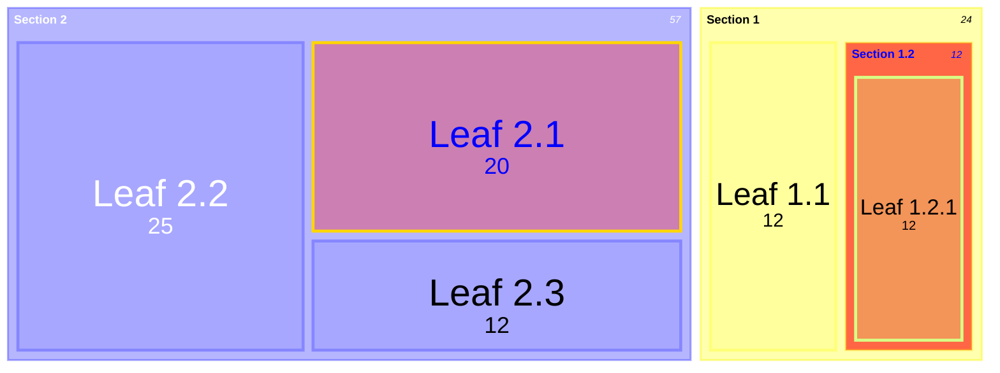

在 Nginx 中使用 Lua 脚本调用外部 API 验证 Token 是一种灵活且强大的方式，特别适合 OpenResty 环境。下面我将详细介绍如何实现这一方案。

> 😃文章最后我会附上一个我实际项目中使用的完整实例，直接可以运行，有需要的小伙伴可以参考。

```nginx
server {
    listen 443 ssl;
    server_name your.domain.com;

    ssl_certificate /path/to/cert.pem;
    ssl_certificate_key /path/to/key.pem;

    location / {
        access_by_lua_block {
            -- 引入必要的库
            local http = require "resty.http"
            local cjson = require "cjson"

            -- 获取 Authorization 头
            local auth_header = ngx.var.http_Authorization
            if not auth_header then
                ngx.log(ngx.ERR, "No Authorization header provided")
                ngx.exit(ngx.HTTP_UNAUTHORIZED)
            end

            -- 提取 Bearer token
            local _, _, token = string.find(auth_header, "Bearer%s+(.+)")
            if not token then
                ngx.log(ngx.ERR, "Invalid Authorization header format")
                ngx.exit(ngx.HTTP_UNAUTHORIZED)
            end

            -- 创建 HTTP 客户端
            local httpc = http.new()
            httpc:set_timeout(2000)  -- 2秒超时

            -- 调用验证 API
            local res, err = httpc:request_uri("https://auth-service.example.com/verify", {
                method = "POST",
                headers = {
                    ["Content-Type"] = "application/json",
                    ["Authorization"] = "Bearer " .. token,
                },
                body = cjson.encode({
                    endpoint = ngx.var.request_uri,
                    method = ngx.var.request_method
                }),
                ssl_verify = true  -- 生产环境应启用 SSL 验证
            })

            -- 处理错误情况
            if not res then
                ngx.log(ngx.ERR, "Failed to request auth service: ", err)
                ngx.exit(ngx.HTTP_INTERNAL_SERVER_ERROR)
            end

            -- 检查响应状态码
            if res.status ~= 200 then
                ngx.log(ngx.ERR, "Auth service returned status: ", res.status)
                ngx.exit(res.status == 401 and ngx.HTTP_UNAUTHORIZED or ngx.HTTP_FORBIDDEN)
            end

            -- 解析响应体
            local auth_data = cjson.decode(res.body)
            if not auth_data or not auth_data.valid then
                ngx.log(ngx.ERR, "Invalid token verification response")
                ngx.exit(ngx.HTTP_FORBIDDEN)
            end

            -- 可选：将验证信息传递给后端
            ngx.req.set_header("X-User-ID", auth_data.user_id or "")
            ngx.req.set_header("X-User-Roles", auth_data.roles or "")
        }

        # 验证通过后转发请求
        proxy_pass http://backend_service;
        proxy_set_header X-Original-URI $request_uri;
        proxy_set_header X-Original-Method $request_method;
    }
}
```

## 关键组件解析 ##

### 必要的 Lua 库 ###

- `resty.http`: 用于发送 HTTP 请求到验证服务
- `cjson`: 用于处理 JSON 数据

### Token 提取逻辑 ###

```lua
local _, _, token = string.find(auth_header, "Bearer%s+(.+)")
```

这段代码从 `Authorization: Bearer <token>` 头中提取 token 值。

### 验证 API 调用 ###

```lua
local res, err = httpc:request_uri("https://auth-service.example.com/verify", {
    method = "POST",
    headers = { ... },
    body = cjson.encode({ ... })
})
```

向验证服务发送 POST 请求，包含 token 和当前请求信息。

### 响应处理 ###

```lua
if res.status ~= 200 then
    ngx.exit(res.status == 401 and ngx.HTTP_UNAUTHORIZED or ngx.HTTP_FORBIDDEN)
end
```

根据验证服务的响应状态码决定是否放行请求。

## 高级优化建议 ##

### 添加缓存机制 ###

```lua
-- 在 access_by_lua_block 开头添加
local cache = ngx.shared.token_cache
local cached = cache:get(token)
if cached then
    if cached == "valid" then
        return  -- 验证通过
    else
        ngx.exit(ngx.HTTP_UNAUTHORIZED)
    end
end

-- 在验证成功后添加
cache:set(token, "valid", 300)  -- 缓存5分钟
```

### 超时和重试机制 ###

```lua
httpc:set_timeout({
    connect = 500,
    send = 500,
    read = 1000
})

-- 添加重试逻辑
local retries = 3
while retries > 0 do
    local res, err = httpc:request_uri(...)
    if res then break end
    retries = retries - 1
    if retries == 0 then
        ngx.log(ngx.ERR, "Auth service unreachable after retries")
        ngx.exit(ngx.HTTP_SERVICE_UNAVAILABLE)
    end
    ngx.sleep(0.1)  -- 短暂延迟后重试
end
```

### 验证服务响应示例 ###

验证服务应返回类似以下结构的 `JSON` 响应：

```json
{
    "valid": true,
    "user_id": "12345",
    "roles": ["admin", "user"],
    "expires_in": 3600
}
```

### 将Lua脚本提取成.lua文件 ###

`lua` 脚本从 `nginx.config` 配置文件剥离出来，更加直观也更易于维护。使用 `access_by_lua_file` 引用 `token_filter.lua` 文件：

```lua
location /api/ {
	 default_type 'application/json';  
	 charset utf-8;  
	 lua_code_cache on;  
	 access_by_lua_file /lua/token_filter.lua;
}
```

## 安全注意事项 ##

- **始终使用 HTTPS**：验证服务与 Nginx 之间的通信必须加密
- **验证 SSL 证书**：生产环境中应启用 `ssl_verify`
- **限制 Token 长度**：防止过长的 token 导致缓冲区溢出
- **监控验证延迟**：外部 API 调用会增加请求延迟
- **实施速率限制**：防止暴力攻击验证端点

这种方案提供了极大的灵活性，可以根据你的具体认证需求进行调整，同时保持了良好的性能特征。

## 完整的 Nginx Token 验证实例 ##

可直接使用的配置实例，使用 Lua 脚本调用外部 API 验证 Token。我会分步骤解释每个部分的作用。

### 准备工作 ###

1. 确保已安装 OpenResty（带 Lua 支持的 Nginx）
2. 准备一个验证 Token 的 API 接口（示例中使用 `http://ip:port/gshr/gp3/commonApi/verifyToken`）

### 完整配置实例 ###

打开文件 `/usr/local/openresty/nginx/conf/nginx.conf`：

```nginx
worker_processes  1;

events {
    worker_connections  1024;
}

http {
    # 共享内存区域用于缓存（可选）
    lua_shared_dict token_cache 10m;
    
    # 设置 Lua 包路径
    lua_package_path '/usr/local/openresty/lualib/?.lua;;';
    
    # 要转发到的实际后端服务
    upstream gshrserver {
        server 192.168.101.11:8888;
    }
    
    server {
        listen       80;
        server_name  localhost;

        # 示例受保护的应用路径
        location /api/ {
            # 使用 Lua 进行访问控制
            access_by_lua_block {
                -- 1. 获取 Authorization 头
                local token = ngx.var.http_Authorization
                
                -- 2. 检查是否有 Token
                if not token then
                    ngx.log(ngx.WARN, "No Authorization header found")
                    ngx.header["WWW-Authenticate"] = "Bearer realm=\"Access to API\""
                    ngx.exit(401)
                end
                
                -- 3. 提取 Bearer Token (去掉 "Bearer " 前缀)
                local jwt_token = string.match(token, "Bearer%s+(.+)")
                if not jwt_token then
                    ngx.log(ngx.WARN, "Invalid Authorization format")
                    ngx.exit(401)
                end
                
                -- 4. 调用验证 API
                local http = require "resty.http"
                local httpc = http.new()
                
                -- 设置请求参数
                local res, err = httpc:request_uri("http://ip:port/gshr/gp3/commonApi/verifyToken", {
                    method = "GET",
                    headers = {
                        ["Authorization"] = "Bearer " .. jwt_token,
                        ["Content-Type"] = "application/json"
                    },
                    keepalive_timeout = 60,
                    keepalive_pool = 10
                })
                
                -- 5. 处理验证结果
                if not res then
                    ngx.log(ngx.ERR, "Auth service request failed: ", err)
                    ngx.exit(500)
                end
                
                if res.status ~= 200 then
                    ngx.log(ngx.WARN, "Token validation failed: HTTP ", res.status)
                    ngx.exit(res.status)  -- 返回验证服务的状态码
                end
                
                -- 6. 验证通过，可选添加用户信息到请求头
                ngx.req.set_header("X-User-Validated", "true")
            }
            
            # 7. 验证通过后转发到实际后端
            proxy_pass http://gshrserver/;
            proxy_set_header Host $host;
            proxy_set_header X-Real-IP $remote_addr;
        }
        
        # 验证服务健康检查（可选）
        location /auth-health {
            proxy_pass http://ip:port/gshr/gp3/commonApi/health;
        }
        
        # 简单的公开访问路径
        location / {
            return 200 'Public access area. Use /api/ for protected resources.';
        }
    }
}
```

### 验证Token外部API ###

#### 验证Token API示例 (Java) ####

```java:CommonAPIController.java：
/**
 * @Author: GP3
 * @Description: nginx验证token
 * @Date: 22:38 2025/6/16
 * @Modified By:
 */
@ResponseBody
@RequestMapping(value = "${adminPath}/commonApi/verifyToken")
public void verifyToken(HttpServletRequest request, HttpServletResponse response) throws IOException {
    String Authorization = request.getHeader("Authorization");
    if (StringUtils.isBlank(Authorization)) {
        response.setStatus(HttpServletResponse.SC_UNAUTHORIZED);
        response.getWriter().write("No Authorization header found!");
        return;
    } else if (!Authorization.contains("Bearer ")){
        response.setStatus(HttpServletResponse.SC_UNAUTHORIZED);
        response.getWriter().write("Invalid Authorization format!");
        return;
    } else {
        boolean success = JWTUtil.verify(Authorization.split(" ")[1]);
        if (!success) {
            response.setStatus(HttpServletResponse.SC_UNAUTHORIZED);
            response.getWriter().write("token校验失败或失效！");
            return;
        }
    }
}
```

关键点解释

- `access_by_lua_block`：在访问阶段执行 Lua 代码进行验证
- `resty.http`：OpenResty 提供的 HTTP 客户端库，需要单独引入
- `验证流程`：
  - 检查请求头是否有 Authorization
  - 提取 Bearer Token
  - 调用验证服务检查 Token 有效性
  - 根据结果允许/拒绝访问
- `proxy_pass`：验证通过后转发到实际后端服务

这个完整实例可以直接使用，你只需要：

1. 安装 OpenResty
2. 根据示例编写 verifyToken 验证Token接口
3. 修改配置中的服务地址（如果不用默认的 localhost）

## Lua高性能脚本 ##

### Lua介绍 ###

Lua 是一种轻量小巧的脚本语言，用标准C语言编写并以源代码形式开放， 其设计目的是为了嵌入应用程序中，从而为应用程序提供灵活的扩展和定制功能。

#### Lua特性 ####

- **轻量级**: 它用标准C语言编写并以源代码形式开放，编译后仅仅一百余K，可以很方便的嵌入别的程序里。
- **可扩展**: Lua提供了非常易于使用的扩展接口和机制：由宿主语言(通常是C或C++)提供这些功能，Lua可以使用它们，就像是本来就内置的功能一样。
- **其它特性**:
  - 支持面向过程(procedure-oriented)编程和函数式编程(functional programming)；
  - 自动内存管理；只提供了一种通用类型的表（table），用它可以实现数组，哈希表，集合，对象；
  - 语言内置模式匹配；闭包(closure)；函数也可以看做一个值；提供多线程（协同进程，并非操作系统所支持的线程）支持；
  - 通过闭包和table可以很方便地支持面向对象编程所需要的一些关键机制，比如数据抽象，虚函数，继承和重载等。

#### Lua应用场景 ####

- 游戏开发
- 独立应用脚本
- Web 应用脚本
- 扩展和数据库插件如：MySQL Proxy 和 MySQL WorkBench
- 安全系统，如入侵检测系统

### Lua高级操作 ###

我们用Lua脚本，一般都是和Nginx结合一起使用，那么我们的Lua脚本在请求过来的时候是如何执行的呢，下面是指令执行顺序：

```nginx
http{
    server{
        location / {}
    }
}
```

{data-zoomable}



如上面的流程图，我们对关键的指令进行讲解：

1. **init_by_lua**:当Nginx的master进程加载Nginx配置文件（加载或重启Nginx进程）时，可以通过该指令控制初始化的配置信息，*init_by_lua*是Nginx配置加载的阶段。可以配置在http中。
​
2. **init_worker_by_lua**：当Nginx启动后，会执行*init_worker_by_lua*的Lua脚本，该脚本可以用来定期执行相关任务操作，类似java中的定时任务，比如定时检查相关服务的健康状态。可以配置在http中。
​
3. **set_by_lua**:执行Lua代码，并将返回的字符串赋值给$变量，如：`set_by_lua_block $res {lua-script-str}`表示执行`<lua-script-str>`代码，并将返回的字符串赋值给$res。可以配置在server，server if，location，location if。
​
4. **rewrite_by_lua**:重写阶段的处理程序，对每个请求执行指定的Lua代码。可以配置在http，server，location，location if。
​
5. **access_by_lua**:在Nginx的access阶段，对每个请求执行Lua的代码，和rewrite_bylua block一样，这些Lua代码可以调用所有的Lua API，并且运行在独立的全局环境（类似于沙盒）中，以新的协程来执行。此阶段一般用来进行权限检查和黑白名单配置。可以配置在http，server，location，location if。
​
6. **content_by_lua**:*content_by_lua*:作为内容处理阶段，对每个请求执行`<lua-script-str>`的代码。和rewrite_by_lua_block一样，这些Lua代码可以调用所有的Lua API，并且运行在独立的全局环境（类似于沙盒）中，以新的协程来执行。可以配置在location，location if。
​
7. **header_filter_by_lua**:在*header_filter_by_lua*阶段，对每个请求执行lua代码，以此对响应头进行过滤。常用于对响应头进行添加、删除等操作。可以配置在http，server，location，location if。
​
8. **body_filter_by_lua**:在*body_filter_by_lua*阶段执行Lua代码，用于设置输出响应体的过滤器。在此阶段可以修改响应体的内容，如修改字母的大小写、替换字符串等。可以配置在http，server，location，location if。
​
9. **log_by_lua**:在日志请求处理阶段执行lua代码。它不会替换当前access请求的日志，而会运行在access的前面。log_by_lua_block阶段非常适合用来对日志进行定制化处理，且可以实现日志的集群化维护。另外，此阶段属于log阶段，这时，请求已经返回到了客户端，对Ngx_Lua代码的异常影响要小很多。可以配置在http，server，location，location if。
