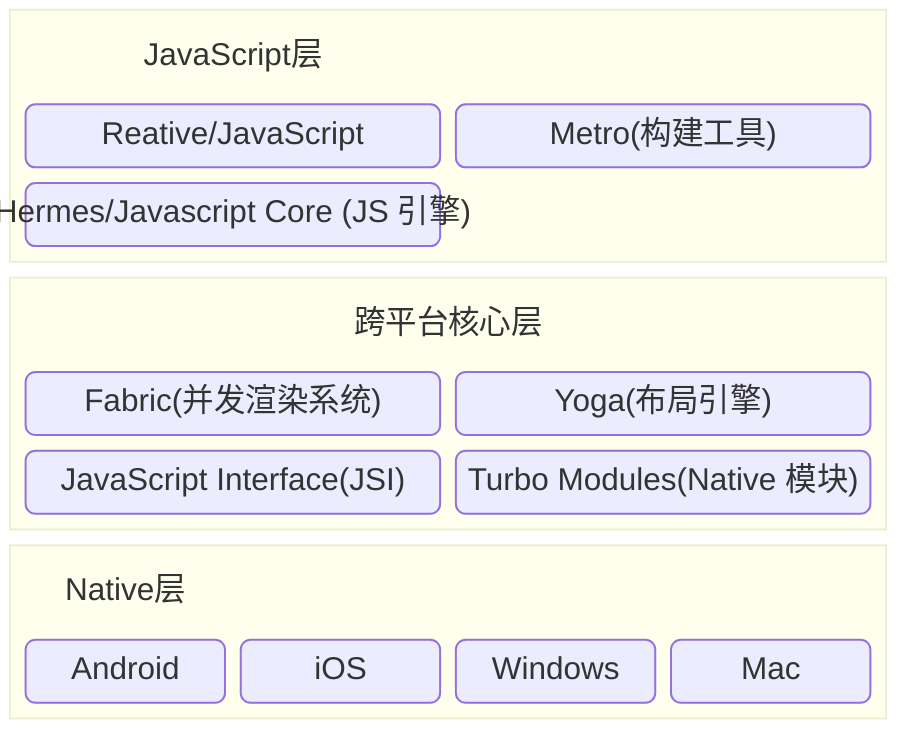
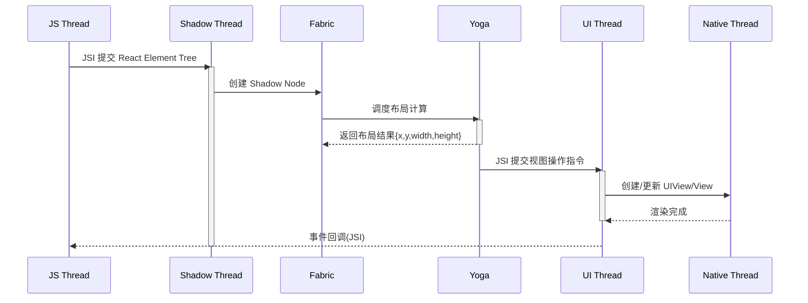
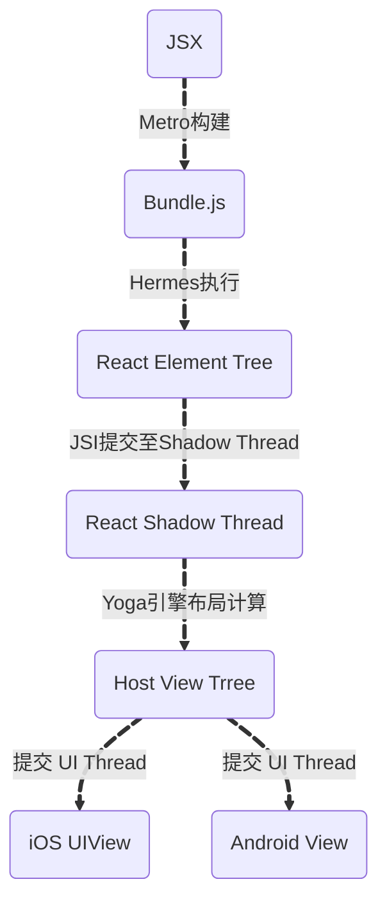

## 🙋 前言 ##

在移动应用开发领域，React Native（简称RN）以其跨平台能力和高效的开发效率，成为了众多开发者的首选。RN通过将React组件转换为原生组件表达，实现了在iOS和Android平台上的一致性体验。本文将简单介绍RN的架构及其核心组件，帮助读者认识这一强大的开发框架。

> 本文默认使用 `React Native v0.76` 版本

## 😀 React Native 介绍 ##

### 定义 ###

`React Native (RN)` 是基于 React 的**跨平台移动应用框架**，使用 JavaScript 编写业务逻辑，通过**原生渲染引擎**输出高性能 UI（非 WebView）。

### 设计思想 ###

- Learn Once, Write Anywhere
  - 复用 React 开发范式，跨 iOS/Android 平台
- 声明式 UI + 响应式编程
  - 基于 Virtual DOM 的 UI 状态管理
- 原生性能优先
  - JSI 实现 JS 与Native直接通信，避免序列化瓶颈
- 渐进式更新
  - 新架构向后兼容，支持平滑迁移

## 🕵 核心线程 ##

| 线程  |  职责  |  关键模块  |
| :-------: | :---------: | :--------: |
| JS Thread | 执行业务逻辑，生成 React Element Tree | Hermes, React |
| Shadow Thread | 管理 Shadow Tree，调度 Yoga 布局计算 | Fabric, Yoga |
| UI Thread | 挂载原生视图，处理用户输入事件 | UIKit/View System |

### 线程交互时序图 ###

> 关键说明：

- Yoga 由 **Fabric 在 Shadow 线程内同步调用**
- 事件处理通过 JSI **直通 JS 线程**，无 Bridge 序列化开销

## 🚄 JSX → Native UI 全流程 ##

### 转换节点与负责模块 ###

| 节点  |  负责模块  |  关键动作  |
| :-------: | :---------: | :--------: |
| JSX → Bundle.js | Metro | 打包 JS 代码 |
| Bundle.js → React Element Tree | Hermes + React Reconciler | 执行 JS 生成轻量 UI 描述对象 |
| React Element Tree → Shadow Tree | Fabric (C++) | 映射为 C++ Shadow Node |
| Shadow Tree → 布局计算 | Yoga (由 Fabric 调度) | Flexbox 递归计算坐标/尺寸 |
| 布局结果 → Host View Tree | Fabric | 生成原生视图操作指令集 |
| Host View Tree → Native UI | 平台渲染引擎 (iOS/Android) | 创建/更新 UIView 或 View |

## 🏐 Metro 打包工具 ##

`Metro` 是React Native的JavaScript打包器和开发服务器。它负责将JavaScript代码和资源打包成单个bundle文件，并提供开发时的热更新（Hot Reloading）和实时刷新（Fast Refresh）。

### 工作流程 ###

- **依赖解析**：从入口文件构建模块图
- **转换管道**：Babel 转译 + 类型擦除 (TypeScript/Flow)
- **序列化**：生成单一 Bundle 文件
- **字节码编译**：Hermes 将 JS 编译为 Bytecode (生产环境)

## 🤴 Fabric渲染器 ##

`Fabric` 是 React Native 新架构（0.68+ 版本引入）中的**全新渲染引擎**，用于替代旧架构中的 **UI Manager**。其本质区别在于通过底层架构革新解决了旧架构的性能瓶颈，核心差异如下：

### Fabric vs UI Manager ###

| 特性  |  旧架构（UI Manager）  |  新架构（Fabric）  |
| :-------: | :---------: | :--------: |
| 通信机制 | 异步 Bridge（JSON 序列化） | 同步 JSI（直接 C++ 对象调用） |
| 线程模型 | 三线程（JS、UI、Shadow）强耦合 | 双线程（JS 与 UI 直接通信） |
| 渲染流程 | 异步瀑布流，易阻塞 | 同步/增量渲染，支持并发更新 |
| 更新粒度 | 全量更新，重复计算多 | 细粒度更新，仅刷新变化组件 |
| 内存管理 | 多份 Shadow Tree 拷贝 | 共享 C++ Shadow Tree，减少内存占用 |
| 布局计算 | Yoga 在 Shadow 线程，与 UI 线程分离 | Yoga 由 Fabric 调度，与渲染流程整合 |
| 性能瓶颈 | Bridge 序列化延迟（>3ms） | JSI 微秒级延迟（<0.1ms） |

### 通信机制：Bridge vs JavaScript Interface（JSI） ###

- UI Manager：
  - 依赖 Bridge 异步队列，JS 与 Native 通信需将数据序列化为 JSON，通过消息队列传递，反序列化后再执行。导致高延迟（>3ms）和阻塞风险。
- Fabric：
  - 基于 JSI ，允许 JS 直接持有 C++ 对象引用并调用其方法，零序列化开销，支持同步操作（如紧急 UI 更新）。

### 线程模型：耦合 vs 解耦 ###

- UI Manager：
  - JS 线程：处理逻辑和 Virtual DOM 计算。
  - Shadow 线程：Yoga 计算布局。
  - UI 线程：渲染原生视图。
  - 三线程通过 Bridge 通信，复杂且易延迟。

- Fabric：
  - JS 与 UI 线程通过 JSI 直接通信，减少线程切换开销。

### 渲染流程：异步瀑布流 vs 同步增量更新 ###

- UI Manager：
  - JS 生成 React Element Tree → 经 Bridge 传递 → Native 端顺序渲染。全量更新导致列表滚动卡顿。

- Fabric：
  - 增量渲染：仅对比并更新变化的组件（类似 React Diff 算法）。
  - 同步提交：通过 JSI 将 UI 操作直送 UI 线程，避免异步堆积。

### 内存与性能优化 ###

- UI Manager：
  - 每个 UI 更新需创建新的 Shadow Tree，内存占用高。
  - 无视图拍平（View Flattening），冗余嵌套组件降低性能。

- Fabric：
  - 共享 Shadow Tree：C++ 对象树被 JS 和 Native 共享，减少拷贝。
  - 自动视图拍平：合并冗余视图层级，提升渲染效率。

## 👷  JavaScript Interface（JSI） ##

旧版本RN 使用 Bridge Module 来让 JS 和 Native 线程进行通信，每次利用 Bridge 发送数据时，都需要转换为 JSON， 而收到数据时也需要进行解码。

**这就意味着 JavaScript 和 Native 直接是隔离的，也就是 JS 线程不能直接调用 Native 线程上的方法**。

另一个就是；**通过 Bridge 发送的消息本质上是异步的**，如果需要 JS 代码和 Naitve 同步执行在之前是无法实现。

> ❝例如，如果 JS 线程需要访问 native modules（例如蓝牙），它就需要向 native 线程发送消息，JS 线程就会通过 Bridge 发送一个 JSON 消息，然后消息在 native 线程上进行解码，最终将执行所需的 native 代码。
❞

而在全新架构中，**Bridge 将被一个名为 JavaScript Interface 的模块所代替，它是一个轻量级的通用层**，用 C++ 编写，JavaScript Engine 可以使用它直接执行或者调用 native。

> ❝通用层代表着：JSI 让 JavaScript 接口将与 Engine 分离，这意味着新架构支持 「RN 直接使用其他 JavaScript 引擎，比如 Chakra、v8、Hermes 等等」。❞

## 👮 Hermes引擎 ##

### 定义 ###

`Hermes` 是专门针对 React Native 应用而优化的全新开源 JavaScript 引擎。对于很多应用来说，启用 Hermes 引擎可以优化启动时间，减少内存占用以及空间占用。从 React Native 0.70 版本开始 Hermes 已经默认启用，无需开发者再做任何配置。

- 使用 Hermes可以获得更好的性能和可靠性。使用Hermes引擎相对于默认引擎可以获得30%左右的性能提升
- 具体而言，Hermes 是一种基于单线程的 JavaScript 引擎，在内存管理、垃圾回收等方面都有优化，因此与默认引擎比较时可以显著减少 CPU 和内存使用量。
- 此外，由于 Hermes 执行速度更快，在处理大型应用程序或文件时也表现得更加流畅。
- 最后值得一提的是，Hermes 的构建时间也比默认引擎要短很多，并且可以与 JSC 进行无缝兼容，以便开发者根据需求选择适合自己项目的解决方案。

### Hermes 引擎 vs JavaScriptCore（旧） ###

| 指标  |  Hermes  |  JavaScriptCore  |
| :-------: | :---------: | :--------: |
| 启动时间 | ⭐⭐⭐⭐ (减少 50% TTI) | ⭐⭐ |
| 内存占用 | ⭐⭐⭐⭐ (降低 30%) | ⭐⭐ |
| 执行性能 | ⭐⭐ (无 JIT) | ⭐⭐⭐ (JIT 优化) |
| 包体积 | ⭐⭐⭐ (字节码更紧凑) | ⭐ (包含完整 JS 源码) |
| 调试支持 | ⭐ (Chrome DevTools 受限) | ⭐⭐⭐ (完整支持) |

## 💁 Yoga 引擎 ##

`Yoga` 是一个布局计算库（基于Flexbox），由Fabric渲染器在shadow线程调用，用于计算Shadow Tree中每个节点的位置和大小。

## 🎅 Turbo Modules ##

在之前的架构中 JS 使用的所有 Native Modules（例如蓝牙、地理位置、文件存储等）都必须在应用程序打开之前进行初始化，这意味着即使用户不需要某些模块，但是它仍然必须在启动时进行初始化。

`Turbo Modules` 基本上是对这些旧的 Native 模块的增强，正如在前面介绍的那样，*「现在 JS 将能够持有这些模块的引用，所以 JS 代码可以仅在需要时才加载对应模块，这样可以将显着缩短 RN 应用的启动时间」*。

## 🙅 Codegen 代码生成器 ##

*「Codegen 主要是用于保证 JS 代码和 C++ 的 JSI 可以正常通信的静态类型检查器」*，通过使用类型化的 JS 作为参考来源，CodeGen 将定义可以被 Turbo 模块和 Fabric 使用的接口，另外 Codegen 会在构建时生成 Native 代码，减少运行时的开支。

## 🤽 Skia 图形引擎 ##

### 在 RN 中的角色 ###

- 非核心依赖：RN 默认使用原生渲染
- 可选扩展：通过 `react-native-skia` 库提供：
  - Canvas 2D/3D 绘图
  - 复杂矢量图形处理
  - 高性能粒子动画

### 优势 ###

- 跨平台一致的 2D 渲染效果
- 硬件加速绘制 (Metal/Vulkan)
- 替代 CSS 无法实现的复杂视觉效果

## 🎫 跨平台框架深度对比 ##

| 维度  |  React Native 0.79  |  Flutter 3.10  |  Native  |  Ionic 7  |
| :-------: | :---------: | :--------: | :---------: | :--------: |
| 内存占用 | 150-250 MB| 120-200 MB | 80-150 MB | 200-350 MB |
| CPU峰值 | 85% (复杂列表)| 70% (Skia优化) | 60% | 95% (WebView) |
| 动画性能 | 58 FPS (Reanimated)| 60 FPS (Skia) | 60 FPS | 35 FPS |
| 包体积 | 20-35 MB (Hermes)| 25-40 MB (AOT) | 10-20 MB | 5-15 MB |
| 开发效率 | ⭐⭐⭐⭐ (React生态)| ⭐⭐⭐ (Dart) | ⭐ (双平台) | ⭐⭐⭐⭐ (Web) |
| 调试体验 | Flipper + Hermes| DevTools | Xcode/AS | Chrome Dev |
| 跨平台一致性 | 90%| 98% (Skia) | 0% | 85% |

## 🎯 总结 ##

- **新架构 (JSI/Fabric/Turbo) ** 使 RN 性能接近原生，超越 WebView 方案
- **Hermes + Yoga** 在启动速度和内存上显著优化
- **Flutter 仍是最高性能方案**，但 RN 在开发效率/生态有优势
- **淘汰方案**：Weex 已停止维护，Ionic/MUI 仅适合简单应用
