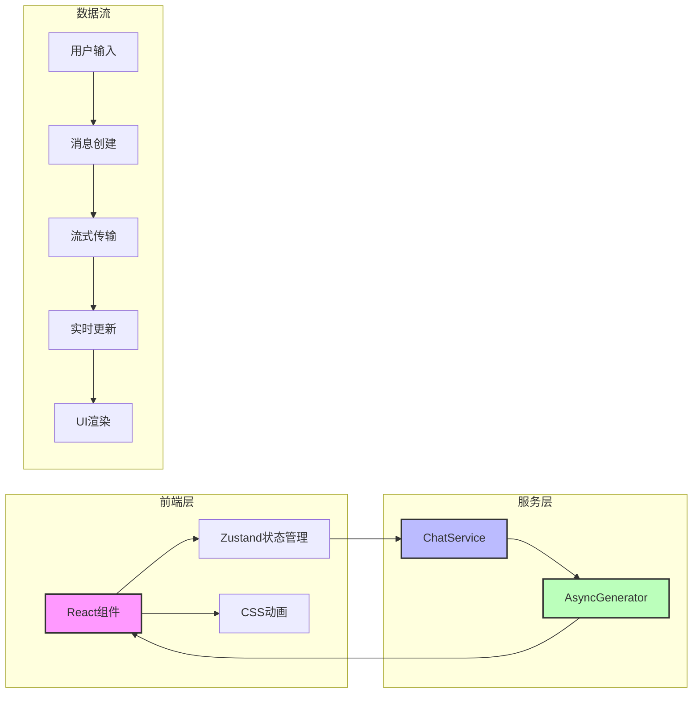
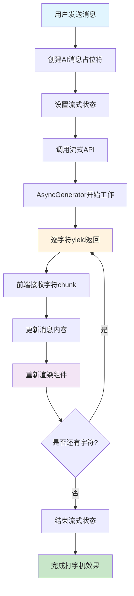
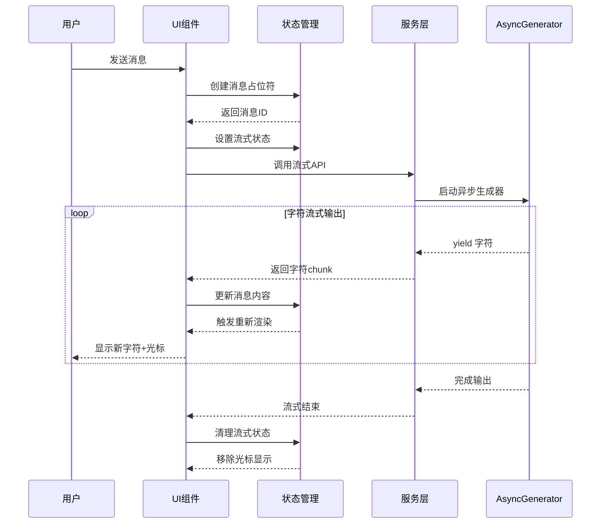

## 概述 ##

打字机效果（Typewriter Effect）是现代AI聊天应用中的经典视觉效果，通过逐字符显示文本来模拟真实打字的过程，增强用户体验和互动感。本文将深入分析在我们的聊天应用中如何实现这一效果。

## 核心技术架构 ##

### 技术栈选择 ###

- **前端**: React + TypeScript + Zustand
- **流式传输**: AsyncGenerator (模拟Server-Sent Events)
- **状态管理**: 集中式状态管理
- **UI动画**: CSS动画 + React Hook

### 系统架构图 ###



### 实现流程图 ###



## 详细实现分析 ##

### 服务层实现 (chatService.ts) ###

#### AsyncGenerator流式响应 ####

```ts
// 流式响应 (模拟Server-Sent Events)
async *sendMessageStream(request: SendMessageRequest): AsyncGenerator<string, void, unknown> {
  const startTime = Date.now()
  
  try {
    // 模拟初始延迟
    await delay(500)
    
    const responseContent = mockResponses[Math.floor(Math.random() * mockResponses.length)]
    const words = responseContent.split('')
    
    // 逐字符流式输出
    for (let i = 0; i < words.length; i++) {
      await delay(20 + Math.random() * 30) // 模拟打字速度
      yield words[i]
    }
    
  } catch (error) {
    console.error('Chat stream error:', error)
    throw error
  }
}
```

**核心知识点**:

- **AsyncGenerator**: ES2018引入的异步生成器，可以异步地产生一系列值
- **yield关键字**: 暂停函数执行并返回值，等待下次调用
- **字符分割策略**: 使用 `split('')` 逐字符处理，确保打字效果
- **随机延迟**: `20 + Math.random() * 30` 毫秒，模拟真实打字速度变化

#### 延迟函数实现 ####

```ts
const delay = (ms: number) => new Promise(resolve => setTimeout(resolve, ms))
```

- **作用**: 控制打字速度，创造真实的打字节奏

### 状态管理层 (chatStore.ts) ###

#### 流式状态定义 ####

```ts
interface ChatState {
  currentConversation: Conversation | null
  conversations: Conversation[]
  isLoading: boolean
  isStreaming: boolean  // 关键状态标识
  error: string | null
}
```

#### 状态控制方法 ####

```ts
setStreaming: (streaming: boolean) => {
  set({ isStreaming: streaming })
}
```

- **设计思路**: 全局状态管理，确保UI组件能响应流式状态变化

### 页面逻辑层 (Chat/index.tsx) ###

#### 流式发送消息核心逻辑 ####

```ts
const handleSendMessageStream = useCallback(async () => {
  // ... 前置检查 ...

  try {
    // 1. 创建AI消息占位符
    const aiMessage: Omit<Message, 'id' | 'timestamp'> = {
      role: 'assistant',
      content: '',
      conversationId: conversationId!
    }
    const addedMessage = addMessage(aiMessage)
    
    // 2. 设置流式状态
    setStreamingMessageId(addedMessage.id)
    setStreaming(true)

    // 3. 开始流式接收
    let content = ''
    const stream = chatService.sendMessageStream({
      message,
      conversationId: conversationId!,
      model: 'gpt-4'
    })

    // 4. 逐字符处理
    for await (const chunk of stream) {
      content += chunk
      updateMessage(addedMessage.id, { content })
    }
    
  } catch (err) {
    // 错误处理
  } finally {
    // 5. 清理流式状态
    setStreaming(false)
    setStreamingMessageId(undefined)
  }
}, [/* 依赖项 */])
```

**核心流程分析**:

- **消息占位符**: 先创建空消息，获取messageId用于后续更新
- **状态同步**: 设置全局流式状态和消息ID
- **for await循环**: 异步迭代AsyncGenerator返回的字符
- **实时更新**: 每接收一个字符就更新消息内容
- **状态清理**: 确保流式结束后重置状态

### UI组件层 (MessageBubble.tsx) ###

#### 流式显示组件 ####

```tsx
const MessageBubble: React.FC<MessageBubbleProps> = ({
  message,
  isStreaming = false,
  // ... 其他props
}) => {
  // 渲染消息内容
  <div className="text-sm leading-relaxed">
    {isAssistant ? (
      <div dangerouslySetInnerHTML={{ __html: renderMarkdown(message.content) }} />
    ) : (
      <div className="whitespace-pre-wrap break-words">
        {message.content}
      </div>
    )}
    
    {/* 流式输出光标 */}
    {isStreaming && isAssistant && (
      <span className="inline-block w-2 h-4 ml-1 bg-gray-400 animate-pulse" />
    )}
  </div>
}
```

#### 光标动画实现 ####

```css
/* CSS动画定义 */
@keyframes typing {
  0%, 50% { opacity: 1; }
  51%, 100% { opacity: 0.3; }
}

.typing-indicator {
  animation: typing 1.5s ease-in-out infinite;
}
```

**视觉效果设计**:

- **光标样式**: 2px宽度的竖线，使用 `bg-gray-400`
- **动画效果**: `animate-pulse` 类实现闪烁效果
- **条件渲染**: 只在 `isStreaming && isAssistant` 时显示

### 样式和动画层 (global.css) ###

#### 消息动画 ####

```css
/* 消息气泡动画 */
@keyframes messageSlideIn {
  from {
    opacity: 0;
    transform: translateY(10px);
  }
  to {
    opacity: 1;
    transform: translateY(0);
  }
}

.message-bubble {
  animation: messageSlideIn 0.3s ease-out;
}
```

#### 打字机光标动画 ####

```css
/* 打字机效果 */
@keyframes typing {
  0%, 50% { opacity: 1; }
  51%, 100% { opacity: 0.3; }
}

.typing-indicator {
  animation: typing 1.5s ease-in-out infinite;
}
```

## 核心技术知识点 ##

### AsyncGenerator深度解析 ###

**定义**: AsyncGenerator是JavaScript中的异步生成器，结合了Promise和Generator的特性。

**语法特点**:

```ts
async function* asyncGenerator(): AsyncGenerator<string, void, unknown> {
  for (let i = 0; i < 5; i++) {
    await delay(100);
    yield `字符${i}`;
  }
}
```

**工作原理**:

- `async function*`声明异步生成器函数
- `yield` 暂停执行并返回值
- `for await...of` 异步迭代接收值
- 自动处理Promise状态和错误

### React状态更新机制 ###

**状态批处理**:

```ts
// React会批处理这些状态更新
for await (const chunk of stream) {
  content += chunk  // 本地变量累积
  updateMessage(id, { content })  // 批量更新
}
```

**性能优化考虑**:

- 避免每个字符都触发重新渲染
- 使用 `useCallback` 缓存函数引用
- 合理设置依赖数组

### TypeScript类型安全 ###

**接口定义**:

```ts
interface SendMessageRequest {
  message: string
  conversationId?: string
  model?: string
}

// AsyncGenerator类型标注
AsyncGenerator<string, void, unknown>
//             ↑      ↑     ↑
//          yield值  返回值  next参数
```

### CSS动画性能优化 ###

**GPU加速属性**:

```css
.typing-cursor {
  transform: translateZ(0); /* 开启硬件加速 */
  animation: blink 1s infinite;
}
```

**动画最佳实践**:

- 使用 `transform` 和 `opacity` 属性
- 避免频繁修改 `width`、`height`等布局属性
- 合理使用 `will-change` 属性

## 流程时序图 ##



## 高级优化技巧 ##

### 错误处理机制 ###

```ts
try {
  for await (const chunk of stream) {
    content += chunk
    updateMessage(addedMessage.id, { content })
  }
} catch (error) {
  // 流式中断处理
  updateMessage(addedMessage.id, { 
    content: content + "\n\n[消息传输中断]",
    error: true 
  })
} finally {
  // 确保状态清理
  setStreaming(false)
  setStreamingMessageId(undefined)
}
```

### 性能监控 ###

```ts
const handleSendMessageStream = useCallback(async () => {
  const startTime = performance.now()
  
  try {
    // 流式处理逻辑
  } finally {
    const endTime = performance.now()
    console.log(`流式响应完成，耗时: ${endTime - startTime}ms`)
  }
}, [])
```

### 内存管理 ###

```ts
useEffect(() => {
  // 组件卸载时清理流式状态
  return () => {
    if (isStreaming) {
      setStreaming(false)
      setStreamingMessageId(undefined)
    }
  }
}, [])
```

## 实际应用场景 ##

### 多模型支持 ###

```ts
// 不同模型可能有不同的流式速度
const getTypingSpeed = (model: string) => {
  switch (model) {
    case 'gpt-4': return 25 // 较慢，显示思考过程
    case 'gpt-3.5-turbo': return 15 // 较快
    default: return 20
  }
}
```

### 网络适配 ###

```ts
// 根据网络状况调整流式速度
const adaptiveDelay = () => {
  const connection = (navigator as any).connection
  if (connection) {
    const speed = connection.effectiveType
    return speed === 'slow-2g' ? 100 : 20
  }
  return 30
}
```

## 总结 ##

打字机效果的实现涉及多个技术层面的协作：

- **服务层**: 使用AsyncGenerator实现流式数据产生
- **状态层**: 管理流式状态和消息更新
- **组件层**: 处理UI渲染和用户交互
- **样式层**: 实现视觉动画效果

这种分层架构确保了代码的可维护性和可扩展性，同时提供了良好的用户体验。通过深入理解这些技术细节，我们可以构建更加精致和高性能的聊天应用。
