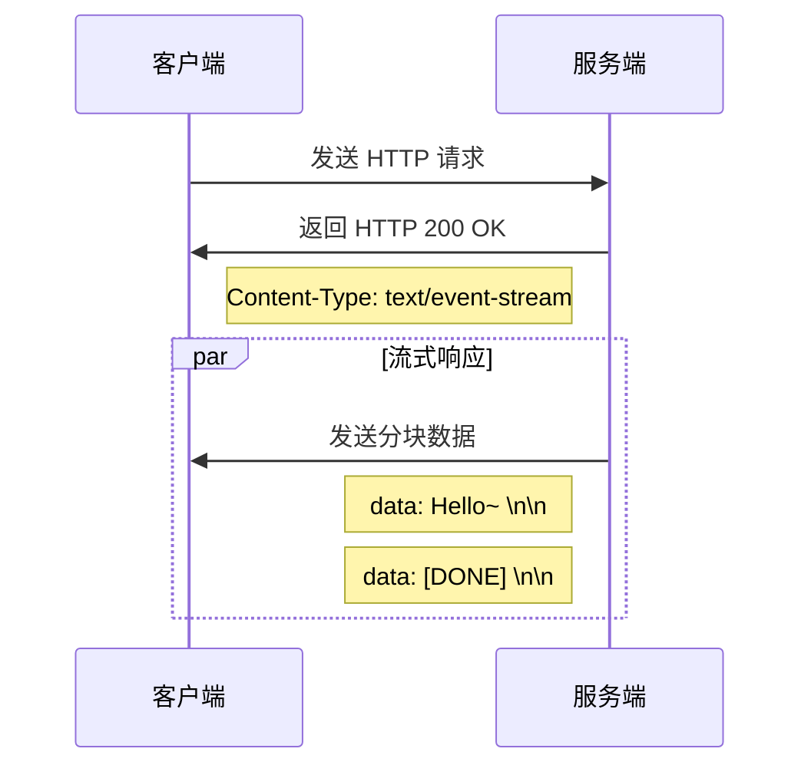
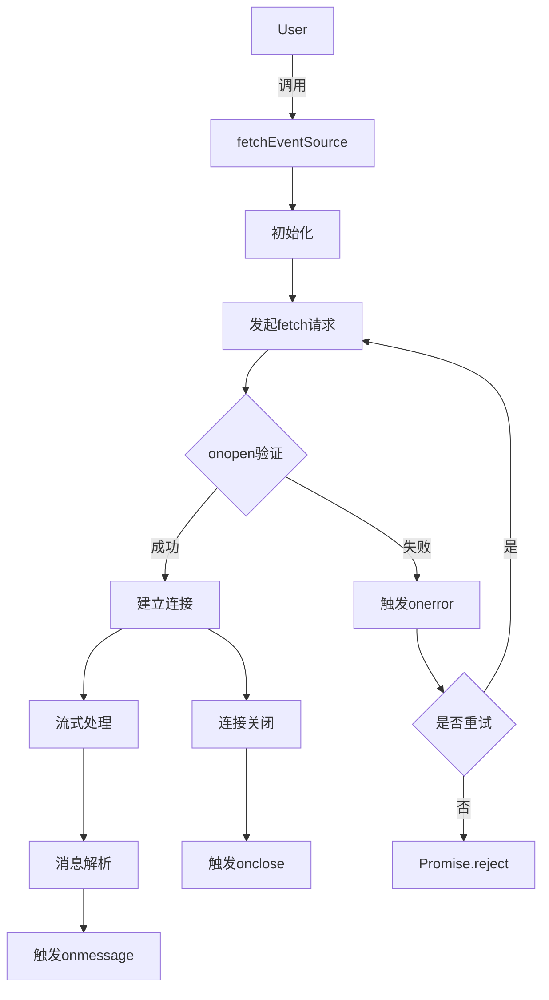

## 目的 ##

> 使用SSE+deepseekAPI+react+node.js实现流式输出markdown语法

## 效果速看 ##

{data-zoomable}

## SSE简介 ##

- SSE(Server-Sent Events)译为服务器推送事件，通过 `EventSource` 接口实现服务器推送通信。
- `EventSource` 实例会对 HTTP 服务器开启一个 `持久化的连接`，以 `text/event-stream` 格式发送事件

## SSE使用 ##

### 服务端设置 ###

- 请求头设置
- `Content-Type` 为 `text/event-stream` 来开启SSE
- 连接状态 `Connection` 为 `keep-alive`
- 实时推送需要设置 `Cache-Control` 为 `no-cahce` 停用缓存

```js
const express = require("express");
const cors = require("cors");
const app = express();

// 允许跨域
app.use(cors());

// SSE端点
app.get("/sse", (req, res) => {
  // 设置SSE需要的headers
  res.writeHead(200, {
    "Content-Type": "text/event-stream",
    "Cache-Control": "no-cache",
    Connection: "keep-alive",
  });
  // 定时发送消息
  let counter = 0;
  const intervalId = setInterval(() => {
    counter++;
    res.write(`event: message\n`);
    res.write(`data: 这是第${counter}次推送\n\n`);
    if (counter > 10) {
      clearInterval(intervalId);
    }
  }, 1000);

  // 客户端断开连接时清理
  req.on("close", () => {
    clearInterval(intervalId);
    console.log("客户端断开连接");
  });
});
// 启动服务器
const PORT = 8080;
app.listen(PORT, () => {
  console.log(`Server running on http://localhost:${PORT}`);
});
```

### 客户端设置 ###

- `new EventSource` 创建实例
- 监听 `message` 事件

```html
<html>
<div id="root"></div>
  <script>
    const sse = new EventSource("http://localhost:8080/sse");
    sse.addEventListener("message", (e) => {
      console.log("---数据", e.data);
      root.innerHTML += e.data + " ";
      //页面渲染
    });
</script>
</html>
```

- 缺点: `EventSource` 只支持 `get` 请求

## 可读流实现SSE ## 

### ReadableStream ###

> 用 `fetch` 发送 `post` 请求，使用 `ReadableStream` 实现流式传输

```ts
const response = await fetch(url, {
    method: "POST",
    headers: {
      "Content-Type": "application/json",
      Accept: "text/event-stream",
    },
    body: JSON.stringify(data),
  }).catch((err) => {
    console.log("err报错了", err);
  });
  // 获取 ReadableStream 并创建读取器
  const reader = response.body.getReader();
}
```

- `reader.read()` 得到的 `value` 为字节流

### TextDecoder 解码 ###

```ts
 const decoder = new TextDecoder();
  // 持续读取流数据
  while (true) {
    const { done, value } = await reader.read();
    if (done) {
      reader.releaseLock();
      break;
    } // 流结束
    console.log("字节流", value);
    const chunk = decoder.decode(value);
    console.log("解码后数据为", chunk);
  }
```

### markdown解析 ###

引入markdown库

```ts
import { marked } from "marked";
marked.parse(value.current)
```

### 失去重连 ###

- 注意:自己实现SSE的话, SSE将 `失去重连`
- 解决方法:第三方库 `@microsoft/fetch-event-source`

```ts
import { fetchEventSource } from '@microsoft/fetch-event-source';

fetchEventSource('http://localhost:3000/sse',{
    method:'POST',
    headers:{
        'Content-Type':'application/json'
    },
    body:JSON.stringify({message:'Hello, SSE!'}),
    onmessage:(event)=>{
        console.log(JSON.parse(event.data))
    },
    onerror:(event)=>{
        console.log(event)
    }
})
```

## 具体代码 ##

### AI 调用 ###

```ts
let OpenAI = require("openai");

const openai = new OpenAI({
  baseURL: "https://api.deepseek.com/v1",
  apiKey: "XXXXXX",//这里用自己的
});

async function main(content, res) {
  try {
    const response = await openai.chat.completions.create({
      messages: [
        {
          role: "system",
          content:
            "You are a translation expert. Please format your responses in Markdown syntax.",
        },
        { role: "user", content: content },
      ],
      model: "deepseek-chat",
      stream: true,
    });

    for await (const chunk of response) {
      if (chunk.choices && chunk.choices[0] && chunk.choices[0].delta) {
        const content = chunk.choices[0].delta.content || "";
        res.write(`data: ${JSON.stringify({ text: content })}\n\n`);
      }
    }
  } catch (error) {
    console.error("Error in OpenAI request:", error);
    res.write(
      `event: error\ndata: ${JSON.stringify({ error: error.message })}\n\n`
    );
  } finally {
    res.end();
  }
}
module.exports = { main };
```

### 服务器 ###

```ts
const express = require("express");
const app = express();
const PORT = 8080;
const cors = require("cors");
const { main } = require("./ai.js");

// 允许跨域
app.use(cors());
app.use(express.json());

app.post("/sse", (req, res) => {
  try {
    let body = req.body;
    res.writeHead(200, {
      "Content-Type": "text/event-stream",
      "Cache-Control": "no-cache",
      Connection: "keep-alive",
    });

    main(body.content, res);
  } catch (error) {
    console.error("Error in handling request:", error);
    res.write(
      `event: error\ndata: ${JSON.stringify({ error: error.message })}\n\n`
    );
    res.end();
  }
});
app.listen(PORT, () => {
  console.log(`Server running on http://localhost:${PORT}`);
});
```

### 前端代码 ###

```jsx
import React, { useState, useRef } from "react";
import { marked } from "marked";

const App = () => {
  const value = useRef("");
  const [renderedContent, setRenderedContent] = useState("");
  const inputRef = useRef(null);

  const fetchSSE = async () => {
    const url = "http://localhost:8080/sse";
    const inputValue = inputRef.current.value;
    const data = {
      userId: 123,
      content: inputValue,
      date: new Date().toISOString(),
    };

    try {
      const response =
        inputValue &&
        (await fetch(url, {
          method: "POST",
          headers: {
            "Content-Type": "application/json",
            Accept: "text/event-stream",
          },
          body: JSON.stringify(data),
        }));

      // 获取 ReadableStream 并创建读取器
      const reader = response.body.getReader();
      const decoder = new TextDecoder();

      // 持续读取流数据
      while (true) {
        const { done, value } = await reader.read();
        if (done) {
          reader.releaseLock();
          break;
        } // 流结束
        const chunk = decoder.decode(value);
        const events = chunk.split("\n\n"); // SSE 事件以双换行分隔
        events.forEach((event) => {
          if (event.trim() === "") return;
          parseSSEEvent(event);
        });
      }
    } catch (err) {
      console.log("err报错了", err);
    }
  };

  // 解析单个 SSE 事件
  const parseSSEEvent = (event) => {
    const lines = event;
    let dataObj = JSON.parse(lines.split(": ")[1]);
    value.current += dataObj.text;
    setRenderedContent(marked.parse(value.current));
  };

  return (
    <div>
      <input type="text" ref={inputRef} />
      <button onClick={fetchSSE}>发送</button>
      <div dangerouslySetInnerHTML={{ __html: renderedContent }} />
    </div>
  );
};

export default App;
```

## SSE 简介 ##

Server-Sent Events (SSE) 基于HTTP协议，是一种允许服务器主动向客户端推送数据的技术。

- 与传统的 HTTP 请求-响应模式区别：SSE 允许服务器在建立连接后，可以持久地向客户端发送消息，也就是建立一个长连接。
- 与 Websocket 区别： SSE 并不支持客户端向服务端发送消息，即 SSE 为单工通信。
- 与长轮询区别：不需要客户端反复请求数据



目前大模型问答的数据交互基本都是基于SSE去实现的，采用EventStream的事件流方式，实际效果像打字机一样，一段一段的返回答案。

采用这种方式有两种好处：

- 响应效率：响应效率大大提升，一边响应一边返回结果
- 用户体验：显著提高用户体验，给用户感觉就像是真实的对话一样

```txt
传统http：
客户端: POST 完整问题 → 服务器: 处理完成后返回完整答案（延迟高）

-------------------------------------------------------------

SSE:
客户端: POST 问题 → 服务器: 立即返回流式 token（低延迟）
         ▲                       │
         └───────────────────────┘ 单工通道
```

## 协议与消息 ##

### 协议 ###

SSE 协议本质是浏览器发起 http 请求，服务器在接受请求后返回消息，但是需要在响应头需要加下以下几个字段

```js
Content-Type: text/event-stream
Cache-Control: no-cache
Connection: keep-alive
```

- Content-Type: text/event-stream：SSE API规定推送事件流的类型为 text/event-stream。
- Cache-Control: no-cache：必须指定浏览器不缓存服务端发送的数据，以确保浏览器可以实时显示服务端发送的数据。
- Connection: keep-alive：SSE 是一个一直保持开启的 TCP 连接

### 消息格式 ###

每条消息由一行或多行字段组成，每个字段组成形式为：字段名:字段值，同时字段以行为单位，每行一个（即以 \n 结尾）
每次推送，可由多个消息组成，每个消息之间以空行分隔（即最后一个字段以\n\n结尾）

```js
// 第一条消息
event:xxx(\n)
data:xxx
id: xx
retry:xx (\n\n)

// 第二条消息
event:xxx
data:xxx
```

### 字段类型 ###

字段类型包含以下四种：

- event：指定事件类型
  - 浏览器可以使用 addEventListener 方法在当前 EventSource 对象上进行监听
  - 如果消息体没有event字段，则会触发 message 事件上的事件处理函数
- data：消息数据
  - 数据内容只能以一个字符串的文本形式进行发送
  - 如果需要发送一个对象时，需要将该对象以一个 JSON 格式的字符串的形式进行发送
- id：事件ID，事件的唯一标识符
  - 如果发生断连，浏览器可以把收到的最后一个事件ID放到请求头Last-Event-Id 中进行重连
- retry：重连时间
  - 由服务器指定重连时间，是一个整数值，单位为ms
  - 如果没有指定retry，就由浏览器自行决定每隔多久与服务端建立一次连接

**deepseek的具体示例**

```js
event: ready(\n)
data: {}（\n\n）

event: update_session(\n)
data: {"updated_at":1745054696.793322}(\n\n)

data: {"v": "好的", "p": "response/thinking_content"}

data: {"v": "，", "o": "APPEND"}

data: {"v": "我现在"}

data: {"v": "需要"}

data: {"v": "详细"}

data: {"v": "理解"}

...

event: close
data: {}
```

**注意**

- 除上述四个字段外，其他所有字段都会被忽略

## 基于eventSource实现 ##

在浏览器端，可以使用 JavaScript 的 EventSource API 创建 EventSource 对象，监听服务器发送的事件

### 建立连接 ###

EventSource 接受两个参数：URL 和 options

- ​URL：请求地址
- options ：是一个可选的对象，包含 withCredentials 属性，表示是否发送凭证（cookie、HTTP认证信息等）到服务端，默认为 false

```ts
const eventSource = new EventSource('服务器接口地址', { withCredentials: true })
```

### 监听事件 ###

EventSource 对象触发的事件主要包括以下四种：

- open 事件：当成功连接到服务端时触发。
- message 事件：当接收到服务器发送的消息时触发。该事件对象的 data 属性包含了服务器发送的消息内容。
- error 事件：当发生错误时触发。该事件对象的 event 属性包含了错误信息。
- 自定义事件：可以监听event参数指定事件

```ts
eventSource.addEventListener('open', function(event) {
  console.log('Connection opened')
})

eventSource.addEventListener('message', function(event) {
  console.log('Received message: ' + event.data);
})

// 监听自定义事件
eventSource.addEventListener('ready', function(event) {
  console.log('Received message: ' + event.data);
})

eventSource.addEventListener('error', function(event) {
  console.log('Error occurred: ' + event.event);
})
```

### 使用限制 ###

- 无法自定义请求头内容
- 只支持get请求，携带参数字段长度有限制

## 基于fetch-event-source实现 ##

由于EventSource API限制，满足不了实际使用的需求，这边使用库 `@microsoft/fetch-event-source`

它既支持get及post请求，也支持自定义请求头内容。

### 具体实现 ###

建立连接后，分别监听四种事件（open，message，close，error）

```ts
import { fetchEventSource } from '@microsoft/fetch-event-source';
async getFetchEventSource() {
	const ctrl = new AbortController();
	await fetchEventSource(`/frmp-rcmp/V1/stream/chat`, {
	  method: 'get',
	  headers: {
	    'Content-Type': 'text/event-stream',
	    'request-id': this.messageId,
	  },
	  openWhenHidden: true, // 页面退至后台保存连接
	  signal: ctrl.signal, // 用于终止请求
	  onopen(response) {
	    // 连接成功时触发
	    if (response.ok) {
	      console.log('连接成功');
	      return;
	    }
	    throw new Error('连接失败');
	  },
	  onmessage(event) {
	    // 检查是否是结束标识符
	    if (event.data == '[DONE]') {
	      console.log('数据接收完成');
	      return;
	    }
	    // 检查事件类型
	    if (event.event === 'custom-event') {
	      console.log('收到自定义事件:', event.data);
	      const customData = JSON.parse(event.data);
	      handleCustomEvent(customData); // 处理自定义事件
	    } else if (event.event === 'message') {
	      console.log('收到标准消息:', event.data);
	      const messageData = JSON.parse(event.data);
	      handleMessageEvent(messageData); // 处理标准消息
	    }
	  },
	  onclose() {
	    // 连接关闭时触发
	    console.log('连接终止');
	    _this.streamEnd = true;
	  },
	  onerror(err) {
	    // 错误处理（默认会抛出异常并自动重试）
	    console.error('错误:', err);
	    throw err; // 抛出错误会触发重试机制
	  },
	});
}
```

### 底层实现 ###

这个库的底层是基于fetch进行封装的，核心数据流程图如下：



### 初始化阶段 ###

- 合并headers，设置默认值
- 绑定visibility事件监听，用于控制页面退至后台是否保持连接
- 初始化AbortController
- 绑定abort事件，用于终止请求

> fetch 并未原生提供终止操作方法，可以通过 DOM API [AbortController]实现 fetch 请求终止操作

```ts
function fetchEventSource(input, { 
  headers, 
  onopen, 
  onmessage,
  onerror,
  fetch: inputFetch
}) {
  // 1. 合并headers，设置默认accept
  const headers = { accept: 'text/event-stream', ...inputHeaders };
  
  // 2. 绑定页面可见性监听（自动重连）
  if (!openWhenHidden) {
    document.addEventListener('visibilitychange', onVisibilityChange);
  }

  // 3. 初始化AbortController
  let curRequestController = new AbortController();
  
  // 4. 绑定abort事件，用于终止请求
  inputSignal?.addEventListener('abort', () => {
      dispose();
      resolve(); // don't waste time constructing/logging errors
  });
}
```

```ts
// 页面可见性变化时自动重连
function onVisibilityChange() {
  curRequestController.abort();
  if (!document.hidden) create();
}

// 用户不可见时暂停连接
document.addEventListener('visibilitychange', onVisibilityChange);
```

### 请求处理流程 ###

- 调用 fetch 发起 SSE 请求
- 验证是否连接成功，调用 onopen 回调
- 使用 getBytes、getLines 和 getMessages 逐层解析数据流
- 正常关闭，调用onclose回调

```ts
async function create() {
  // 1. 发起Fetch请求（支持自定义fetch函数）
  const response = await fetch(input, {
    signal: curRequestController.signal
  });

  // 2. 验证Content-Type（默认逻辑可覆盖）
  await onopen(response);

  // 3. 流式处理管道（核心解析逻辑）
  await getBytes(
    response.body!,
    getLines(
      getMessages(
        id => headers['last-event-id'] = id, // 更新last-event-id
        retry => retryInterval = retry,     // 动态调整重试间隔
        onmessage                           // 触发用户消息回调
      )
    )
  );

  // 4. 正常关闭连接
  onclose?.();
}
```

### 流式数据处理 ###

```ts
代码浏览器响应流 (ReadableStream)
  → getBytes()   // 按字节读取
  → getLines()   // 按行分割（\n\n）
  → getMessages()// 解析SSE事件字段
  → onmessage()  // 用户回调
```

**getBytes**

- 通过流式读取器循环读取流中数据
- 每次读取到一块数据后，调用 getLines 的回调函数 onChunk。

```ts
export async function getBytes(stream, onChunk) {
   // 创建一个流的读取器
    const reader = stream.getReader();
    let result;

    // 循环读取流中的数据，直到流结束
    while (!(result = await reader.read()).done) {
        // 将读取到的字节块传递给回调函数 onChunk
        onChunk(result.value);
    }
}
```

**getLines**

根据特殊符号(：，\n，\r)将字节块按行分割，得到以下行：

```js
event: custom-event

data: {"key": "value"}

<空行>

data: Hello, world!
```

核心代码如下

```ts
// 遍历缓冲区中的每个字节，寻找换行符以分割行
while (position < bufLength) {
	// 如果上一个字符是 \r，则跳过紧随其后的 \n
	if (discardTrailingNewline) {
	    if (buffer[position] === 10) { // 换行符（\n）
	        lineStart = ++position;
	    }
	    discardTrailingNewline = false;
	}
	
	let lineEnd = -1; // 当前行的结束位置
	
	// 查找行结束位置（遇到冒号、回车符或换行符时停止）
	for (; position < bufLength && lineEnd === -1; ++position) {
	    switch (buffer[position]) {
	        case 58: // 冒号（:）
	            // 如果尚未记录字段名长度，则计算字段名长度
	            if (fieldLength === -1) {
	                fieldLength = position - lineStart;
	            }
	            break;
	        case 13: // 回车符（\r）
	            discardTrailingNewline = true;
	        case 10: // 换行符（\n）
	            lineEnd = position; // 标记行结束位置
	            break;
	    }
	}
	
	// 如果未找到行结束位置，则退出循环
	if (lineEnd === -1) {
	    break;
	}
	
	// 调用回调函数 onLine 处理当前行的数据
	onLine(buffer.subarray(lineStart, lineEnd), fieldLength);
	
	// 更新下一行的起始位置，并重置字段长度
	lineStart = position;
	fieldLength = -1;
}
```

**getMessages**

基于TextDecoder解析每行的字节数组，生成以下消息对象

```ts
{ event: 'custom-event', data: '{"key": "value"}' }
{ event: 'message', data: 'Hello, world!' }
```

核心代码如下：

```ts
let message = newMessage();
const decoder = new TextDecoder(); // 用于解码字节数组为字符串
// 解码字段名（如 event: 或 data:）
const field = decoder.decode(line.subarray(0, fieldLength));

// 计算字段值的起始位置（考虑冒号后是否有空格）
const valueOffset = fieldLength + (line[fieldLength + 1] === 32 ? 2 : 1);

// 解码字段值
const value = decoder.decode(line.subarray(valueOffset));

// 根据字段名处理不同的字段
switch (field) {
	case 'data':
	    // 如果 data 字段有多行，则用换行符拼接
	    message.data = message.data
	        ? message.data + '\n' + value
	        : value;
	    break;
	case 'event':
	    // 设置事件类型
	    message.event = value;
	    break;
	case 'id':
	    // 设置消息 ID，并调用 onId 回调函数
	    onId(message.id = value);
	    break;
	case 'retry':
	    // 设置重试间隔时间，并调用 onRetry 回调函数
	    const retry = parseInt(value, 10);
	    if (!isNaN(retry)) {
	        onRetry(message.retry = retry);
	    }
	    break;
}
```

### 错误处理和重试 ###

- 触发error事件
- 设置重试定时器，进行重连

```ts
try {
  // ... 主流程 ...
} catch (err) {
  // 1. 非主动中止的错误才会触发重试
  if (!curRequestController.signal.aborted) {
    // 2. 用户自定义错误处理策略
    const interval = onerror?.(err) ?? retryInterval;
    // 3. 动态设置重试定时器
    retryTimer = setTimeout(create, interval);
  }
}
```

## 遇到的问题 ##

### 数据格式不规范 ###

响应体的数据格式一定要严格标准格式来，不然会导致流式输出失效

```js
event:xxx(\n)
data:xxx(\n\n)

event:xxx
data:xxx
```

### 开启压缩会导致流式输出失效 ###

**核心原因**：

- 当启用压缩（如 Gzip/Brotli）时，数据需要完整压缩后才能输出，这会破坏流式传输的分块特性：

```js
# 流式传输应有的效果（分块输出）
[Chunk1] --> [Chunk2] --> [Chunk3] 

# 开启压缩后的效果（等待全部压缩）
[ Entire Compressed Data ] --> 一次性输出
```

在开发环境将webpack的compress设置为false

- compress 主要用于 响应压缩（Gzip/Brotli），目的是减少传输体积，提升加载速度

```js:webpack.config.js
const isProduction = process.env.NODE_ENV === 'production';
devServer: {
  compress: isProduction, // 开发环境关闭压缩
},
```

修改测试环境和生产环境的Nginx配置，针对流式接口禁用压缩

- 跟后端约定好接口名称（比如：需要带有stream）
- 对流式输出的接口内容（如实时日志、动态数据）禁用压缩。
  - gzip off：对此路由禁用压缩。
  - proxy_buffering off：禁止 Nginx 缓冲后端响应数据，确保数据直接流式传输到客户端。

```conf
# 匹配带有 stream 的接口路径，并关闭 gzip 压缩
location ~* /stream {
    gzip off;
    proxy_buffering off;     # 关闭代理缓冲
}
```
