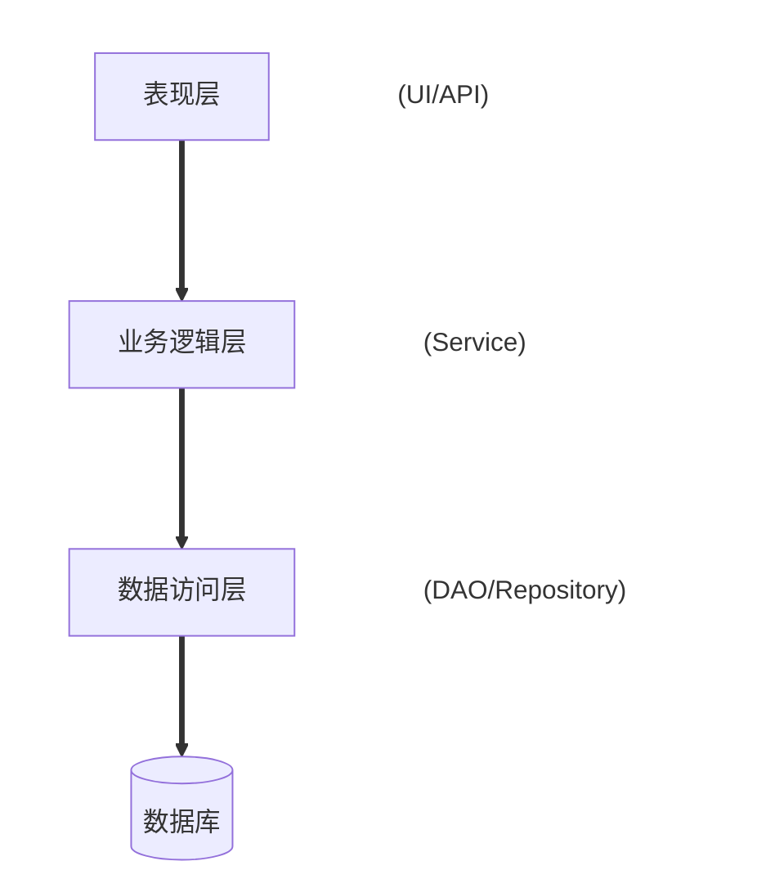
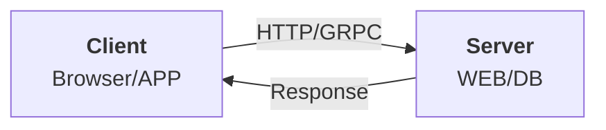
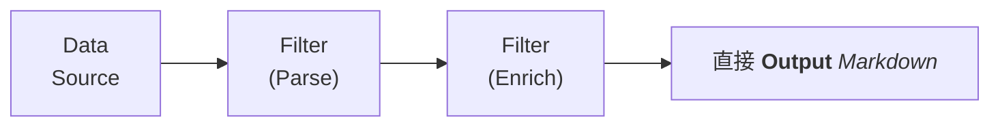

软件架构风格是描述软件系统高层次组织和结构的模式，它定义了组件之间的交互方式、通信协议以及系统的整体设计原则。不同的架构风格适用于不同的应用场景，影响系统的可维护性、可扩展性、性能和可靠性。

这篇文章，我们来分析 11种常见的软件架构风格及其特点。

## 软件架构风格 ##

### 分层架构 ###

分层架构（Layered Architecture）的核心思想是将系统垂直划分为多个层级，每层提供特定功能，且仅能调用下一层的服务（严格分层）或相邻层（松散分层）。其特点是将系统划分为若干层（如表现层、业务逻辑层、数据访问层），每层仅依赖下一层。

常见的典型分层：表现层（UI）→ 业务逻辑层（BLL）→ 数据访问层（DAL）→ 数据库。

- **优点**：职责分离、易于维护、适合团队分工。
- **缺点**：层间调用可能引发性能瓶颈，过度分层会增加复杂性。
- **应用场景**：企业级应用（如ERP、CRM）、传统Web应用。



**箭头**：严格分层仅允许上层调用下层（禁止跨层或逆向调用）。

### 客户端-服务器架构 ###

客户端-服务器架构（Client-Server）的核心思想：功能分离为两个角色：

- 客户端：发起请求（如浏览器、移动App）。
- 服务器：处理请求并返回响应（如Web服务器、数据库服务器）。

其特点是客户端请求服务，服务器提供服务，两者通过网络通信。



**双向箭头**：客户端发起请求，服务器返回响应。

- **优点**：职责清晰、易于扩展服务器端。
- **缺点**：服务器可能成为单点故障，网络延迟影响性能。
- **应用场景**：Web应用、电子邮件系统。

### 微服务架构 ###

微服务架构（Microservices）的核心思想：将单体应用拆分为多个小型服务，每个服务：

- 独立进程，轻量级通信（HTTP/gRPC）。
- 独立开发、部署、扩展（如订单服务、支付服务）。

微服务架构的特点是将系统拆分为多个小型、独立的服务，每个服务负责特定功能，通过API通信。

```mermaid
flowchart
client[Client]--API Gateway--> service[Service A]
client-->|Service Discovery!|service
client-->|(Consul/Eureka/Nacos)|service
```

```txt
┌─────────────┐       API Gateway       ┌─────────────┐
│   Client    │ ──────────────────────> │  Service A  │
└─────────────┘                         └─────────────┘
            │                           ▲
            │  Service Discovery        │
            └───────────────────────────┘
              (Consul/Eureka/Nacos)
```

**关键组件**：API网关统一入口，服务注册中心管理动态服务地址。

- **优点**：高内聚低耦合、独立部署、技术栈灵活。
- **缺点**：分布式系统复杂性（如事务管理、服务发现）、运维成本高。
- **应用场景**：大型复杂系统（如电商平台、云原生应用）。

### 事件驱动架构 ###

事件驱动架构（Event-Driven Architecture, EDA）的核心思想：组件通过事件异步通信，典型模式：

- 发布/订阅：生产者发布事件，消费者订阅事件队列（如Kafka）。
- 事件总线：中央调度器管理事件（如Node.js的EventEmitter）。

事件驱动架构的特点是组件通过发布/订阅事件异步通信，解耦生产者和消费者。

```txt
┌─────────────┐       Publish        ┌─────────────┐
│  Producer   │ ───────────────────> │ Event Bus   │
└─────────────┘       (OrderCreated) └─────────────┘
                                           ↑
                                           │ Subscribe
                                           │
                                    ┌─────────────┐
                                    │  Consumer   │
                                    │ (Inventory) │
                                    └─────────────┘
```

**事件流**：生产者发布事件到消息队列（如Kafka），消费者订阅感兴趣的事件。

- **优点**：高扩展性、实时响应、松耦合。
- **缺点**：事件流复杂、难以调试。
- **应用场景**：实时数据处理、消息队列系统（如Kafka）、GUI应用。

### 管道-过滤器架构 ###

管道-过滤器架构（Pipe-Filter）的核心思想：数据流经一系列过滤器（处理单元），每个过滤器：

- 输入数据 → 处理 → 输出数据。
- 管道（Pipe）连接过滤器，传递数据流。

管道-过滤器架构的特点是数据通过一系列过滤器（处理单元）流动，每个过滤器对数据做特定处理。



**线性管道**：数据流经多个过滤器，每个过滤器完成特定转换。

- **优点**：模块化、易于重用过滤器。
- **缺点**：不适合交互式应用，数据转换开销大。
- **应用场景**：编译器、数据处理流水线（如ETL）。

### 面向服务架构 ###

面向服务架构（SOA）的核心思想是将业务功能抽象为可复用服务，通过企业服务总线（ESB）集成：

- 服务提供者注册到ESB，消费者通过ESB调用服务。
- 通信协议：SOAP（XML）、REST或消息队列。

它的特点是将功能封装为可重用的服务，通过标准协议（如SOAP、REST）通信。


```txt
┌─────────────┐       SOAP/REST       ┌─────────────┐
│  Consumer   │ ────────────────────> │   Service   │
└─────────────┘                       └─────────────┘
            │                           ▲
            │          ESB              │
            └───────────────────────────┘
 (Enterprise Service Bus)
```

**ESB核心作用**：路由、协议转换、消息增强。

- **优点**：服务复用、跨平台集成。
- **缺点**：ESB（企业服务总线）可能成为瓶颈，复杂性高。
- **应用场景**：企业系统集成（如银行系统）。

### 单体架构 ###

单体架构（Monolithic）的核心思想是：所有功能模块（UI、业务逻辑、数据库访问）打包为单一可执行文件。 它的特点是将所有功能集中在一个代码库中，统一部署。

```txt
┌───────────────────────────────────┐
│            Monolith               │
│ ┌─────────┐ ┌─────────┐ ┌───────┐ │
│ │ Module A │ │ Module B │ │ DB   │ │
│ └─────────┘ └─────────┘ └───────┘ │
└───────────────────────────────────┘
```

**单一进程**：所有模块共享同一内存空间和数据库连接。

- **优点**：开发简单、部署直接。
- **缺点**：难以扩展、维护成本高。
- **应用场景**：小型应用或早期快速迭代阶段。

### 无服务器架构 ###

无服务器架构（Serverless）的核心思想是：开发者只编写函数（如AWS Lambda），云平台负责：

- 动态扩缩容（按请求量自动调整实例）。
- 按实际执行时间计费（“零成本”闲置时）。

它的特点是开发者专注于函数（Function）开发，云平台管理资源调度。

```txt
┌─────────────┐       Event        ┌─────────────┐
│   Trigger   │ ─────────────────> │   Function  │
│ (HTTP/S3)   │ <───────────────── │ (Lambda)    │
└─────────────┘       Response     └─────────────┘
```

**事件触发**：云平台自动管理函数实例的创建和销毁。

- **优点**：自动扩缩容、按需付费。
- **缺点**：冷启动延迟、厂商锁定。
- **应用场景**：事件触发任务（如文件处理、API后端）。

### 空间架构 ###

空间架构的核心思想：通过分布式共享内存（如元组空间）实现数据共享，避免集中式数据库。

- 组件通过读写共享空间通信（如JavaSpaces）。
- 数据分区存储（如用户A数据在节点1，用户B在节点2）。

它的特点是通过共享内存（如元组空间）实现分布式组件通信，避免集中式数据库。

```txt
┌─────────────┐       Read/Write       ┌─────────────┐
│   Node 1    │ ────────────────────>  │  Tuple      │
└─────────────┘                        │  Space      │
┌─────────────┐       Data Grid        └─────────────┘
│   Node 2    │ ────────────────────>  (Shared Memory)
└─────────────┘
```

**共享空间**：所有节点通过分布式内存（如Redis集群）交换数据。

- **优点**：高扩展性、高可用性。
- **缺点**：数据一致性难保证。
- **应用场景**：高频交易系统、实时分析。

### 点对点架构 ###

点对点架构（Peer-to-Peer, P2P）的核心思想： 节点（Peer）既消费又提供服务，无中心服务器。

- 结构化P2P：基于DHT（如Chord算法）定位资源。
- 非结构化P2P：随机广播查询（如Gnutella）。

它的特点是节点平等，既消费又提供服务（如文件共享）。

```txt
       ┌─────────────┐
       │   Peer A    │
       └──────┬──────┘
              │ Query File
       ┌──────▼──────┐
       │   Peer B    │
       └──────┬──────┘
              │ Forward
       ┌──────▼──────┐
       │   Peer C    │
       └─────────────┘
```

**去中心化网络**：节点间直接通信，无中心协调者。

- **优点**：去中心化、抗单点故障。
- **缺点**：安全性挑战（如恶意节点）。
- **应用场景**：区块链、文件共享（如BitTorrent）。

### 趋势与混合风格 ###

现代系统常混合多种风格（如微服务+事件驱动），并结合云原生技术（容器化、Kubernetes）。架构风格的选择需权衡业务需求与技术约束，没有“银弹”。

## 总结 ##

本文，我们分析了 11种常见的软件架构风格，并且花了它们简要的模型图。每种架构风格都有它的特点以及对应的使用场景，不过在现实工作中，为了业务需求，我们通常会多种架构风格混合使用。所以，掌握这些架构风格还是很有必要的。
