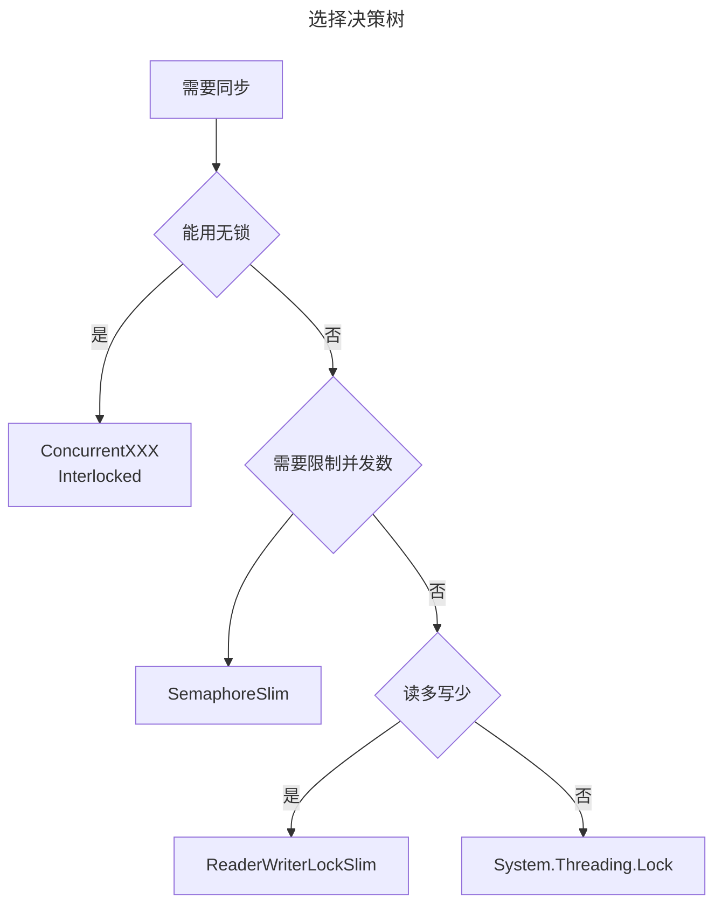

## 四大主流锁机制对比 ##

### System.Threading.Lock (C# 13) ###

```csharp
private readonly Lock _lock = new Lock();

public void DoWork()
{
    using (_lock.EnterScope())  // 或 lock(_lock)
    {
        // 临界区代码
    }
}
```

#### ✅ 优势 ####

- 性能最优（比传统lock快）
- 自动内存管理
- 更好的调试信息
- 编译器优化支持

#### ❌ 劣势 ####

- 只能C# 13使用
- 仍然是互斥锁（一次只能一个线程）

#### 🎯 适用场景 ####

99%的普通同步需求

### ReaderWriterLockSlim ###

```csharp
private readonly ReaderWriterLockSlim _rwLock = new ReaderWriterLockSlim();

public string Read()
{
    _rwLock.EnterReadLock();
    try { return _data; }
    finally { _rwLock.ExitReadLock(); }
}

public void Write(string value)
{
    _rwLock.EnterWriteLock();
    try { _data = value; }
    finally { _rwLock.ExitWriteLock(); }
}
```

#### ✅ 优势 ####

- 多个线程可同时读
- 读写分离，提高并发度
- 适合读多写少场景

#### ❌ 劣势 ####

- 开销比普通锁大
- 写操作仍需独占
- 可能出现写饥饿

#### 🎯 适用场景 ####

- 缓存、配置、读多写少的数据结构

### 信号量 (Semaphore/SemaphoreSlim) ###

```csharp
private readonly SemaphoreSlim _semaphore = new SemaphoreSlim(3, 3); // 允许3个并发

public async Task ProcessAsync()
{
    await _semaphore.WaitAsync();
    try
    {
        // 限制并发数的工作
    }
    finally
    {
        _semaphore.Release();
    }
}
```

#### ✅ 优势 ####

- 控制并发数量
- 支持异步等待
- 灵活的资源管理

#### ❌ 劣势 ####

- 不保护共享状态
- 需要手动管理计数
- 可能资源泄露

#### 🎯 适用场景 ####

限流、连接池、资源控制

### 无锁 (ConcurrentXXX) ###

```csharp
private readonly ConcurrentDictionary<string, int> _dict = new();
private int _counter;

public void Increment()
{
    Interlocked.Increment(ref _counter);  // 原子操作
}

public void AddItem(string key, int value)
{
    _dict.AddOrUpdate(key, value, (k, old) => old + value);
}
```

#### ✅ 优势 ####

- 性能最高
- 无死锁风险
- 高并发友好

#### ❌ 劣势 ####

- 复杂操作难实现
- 学习成本高
- ABA问题等陷阱

#### 🎯 适用场景 ####

- 高性能场景、简单数据操作

## 🚀 现代化最佳实践 ##

### 选择决策树 ###



### 实际场景模板

```csharp
public class ModernService
{
    // 缓存 - 优先无锁
    private readonly ConcurrentDictionary<string, object> _cache = new();

    // 计数器 - 原子操作
    private long _requestCount;
    public void IncrementRequests() => Interlocked.Increment(ref _requestCount);

    // 限流 - 信号量
    private readonly SemaphoreSlim _concurrencyLimit = new(10, 10);

    // 复杂状态 - 新Lock
    private readonly Lock _stateLock = new();
    private ComplexState _state = new();

    // 配置管理 - 读写锁
    private readonly ReaderWriterLockSlim _configLock = new();
    private Dictionary<string, string> _config = new();
}
```

## 🛡️ 锁问题解决方案 ##

### 死锁预防 ###

#### 锁顺序化 - 最重要的规则 ####

```csharp
// ❌ 错误：可能死锁
public class BadTransfer
{
    public void Transfer(Account from, Account to, decimal amount)
    {
        lock (from._lock)
        {
            lock (to._lock)  // 不同线程可能以相反顺序获取锁
            {
                from.Balance -= amount;
                to.Balance += amount;
            }
        }
    }
}

// ✅ 正确：按固定顺序获取锁
public class GoodTransfer
{
    public void Transfer(Account from, Account to, decimal amount)
    {
        // 按账户ID排序，确保锁获取顺序一致
        var firstLock = from.Id < to.Id ? from._lock : to._lock;
        var secondLock = from.Id < to.Id ? to._lock : from._lock;

        lock (firstLock)
        {
            lock (secondLock)
            {
                from.Balance -= amount;
                to.Balance += amount;
            }
        }
    }
}
```

#### 超时机制 ####

```csharp
public class TimeoutLockService
{
    private readonly Lock _lock1 = new();
    private readonly Lock _lock2 = new();

    public bool TryExecuteWithTimeout(Action action, int timeoutMs = 5000)
    {
        using var cts = new CancellationTokenSource(timeoutMs);

        try
        {
            using (_lock1.EnterScope())
            {
                cts.Token.ThrowIfCancellationRequested();
                using (_lock2.EnterScope())
                {
                    action();
                    return true;
                }
            }
        }
        catch (OperationCanceledException)
        {
            return false; // 超时
        }
    }
}
```

#### 避免嵌套锁 ####

```csharp
// ❌ 危险：嵌套锁
public void BadMethod()
{
    lock (_lock1)
    {
        DoSomething();
        lock (_lock2)  // 嵌套锁容易死锁
        {
            DoMore();
        }
    }
}

// ✅ 安全：分离锁操作
public void GoodMethod()
{
    var data1 = GetDataSafely1();
    var data2 = GetDataSafely2();

    // 在锁外处理数据
    var result = ProcessData(data1, data2);

    SetResultSafely(result);
}
```

### 性能优化技巧 ###

#### 减少锁粒度 ####

```csharp
// ❌ 锁粒度太大
public class CoarseGrainedLock
{
    private readonly Lock _bigLock = new();
    private readonly Dictionary<string, UserData> _users = new();

    public void UpdateUser(string userId, UserData data)
    {
        lock (_bigLock)  // 所有用户更新都要等待
        {
            _users[userId] = data;
        }
    }
}

// ✅ 细粒度锁
public class FineGrainedLock
{
    private readonly ConcurrentDictionary<string, Lock> _userLocks = new();
    private readonly ConcurrentDictionary<string, UserData> _users = new();

    public void UpdateUser(string userId, UserData data)
    {
        var userLock = _userLocks.GetOrAdd(userId, _ => new Lock());
        lock (userLock)  // 只锁定特定用户
        {
            _users[userId] = data;
        }
    }
}
```

#### 双重检查模式 ####

```csharp
public class LazyInitialization
{
    private volatile ExpensiveObject _instance;
    private readonly Lock _lock = new();

    public ExpensiveObject GetInstance()
    {
        if (_instance == null)  // 第一次检查（无锁）
        {
            lock (_lock)
            {
                if (_instance == null)  // 第二次检查（有锁）
                {
                    _instance = new ExpensiveObject();
                }
            }
        }
        return _instance;
    }
}
```

### 异步友好模式 ###

```csharp
public class AsyncSafeService
{
    private readonly SemaphoreSlim _asyncLock = new(1, 1);

    // ❌ 错误：在async方法中使用lock
    public async Task BadMethodAsync()
    {
        // lock (_lock)  // 编译错误：不能在async方法中使用lock
        // {
        //     await SomeAsyncWork();
        // }
    }

    // ✅ 正确：使用SemaphoreSlim
    public async Task GoodMethodAsync()
    {
        await _asyncLock.WaitAsync();
        try
        {
            await SomeAsyncWork();
        }
        finally
        {
            _asyncLock.Release();
        }
    }

    // ✅ 更好：封装成扩展方法
    public async Task<T> ExecuteWithLockAsync<T>(Func<Task<T>> operation)
    {
        await _asyncLock.WaitAsync();
        try
        {
            return await operation();
        }
        finally
        {
            _asyncLock.Release();
        }
    }
}
```

## 📊 选择指南总结 ##

| 场景  |  推荐方案  |  原因  |   备注 |
| :-------: | :---------: | :--------: | :----------: |
| 简单计数器 | `Interlocked` | 无锁，性能最佳 |  |
| 字典缓存 | `ConcurrentDictionary` | 无锁，并发友好 |  |
| 单例模式 | `Lazy<T>` 或双重检查 | 线程安全，延迟初始化 |  |
| 配置管理 | `ReaderWriterLockSlim` | 读多写少优化 |  |
| 限流控制 | `SemaphoreSlim` | 控制并发数 |  |
| 一般同步 | `System.Threading.Lock` | 现代化，性能优 |  |
| 异步场景 | `SemaphoreSlim` | 异步友好 |  |
| 文件操作 | `Lock` + 异常处理 | 简单可靠 |  |

## 🎯 黄金法则 ##

- 无锁 > 信号量（控制并发）> Lock（互斥）> 读写锁（读多写少）
- 能用 `ConcurrentXXX` 就别用锁
- 锁对象要专用，不要锁 `this` 或 `字符串`
- 锁里面不要调用外部方法
- 异步方法用 `SemaphoreSlim`，不用 `lock`
- 获取多个锁时，总是按相同顺序
- 尽快释放锁，不要在锁内做耗时操作

> 选择原则：**先考虑能否无锁，再考虑是否需要限流，最后才考虑互斥锁的具体类型**。
