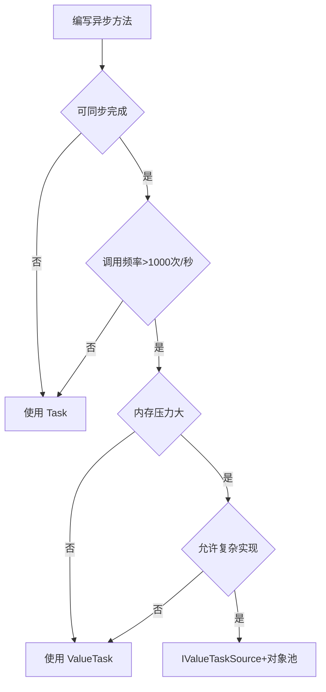

## 简介 ##

`ValueTask` 是 `.NET Core 2.0+` 引入的高性能异步操作类型，用于优化可能同步完成的异步操作，减少内存分配和性能开销。

## 为什么需要 ValueTask？ ##

### Task 的性能问题 ###

- 堆分配开销：每次创建 `Task<T>` 都会在堆上分配对象（约 1KB），高频调用会导致 GC 压力。
- 多数场景同步完成：许多异步方法在多数情况下可以直接返回结果，无需真正异步。

### ValueTask 的优势 ###

- 值类型：`ValueTask<T>` 是 `struct`，避免堆分配。
- 双重表示：
  - 直接存储同步结果（无需分配）。
  - 包装真正的 `Task<T>`（当确实需要异步时）。

### ValueTask本质 ###

```csharp
public readonly struct ValueTask<TResult> : IEquatable<ValueTask<TResult>>
{
    private readonly object? _obj; // Task或IValueTaskSource
    private readonly TResult _result; // 同步结果
    private readonly short _token; // 验证令牌
    // ...
}
```

## 典型使用场景 ##

- 同步完成概率高
  - 缓存命中、预加载数据、简单计算等。
  - 示例：从缓存读取数据，命中时同步返回。
- 高频调用的异步方法
  - 如网络库、序列化、中间件等底层组件。
  - 避免大量 `Task` 分配导致的 `GC` 压力。
- 热路径（`Hot Path`）优化
  - 性能关键的代码段（如循环内调用）。

## 核心使用场景 ##

### 高频调用且多数情况同步完成的方法 ###

```csharp
// 缓存场景：多数情况直接命中缓存（同步）
public ValueTask<string> GetDataAsync(string key)
{
    if (_cache.TryGetValue(key, out string value))
    {
        return new ValueTask<string>(value); // 同步返回，无堆分配
    }
    
    return new ValueTask<string>(LoadDataFromDbAsync(key)); // 异步返回
}
```

### 实现异步接口或基类方法 ###

```csharp
// 实现异步接口时，优先使用 ValueTask
public interface IDataProvider
{
    ValueTask<string> GetDataAsync(string key);
}
```

### 异步流中的值返回 ###

```csharp
// 异步流中的值生成
public async IAsyncEnumerable<ValueTask<int>> GenerateValuesAsync()
{
    for (int i = 0; i < 10; i++)
    {
        await Task.Delay(100);
        yield return new ValueTask<int>(i); // 高效返回值
    }
}
```

## 详细用法与示例 ##

### 创建 ValueTask ###

```csharp
// 同步结果（无堆分配）
ValueTask<int> GetSynchronizedResult()
{
    return new ValueTask<int>(42); // 直接存储结果
}

// 异步结果（包装 Task）
ValueTask<int> GetAsynchronizedResult()
{
    return new ValueTask<int>(Task.Delay(100).ContinueWith(_ => 42));
}
```

### 消费 ValueTask ###

```csharp
// 推荐方式：直接 await
await foreach (var valueTask in GenerateValuesAsync())
{
    int value = await valueTask; // 安全消费，支持同步/异步场景
}

// 手动检查（不常用）
async Task ConsumeValueTask(ValueTask<int> valueTask)
{
    if (valueTask.IsCompletedSuccessfully)
    {
        int value = valueTask.Result; // 直接获取结果（无等待）
    }
    else
    {
        int value = await valueTask; // 等待异步完成
    }
}
```

### 与 Task 的转换 ###

```csharp
// 转换为 Task（需谨慎，会导致堆分配）
Task<int> task = valueTask.AsTask();

// 从 Task 创建 ValueTask
ValueTask<int> valueTask = new ValueTask<int>(Task.FromResult(42));
```

### 混合同步/异步完成 ###

```csharp
public ValueTask<string> ReadDataAsync()
{
    if (_buffer.Length > 0)
        return new ValueTask<string>(_buffer.ToString()); // 同步

    return new ValueTask<string>(ReadFromStreamAsync()); // 异步
}
```

### 使用 async 方法（.NET Core 3.0+） ###

```csharp
public async ValueTask<byte[]> ComputeHashAsync(byte[] data)
{
    if (data.Length < 1024)
        return ComputeHashSync(data); // 同步分支

    return await Task.Run(() => ComputeHash(data)); // 异步分支
}

private byte[] ComputeHashSync(byte[] data) { ... }
```

## 高级模式：IValueTaskSource ##

### 对象池集成（极致优化） ###

```csharp
private static readonly ObjectPool<MyValueTaskSource> _pool = 
    new DefaultObjectPool<MyValueTaskSource>(new PooledPolicy());

public ValueTask<int> GetOptimizedValueAsync()
{
    var source = _pool.Get();
    try
    {
        if (source.TrySetResultIfPossible(42))
            return new ValueTask<int>(source, source.Version);
            
        StartAsyncOperation(source);
        return new ValueTask<int>(source, source.Version);
    }
    catch
    {
        _pool.Return(source);
        throw;
    }
}

private void StartAsyncOperation(MyValueTaskSource source)
{
    ThreadPool.UnsafeQueueUserWorkItem(state =>
    {
        try
        {
            // 模拟工作
            Thread.Sleep(10);
            source.SetResult(42);
        }
        finally
        {
            _pool.Return(source);
        }
    }, null);
}
```

### 自定义ValueTaskSource完整实现 ###

```csharp
public class MyValueTaskSource : IValueTaskSource<int>
{
    private ManualResetValueTaskSourceCore<int> _core;
    
    public int GetResult(short token) => _core.GetResult(token);
    public ValueTaskSourceStatus GetStatus(short token) => _core.GetStatus(token);
    
    public void OnCompleted(
        Action<object?> continuation, 
        object? state, 
        short token, 
        ValueTaskSourceOnCompletedFlags flags)
        => _core.OnCompleted(continuation, state, token, flags);
    
    public void SetResult(int result) => _core.SetResult(result);
    public void SetException(Exception error) => _core.SetException(error);
    
    // 版本令牌防重用
    public short Version => _core.Version;
}
```

## 注意事项 ##

### 禁止多次 await 同一个 ValueTask ###

`ValueTask` 不保存状态，多次 `await` 可能导致异常或未定义行为。

```csharp
var task = GetValueTask();
await task; // OK
await task; // ❌ 错误！ValueTask 只能消费一次
```

### 需要多次消费时转换为 Task ###

```C#
Task<int> task = GetValueTask().AsTask();
await task;
await task; // 安全（但通常应避免多次 await）
```

### 避免在异步方法外阻塞 ###

```csharp
// ❌ 危险！可能导致死锁
var result = GetValueTask().Result;

// ✅ 推荐做法
var result = await GetValueTask();
```

## 何时避免使用 ValueTask ##

- 方法总是异步完成 → 用 `Task`。
- 需要多次 `await` 或长期存储任务结果 → 用 `Task`。
- 不关心性能的普通场景 → 优先 `Task`（代码更简单）。

## 底层原理 ##

- 同步完成：内联存储结果（`TResult`），零分配。
- 异步完成：内部包装一个 `Task` 或实现 `IValueTaskSource`（`.NET Core 3.0+`），分配一次对象。
- `IValueTaskSource`：高级场景下手动管理异步状态（如 `Socket`、`PipeReader`）。

## 最佳实践总结 ##

| 场景  |  推荐类型  |  原因  | 
| :-------: | :---------: | :---------: |
| 可能同步完成的高频方法 | `ValueTask` | 减少分配 |
| 总是异步完成 | `Task` | 避免 `ValueTask` 额外开销 |
| 需存储任务或多次 `await` | `Task` | `ValueTask` 不支持复用 |
| 库/框架开发（性能敏感） | `ValueTask` | 最大化调用方性能 |

## 性能基准对比 ##

| 方法  |  内存分配  |  GC 触发  |  执行时间  | 
| :-------: | :---------: | :---------: |  :---------: |
| `Task.FromResult` | 48 MB | Gen0: 15 | 650 ms |
| `ValueTask.FromResult` | 0 MB | 0 | 120 ms |
| `IValueTaskSource+池` | 0.01 MB | 0 | 95 ms |

## 决策流程：何时使用ValueTask ##


