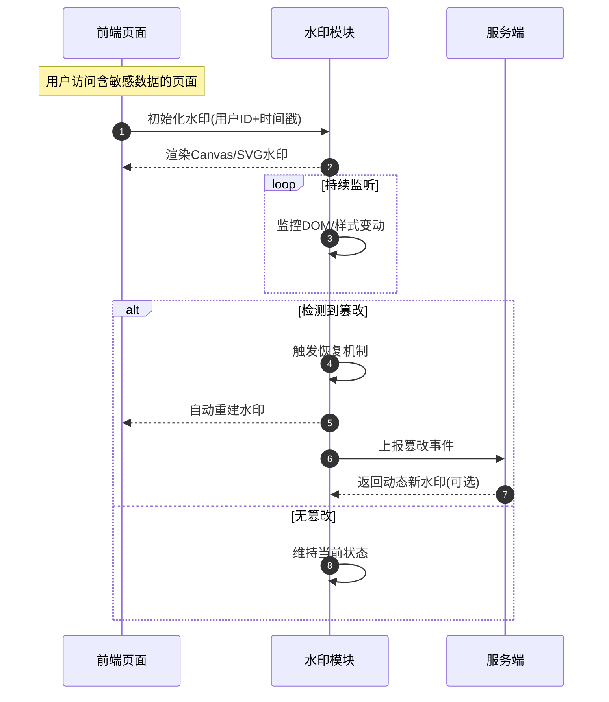

前端水印防篡改技术通过在网页内容上叠加半透明标识（如用户信息、时间戳等），结合监控与恢复机制，防止恶意删除或修改。其核心目标是实现数据溯源与版权保护。以下从原理、技术实现及防护策略展开说明：

## 🔍 ​​一、水印防篡改的核心挑战​​ ##

- **​​DOM 删除**​​​：攻击者通过浏览器开发者工具直接删除水印元素。
- **​​样式篡改**​​​：修改水印的透明度、`z-index` 层级或 `display` 属性使其不可见。
- **​​图层覆盖**​​​：在 DOM 树中创建更高层级的元素遮挡水印。
- **​​截图绕过**​​​：截取不包含水印的区域泄露内容。

## 🛡️ ​​二、基础防篡改技术​​ ##

### ​​DOM 删除防护：MutationObserver 监听​​ ###

- **​​原理**​​：监听水印元素是否被移除，若删除则自动重建。

- **​​代码示例**​​：

```ts
const observer = new MutationObserver(mutations => {
  mutations.forEach(mutation => {
    if (mutation.removedNodes.includes(watermark)) {
      document.body.appendChild(watermark); // 重建水印
    }
  });
});
observer.observe(document.body, { childList: true });
```

### ​​样式篡改防护​​ ###

- **​​属性锁定​**​：通过 `Object.defineProperty` 冻结关键样式（如 `opacity`、`display`），阻止修改：

```ts
Object.defineProperty(watermark.style, 'opacity', {
  set(value) { this._opacity = parseFloat(value) < 0.1 ? '0.3' : value; },
  get() { return this._opacity || '0.3'; }
});
```

- **​​样式恢复机制​**​：监听 `style` 属性变化，强制恢复原始值。

### ​​层级防护（防遮挡）​​ ###

- 动态计算页面最大 `z-index`，确保水印始终位于顶层：

```ts
function ensureCanvasOnTop() {
  const maxZIndex = Math.max(...Array.from(document.querySelectorAll('*'))
    .map(el => parseFloat(getComputedStyle(el).zIndex) || 0));
  watermark.style.zIndex = maxZIndex + 1;
}
```

## ⚙️ ​​三、水印实现方案与防篡改增强​​ ##

### ​​Canvas 动态水印​​ ###

- **​​优势**​​：生成图片格式水印，难以通过 DOM 操作直接修改内容。

- **​​防篡改增强​**​：
  - 绑定用户信息（如 ID、IP、时间戳），实现溯源。
  - 定期更新水印（如每分钟重绘），防止静态截图泄露。

### ​​SVG 水印​​ ###

- **​​优势​**​：矢量图形缩放无损，可添加干扰路径增加破解难度：

```html
<svg>
  <text>机密文档</text>
  <path d="M0,0 Q100,50..." stroke="rgba(0,0,255,0.01)"/> <!-- 干扰线 -->
</svg>
```

- **​​防移除​**​：转换为 Base64 背景图，避免暴露 SVG 源码。

### ​​CSS 多重复合背景​​ ###

- **​​策略**​​：叠加多层背景（线性渐变 + 水印图），并通过动画位移干扰截图：

```css
.watermark::before {
  background-image: 
    linear-gradient(45deg, rgba(0,0,0,0.03) 25%, transparent 25%),
    url('watermark.svg');
  animation: waterflow 120s infinite linear; /* 动态位移 */
}
```

### ​​暗水印（隐形水印）​​ ###

- **​​原理​**​：将信息嵌入像素最低有效位（LSB）或色彩通道，肉眼不可见。

- **​​应用**​​：

  - **​​​嵌入阶段**​​：修改像素 LSB 存储用户信息。
  - **​​​提取阶段**​​：通过图像处理（如叠加增强）还原水印。

- **​​示例**​​：

```ts
// 嵌入水印
for (let i = 0; i < binaryText.length; i++) {
  imageData.data[i * 4 + 2] = (imageData.data[i * 4 + 2] & 0xFE) | binaryText[i]; // 修改蓝色通道
}
```

## 🔐 ​​四、高级防护策略​​ ##

### ​​服务端协同验证​​ ###

动态水印由服务端生成（如 `/api/watermark?userId=123`），前端仅负责展示，防止篡改水印内容。

### ​​行为监控与上报​​ ###

水印被篡改时自动触发安全告警：

```ts
fetch('/api/security-alert', {
  method: 'POST',
  body: JSON.stringify({ type: 'WATERMARK_TAMPER', user: 'admin' })
}); // 上报至服务端
```

### ​​加密与水印混淆​​ ###

- 水印文本经 AES 加密后嵌入，避免明文暴露用户信息。
- 混淆 DOM 结构（如随机 Class 名、分散水印片段），增加定位难度。

## ⚠️ ​​五、技术局限性与应对​​ ##

- **​​前端固有弱点​**​：无法完全防御专业截图、录屏或浏览器插件禁用 JavaScript。

- **​​增强建议​**​：

  - 结合 **​​明水印**​​（可见）与 ​**​暗水印**​​（不可见），实现双重防护。
  - 高安全场景使用​**​数字版权管理（DRM）**​​ 或 **​​PDF 水印**​​（服务端预渲染）。

## ​​六、最佳实践​​ ##

- **​​​用户绑定**​​​：水印需包含唯一标识（如用户 ID、时间戳）。
- **​​性能优化​**​​：使用 Web Worker 异步生成水印，避免阻塞渲染。
- **​​​法律合规**​​​：在用户协议中声明水印用途，获取知情同意。



> 💎 ​​总结​​：前端水印防篡改依赖 ​​“监控 + 恢复 + 混淆”​​ 的技术组合。尽管无法实现绝对安全，但通过动态水印、多层防护与服务端协同，可显著提升攻击成本，满足多数场景的数据保护需求。
