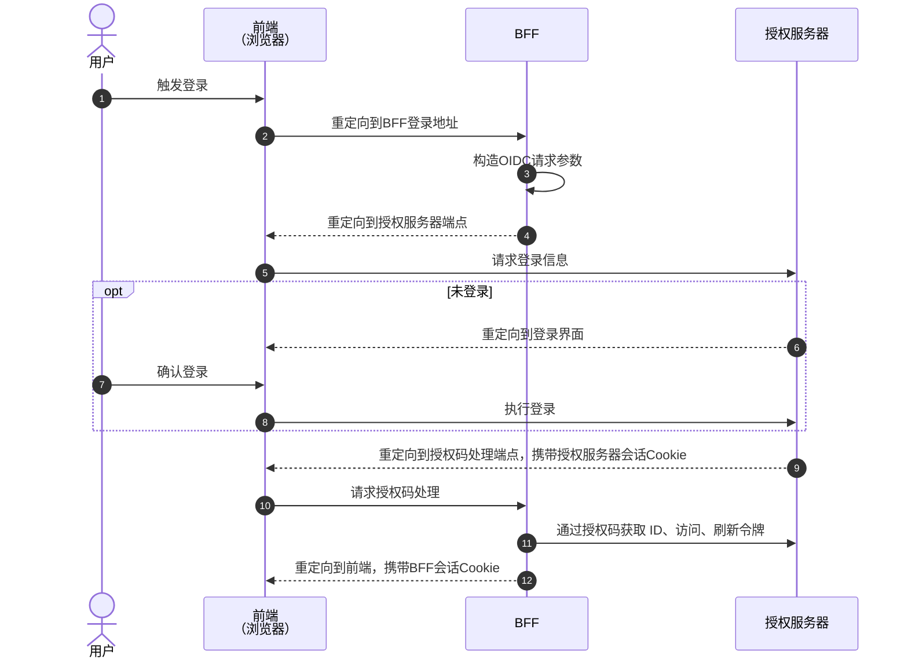
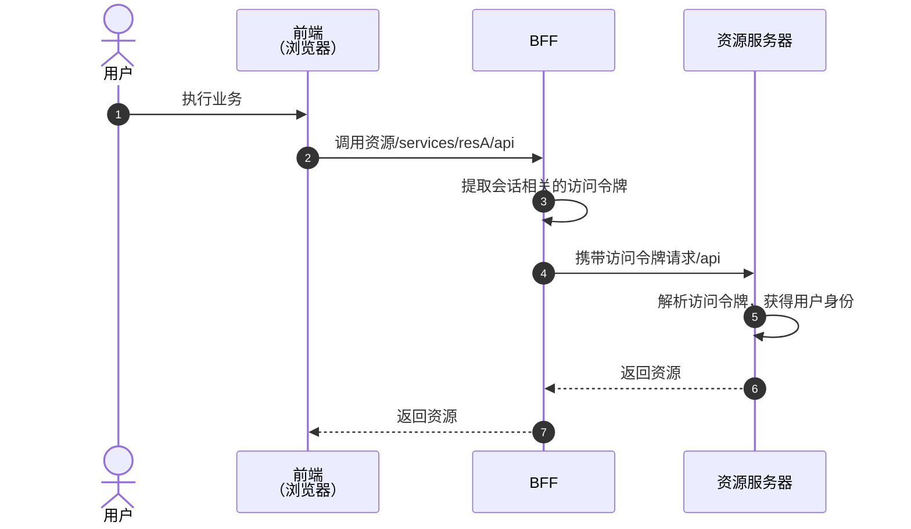
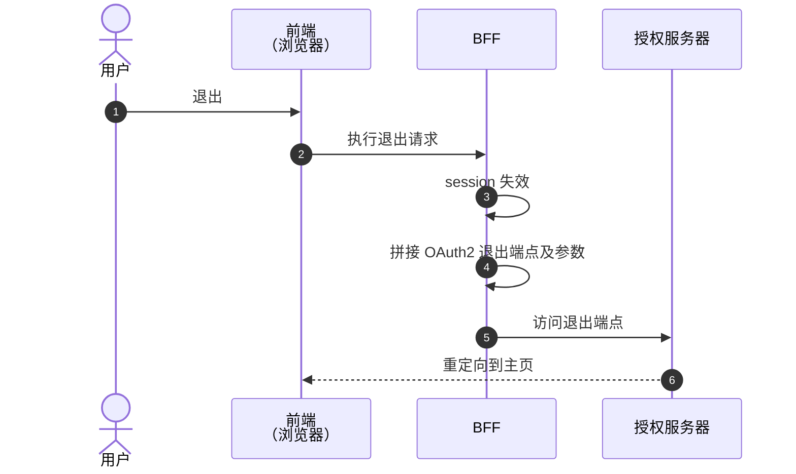

## 背景 ##

在前后端分离的架构下，OAuth 2.0 的应用面临一项挑战：即前端如何安全地持有与运用令牌。鉴于前端环境对敏感信息保护的局限性，这些关键数据极易成为安全漏洞，被三方窃取利用。针对令牌管理，前端无论使用哪种客户端类型，均存在不容忽视的隐患。

### 保密客户端 ###

将前端视为保密客户端，负责请求并存储访问令牌与刷新令牌。然而，此模式下，客户端密钥与刷新令牌的保密性难以保证，一旦泄露，将赋予恶意第三方长期冒充用户权限的能力，风险极高。

### 公开客户端 ###

将前端定位为公共客户端，仅请求访问令牌使用。

此做法虽在一定程度上减少了敏感信息的暴露面，但亦有其局限性，访问令牌过期后，前端无法获取新的令牌，只能跳转到登录页要求用户重新登录，未能全面解决前端在令牌管理上的安全难题。

公开客户端的访问令牌生命周期较短（N分钟），如使用刷新令牌，那也存在与保密客户端的问题。一般授权服务器也不颁发刷新令牌。

那么，前端该作为什么身份参与到 OAuth2 的授权流程中？

## BFF (Backend For Frontend) ##

根据上文的说明，前端无法妥善处理敏感信息，不能作为一个单独的客户端来参与到 OAuth2 的授权流程中。

我们可以常用以下方式处理敏感信息：

- 将敏感信息加密
- 通过后端传输

### PKCE ###

OAuth2 支持通过 `PKCE` 的方式进行加密传输过程的信息，这不是本文讨论的重点。需要注意的是，前端运行在不安全的环境中，加密的算法也很容易泄露。

### BFF ###

为前端应用配备一个后端，将前端和对应的后端作为一个整体来参与到 OAuth2 的流程中，这就是 `BFF` 架构模式。

BFF 后端参与 OAuth2 授权流程，秘钥、刷新令牌等敏感信息通过“后端信道”传输，避免在公共网络中泄露。

前端通过 `Cookie` 维持与 BFF后端的 `Session` 会话。

BBF 架构模式 Mermaid

### 前端如何访问资源服务器 ###

前端与 BFF 后端通过 `Session` 维持会话，前端与资源服务器没有会话凭证，也就是说资源服务器无法识别前端直接请求是否合法。

OAuth2 相关的`访问令牌`、`刷新令牌`、`ID令牌`都存储在 `BFF` 后端，前端的所有请求需要通过 `BFF` 后端进行转发，转发时需要携带这些令牌信息。

## 基于 BFF 的处理流程 ##

### 登录流程 ###



**说明**

1-2: 登录页面在授权服务器中，用户的登录状态由授权服务器会话 Session 维护。这样设计就自动拥有单点登录能力。对于前端来说，需要通过路由、请求拦截或用户主动触发登录流程。

3-5: 通过已注册的客户端，BFF 需要解析出 OIDC 请求端点，并将当前请求重定向到授权服务器，以便进行 OIDC 登录流程。

6-8: 授权服务器未获得当前请求有效会话，要求用户登录时，将当前请求重定向到授权服务器登录页面。

9-11: 授权服务器返回授权码，并重定向到 BFF。 BFF 基于授权码通过后端信道获取ID、访问、刷新令牌。

12: 完成授权后，BFF 已经拥有了 ID、访问、刷新令牌，需要将这些信息与用户 Session 关联起来。重定向到前端，Session Cookie 不一定是在这个环节生成（在第 2 步骤第一次与 BFF 交互时就生成）。

### 访问资源服务器 ###

用户完成登录后，进行业务操作，请求资源服务器上的资源。



**说明**

1-2: 用户执行业务操作，请求资源接口2 相关的令牌存储在 BFF 中，需要通过 BFF 转发该请求到指定资源服务器上；

3: BFF 从 Session 中提取出访问令牌，此时需要校验访问令牌是否过期以及是否需要使用刷新令牌。使用刷新令牌算法：过期时间 - 当前时间 < 阈值，阈值根据实际情况设置，一般设置为 1 分钟；

4: BFF 转发请求时，在 HTTP Head 上携带访问令牌；

5-7: 资源服务器提取访问令牌并解析，获得用户合法身份后，返回对应的资源；

### 退出 ###



**说明**

1-2: 执行退出，退出操作也需要经过 BFF ;

3-4: 在 BFF 中，退出操作需要将当前会话失效，同时需要请求授权服务器结束 OAuth2 的会话。这个过程需要按照规范拼接 OAuth2 结束会话端点地址及参数，主要参数：`id_token_hint`、`post_logout_redirect_uri` ；

5-6: 授权服务器结束会话，并按照 `post_logout_redirect_uri` 重定向回前端；

## 落地 ##

基于以上理论部分，使用 Spring Cloud 技术栈实现。

以下代码片段省略了部分不重要的信息，需要自行补充。

### 授权服务器 ###

基于 Spring Authorization Server 开发授权服务器，也可以直接使用其他开源授权服务器 KeyCloak、Okta 代替。

#### 依赖 ####

```xml
<dependency>
    <groupId>org.springframework.boot</groupId>
    <artifactId>spring-boot-starter-oauth2-authorization-server</artifactId>
</dependency>
<dependency>
	<groupId>org.springframework.boot</groupId>
	<artifactId>spring-boot-starter-oauth2-resource-server</artifactId>
</dependency>
<dependency>
	<groupId>org.springframework.boot</groupId>
	<artifactId>spring-boot-starter-security</artifactId>
</dependency>
<dependency>
	<groupId>org.springframework.boot</groupId>
	<artifactId>spring-boot-starter-web</artifactId>
</dependency>
```

#### 配置文件 ####

```yaml
spring:
  security:
    # 内置用户
    user:
      name: admin
      password: admin
      roles:
        - ADMIN
        - USER
    oauth2:
      authorizationserver:
        client:
            oidc:
              registration:
                client-id: web_app
                client-secret: "{noop}web_app"
                client-authentication-methods:
                  - "client_secret_basic"
                authorization-grant-types:
                  - "authorization_code"
                  - "refresh_token"
                  - "client_credentials"
                redirect-uris:
                  - "http://localhost:9000/login/oauth2/code/oidc"
                post-logout-redirect-uris:
                  - "http://localhost:9000"
                scopes:
                  - "openid"
                  - "profile"
              require-authorization-consent: false
```

作为授权服务器内置 admin 用户，注册 web_app 客户端并配置授权方式、重定向地址、退出重定向地址等。

#### 安全配置 ####

```java
@Bean 
@Order(Ordered.HIGHEST_PRECEDENCE)
SecurityFilterChain authorizationServerSecurityFilterChain(HttpSecurity http)
		throws Exception {
	OAuth2AuthorizationServerConfiguration.applyDefaultSecurity(http);
	http.getConfigurer(OAuth2AuthorizationServerConfigurer.class)
		.oidc(Customizer.withDefaults());	
	http
		.exceptionHandling((exceptions) -> exceptions
			.defaultAuthenticationEntryPointFor(
				new LoginUrlAuthenticationEntryPoint("/login"),
				new MediaTypeRequestMatcher(MediaType.TEXT_HTML)
			)
		)
		.oauth2ResourceServer((resourceServer) -> resourceServer
				.jwt(Customizer.withDefaults()));

	http.cors(Customizer.withDefaults());
	return http.build();
}

@Bean 
@Order(2)
SecurityFilterChain defaultSecurityFilterChain(HttpSecurity http)
		throws Exception {
	http
            .authorizeHttpRequests((authorize) -> authorize
                    .anyRequest().authenticated()
            )
            // 表单登录
            .formLogin(Customizer.withDefaults());
	
	return http.build();
}
```

其中 `oidc()` 配置开启 OIDC 认证流程；`oauth2ResourceServer()` 设置同时作为资源服务器时使用 JWT 令牌；`exceptionHandling()` 配置使用内置的登录页面。

需要注意的 `cors()` 的配置，当前 demo 使用 localhost 默认是通过 cors 校验，如果使用 ip 访问请将前端地址配置到 cors 中。

### BFF 网关 ###

BFF 后端的要求类似网关，完全可以把 BFF 后端的作用实现在网关内。

基于 Sping Cloud Gateway 来实现网关。

#### 依赖 ####

```xml
<dependency>
	<groupId>org.springframework.boot</groupId>
	<artifactId>spring-boot-starter-oauth2-client</artifactId>
</dependency>
<dependency>
	<groupId>org.springframework.boot</groupId>
	<artifactId>spring-boot-starter-oauth2-resource-server</artifactId>
</dependency>
<dependency>
	<groupId>org.springframework.cloud</groupId>
	<artifactId>spring-cloud-starter-gateway</artifactId>
</dependency>
```

网关作为 OAuth2 客户端需要引入客户端依赖。如果仅仅只在当前场景下使用，不需要引入资源服务器依赖。

#### 配置文件 ####

```yaml
spring:
  cloud:
    gateway:
      default-filters:
        - TokenRelay
      routes:
        - id: to_resource
          uri: http://localhost:8081
          filters:
            - RewritePath=/services/registrymicro/(?<segment>.*), /${segment}
          predicates:
            - Path=/services/registrymicro/**   
            
  security:
    oauth2:
      client:
        provider:
          oidc:
            issuer-uri: http://localhost:9081
        registration:
          oidc:
            client-id: web_app
            client-secret: web_app
            scope: openid, profile
```

网关配置 `default-filters：TokenRelay` 会在转发请求时携带访问令牌；为简化示例，路由配置了一个固定的资源服务地址，可替换为服务注册中的服务名称。

配置授权服务器地址以及已注册的客户端信息。

#### 配置 ####

```java
@Bean
SecurityWebFilterChain authorizationSecurityFilterChain(ServerHttpSecurity http) {
	http
		.securityMatcher(
				new NegatedServerWebExchangeMatcher(new OrServerWebExchangeMatcher(pathMatchers("/assets/**")))
		)
                // ...省略部分
		.authorizeExchange(authz ->
			authz
				.pathMatchers("/").permitAll()
				.pathMatchers("/*.*").permitAll()
				.pathMatchers("/api/**").authenticated()
				.pathMatchers("/services/**").authenticated()
		)
		.oauth2Login(withDefaults())
		.oauth2Client(withDefaults())
		.oauth2ResourceServer(withDefaults());
	return http.build();
}
```

- `authorizeExchange()`: 设定当前接口访问权限；
- `oauth2Login()`： 配置执行 OIDC 认证；
- `oauth2ResourceServer()`：配置作为资源服务器；

#### 退出实现 ####

```java
@RestController
public class LogoutResource {

    private final Mono<ClientRegistration> registration;

    public LogoutResource(ReactiveClientRegistrationRepository registrations) {
        this.registration = registrations.findByRegistrationId("oidc");
    }

    /**
     * 注销当前用户。
     *
     */
    @PostMapping("/api/logout")
    public Mono<Map<String, String>> logout(
        @AuthenticationPrincipal(expression = "idToken") OidcIdToken idToken,
        ServerHttpRequest request,
        WebSession session
    ) {
        return session.invalidate().then(this.registration.map(oidc -> prepareLogoutUri(request, oidc, idToken)));
    }
    
    /**
     * 获取注销令牌URL
     */
    private Map<String, String> prepareLogoutUri(ServerHttpRequest request, ClientRegistration clientRegistration, OidcIdToken idToken) {
        StringBuilder logoutUrl = new StringBuilder();
        logoutUrl.append(clientRegistration.getProviderDetails().getConfigurationMetadata().get("end_session_endpoint").toString());
        String originUrl = request.getHeaders().getOrigin();
        logoutUrl.append("?id_token_hint=").append(idToken.getTokenValue()).append("&post_logout_redirect_uri=").append(originUrl);
        return Map.of("logoutUrl", logoutUrl.toString());
    }
}
```

### 资源服务器 ###

该方案不影响资源服务器的实现，按照 `OAuth2` 标准的资源服务器处理即可。

#### 依赖 ####

```xml
<dependency>
	<groupId>org.springframework.boot</groupId>
	<artifactId>spring-boot-starter-oauth2-resource-server</artifactId>
</dependency>
<dependency>
	<groupId>org.springframework.boot</groupId>
	<artifactId>spring-boot-starter-security</artifactId>
</dependency>
```

#### 配置文件 ####

```yaml
spring:
  security:
    oauth2:
      resourceserver:
        jwt:
          issuer-uri: http://localhost:9081
```

#### 配置 ####

```java
@Bean
SecurityFilterChain filterChain(HttpSecurity http) throws Exception {
	http
		.csrf(csrf -> csrf.disable())
		.authorizeRequests(authorize -> authorize.anyRequest().authenticated())
		.sessionManagement(session -> session.sessionCreationPolicy(SessionCreationPolicy.STATELESS))
		.oauth2ResourceServer(Customizer.withDefaults());
	return http.build();
}
```

- `sessionManagement()` 配置使用无状态的会话；
- `oauth2ResourceServer()` 开启 OAuth2 资源服务器。

#### 创建示例资源 ####

按照网关路由的地址，创建一个资源，该处省略。

### 前端 ###

前端基于 Vue 3 开发，给出部分关键片段。

在 Store 中存储用户的会话信息，路由在请求前拦截当前是否存在会话，并尝试获取用户信息

```ts
router.beforeResolve(async (to, from, next) => {
  if (!store.authenticated) {
    try {
      const account = await accountApi()
      await store.setAuthentication(account.data); 
    } catch(e) {
      console.error(e)
    }
  }
  next();
})
```

如果用户未登录，提供一个触发给用户进行登录。

```ts
function login() {
  // BBF OIDC 登录地址
  window.location.href = `http://localhost:8080/oauth/authorization/oidc`;
}
```

## 结语 ##

前后端分离场景下，基于 `OAuth2` `BFF` 的登录流程大抵就是这样的。

但距离一个完整的解决方案还有很多点：用户的角色权限如何传递、使用 `JWT` 令牌还是不透明令牌、刷新令牌如何应用起来、移动端以及SDK如何登录访问。
