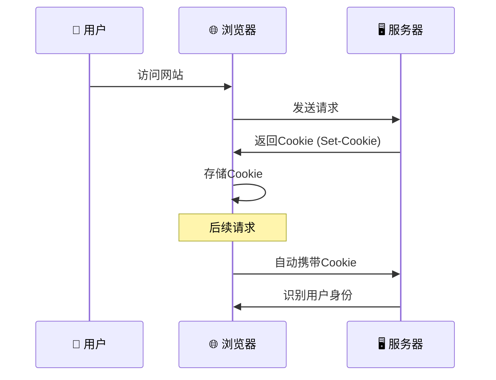
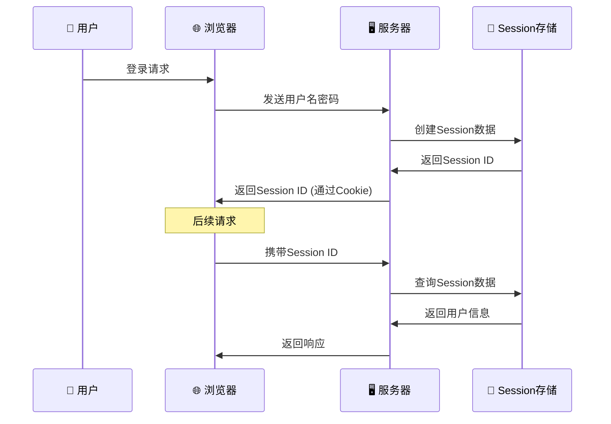
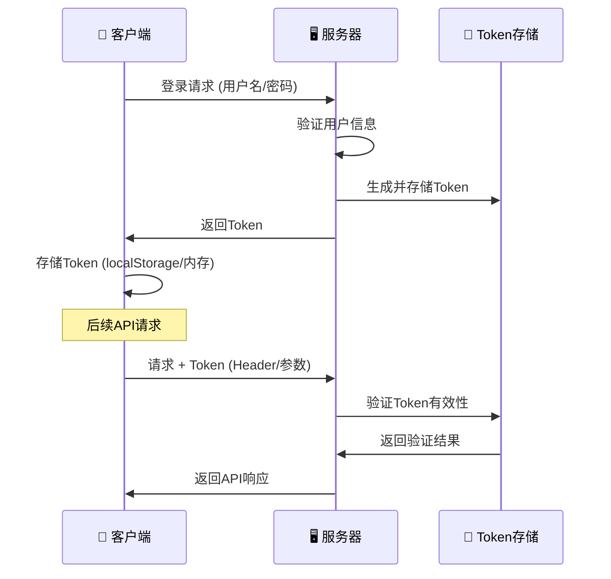
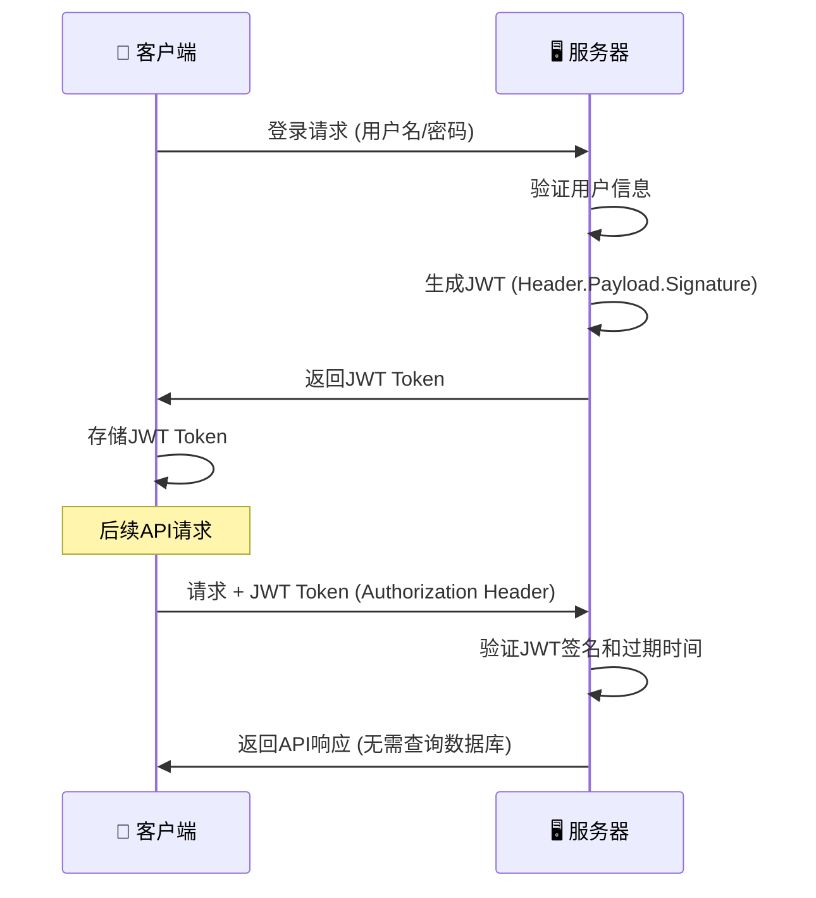
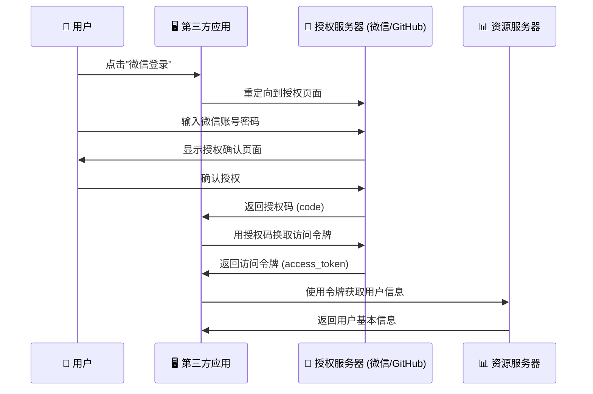
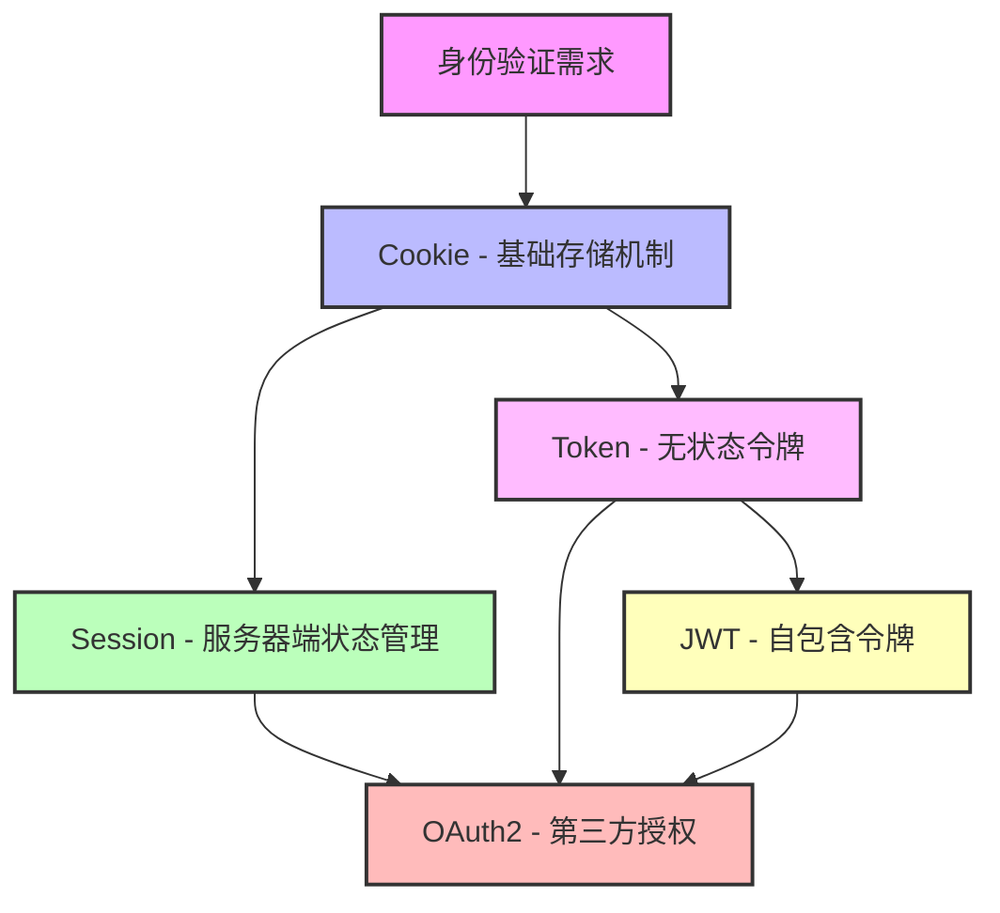

## 前言 ##

作为一个程序员，每天都在和各种登录机制打交道，但你真的搞清楚 Token、Session、Cookie、JWT、OAuth2 这五兄弟的关系了吗？今天我们用一个有趣的故事来彻底理清这些概念！

## 故事背景：网络王国的身份验证大作战 ##

在遥远的网络王国里，有一座繁华的数字城市。这座城市里住着无数的用户，他们每天都要进出各种应用商店、银行、图书馆等场所。但是问题来了：如何确保每个人的身份安全，防止坏人冒充呢？

于是，国王召集了五位身份验证专家，他们就是我们今天的主角：`Cookie老爷爷`、`Session大哥`、`Token二哥`、`JWT三弟`、`OAuth2小妹`。

## 第一幕：Cookie老爷爷的传统门卫法 ##

### Cookie的故事 ###

Cookie老爷爷是最早的身份验证专家，他的方法很简单粗暴：

> "小伙子，第一次来我这里？来，我给你一个小纸条，上面写着你的信息。下次来的时候带着这个纸条，我就知道你是谁了！"



**Cookie的工作原理**：

- 服务器通过 `Set-Cookie` 响应头发送Cookie到浏览器
- 浏览器自动存储Cookie
- 后续请求自动携带Cookie
- 服务器通过Cookie识别用户

**Cookie老爷爷的优缺点**：

- v✅ 简单易用，浏览器原生支持
- ✅ 可以设置过期时间
- ❌ 容易被篡改，安全性较低
- ❌ 有大小限制（4KB）
- ❌ 容易受到CSRF攻击

## 第二幕：Session大哥的保险箱策略 ##

### Session的故事 ###

Session大哥看到Cookie老爷爷的方法有安全隐患，于是想出了一个更安全的办法：

> "Cookie老爷爷，你直接把用户信息写在纸条上太危险了！我有个更好的办法：我给用户一个保险箱钥匙（Session ID），真正的宝贝（用户信息）我锁在服务器的保险箱里！"



**Session的工作原理**：

- 用户登录后，服务器创建Session并生成唯一的Session ID
- Session ID通过Cookie发送给浏览器
- 用户信息存储在服务器端（内存、数据库或Redis）
- 后续请求通过Session ID查找对应的用户信息

**Session大哥的优缺点**：

- ✅ 安全性高，用户信息存储在服务器端
- ✅ 可以存储大量用户信息
- ❌ 服务器需要存储Session数据，占用内存
- ❌ 集群环境下需要Session共享
- ❌ 仍然依赖Cookie传输Session ID

## 第三幕：Token二哥的令牌革命 ##

### Token的故事 ###

Token二哥是个现代派，他觉得前面两位老兄的方法都有局限性：

> "各位，时代变了！现在是移动互联网时代，不是所有客户端都支持Cookie。我的令牌系统更灵活：给用户一个令牌，想放哪里放哪里，想怎么传就怎么传！"



**Token的工作原理**：

- 用户登录成功后，服务器生成一个唯一的Token
- Token可以通过多种方式传输（HTTP Header、URL参数等）
- 服务器验证Token的有效性来识别用户身份
- Token通常有过期时间

**Token二哥的优缺点**：

- ✅ 跨平台支持，不依赖Cookie
- ✅ 传输方式灵活
- ✅ 支持跨域请求
- ❌ 需要服务器端存储和验证
- ❌ Token泄露风险
- ❌ 无状态但需要存储验证

## 第四幕：JWT三弟的自证清白术 ##

### JWT的故事 ###

JWT三弟是Token二哥的升级版，他有一个神奇的能力：

> "二哥，你的令牌还需要服务器存储和验证，太麻烦了！看我的自证清白术：我的令牌自带签名，服务器不用存储任何信息，只要验证签名就知道令牌是否有效！"



**JWT的结构**：

```txt
Header.Payload.Signature
```

- **Header**: 包含算法和令牌类型
- **Payload**: 包含用户信息和声明
- **Signature**: 使用密钥对Header和Payload的签名

**JWT三弟的优缺点**：

- ✅ 无状态，服务器不需要存储
- ✅ 自包含用户信息
- ✅ 支持分布式系统
- ✅ 跨域友好
- ❌ Token较大，增加传输开销
- ❌ 无法主动失效（除非维护黑名单）
- ❌ 敏感信息不能放在Payload中

## 第五幕：OAuth2小妹的第三方信任网 ##

### OAuth2的故事 ###

OAuth2小妹是最聪明的，她解决了一个复杂的问题：

> "各位哥哥，你们解决的都是自家的身份验证问题。但现在用户不想记住那么多账号密码，他们希望用微信、QQ、GitHub账号登录其他网站。我的第三方授权系统就是为了解决这个问题！"



**OAuth2的四种授权模式**：

- **授权码模式** (最安全，适用于有后端的应用)
- **简化模式** (适用于纯前端应用)
- **密码模式** (适用于高度信任的应用)
- **客户端模式** (适用于服务器间通信)

**OAuth2小妹的优缺点**：

- ✅ 用户无需注册新账号
- ✅ 第三方应用无需存储用户密码
- ✅ 用户可以控制授权范围
- ✅ 支持多种客户端类型
- ❌ 实现复杂度较高
- ❌ 依赖第三方服务的稳定性
- ❌ 用户隐私可能被第三方获取

## 第六幕：五兄弟的关系梳理 ##

### 他们之间的关系 ###

经过一番介绍，我们来梳理一下这五兄弟的关系：



### 实际应用场景对比 ###

| 场景        |      推荐方案      |  理由 |
| :-----------: | :-----------: | :----: |
| 传统Web应用 | Session + Cookie | 简单可靠，浏览器原生支持 |
| 单页应用(SPA) | JWT | 无状态，适合前后端分离 |
| 移动App | JWT 或 Token | 不依赖Cookie，灵活性高 |
| 微服务架构 | JWT | 无状态，便于服务间通信 |
| 第三方登录 | OAuth2 + JWT | 标准化的第三方授权流程 |
| 高安全要求 | Session + CSRF Token | 服务器端控制，安全性最高 |

## 第七幕：实战代码示例 ##

### Cookie + Session 实现 ###

```js
// Express.js 示例
const express = require('express');
const session = require('express-session');
const app = express();

// 配置Session
app.use(session({
  secret: 'your-secret-key',
  resave: false,
  saveUninitialized: false,
  cookie: { 
    secure: false, // HTTPS环境设为true
    maxAge: 24 * 60 * 60 * 1000 // 24小时
  }
}));

// 登录接口
app.post('/login', (req, res) => {
  const { username, password } = req.body;
  
  // 验证用户信息（省略具体验证逻辑）
  if (validateUser(username, password)) {
    req.session.userId = user.id;
    req.session.username = user.username;
    res.json({ success: true, message: '登录成功' });
  } else {
    res.status(401).json({ success: false, message: '用户名或密码错误' });
  }
});

// 需要登录的接口
app.get('/profile', (req, res) => {
  if (req.session.userId) {
    res.json({ 
      userId: req.session.userId,
      username: req.session.username 
    });
  } else {
    res.status(401).json({ message: '请先登录' });
  }
});
```

### JWT 实现 ###

```ts
const jwt = require('jsonwebtoken');
const SECRET_KEY = 'your-jwt-secret';

// 登录接口
app.post('/login', (req, res) => {
  const { username, password } = req.body;
  
  if (validateUser(username, password)) {
    const token = jwt.sign(
      { 
        userId: user.id, 
        username: user.username 
      },
      SECRET_KEY,
      { expiresIn: '24h' }
    );
    
    res.json({ 
      success: true, 
      token: token,
      message: '登录成功' 
    });
  } else {
    res.status(401).json({ success: false, message: '用户名或密码错误' });
  }
});

// JWT验证中间件
const authenticateToken = (req, res, next) => {
  const authHeader = req.headers['authorization'];
  const token = authHeader && authHeader.split(' ')[1]; // Bearer TOKEN
  
  if (!token) {
    return res.status(401).json({ message: '缺少访问令牌' });
  }
  
  jwt.verify(token, SECRET_KEY, (err, user) => {
    if (err) {
      return res.status(403).json({ message: '令牌无效或已过期' });
    }
    req.user = user;
    next();
  });
};

// 需要登录的接口
app.get('/profile', authenticateToken, (req, res) => {
  res.json({
    userId: req.user.userId,
    username: req.user.username
  });
});
```

### OAuth2 实现（以GitHub为例） ###

```ts
const axios = require('axios');

// GitHub OAuth配置
const GITHUB_CLIENT_ID = 'your-github-client-id';
const GITHUB_CLIENT_SECRET = 'your-github-client-secret';
const REDIRECT_URI = 'http://localhost:3000/auth/github/callback';

// 重定向到GitHub授权页面
app.get('/auth/github', (req, res) => {
  const githubAuthUrl = `https://github.com/login/oauth/authorize?client_id=${GITHUB_CLIENT_ID}&redirect_uri=${REDIRECT_URI}&scope=user:email`;
  res.redirect(githubAuthUrl);
});

// GitHub回调处理
app.get('/auth/github/callback', async (req, res) => {
  const { code } = req.query;
  
  try {
    // 用授权码换取访问令牌
    const tokenResponse = await axios.post('https://github.com/login/oauth/access_token', {
      client_id: GITHUB_CLIENT_ID,
      client_secret: GITHUB_CLIENT_SECRET,
      code: code
    }, {
      headers: { 'Accept': 'application/json' }
    });
    
    const accessToken = tokenResponse.data.access_token;
    
    // 使用访问令牌获取用户信息
    const userResponse = await axios.get('https://api.github.com/user', {
      headers: { 'Authorization': `token ${accessToken}` }
    });
    
    const githubUser = userResponse.data;
    
    // 创建本地JWT令牌
    const token = jwt.sign(
      { 
        userId: githubUser.id, 
        username: githubUser.login,
        provider: 'github'
      },
      SECRET_KEY,
      { expiresIn: '24h' }
    );
    
    res.json({ 
      success: true, 
      token: token,
      user: {
        id: githubUser.id,
        username: githubUser.login,
        avatar: githubUser.avatar_url
      }
    });
    
  } catch (error) {
    res.status(500).json({ message: 'GitHub授权失败' });
  }
});
```

## 第八幕：安全性考虑 ##

### 常见安全问题及解决方案 ###

#### XSS攻击防护 ####

```ts
// 设置HttpOnly Cookie，防止JavaScript访问
app.use(session({
  cookie: { 
    httpOnly: true,  // 防止XSS攻击
    secure: true,    // 仅HTTPS传输
    sameSite: 'strict' // 防止CSRF攻击
  }
}));
```

#### CSRF攻击防护 ####

```ts
const csrf = require('csurf');
app.use(csrf());

app.get('/form', (req, res) => {
  res.render('form', { csrfToken: req.csrfToken() });
});
```

#### JWT安全实践 ####

```ts
// 使用强密钥
const crypto = require('crypto');
const SECRET_KEY = crypto.randomBytes(64).toString('hex');

// 设置合理的过期时间
const token = jwt.sign(payload, SECRET_KEY, { 
  expiresIn: '15m',  // 短期访问令牌
  issuer: 'your-app',
  audience: 'your-users'
});

// 实现刷新令牌机制
const refreshToken = jwt.sign(
  { userId: user.id }, 
  REFRESH_SECRET, 
  { expiresIn: '7d' }
);
```

## 结语：选择合适的身份验证方案 ##

通过这个故事，我们了解了五种身份验证机制的特点和适用场景。在实际项目中，选择哪种方案需要考虑：

- **应用类型**：Web应用、移动App、还是API服务
- **安全要求**：对安全性的要求程度
- **用户体验**：是否需要单点登录、第三方登录
- **技术架构**：单体应用还是微服务架构
- **团队能力**：团队对各种技术的掌握程度

记住，没有最好的方案，只有最适合的方案。有时候甚至需要组合使用多种方案，比如：

- 使用OAuth2进行第三方登录，然后颁发JWT令牌
- 使用Session存储敏感信息，JWT传递基础身份信息
- 在不同的服务中使用不同的认证机制

希望这个故事能帮你理清这五兄弟的关系，在下次技术选型时不再迷茫！
