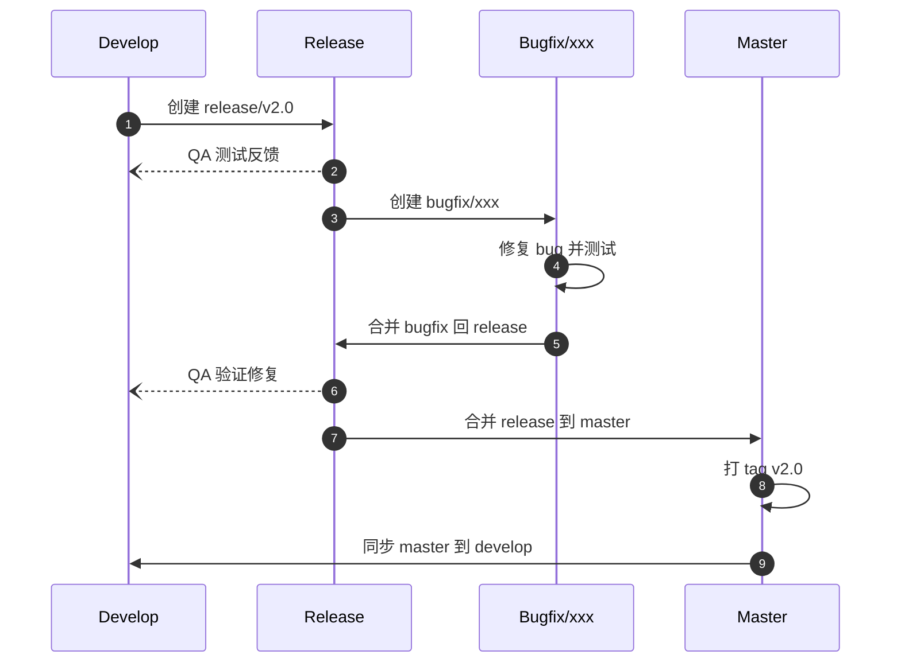

本文整理了一套基于 Git Flow 的简化分支管理方案，结合实际开发中的常见场景，配合 时序图 展示完整流程，帮助团队在多人协作开发中做到 规范统一、降低风险、快速响应。

## 分支模型 ##

本Git管理方案采用基于 Git Flow 的简化分支模型，主要包含以下分支类型：

|  分支类型   |  说明  |
| :-----------: | :-----------: |
| `master` | 生产环境分支，始终保持稳定，仅通过合并 `release` 或 `hotfix` 分支更新 |
| `develop` | 开发整合分支，集成所有已完成的功能，用于日常开发集成 |
| `feature/xxx` | 新功能开发分支，基于 `develop` 创建，开发完成后合并回 `develop`  |
| `release/x.x.x` | 预发布分支，用于测试、修复和准备发布 |
| `bugfix/xxx` | Release 阶段发现的 Bug 修复分支，用于临时修复 Release 问题 |
| `hotfix/xxx` | 紧急修复分支，用于快速修复 `master` 上的生产问题 |
| `support/x.x` | 长期维护分支，用于旧版本的维护 |

## 分支命名规范 ##

**功能分支**：`feat/模块名-功能描述`
例：`feature/login-page`、`feature/user-profile-edit`

**Release 阶段 Bug 修复分支**：`bugfix/问题描述`
例：`bugfix/login-button-fix`

**生产环境 紧急 Bug 修复分支**：`hotfix/问题描述`
例：`hotfix/login-bug`

**预发布分支**：`release/版本号`
例：`release/1.2.0`

**长期维护分支**：`support/版本号`
例：`support/1.x`

## 分支管理全流程示意 ##

### Feature 并行开发 ###

**要点总结**：

- 每个开发人员在自己的 feature 分支 上独立开发新功能
- 完成功能后，通过 Pull Request 提交到 develop 分支
- CI/CD 或团队负责人 在 develop 分支执行合并
- 合并完成后，反馈给 feature 分支开发者 确认

### Feature 分支冲突处理流程 ###

**要点总结**：

- 冲突必须由 功能分支的开发者 自行解决，不能把冲突推给 集成分支
- 解决冲突的正确方式是：在 feature 分支合并 develop，而不是强行修改 develop
- 解决后再 push 并重新发起合并请求

### Release 流程与上线 Master ###

**要点总结**：

- 从 develop 创建 release 分支 进行集成测试和预发布
- Release 阶段发现 Bug → 创建 bugfix 分支修复 → 合并回 Release → QA 验证
- Release 分支合并到 master 后 打 Tag，用于 正式上线并保留上线版本记录
- master 的更新 必须同步回 develop，保证开发主干与生产环境一致

### Hotfix 紧急修复 ###

**要点总结**：

- 生产环境出现 紧急问题 时，从 master 创建 hotfix 分支 快速修复
- 修复完成后，合并回 master 并 打 Tag，触发上线
- 同时合并回 develop，保证开发主干包含所有修复

### 回滚到历史版本 ###

**要点总结**：

- 当生产环境出现 严重问题且修复不可行 时，master 通过 tag 回滚 到历史稳定生产版本
- 回滚完成后，开发团队需要 同步 develop，保证开发主干和生产一致
- 确保开发人员 不会基于已回滚的代码继续开发

### 长期维护分支 ###

**要点总结**：

- 已发布的旧版本维护一个 长期维护分支 support/1.x
- 生产环境发现 bug 时，从 master 创建 hotfix 分支 进行修复
- 修复完成后，必须合并到：
  - master（生产环境）
  - support 分支（保证旧版本客户可用）
  - develop（保持开发主干一致）

4.完整流程图

