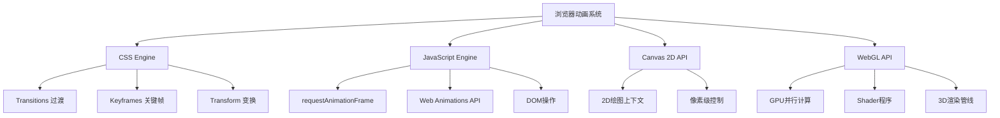

## 摘要 ##

- 浏览器动画的四大底层API体系
- 从最简单的CSS过渡到复杂的GPU渲染，循序渐进掌握动画技术栈
- 性能优化策略和常见坑点的完整解决方案
- 可直接使用的代码模板和最佳实践检查清单

## 浏览器动画的四大引擎 ##

现代浏览器提供四种底层动画API：



工作流程对比

| 技术类型   |   执行环境     |   适用场景 |  性能特点 |
| :----------: | :----------: | :---------:  | :---------:  |
| CSS动画 | 浏览器合成线程  | UI交互、简单变换 | 硬件加速，不阻塞主线程 |
| JS动画 | 主线程  | 复杂逻辑、交互式动画 | 灵活但可能阻塞渲染 |
| Canvas 2D | 主线程  | 2D游戏、图表绘制 | 像素级控制，CPU密集 |
| WebGL | GPU  | 3D场景、粒子系统 | 并行计算，高性能 |

## 实战案例：四大动画技术 ##

### CSS动画 - 加载指示器 ###

创建一个现代化的加载动画，学会使用CSS关键帧和变换。

```css
.spinner {
    width: 40px;
    height: 40px;
    border: 4px solid #f3f3f3;
    border-top: 4px solid #3498db;
    border-radius: 50%;
    animation: spin 1s linear infinite;
}

@keyframes spin {
    0% { transform: rotate(0deg); }
    100% { transform: rotate(360deg); }
}
```

为什么这样设计？

- `border-radius:50%` 创建圆形
- `border-top` 不同颜色形成视觉对比
- `linear` 确保匀速旋转
- `infinite` 实现持续循环

### JavaScript动画 - 弹性滚动 ###

使用 `requestAnimationFrame` 实现平滑的滚动动画：

```ts
function smoothScrollTo(targetY, duration = 1000) {
    const startY = window.pageYOffset;
    const distance = targetY - startY;
    let startTime = null;
    
    function animation(currentTime) {
        if (startTime === null) startTime = currentTime;
        const timeElapsed = currentTime - startTime;
        const progress = Math.min(timeElapsed / duration, 1);
        
        // 缓动函数：easeOutCubic
        const ease = 1 - Math.pow(1 - progress, 3);
        
        window.scrollTo(0, startY + distance * ease);
        
        if (progress < 1) {
            requestAnimationFrame(animation);
        }
    }
    
    requestAnimationFrame(animation);
}

// 使用示例
smoothScrollTo(1000); // 滚动到页面1000px位置
```

### Canvas动画 - 粒子系统 ###

创建一个简单的粒子爆炸效果：

```ts
class Particle {
    constructor(x, y) {
        this.x = x;
        this.y = y;
        this.vx = (Math.random() - 0.5) * 10;
        this.vy = (Math.random() - 0.5) * 10;
        this.life = 1.0;
        this.decay = Math.random() * 0.02 + 0.01;
    }
    
    update() {
        this.x += this.vx;
        this.y += this.vy;
        this.vy += 0.1; // 重力
        this.life -= this.decay;
    }
    
    draw(ctx) {
        ctx.globalAlpha = this.life;
        ctx.fillStyle = '#ff6b6b';
        ctx.fillRect(this.x, this.y, 3, 3);
    }
}

function createExplosion(canvas, x, y) {
    const ctx = canvas.getContext('2d');
    const particles = [];
    
    // 创建50个粒子
    for (let i = 0; i < 50; i++) {
        particles.push(new Particle(x, y));
    }
    
    function animate() {
        ctx.clearRect(0, 0, canvas.width, canvas.height);
        
        particles.forEach((particle, index) => {
            particle.update();
            particle.draw(ctx);
            
            // 移除死亡粒子
            if (particle.life <= 0) {
                particles.splice(index, 1);
            }
        });
        
        if (particles.length > 0) {
            requestAnimationFrame(animate);
        }
    }
    
    animate();
}
```

介绍： 每个粒子有位置、速度、生命值，随时间衰减并受重力影响。模拟真实物理效果

### WebGL动画 - 3D旋转立方体 ###

使用WebGL创建一个基础的3D动画，体验GPU渲染的强大能力：

```ts
// WebGL着色器代码
const vertexShaderSource = `
    attribute vec4 a_position;
    attribute vec4 a_color;
    uniform mat4 u_matrix;
    varying vec4 v_color;
    
    void main() {
        gl_Position = u_matrix * a_position;
        v_color = a_color;
    }
`;

const fragmentShaderSource = `
    precision mediump float;
    varying vec4 v_color;
    
    void main() {
        gl_Color = v_color;
    }
`;

class WebGLCube {
    constructor(canvas) {
        this.gl = canvas.getContext('webgl');
        this.program = this.createProgram();
        this.setupGeometry();
        this.rotation = 0;
    }
    
    createProgram() {
        const gl = this.gl;
        const vertexShader = this.createShader(gl.VERTEX_SHADER, vertexShaderSource);
        const fragmentShader = this.createShader(gl.FRAGMENT_SHADER, fragmentShaderSource);
        
        const program = gl.createProgram();
        gl.attachShader(program, vertexShader);
        gl.attachShader(program, fragmentShader);
        gl.linkProgram(program);
        
        return program;
    }
    
    createShader(type, source) {
        const gl = this.gl;
        const shader = gl.createShader(type);
        gl.shaderSource(shader, source);
        gl.compileShader(shader);
        return shader;
    }
    
    setupGeometry() {
        const gl = this.gl;
        
        // 立方体顶点数据（位置 + 颜色）
        const vertices = new Float32Array([
            // 前面 - 红色
            -1, -1,  1,  1, 0, 0, 1,
             1, -1,  1,  1, 0, 0, 1,
             1,  1,  1,  1, 0, 0, 1,
            -1,  1,  1,  1, 0, 0, 1,
            // 后面 - 绿色
            -1, -1, -1,  0, 1, 0, 1,
             1, -1, -1,  0, 1, 0, 1,
             1,  1, -1,  0, 1, 0, 1,
            -1,  1, -1,  0, 1, 0, 1,
        ]);
        
        this.vertexBuffer = gl.createBuffer();
        gl.bindBuffer(gl.ARRAY_BUFFER, this.vertexBuffer);
        gl.bufferData(gl.ARRAY_BUFFER, vertices, gl.STATIC_DRAW);
        
        // 索引数据
        const indices = new Uint16Array([
            0, 1, 2,  0, 2, 3,  // 前面
            4, 5, 6,  4, 6, 7,  // 后面
            0, 4, 7,  0, 7, 3,  // 左面
            1, 5, 6,  1, 6, 2,  // 右面
            3, 2, 6,  3, 6, 7,  // 上面
            0, 1, 5,  0, 5, 4   // 下面
        ]);
        
        this.indexBuffer = gl.createBuffer();
        gl.bindBuffer(gl.ELEMENT_ARRAY_BUFFER, this.indexBuffer);
        gl.bufferData(gl.ELEMENT_ARRAY_BUFFER, indices, gl.STATIC_DRAW);
        
        this.indexCount = indices.length;
    }
    
    render() {
        const gl = this.gl;
        
        // 清空画布
        gl.clear(gl.COLOR_BUFFER_BIT | gl.DEPTH_BUFFER_BIT);
        gl.enable(gl.DEPTH_TEST);
        
        // 使用着色器程序
        gl.useProgram(this.program);
        
        // 绑定顶点数据
        gl.bindBuffer(gl.ARRAY_BUFFER, this.vertexBuffer);
        
        const positionLocation = gl.getAttribLocation(this.program, 'a_position');
        const colorLocation = gl.getAttribLocation(this.program, 'a_color');
        
        // 位置属性
        gl.enableVertexAttribArray(positionLocation);
        gl.vertexAttribPointer(positionLocation, 3, gl.FLOAT, false, 28, 0);
        
        // 颜色属性
        gl.enableVertexAttribArray(colorLocation);
        gl.vertexAttribPointer(colorLocation, 4, gl.FLOAT, false, 28, 12);
        
        // 创建变换矩阵
        const matrix = this.createTransformMatrix();
        const matrixLocation = gl.getUniformLocation(this.program, 'u_matrix');
        gl.uniformMatrix4fv(matrixLocation, false, matrix);
        
        // 绘制立方体
        gl.bindBuffer(gl.ELEMENT_ARRAY_BUFFER, this.indexBuffer);
        gl.drawElements(gl.TRIANGLES, this.indexCount, gl.UNSIGNED_SHORT, 0);
        
        // 更新旋转角度
        this.rotation += 0.02;
        requestAnimationFrame(() => this.render());
    }
    
    createTransformMatrix() {
        // 简化的4x4变换矩阵计算
        const cos = Math.cos(this.rotation);
        const sin = Math.sin(this.rotation);
        
        return new Float32Array([
            cos, 0, sin, 0,
            0, 1, 0, 0,
            -sin, 0, cos, 0,
            0, 0, -5, 1  // Z轴偏移，让立方体可见
        ]);
    }
}

// 使用示例
const canvas = document.getElementById('webgl-canvas');
const cube = new WebGLCube(canvas);
cube.render();
```

**介绍**： 创建一个3D立方体，使用GPU并行计算实现旋转动画。

**为什么选择WebGL**： Canvas 2D无法处理3D场景，WebGL利用GPU并行处理能力，性能远超CPU渲染。

**WebGL核心概念**：

- **顶点着色器（Vertex Shader）**： 处理3D坐标变换
- **片段着色器（Fragment Shader）**： 处理像素颜色计算
- **缓冲区（Buffer）**： 存储顶点数据在GPU内存中
- **着色器程序（Program）**： 链接顶点和片段着色器的完整渲染管线

## 关键API速查表 ##

| API/属性   |   用途     |   语法示例 |  兼容性 |
| :----------: | :----------: | :---------:  | :---------:  |
| `transition` | CSS状态过渡  | `transition: all 0.3s ease` | IE10+ |
| `@keyframes` | CSS关键帧动画  | `@keyframes slide { from{} to{} }` | IE10+ |
| `requestAnimationFrame` | JS动画帧同步  | `requestAnimationFrame(callback)` | IE10+ |
| `transform` | 2D/3D变换  | `transform: translateX(100px)` | IE9+ |
| `Web Animations API` | JS动画控制  | `element.animate(keyframes, options)` | Chrome 36+ |
| `Canvas 2D Context` | 2D绘图  | `canvas.getContext('2d')` | IE9+ |
| `WebGL Context` | 3D渲染  | `canvas.getContext('webgl')` | IE11+ |
| `gl.createShader()` | 创建着色器  | `gl.createShader(gl.VERTEX_SHADER)` | IE11+ |
| `gl.createProgram()` | 创建着色器程序  | `gl.createProgram()` | IE11+ |
| `gl.createBuffer()` | 创建缓冲区  | `gl.createBuffer()` | IE11+ |
| `gl.drawElements()` | 绘制图元  | `gl.drawElements(gl.TRIANGLES, count, type, offset)` | IE11+ |

## 最佳实践与检查清单 ##

### 性能优化清单 ###

- 使用CSS动画优先，避免频繁的DOM操作
- 启用硬件加速：`transform: translateZ(0)` 或 `will-change: transform`
- 控制动画帧率，避免 `60fps` 以上的无意义消耗
- 使用 `transform` 和 `opacity` 属性，避免触发重排
- 长时间动画考虑使用 `Web Workers`

### 用户体验清单 ###

- 提供动画开关选项，尊重用户的 `prefers-reduced-motion` 设置
- 动画时长符合 Material Design 建议：简单动画 `100-300ms`，复杂动画 `300-500ms`
- 缓动函数选择自然：入场用 `ease-out`，出场用 `ease-in`，双向用 `ease-in-out`
- 避免过度动画，保持界面的专业性

### 代码质量清单 ###

- 动画逻辑与业务逻辑分离
- 提供动画完成的回调机制
- 正确清理动画资源，避免内存泄漏
- 使用现代 CSS 特性：`CSS Custom Properties` 实现动态动画

## 常见坑与排错 ##

| 症状   |   可能原因     |   解决步骤 |  备注 |
| :----------: | :----------: | :---------:  | :---------:  |
| 动画卡顿、掉帧 | 触发了重排重绘  | 使用 `transform` 替代 `left/top`；检查是否有同步的DOM查询 |  |
| CSS动画不生效 | 元素未正确触发状态变化  | 检查伪类选择器；使用JS强制重排：`element.offsetHeight` |  |
| Canvas动画模糊 | 未处理设备像素比  | 设置 canvas 实际大小为 `devicePixelRatio` 倍数 |  |
| 移动端动画性能差 | GPU内存不足  | 减少同时存在的动画数量；使用CSS动画替代JS动画 |  |
| 动画在后台标签页停止 | 浏览器优化机制  | 监听 `visibilitychange` 事件，页面可见时恢复动画 |  |

## 性能要点 ##

### 性能基线指标 ###

- 帧率目标： 60fps（16.67ms/帧）
- 动画启动延迟： <100ms
- 内存占用增长： 长时间动画<10MB
- CPU使用率： 复杂动画<30%

### 性能监控代码 ###

```ts
// 帧率监控
let lastTime = performance.now();
let frameCount = 0;

function measureFPS() {
    const now = performance.now();
    frameCount++;
    
    if (now - lastTime >= 1000) {
        console.log(`FPS: ${frameCount}`);
        frameCount = 0;
        lastTime = now;
    }
    
    requestAnimationFrame(measureFPS);
}

measureFPS();
```

### 适用场景选择指南 ###

| 场景类型   |   推荐技术     |   理由 |  示例 |
| :----------: | :----------: | :---------:  | :---------:  |
| 简单UI交互 | CSS Transitions  | 硬件加速，代码简洁 | 按钮悬停、菜单展开 |
| 复杂UI动画 | CSS Keyframes  | 声明式，易维护 | 加载动画、页面切换 |
| 交互式动画 | JavaScript + requestAnimationFrame  | 灵活控制，可响应用户输入 | 拖拽排序、手势操作 |
| 2D游戏 | Canvas 2D  | 像素级控制，绘图API丰富 | 贪吃蛇、俄罗斯方块 |
| 数据可视化 | SVG + CSS/JS  | 矢量图形，易于交互 | 图表动画、流程图 |
| 3D场景 | WebGL + Three.js  | GPU并行计算 | 产品展示、虚拟现实 |
| 大量粒子 | WebGL Shaders  | 并行处理，性能最优 | 粒子特效、流体模拟 |

## 扩展阅读与延伸话题 ##

### 进阶技术 ###

- **CSS Houdini Paint API** - 自定义CSS绘制函数，实现原生无法达到的效果
- **Intersection Observer动画** - 基于元素可见性的滚动触发动画，性能优于传统scroll事件
- **Web Animations API** - JavaScript原生动画API，提供更精细的动画控制
- **FLIP技术** - First, Last, Invert, Play动画优化模式，让复杂布局变化也能流畅动画

### 动画库推荐 ###

- **Framer Motion** - React动画库，声明式API和强大的手势系统
- **GSAP (GreenSock)** - 专业级动画库，性能卓越且功能全面
- **Lottie** - After Effects动画在Web端的完美呈现方案
- **Three.js** - WebGL 3D动画的事实标准，生态丰富

掌握动画技术不仅仅是学会语法和API，更重要的是理解不同技术的适用场景和性能特点。从简单的CSS过渡到复杂的GPU渲染，每种技术都有其独特价值。最好的动画是用户几乎察觉不到的动画——它们自然、流畅，恰到好处地增强了用户体验。
