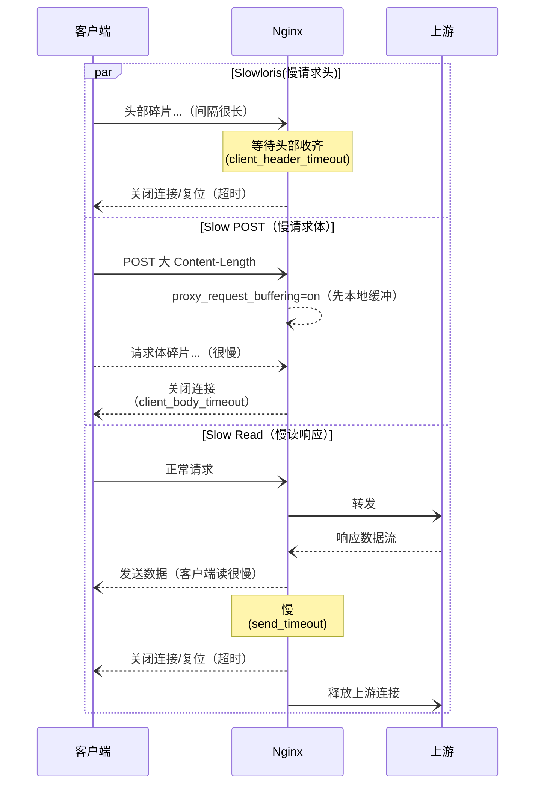

慢速攻击是一类用很少带宽就能长期占用服务器连接/资源的攻击方式。攻击者通过非常慢地发送请求头或请求体，或极慢地读取服务器响应，让每个连接都“挂着不结束”，从而耗尽 Web 服务器（或上游应用、数据库、代理）的并发与缓冲资源。

典型类型主要有以下几个方面：

- **Slowloris（慢请求头）**：客户端以极低速率分片发送 HTTP 头部，始终不把头部发完，服务器就一直等待。
- **Slow POST / RUDY（慢请求体）**：先宣称要上传较大的 `Content-Length`，然后以极慢速率发送请求体，服务器为其保留缓冲与上游连接。
- **Slow Read（慢读取响应）**：客户端窗口/读取速率极低，迫使服务器缓冲并保持连接很久（尤其响应较大时）。
- **HTTP/2 变种**：滥用单连接多流（streams）和窗口控制：开很多流但每流都很慢，放大资源占用。

{data-zoomable}

传统 DDoS 依靠高带宽与高包速直接压垮网络/设备，而慢速攻击用极低带宽长期占用连接，更隐蔽，常被误认为是网络状况差的正常用户。

现场通常会看到活跃连接（尤其 `reading`）持续攀升，但总体带宽并不高。

`error_log` 中频繁出现 `client timed out`、`client sent invalid header while reading client request headers` 等信息。

上游服务看似空闲却体验发卡，Nginx 的 `429/502/504` 增多，访问日志还能发现同一 IP 维持大量长期未完成的请求或异常长的响应时间。

- 429 表示“请求过多被限流”，通常稍后或按 `Retry-After` 重试即可。
- 502 表示“网关收到上游无效响应或连不上上游”，多见于上游挂掉、拒连或协议不匹配。
- 504 表示“等待上游超时”，通常是上游处理太慢一直没回。

## 如何防护 ##

核心目标就是尽快关闭拖延发送请求头/请求体或极慢读取响应的连接，限制单 IP 的并发与速率，避免慢连接占满 `worker` 的 `worker_connections` 与上游资源。

- **收紧超时**：`client_header_timeout`、`client_body_timeout`、`send_timeout`、`keepalive_timeout`。

- **超时立刻复位**：`reset_timedout_connection on`; 减少 `TIME_WAIT/` 资源滞留。

- **限并发/限速**：`limit_conn`、`limit_req`（必要时返回 429 并带 `Retry-After`）。

- **HTTP/2 参数**：降低 `http2_max_concurrent_streams`，设置 `http2_recv_timeout/http2_idle_timeout`。

- **反向代理场景**：`proxy_request_buffering on`; 先把请求缓冲到 Nginx，避免慢上传占住上游。

- **分路径/分人群**：对登录、搜索等接口更严；对可信源/健康检查放宽或白名单。

- **边缘清洗**：结合 CDN/WAF 的连接层/应用层限速更稳。

一些相关的配置可以参考下面的 Nginx 配置：

```nginx
worker_processes auto;

events {
    worker_connections  4096;
    multi_accept        on;
}

http {
    # 1) 关键超时（防慢头/慢体/慢读）
    client_header_timeout  5s;   # 等头部时间
    client_body_timeout    10s;  # 等请求体每个读周期的时间
    send_timeout           10s;  # 发送响应给客户端每个写周期的时间
    keepalive_timeout      10s;  # keep-alive 连接空闲时间
    keepalive_requests     100;  # 单连接最大请求数，防长时间占用

    # 2) 连接超时直接复位（释放资源更快）
    reset_timedout_connection on;

    # 3) 并发限制（每 IP）
    #    10m 可容纳 ~160k 键（基于 $binary_remote_addr）
    limit_conn_zone $binary_remote_addr zone=perip:10m;

    # 4) 速率限制（每 IP），按需调大/调小 rate
    limit_req_zone  $binary_remote_addr zone=req_perip:10m rate=10r/s;

    # 5) HTTP/2 专项（若开启了 http2）
    http2_max_concurrent_streams 64; # 降并发流数
    http2_recv_timeout           5s; # 接收客户端帧超时
    http2_idle_timeout          10s; # HTTP/2 空闲超时

    # 6) 合理的头部缓冲（避免过大内存占用；默认已够用，按需微调）
    large_client_header_buffers 4 8k;

    server {
        listen 443 ssl http2;
        server_name example.com;

        # 并发/速率在 server 层生效
        limit_conn       perip 20;        # 每 IP 并发连接上限
        limit_conn_status 429;

        limit_req        zone=req_perip burst=20 nodelay;  # 短突发
        limit_req_status 429;

        # 限制请求体大小（配合 body_timeout 可更快淘汰异常大/慢上传）
        client_max_body_size 10m;

        # 【反向代理站点强烈推荐】先把完整请求缓冲到 Nginx
        # 避免上游被慢上传拖住连接
        location / {
            proxy_pass http://app_backend;
            proxy_request_buffering on;

            proxy_connect_timeout  3s;
            proxy_send_timeout    10s;  # 向上游发送（写）超时
            proxy_read_timeout    30s;  # 自上游读取（读）超时
        }

        # 对静态资源可放宽速率限制以提升体验（示例）
        location ~* \.(?:css|js|png|jpg|jpeg|gif|webp|ico|svg)$ {
            root /var/www/html;
            access_log off;
            expires 30d;
        }

        # 自定义 429 页面（可选）
        error_page 429 /429.html;
        location = /429.html { internal; return 429 "Too Many Requests\n"; }
    }
}
```

除此之外，还有一些数值上的建议：

- 高频 `API` 可将 `rate` 调小、`burst` 适度放大；页面类流量可相反。
- 对上传较多的业务，将 `client_body_timeout` 与 `proxy_request_buffering on`; 组合尤为关键。
- 如果公网复杂、遭遇中等强度慢攻：`client_header_timeout 2-3s`、`client_body_timeout 5-8s`、`send_timeout 8-10s` 往往更稳。

考虑到移动网络或跨境访问确实可能很慢，限流需要在防护与容错间取平衡。可以适度调大 `burst`，并返回合理的 `Retry-After`，让偶发拥塞得以通过。把严格策略仅应用在登录、搜索等敏感接口，对静态资源和页面流量适当放宽。对可信来源（如办公网、监控、合作方）设置白名单或更高配额，尽量减少误杀。

之于上面的理解，我们可以针对不同慢速攻击的做不同的优化了：

- Slowloris（慢头部）：用 `client_header_timeout` 严控请求头收齐时间，配合较短的 `keepalive_timeout` 降低长连驻留，并用 `limit_conn` 限制每 IP 并发；一旦超时，借助 `reset_timedout_connection on`; 立即复位断开。
- RUDY / Slow POST（慢体）：设置较短的 `client_body_timeout`，并开启 `proxy_request_buffering on`; 先在 Nginx 缓冲请求体，慢上传直接在边缘被淘汰且不上游；必要时配合 `client_max_body_size` 约束体积。
- Slow Read（客户端读超慢）：通过 `send_timeout` 限制客户端读取过慢的连接，触发即复位释放缓冲；若是 SSE/长轮询等合法长连，为对应路径单独放宽 `send_timeout`，避免误伤。



## 总结 ##

慢速攻击是用极低带宽长期占用服务器连接/缓冲的攻击：攻击者故意慢发请求头/请求体或慢读响应，让连接一直不结束，耗尽并发与内存。

常见形态有 Slowloris（慢头部）、RUDY/Slow POST（慢请求体）与 Slow Read（慢读响应），在 HTTP/2 下还能通过多流+窗口控制放大影响。

典型症状是活跃连接（尤其 `reading`）持续升高但总体带宽不高，日志频繁出现超时/异常头部，且 `429/502/504` 增多、同一 IP 大量长时间未完成请求。

防护要点是收紧超时（`client_header/body/send/keepalive`）、开启 `reset_timedout_connection`、用 `limit_conn/limit_req` 控制每 IP 并发与速率，反向代理时启用 `proxy_request_buffering on`; 并调优 HTTP/2；同时对敏感路径更严、对可信来源适度放宽或白名单以减少误杀。
