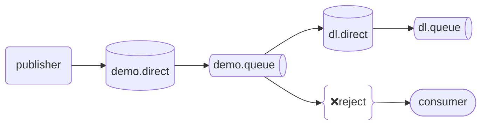

> 前几天被追着要 “超时订单自动取消” 功能，我一拍胸脯：“简单！写个定时任务每 5 分钟查一次库就行！” 结果上线第三天，数据库直接被查崩 —— 这才发现，我把 “延迟消息” 的活，干成了 “定时任务自杀式袭击”。
> 
> 今天就把延迟消息的知识点扒明白，从 “是什么” 到 “怎么选方案”，再到 “订单取消实操”，让你少走我踩过的坑。

## 一、先搞懂：延迟消息不是 “定时任务”！ ##

很多后端 er 刚接触时会懵：延迟消息和定时任务（比如 Quartz）有啥区别？

其实一句话就能懂：*延迟消息是 “给单个消息设闹钟”，定时任务是 “给系统设闹钟”* 。

**比如**：

- **定时任务**：每天凌晨 2 点清理过期日志（对 “一批数据” 统一操作）；
- **延迟消息**：用户下单后 30 分钟没付款，自动取消订单（对 “单个订单” 设 30 分钟延迟）。

再通俗点说，延迟消息就是 “消息界的闹钟”—— 你发消息时告诉 MQ：“这消息先存着，30 分钟后再给消费者发”，MQ 到点就准时送达，不用你每隔 5 分钟去 “催”。

## 二、延迟消息 3 种技术方案：从 “坑多” 到 “爽飞” ##

市面上主流的延迟消息方案有 3 种，各有各的坑和爽点，别瞎选！

### 方案 1：TTL + 死信交换机（最经典，但坑你没商量） ###

这是 RabbitMQ 最经典的延迟方案，原理很简单，像 “快递驿站 + 过期退货”：

- **TTL（消息存活时间）** ：给队列设个 “保质期”，比如 30 分钟，消息进队列后没被消费，30 分钟后就 “过期”；
- **死信交换机（DLX）** ：过期的消息会被扔进 “死信交换机”，再由死信交换机转发到 “真正的消费队列”；
- 消费者只从 “消费队列” 拿消息，相当于 “只收过期的订单消息”。

#### 原理图解（文字版） ###

```txt
用户下单 → 发消息到【延迟队列（TTL=30分钟）】→ 消息过期 → 触发死信 → 转发到【死信交换机】→ 路由到【消费队列】→ 消费者收到消息 → 取消订单
```

#### 代码示例（RabbitMQ + Spring Boot） ####

```java
// 1. 声明死信交换机、消费队列（真正处理取消订单的队列）
@Bean
public DirectExchange dlxExchange() {
    return new DirectExchange("order.dlx.exchange");
}
@Bean
public Queue consumeQueue() {
    return QueueBuilder.durable("order.consume.queue")
            // 绑定死信交换机和路由键
            .withArgument("x-dead-letter-exchange", "order.dlx.exchange")
            .withArgument("x-dead-letter-routing-key", "order.dlx.key")
            .build();
}
@Bean
public Binding dlxBinding() {
    return BindingBuilder.bind(consumeQueue()).to(dlxExchange()).with("order.dlx.key");
}
// 2. 声明延迟队列（设TTL=30分钟=1800000ms）
@Bean
public Queue delayQueue() {
    return QueueBuilder.durable("order.delay.queue")
            // 关键：设TTL，消息30分钟过期
            .withArgument("x-message-ttl", 1800000)
            // 过期后转发到死信交换机
            .withArgument("x-dead-letter-exchange", "order.dlx.exchange")
            .withArgument("x-dead-letter-routing-key", "order.dlx.key")
            .build();
}
// 3. 发送延迟消息（用户下单时调用）
@Autowired
private RabbitTemplate rabbitTemplate;
public void sendDelayMsg(Long orderId) {
    rabbitTemplate.convertAndSend(
        "", "order.delay.queue", orderId, // 延迟队列无交换机，路由键直接用队列名
        message -> {
            // 也可以给单个消息设TTL（优先级高于队列TTL）
            // message.getMessageProperties().setExpiration("1800000");
            return message;
        }
    );
}
// 4. 消费消息（取消订单）
@RabbitListener(queues = "order.consume.queue")
public void handleCancelOrder(Long orderId) {
    // 1. 先查订单状态：如果已付款，不取消
    Order order = orderMapper.selectById(orderId);
    if (order.getStatus() == 1) { // 1=未付款
        // 2. 取消订单（更新状态+释放库存）
        orderService.cancelOrder(orderId);
        stockService.releaseStock(order.getProductId(), order.getNum());
    }
}
```

**这个方案的坑！别踩！**

- **队头阻塞问题**：如果一个延迟队列里有 “30 分钟” 和 “5 分钟” 的消息，先入队的 30 分钟消息会堵在前面，后面的 5 分钟消息要等 30 分钟后才能被处理 —— 相当于 “5 分钟的订单等了 30 分钟才取消”，用户早炸了！

- **解决方案**：按延迟时间分队列！比如建 “5 分钟延迟队列”“30 分钟延迟队列”“2 小时延迟队列”，不同延迟的消息发对应队列，避免阻塞。

### 方案 2：延迟消息插件（爽到飞起，推荐！） ###

如果觉得 TTL + 死信的 “分队列” 太麻烦，直接用 MQ 的 “延迟消息插件”—— 比如 RabbitMQ 的 `delayed_message_exchange`插件，Kafka 的 `kafka-delayed-message` 插件。

这个方案的原理更直接：消息先存在插件里，到点了再转发给消费队列，不用搞复杂的死信和分队列，支持任意延迟时间！



**爽点在哪？**

1. **不用分队列**：不管是 5 分钟还是 30 分钟的消息，都发一个交换机；

2. **支持动态延迟**：发消息时想设多久就设多久，不用改队列配置；

3. **无队头阻塞**：插件会按延迟时间排序，到点就发，不会堵。

#### 代码示例（RabbitMQ 延迟插件）####

```java
// 1. 先装插件：RabbitMQ控制台 → Plugins → 启用 rabbitmq_delayed_message_exchange
// 2. 声明延迟交换机（类型必须是 x-delayed-message）
@Bean
public CustomExchange delayExchange() {
    Map<String, Object> args = new HashMap<>();
    args.put("x-delayed-type", "direct"); // 交换机类型（direct/topic等）
    // 关键：类型是 x-delayed-message
    return new CustomExchange("order.delay.exchange", "x-delayed-message", true, false, args);
}
// 3. 声明消费队列（普通队列就行，不用绑死信）
@Bean
public Queue cancelQueue() {
    return QueueBuilder.durable("order.cancel.queue").build();
}
// 4. 绑定交换机和队列
@Bean
public Binding delayBinding() {
    return BindingBuilder.bind(cancelQueue()).to(delayExchange()).with("order.cancel.key").noargs();
}
// 5. 发送延迟消息（用户下单时调用，设30分钟延迟）
public void sendDelayMsg(Long orderId) {
    rabbitTemplate.convertAndSend(
        "order.delay.exchange", "order.cancel.key", orderId,
        message -> {
            // 关键：设延迟时间（30分钟=1800000ms）
            message.getMessageProperties().setHeader("x-delay", 1800000);
            return message;
        }
    );
}
// 6. 消费消息（和之前一样，处理取消订单）
@RabbitListener(queues = "order.cancel.queue")
public void handleCancelOrder(Long orderId) {
    // 同上：查状态→取消订单→释放库存
}
```

**注意点**：

- 插件需要单独安装（RabbitMQ 默认没有）；
- 延迟时间精度：一般在 100ms 以内，够用了（订单取消差个几百毫秒没事）；
- 持久化：交换机和队列要设为 durable，消息也要设持久化（避免 MQ 宕机丢消息）。

### 方案 3：定时任务查库（小流量可用，大流量找死） ###

就是我最开始踩坑的方案：写个定时任务，每隔 N 分钟查一次 “未付款且创建时间超过 30 分钟” 的订单，然后取消。

#### 什么时候能用？ ####

- **小流量场景**：比如每天订单量不到 1000，查库压力小；

- **对实时性要求不高**：比如延迟 10 分钟也能接受（定时任务 5 分钟查一次，最多延迟 5 分钟）。

#### 为什么大流量不能用？ ####

- **数据库压力大**：每隔 5 分钟全表扫描查订单，数据量大了直接崩；

- **实时性差**：订单 30 分钟过期，可能要等 5 分钟才被查到，用户体验差；

- **重复处理**：如果定时任务集群部署，没做分布式锁，会导致一个订单被取消多次（比如两个节点同时查到，都执行取消）。

## 三、实操避坑：订单取消功能必加的 3 个点 ##

不管用哪种延迟方案，这些细节没处理好，照样出问题！

### 消息持久化：别让 MQ 宕机丢消息 ###

- 交换机和队列设为 `durable=true`

- 发送消息时设 `deliveryMode=2`（持久化消息）：

```java
message.getMessageProperties().setDeliveryMode(MessageDeliveryMode.PERSISTENT);
```

### 幂等性：别让一个订单取消多次 ###

比如 MQ 重试导致消息重复发送，消费者收到两次 “取消订单” 请求，会把已取消的订单再取消一次（还可能重复释放库存）。

**解决方案**：加 “幂等校验”，比如：

- 查订单状态：如果已取消 / 已付款，直接返回；

- 用 Redis 加锁：处理前先 set order:cancel:{orderId} = 1，过期时间 5 分钟，避免重复处理。

### 监控告警：别等用户投诉才发现问题 ###

- **给延迟消息加监控**：比如 “30 分钟内没收到取消消息的订单数”，超过阈值发告警；

- **消费失败加重试 + 死信**：消费时抛异常，重试 3 次还失败，扔进死信队列，发钉钉告警让开发排查（比如订单数据异常）。

## 最后总结：方案怎么选？ ##

|  方案   |   优点  |  缺点  |  适用场景  |
| :-----------: | :-----------: | :-----------: | :-----------: |
| TTL + 死信交换机 | 无需装插件，原生支持 | 需分队列，有队头阻塞 | 延迟时间固定、种类少（比如只有 30 分钟） |
| 延迟消息插件 | 支持任意延迟，无阻塞 | 需装插件 | 延迟时间灵活、大流量（推荐首选） |
| 定时任务查库 | 实现简单，无需 MQ | 数据库压力大、实时性差 | 小流量、低实时性需求 |

其实现在主流方案都是 “延迟插件”，简单高效还少踩坑。我已经把之前的定时任务改成了 RabbitMQ 延迟插件，数据库压力直接降了 90%，运营再也没找过我～

你们之前做超时订单取消用的什么方案？有没有踩过队头阻塞的坑？评论区聊聊，让更多人避坑！
