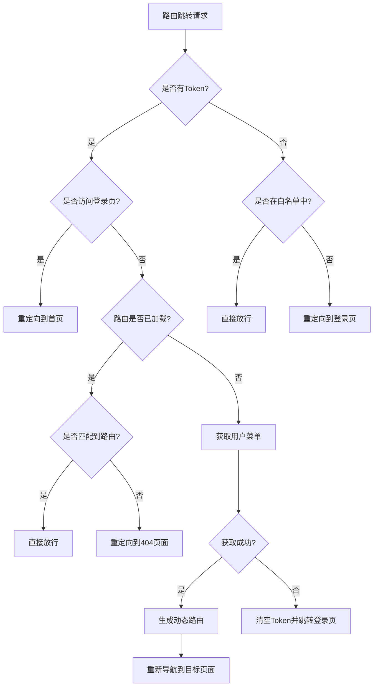
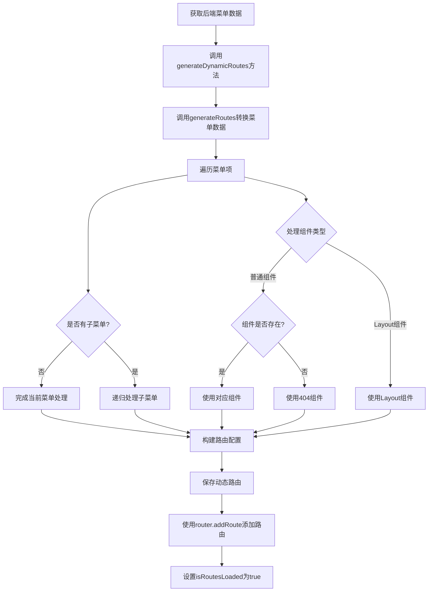

## 一、概述 ##

本文档详细梳理了基于RBAC（基于角色的访问控制）的动态路由实现方案，包括路由拦截机制和动态路由生成过程。该方案通过前端路由守卫与后端权限系统结合，实现了根据用户角色动态加载路由的功能，提高了系统的安全性和灵活性。

## 二、路由钩子拦截流程 ##

路由守卫是 Vue Router 提供的钩子函数，用于在路由跳转过程中进行权限控制。在本项目中，主要通过 `beforeEach` 钩子实现路由拦截。

### 路由拦截流程图 ###



### 关键代码分析 ###

路由守卫实现位于 `src/router/permission.ts` 文件中，主要逻辑如下：

```typescript
// 白名单路由（不需要登录就可以访问）
const whiteList = ['/login']

// 路由前置守卫
router.beforeEach(async (to, from, next) => {
  // 获取权限Store
  const permissionStore = usePermissionStore()
  // 获取Token
  const token = permissionStore.getToken()

  // 判断是否有Token
  if (token) {
    // 已登录
    if (to.path === '/login') {
      // 如果已登录，访问登录页则重定向到首页
      next({ path: '/' })
    } else {
      // 判断是否已获取用户信息
      if (permissionStore.isRoutesLoaded) {
        // 已获取用户信息，直接放行
        next()
      } else {
        try {
          // 获取用户菜单
          const menuRes = await authApi.getUserMenus()
          // 生成动态路由
          permissionStore.generateDynamicRoutes(menuRes)

          // 确保动态路由已添加完成
          next({ ...to, replace: true })
        } catch (error) {
          // 获取用户信息失败，清空Token并跳转到登录页
          permissionStore.resetPermission()
          redirectToLogin(to, next)
        }
      }
    }
  } else {
    // 未登录
    if (whiteList.includes(to.path)) {
      // 在白名单中，直接放行
      next()
    } else {
      // 不在白名单中，重定向到登录页
      redirectToLogin(to, next)
    }
  }
})
```

## 三、动态路由生成流程 ##

动态路由生成是指根据后端返回的菜单数据，动态创建前端路由配置并添加到路由实例中的过程。

### 动态路由生成流程图 ###



### 关键代码分析 ###

动态路由生成的核心代码位于 `src/stores/permission.ts` 文件中：

```typescript
// 使用 import.meta.glob 动态导入所有视图组件
const modules = import.meta.glob('../views/**/*.vue')

/**
 * 将后端返回的菜单数据转换为路由配置
 * @param menus 后端返回的菜单数据
 */
function generateRoutes(menus: ServerMenuItem[]): RouteRecordRaw[] {
  const result: RouteRecordRaw[] = []

  for (const menu of menus) {
    const route: Partial<RouteRecordRaw> = {
      path: menu.path,
      name: menu.name,
      meta: {
        title: menu.meta.title,
        icon: menu.meta.icon,
        hidden: menu.meta.hidden,
        keepAlive: menu.meta.keepAlive,
        alwaysShow: menu.meta.alwaysShow,
      },
    }

    // 如果有重定向，添加到路由配置中
    if (menu.redirect) {
      route.redirect = menu.redirect
    }

    // 处理组件
    if (menu.component?.toString() === 'Layout') {
      route.component = Layout
    } else if (menu.component) {
      // 检查组件是否存在
      const modulePath = `../views/${menu.component}.vue`
      if (modules[modulePath]) {
        route.component = modules[modulePath]
      } else {
        console.warn(`Component not found: ${menu.component}`)
        route.component = () => import('@/views/error/404.vue')
      }
    }

    // 处理子路由
    if (menu.children?.length) {
      route.children = generateRoutes(menu.children)
    }

    result.push(route as RouteRecordRaw)
  }

  return result
}

// 在Store中的方法
function generateDynamicRoutes(menus: ServerMenuItem[]) {
  // 生成路由配置
  const routes = generateRoutes(menus)
  dynamicRoutes.value = routes

  // 添加路由
  routes.forEach((route) => {
    router.addRoute(route)
  })
  isRoutesLoaded.value = true
}
```

## 四、关键技术点分析 ##

### `import.meta.glob` 动态导入 ###

使用 Vite 提供的 `import.meta.glob` 功能实现组件的动态导入，避免了手动导入每个组件的繁琐过程：

```typescript
// 使用 import.meta.glob 动态导入所有视图组件
const modules = import.meta.glob('../views/**/*.vue')

这行代码会扫描 `views` 目录下所有的 `.vue` 文件，并返回一个对象，键是文件路径，值是导入该文件的函数。

### Layout组件处理 ###

布局组件是动态路由中的特殊组件，通常作为父级路由的容器：

```typescript
// 布局组件
export const Layout = () => import('@/layout/index.vue')

// 处理组件
if (menu.component?.toString() === 'Layout') {
  route.component = Layout
}
```

### 容错处理 ###

对于后端返回的不存在的组件路径，提供了容错处理，自动使用404页面代替：

```typescript
if (modules[modulePath]) {
  route.component = modules[modulePath]
} else {
  console.warn(`Component not found: ${menu.component}`)
  route.component = () => import('@/views/error/404.vue')
}
```

### 静态路由与动态路由结合 ###

系统中的路由分为静态路由和动态路由两部分：

```typescript
// 静态路由定义在 src/router/index.ts 中
export const constantRoutes: RouteRecordRaw[] = [
  // 登录页、404页等基础路由
]

// 在Store中合并静态路由和动态路由
const routes = computed(() => [...constantRoutes, ...dynamicRoutes.value])
```

## 五、总结 ##

本项目实现的动态路由方案具有以下特点：

- **基于RBAC模型**：根据用户角色和权限动态加载路由，实现精细化的权限控制。
- **前后端分离**：前端负责路由拦截和动态生成，后端负责提供权限数据，职责明确。
- **灵活性高**：可以通过后端配置动态调整菜单结构，无需修改前端代码。
- **容错性好**：对于不存在的组件提供了容错处理，避免系统崩溃。
- **性能优化**：使用 `import.meta.glob` 实现组件的按需加载，提高了应用性能。

通过这种动态路由方案，系统可以根据不同用户的权限动态生成菜单和路由，既保证了系统的安全性，又提高了开发效率和用户体验。
