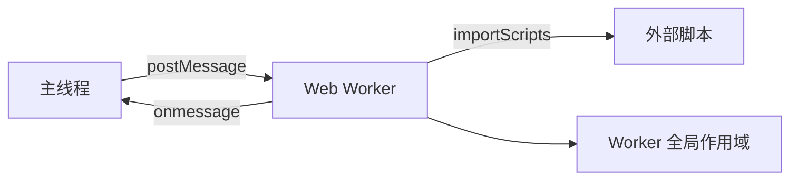

Web Workers 是 HTML5 提供的一个 JavaScript 多线程解决方案，允许在后台线程中运行脚本，而不会影响主线程（通常是UI线程）的性能。这意味着你可以执行一些耗时较长的任务（如大量计算、数据处理等）而不阻塞用户界面。

## 为什么需要 Web Workers？ ##

在传统的 JavaScript 中，由于是单线程的，所有任务都在主线程上执行。如果执行一个耗时的任务（比如复杂的计算、大数据的处理、长时间的网络请求等），就会导致页面卡顿，用户无法进行其他操作，直到任务完成。Web Workers 就是为了解决这个问题，它允许将一些任务放到后台线程中去执行，从而释放主线程。

## 核心价值 ##

- **​​避免 UI 阻塞**​​：耗时任务（如复杂计算、大数据处理）在 Worker 中执行，保持页面响应
- **​​多线程并行​**​：利用多核 CPU 提升性能
- **​​隔离环境​**​：Worker 线程无法直接操作 DOM，保证线程安全

## Web Workers 的特点 ##

- **​​独立线程**​​：Web Worker 运行在另一个全局上下文中，与主线程是分离的。因此，它不能直接访问 DOM，也不能使用一些默认的方法和属性（如 `window` 对象、`document` 对象等）。

- **​​通信机制**​​：主线程和 Worker 线程之间通过消息传递进行通信。使用 `postMessage()` 发送消息，通过 `onmessage` 事件处理函数来接收消息。数据是通过复制而不是共享来传递的（除了 `ArrayBuffer` 等可以通过转移所有权的方式传递）。

- **​​脚本限制**​​：Worker 线程中只能运行部分 JavaScript 特性，不能操作 DOM，不能使用 `alert` 或 `confirm` 等，但可以使用`XMLHttpRequest`、`fetch` 进行网络请求，也可以使用 `setTimeout`、`setInterval` 等。

- **​​同源限制​**​：Worker 脚本必须与主脚本同源（协议、域名、端口相同）。

- **​​关闭 Worker**​​：主线程可以随时终止 Worker，Worker 也可以自己关闭。

## 技术架构 ##



## 使用场景 ##

### ​CPU 密集型任务​​ ###

- 大数据排序/过滤
- 图像/视频处理（如 WebAssembly + Canvas）
- 物理引擎计算

### ​​实时数据处理​​ ###

- WebSocket 消息处理
- 日志分析

### ​​预加载资源​​ ###

- 提前加载和解析数据

## 代码示例 ##

### 基础使用 ###

#### 步骤1：创建 Worker 脚本 ####

首先，你需要创建一个单独的 JavaScript 文件作为 Worker 的脚本。例如，我们创建一个 `worker.js`：

```js:worker.js
// 监听主线程发来的消息
self.onmessage = function(e) {
  console.log('Worker: Message received from main script');
  const data = e.data;
  // 执行一些耗时操作
  const result = heavyTask(data);
  // 将结果发送回主线程
  self.postMessage(result);
};

function heavyTask(data) {
  // 这里模拟一个耗时操作，比如复杂计算
  let result = 0;
  for (let i = 0; i < data; i++) {
    result += i;
  }
  return result;
}
```

#### 步骤2：在主线程中创建 Worker 并通信 ####

在主线程的 JavaScript 文件中：

```js:main.js
// 创建一个新的 Worker，传入脚本的URL
const worker = new Worker('worker.js');

// 向 Worker 发送数据
worker.postMessage(1000000000); // 发送一个很大的数，模拟耗时计算

// 接收来自 Worker 的消息
worker.onmessage = function(e) {
  console.log('Main: Message received from worker', e.data);
};

// 错误处理
worker.onerror = function(error) {
  console.error('Worker error:', error);
};
```

## 终止 Worker ##

当不再需要 Worker 时，应该终止它以释放资源。

```js
// 主线程中终止 Worker
worker.terminate();

// 或者在 Worker 内部自己关闭
self.close();
```

### 注意事项 ###

- **​​数据传输​​：通过 `postMessage` 传递的数据是深拷贝的，所以如果传递的数据量很大，可能会影响性能。对于大数据，可以使用`Transferable` 对象（如 `ArrayBuffer`）来转移数据的所有权，这样数据不会被复制，而是直接转移，原上下文将无法访问该数据。

```ts
// 在 Worker 中
const buffer = new ArrayBuffer(32);
self.postMessage(buffer, [buffer]); // 第二个参数表示要转移的对象数组
```

这样，主线程收到后，原 Worker 中的 buffer 将不可用。

- **​​作用域**​​：在 Worker 内部，全局对象是 `self`（也可以使用 `this`），而不是 `window`。

- **​​引入其他脚本**​​：在 Worker 中可以使用 `importScripts()` 来同步导入其他脚本：

```ts
importScripts('script1.js', 'script2.js');
```

## 图像处理示例 ##

假设我们有一个图像处理的任务，比如将图像转换为灰度图。这个操作可能很耗时，特别是对于大图像。

### ​worker.js（图像处理Worker）​​ ###

```js:​​worker.js
self.onmessage = function(e) {
  const imageData = e.data;
  const data = imageData.data;
  // 灰度化处理：每个像素的RGB值取平均值
  for (let i = 0; i < data.length; i += 4) {
    const avg = (data[i] + data[i+1] + data[i+2]) / 3;
    data[i] = avg;   // R
    data[i+1] = avg; // G
    data[i+2] = avg; // B
  }
  self.postMessage(imageData);
};
```

### ​​主线程代码​​ ###

```ts
const canvas = document.getElementById('myCanvas');
const ctx = canvas.getContext('2d');
// 假设我们有一个图像
const img = new Image();
img.onload = function() {
  ctx.drawImage(img, 0, 0);
  const imageData = ctx.getImageData(0, 0, canvas.width, canvas.height);
  
  // 创建Worker
  const worker = new Worker('worker.js');
  worker.postMessage(imageData); // 注意：imageData包含一个Uint8ClampedArray，它是可转移的
  worker.onmessage = function(e) {
    const processedImageData = e.data;
    ctx.putImageData(processedImageData, 0, 0);
    worker.terminate(); // 处理完成，终止Worker
  };
};
img.src = 'example.jpg';
```

## 高级技巧 ##

### ​​Transferable Objects​​ ###

```ts
// 零拷贝传输大数据
worker.postMessage(largeBuffer, [largeBuffer]);
```

### ​​Worker 池管理​​ ###

```ts
class WorkerPool {
  constructor(size, script) {
    this.workers = Array(size).fill().map(() => new Worker(script));
  }
  // ...任务队列管理
}
```

### ​​动态加载 Worker​​ ###

```ts
const worker = new Worker(URL.createObjectURL(
  new Blob([`(${workerFunction.toString()})()`])
));
```

## 注意事项 ##

- **​​通信成本**​​​：频繁的小消息传递可能抵消性能收益
- **​​功能限制**​​​：
  - 无法访问：DOM、window、document
  - 受限访问：navigator、location（只读）
- **​​调试技巧**​​​：
  - Chrome DevTools → Sources → Threads
  - `console.log` 在 Worker 中可用

- **​​终止机制​**​：

```
// 主线程中
worker.terminate();

// Worker 内部
self.close();
```

## 性能对比 ##

|  操作类型   |      主线程耗时      |  Worker 耗时 |  优势 |
| :-----------: | :-----------: | :----: | :----: |
| 10万次浮点运算 | 120ms | 30ms | ⚡️ 4倍 |
| 5MB 图像处理 | 阻塞UI 800ms | 无阻塞 300ms | 🚀 零卡顿 |
| 实时数据流处理 | 丢帧率 35% | 丢帧率 3% | 💯 流畅体验 |

## 总结 ##

Web Workers 为前端开发提供了多线程能力，可以显著提高复杂应用的性能和用户体验。但需要注意，Worker 线程不能操作 DOM，与主线程的通信是异步的，并且需要谨慎处理数据传输的性能问题。在需要执行耗时任务时，合理使用 Web Workers 可以避免阻塞主线程，保持页面的流畅响应。
