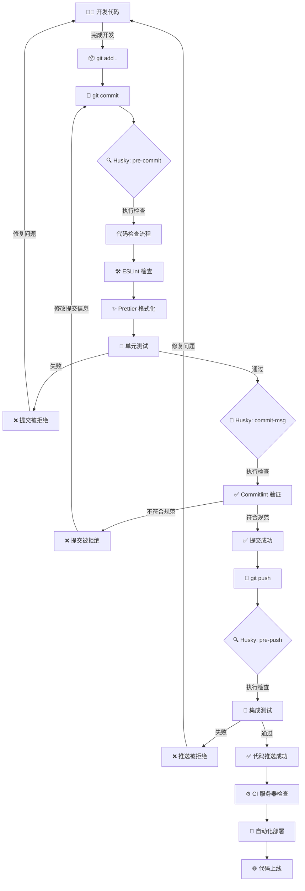

## 📚 前言 ##

在现代前端开发团队中，代码质量和协作效率至关重要。本指南将深入介绍如何利用 Husky 和 Commitlint 这两款强大工具打造专业的 Git 工作流，助您的团队在开发过程中事半功倍。

## 💡 核心概念详解 ##

### 🐶 Husky - Git 钩子管家 ###

Husky 是一款卓越的 Git hooks 工具，它能够优雅地在 Git 生命周期的关键节点执行自定义脚本。通过 Husky，我们可以在代码提交、推送等重要时刻进行智能化自动操作，如代码格式化、测试运行、提交信息验证等，确保每一行进入仓库的代码都经过严格把关。

### 📝 Commitlint - 提交信息守护者 ###

Commitlint 是一个专注于检查 Git commit 信息的精准工具，确保所有提交严格遵循约定式提交规范（Conventional Commits）。它不仅能帮助团队维持高度一致的提交信息格式，还为自动化版本控制和变更日志生成铺平道路，让项目管理如丝般顺滑。

## ✨ 为什么您的项目绝对需要这套工具 ##

### 📏 构建卓越的代码规范体系 ###

- 通过 ESLint、Prettier 等顶级工具在提交前自动检查和格式化代码
- 确保团队中每一行代码都完美符合团队约定的风格指南，告别风格争议

### 🏆 显著提升提交质量 ###

- 智能强制执行提交信息规范，使项目历史记录清晰如镜
- 让团队成员轻松理解每次提交的精确目的和内容，极大促进知识共享

### ⚙️ 构建智能化自动工作流 ###

- 有效防止不符合质量标准的代码悄悄进入代码库
- 大幅减少人工代码审查的工作量，提升团队整体开发效率

### 📊 无缝生成专业变更日志 ###

- 规范化的提交信息可以一键生成结构完美的变更日志
- 全面支持语义化版本控制（Semantic Versioning），使版本管理科学透明

## 🔄 Git 提交工作流全景图 ##

- 👩‍💻 开发者精心编写代码
- 📦 暂存精选更改 (git add .)
- 💾 提交优质更改 (git commit -m "消息")
  - Husky 智能触发 pre-commit hook
    - 执行全方位代码质量检查 (ESLint, Prettier 等)
    - 运行关键单元测试确保功能完整
  - Husky 继续触发 commit-msg hook
    - Commitlint 严格验证提交信息格式合规性
- ✅ 所有检查通过，提交成功完成
- 🚀 推送精良代码 (git push)
  - Husky 最后触发 pre-push hook
    - 运行更全面深入的集成测试
    - 执行必要的构建验证确保部署就绪
- 🌐 高质量代码成功推送到远程仓库

### 📊 工作流程图 ###



## 🛠️ 专业安装与配置指南 ##

### 🔧 安装 Husky ###

```bash
# 安装强大的 husky 工具
npm install husky --save-dev

# 启用 Git 钩子
npx husky init
# 或者添加安装脚本到 package.json 并执行
npm pkg set scripts.prepare="husky"
npm run prepare
```

### ⚙️ 配置 Husky Hooks ###

```bash
# 创建 pre-commit 钩子
npx husky set .husky/pre-commit "npm test"
# 或者直接创建文件
echo '#!/usr/bin/env sh
. "$(dirname -- "$0")/_/husky.sh"

npm test
' > .husky/pre-commit
chmod +x .husky/pre-commit

# 创建 commit-msg 钩子
npx husky set .husky/commit-msg "npx --no -- commitlint --edit \$1"
# 或者直接创建文件
echo '#!/usr/bin/env sh
. "$(dirname -- "$0")/_/husky.sh"

npx --no -- commitlint --edit "$1"
' > .husky/commit-msg
chmod +x .husky/commit-msg
```

### 📝 安装 Commitlint ###

```bash
# 安装强大的 commitlint 核心包和官方推荐的约定式提交配置
npm install --save-dev @commitlint/cli @commitlint/config-conventional
```

### 🔧 配置 Commitlint ###

创建专业的 commitlint.config.mjs 配置文件：

```javascript
// commitlint.config.mjs
export default {
  rules: {
    // === 正文(body)相关规则 ===
    'body-leading-blank': [1, 'always'], // 正文前必须有空行
    'body-max-line-length': [2, 'always', 100], // 正文每行最大长度100字符

    // === 页脚(footer)相关规则 ===
    'footer-leading-blank': [1, 'always'], // 页脚前必须有空行
    'footer-max-line-length': [2, 'always', 100], // 页脚每行最大长度100字符

    // === 标题(header)相关规则 ===
    'header-max-length': [2, 'always', 100], // 整个标题行最大长度100字符

    // === 主题(subject)相关规则 ===
    'subject-case': [2, 'never', ['sentence-case', 'start-case', 'pascal-case', 'upper-case']], // 主题不能使用句子格式、每词首字母大写、帕斯卡命名、全大写
    'subject-empty': [2, 'never'], // 主题不能为空
    'subject-full-stop': [2, 'never', '.'], // 主题结尾不能有句号
    'subject-max-length': [2, 'always', 72], // 主题最大长度72字符

    // === 类型(type)相关规则 ===
    'type-case': [2, 'always', 'lower-case'], // 提交类型必须小写
    'type-empty': [2, 'never'], // 提交类型不能为空
    'type-enum': [
      2,
      'always',
      [
        'feat', // 新功能
        'fix', // 修复 bug
        'docs', // 文档改动
        'style', // 代码格式（不影响功能）
        'refactor', // 代码重构
        'perf', // 性能优化
        'test', // 添加测试
        'build', // 构建相关
        'ci', // CI 配置
        'chore', // 杂项（依赖更新等）
        'revert' // 回滚
      ]
    ]
  }
};
```

### 🙅‍♂️ 常见的"糊弄"式提交（不推荐） ###

在实际项目中，我们经常会看到以下这些过于简单、不具体的提交信息：

```txt
feat： 代码优化            # 不具体，没有说明优化了什么
fix： bug 修复            # 没有说明修复了什么bug
feat：功能开发            # 没有说明开发了什么功能
chore: 修改               # 完全不知道修改了什么
fix: 解决问题             # 什么问题？如何解决的？
docs: 更新文档            # 更新了哪部分文档？
style: 调整样式           # 调整了哪里的样式？
feat: v1.0               # 版本号不是提交信息
```

**为什么这些提交信息不好？**

- 缺乏具体性：无法从提交信息中了解到具体做了什么改动
- 不利于代码审查：审查者需要花更多时间理解变更内容
- 难以追溯历史：当出现问题时，很难通过git历史找到相关提交
- 自动化工具困难：难以基于这些信息自动生成变更日志

**如何改进？**

```yaml
✅ feat: 优化用户列表页面加载性能，减少50%加载时间
✅ fix: 修复用户注册表单在Safari浏览器上提交失败的问题
✅ feat: 实现商品批量导入功能，支持Excel文件解析
✅ chore: 更新Webpack配置，减少打包体积20%
✅ fix: 解决移动端支付页面在iOS 15上按钮不可点击的问题
✅ docs: 更新API文档中的用户认证部分，添加Token刷新说明
✅ style: 调整移动端导航栏高度和字体大小，适配小屏设备
✅ feat: 发布订单管理模块v1.0，包含订单列表、详情和导出功能
```

## 📋 提交信息规范完全指南 ##

按照业界公认的 Conventional Commits 规范，高质量的提交信息应严格遵循以下优雅格式：

```ini
<类型>[可选 作用域]: <描述>

[可选 正文]

[可选 脚注]
```

### 🏷️ 规范类型详解 ###

- feat: ✨ 令人激动的新功能
- fix: 🐛 重要的问题修复
- docs: 📚 文档完善与变更
- style: 💎 代码风格优化(不影响代码运行的变动)
- refactor: 🔄 精心的代码重构(既不是增加feature，也不是修复bug)
- perf: ⚡ 显著的性能优化
- test: 🧪 全面的测试用例增加
- build: 🔨 构建系统或外部依赖的变动
- ci: 🔄 CI配置文件和脚本的变动
- chore: 🔧 构建过程或辅助工具和库的专业化更改(不影响源文件)
- revert: ⏪ 谨慎的版本回滚

### 📋 标准 Commit 提交示例 ###

**✅ 正确示例**：

```txt
feat: 添加用户登录功能

实现了完整的用户认证流程，包括以下功能：
- 用户名和密码验证
- JWT token 生成和验证
- 登录状态持久化
- 自动登出机制

这个功能支持多种登录方式，提高了用户体验。
同时加强了安全性，防止了常见的认证攻击。

Closes #123
Co-authored-by: Developer <dev@example.com>
```

## 🌟 行业最佳实践 ##

- 🚀 始终保持 hooks 脚本简洁高效，避免耗时任务导致开发体验下降
- 🎯 巧妙使用 lint-staged 只针对已暂存的文件进行检查，大幅提升效率
- 📝 为团队成员提供清晰易懂的提交消息指南，促进高效沟通
- 🔄 在 CI/CD 系统中实施同样严格的检查，确保全流程质量一致性
- 🔧 定期更新和优化规则配置，确保与项目发展需求完美匹配

## Git 最佳实践 ##

### 概述 ###

本文档规定了项目的 Git 提交信息规范，采用 Conventional Commits 格式，确保提交历史清晰易读、便于追溯。

### Commit Message 格式 ###

#### 基本结构 ####

```txt
<type>(<scope>): <subject>

[可选 body]

[可选 footer]
```

**示例**:

```txt
feat(router): 新增虚拟路由插件支持动态路由

实现了基于 Vue Router 的虚拟路由插件，支持：
- 动态路由注册
- 路由守卫自动绑定
- 路由缓存管理

Closes #123
```

#### 必填字段 ####

##### Type 类型 #####

|  Type   |      说明  |    使用场景  |
| :-----------: | :-----------: |    用途  |
| feat | 新功能 |    添加新特性、新模块  |
| fix | Bug 修复 |    修复缺陷、错误  |
| docs | 文档更新 |    文档、注释  |
| style | 代码格式 |    格式化代码、调整缩进、优化导入等（不影响功能）  |
| refactor | 重构 |    重构代码逻辑（不改变功能）  |
| perf | 性能优化 |    提升性能、优化算法  |
| test | 测试 |    添加/修改测试  |
| chore | 构建/工具 |    修改配置、构建脚本、依赖管理  |
| revert | 回滚 |    回滚之前的提交  |

##### Scope 范围 #####

范围应该是受影响的业务模块或功能，使用 `kebab-case`：

**业务模块示例**:

```txt
purchase, supplier, contract, requisition, approval, inventory
```

**功能模块示例**:

```txt
login, dashboard, settings, report, notification, workflow
```

**其他**:

```txt
config, build, ci, docs, deps
```

> 💡 Scope 应根据实际业务场景命名，上述仅为示例。建议团队内部统一约定常用的 scope 列表。

##### Subject 主题 #####

✅ 使用中文描述
✅ 使用动词开头，现在时态（如：新增、修复、优化）
✅ 首字母小写
✅ 不超过 50 个字符
✅ 结尾不加句号

#### 可选字段 ####

##### Body 正文 #####

对于复杂的提交，使用多行 body 详细说明：

- 说明修改的原因和背景
- 描述具体实现的功能点
- 列出重要的技术细节

**格式**: 与 subject 之间空一行

```txt
feat(wormhole): 新增 Swagger API 自动生成功能

实现了从 Swagger 文档自动生成 API 代码的功能，包括：
- 自动解析 Swagger/OpenAPI 文档
- 生成 TypeScript 类型定义
- 生成 API 函数代码
- 自动生成 Mock 数据
- 支持 Alova 实例自动检测

该功能可大幅提高 API 接口对接效率，减少手写重复代码。
```

##### Footer 页脚 #####

用于关联 Issue 或标记破坏性变更：

**关联 Issue**:

```txt
fix(router): 修复路由缓存失效问题

修复了在特定场景下路由缓存失效的问题。

Closes #123
Fixes #456
```

**破坏性变更 (Breaking Changes)**:

```txt
feat(api): 重构 API 请求接口

重构了整个 API 请求模块，采用新的 Alova 实例创建方式。

BREAKING CHANGE: createAppAlova 方法签名已更改。
旧版本: createAppAlova(baseURL, timeout)
新版本: createAppAlova({ baseURL, timeout, ...options })

迁移指南：将所有 createAppAlova 调用更新为对象参数形式。
```

### 提交示例 ###

#### ✅ 正例 ####

```txt
# 新功能
feat(purchase): 新增采购申请单批量审批功能
feat(supplier): 实现供应商信息批量导入功能
feat(contract): 新增合同电子签章功能
feat(requisition): 新增请购单高级搜索筛选条件

# Bug 修复
fix(login): 修复登录失败后跳转错误
fix(approval): 修复审批流程状态更新失败的问题
fix(inventory): 修复库存数量显示不正确的问题
fix(notification): 修复消息通知未实时更新的问题

# 文档更新
docs(readme): 更新项目安装说明
docs(api): 补充采购单接口调用文档
docs(workflow): 完善审批流程配置说明

# 代码格式
style(supplier): 格式化供应商模块代码
style(dashboard): 调整仪表盘组件导入顺序

# 重构
refactor(approval): 重构审批流程逻辑
refactor(purchase): 优化采购单查询流程

# 性能优化
perf(dashboard): 优化仪表盘数据加载性能
perf(requisition): 减少请购单列表查询时间

# 测试
test(contract): 添加合同创建流程单元测试
test(approval): 补充审批功能测试用例

# 构建/工具
chore(vite): 更新 Vite 构建配置
chore(deps): 升级 Vue 到 3.4.0
chore(eslint): 调整 ESLint 规则配置

# 回滚
revert(approval): 回滚审批流程优化提交

回滚提交 a1b2c3d，该优化导致某些场景下审批失败。
```

#### ❌ 反例 ####

```txt
# 缺少 type
(purchase): 新增采购申请单
purchase: 新增采购申请单

# 缺少 scope
feat: 新增采购申请单
fix: 修复问题

# scope 使用大写或驼峰
feat(Purchase): 新增采购申请单
feat(purchaseOrder): 新增采购申请单

# 使用英文主题（应使用中文）
feat(purchase): add purchase order
fix(supplier): fix supplier bug

# 主题过长（超过 50 字符）
feat(purchase): 新增采购管理功能包括采购申请、采购审批、采购执行、采购统计等完整功能

# 结尾加句号
feat(purchase): 新增采购申请单。

# 主题不清晰
feat(purchase): 更新代码
fix(supplier): 修复问题
chore: 更新
```

### Git 常用操作 ###

#### 查看状态和历史 ####

```bash
# 查看当前状态
git status

# 查看提交历史（推荐）
git log --oneline --graph --decorate

# 查看某个文件的提交历史
git log --follow -- src/views/purchase/index.vue

# 按作者过滤
git log --author="张三"

# 按模块过滤
git log --grep="purchase"
```

#### 提交代码 ####

```bash
# 添加所有修改的文件
git add .

# 添加指定文件
git add src/views/purchase/index.vue

# 提交代码
git commit -m "feat(purchase): 新增采购申请单列表"

# 查看提交结果
git log -1
```

#### 分支操作 ####

```bash
# 查看所有分支
git branch -a

# 创建并切换到新分支
git checkout -b feature/purchase-list

# 切换分支
git checkout develop

# 删除本地分支
git branch -d feature/purchase-list
```

#### 同步代码 ####

```bash
# 拉取远程最新代码
git pull origin develop

# 推送到远程
git push origin feature/purchase-list

# 第一次推送（关联远程分支）
git push -u origin feature/purchase-list
```

#### 暂存修改 ####

使用场景: 临时切换分支但不想提交当前修改

```bash
# 暂存当前修改
git stash save "采购单开发进行中"

# 查看暂存列表
git stash list

# 恢复暂存（保留暂存记录）
git stash apply

# 恢复暂存（删除暂存记录）
git stash pop
```

#### 查看差异 ####

```bash
# 查看工作区修改
git diff

# 查看已暂存的修改
git diff --cached

# 查看两个分支的差异
git diff develop feature/purchase-list
```

#### 撤销和回退（本地未推送） ####

使用场景: 本地修改错了或提交错了，想要撤销

```bash
# 撤销工作区的修改
git checkout -- src/views/purchase/index.vue

# 撤销暂存区的修改（保留工作区修改）
git reset HEAD src/views/purchase/index.vue

# 回退到上一个提交（保留修改）
git reset --soft HEAD^

# 回退到上一个提交（丢弃修改）
git reset --hard HEAD^

# 回退到指定提交
git reset --hard a1b2c3d

⚠️ 注意: reset 会改变提交历史，只能在本地未推送时使用
```

#### 恢复误删（reflog） ####

使用场景: 误删了分支或回退过头了

```bash
# 第1步：查看所有操作记录
git reflog

# 第2步：找到想要恢复的提交，比如 d4e5f6g

# 第3步：恢复到那个提交
git reset --hard d4e5f6g

# 或者创建新分支指向那个提交
git checkout -b recovered-branch d4e5f6g
```

#### 合并分支（merge） ####

使用场景: 将一个分支的修改合并到当前分支

```bash
# 合并指定分支到当前分支
git merge feature/purchase-list

# 合并但不自动提交（可以先检查）
git merge feature/purchase-list --no-commit

# 放弃合并
git merge --abort
```

示例: 功能开发完成后，将 feature 分支合并到 develop 分支

#### 解决冲突 ####

使用场景: 合并或拉取代码时出现冲突

```bash
# 第1步：查看冲突文件
git status

# 第2步：手动编辑冲突文件，解决冲突标记
# <<<<<<< HEAD
# 当前分支的内容
# =======
# 要合并进来的内容
# >>>>>>> feature/purchase-list

# 第3步：标记冲突已解决
git add src/views/purchase/index.vue

# 第4步：完成合并
git commit  # 如果是 merge
git rebase --continue  # 如果是 rebase
git cherry-pick --continue  # 如果是 cherry-pick
```

提示: 使用 VSCode 等编辑器可以更方便地解决冲突

#### 挑选提交（cherry-pick） ####

使用场景: 需要把某个分支的特定提交应用到当前分支

```bash
# 将某个提交应用到当前分支
git cherry-pick a1b2c3d

# 挑选多个提交
git cherry-pick a1b2c3d e4f5g6h

# 挑选提交范围（不包含 start）
git cherry-pick start..end

# 挑选时发生冲突，解决后继续
git cherry-pick --continue

# 放弃挑选
git cherry-pick --abort
```

示例: 在 feature 分支修复了一个 bug，现在需要把这个修复应用到 master 分支

#### 反向提交（revert） ####

使用场景: 已经推送到远程的提交需要撤销

```bash
# 创建一个反向提交来撤销某次提交（推荐，不改变历史）
git revert a1b2c3d

# 反向提交但不自动提交（可以修改提交信息）
git revert a1b2c3d --no-commit

# 撤销合并提交
git revert -m 1 a1b2c3d  # -m 1 表示保留第一个父节点
```

示例: 某个功能提交后发现有问题，但已经推送到远程，使用 revert 创建一个新提交来撤销

#### 标签管理 ####

使用场景: 版本发布时打标签，方便版本管理

```bash
# 查看所有标签
git tag

# 创建标签
git tag v1.0.0

# 创建带说明的标签
git tag -a v1.0.0 -m "发布 1.0.0 版本"

# 给指定提交打标签
git tag v1.0.0 a1b2c3d

# 推送标签到远程
git push origin v1.0.0

# 推送所有标签
git push origin --tags

# 删除本地标签
git tag -d v1.0.0

# 删除远程标签
git push origin --delete v1.0.0
```

#### 文件修改追溯（blame） ####

使用场景: 追溯某行代码是谁写的，什么时候写的

```bash
# 查看文件每行的最后修改记录
git blame src/views/purchase/index.vue

# 查看指定行范围
git blame -L 10,20 src/views/purchase/index.vue

# 查看详细信息（显示邮箱）
git blame -e src/views/purchase/index.vue

# 配合 show 查看完整提交
git show a1b2c3d
```

技巧: 在 VSCode 中安装 GitLens 插件，鼠标悬停在代码行上即可看到提交信息

#### 清理操作 ####

使用场景: 清理本地无用的分支和文件

```bash
# 查看远程已删除但本地还存在的分支
git remote prune origin --dry-run

# 删除远程已删除的本地分支
git remote prune origin

# 删除已合并的本地分支
git branch --merged | grep -v "master\|develop" | xargs git branch -d

# 清理未跟踪的文件（谨慎使用）
git clean -fd

# 查看会删除哪些文件（不实际删除）
git clean -fd --dry-run
```

示例: 远程分支已经删除，但本地还有很多旧分支，用 prune 清理

### 常见问题 ###

#### Q1: 如何选择合适的 type？ ####

**原则**: 根据修改的主要内容选择：

- 新增功能 → feat
- 修复 Bug → fix
- 更新文档 → docs
- 调整格式 → style
- 重构代码 → refactor
- 性能优化 → perf
- 测试相关 → test
- 构建/配置 → chore

**判断技巧**:

如果用户能感知到变化 → feat 或 fix
如果只是内部优化 → refactor 或 perf
如果只改格式不改逻辑 → style
如果改配置/依赖 → chore

#### Q2: scope 应该写多详细？ ####

**建议**: 使用顶层模块名即可，不要过于详细：

```bash
# ✅ 推荐
feat(purchase): 新增采购申请单审批

# ❌ 过于详细
feat(purchase/approval): 新增采购申请单审批
feat(src/views/purchase/approval): 新增采购申请单审批
```

**特殊情况**: 如果修改影响多个模块，可以选择：

```bash
# 方案 1: 使用多个 scope
feat(purchase,approval): 新增采购申请和审批功能

# 方案 2: 使用更通用的 scope
feat(system): 新增系统核心功能

# 方案 3: 省略 scope（不推荐）
feat: 新增核心功能
```

#### Q3: 什么时候需要写 body？ ####

**需要 body 的情况**:

- 复杂功能，需要说明实现细节
- 破坏性变更，需要说明迁移方法
- 重大重构，需要说明原因和影响

**不需要 body 的情况**:

- 简单的功能新增
- 明显的 Bug 修复
- 文档更新
- 代码格式调整

#### Q4: 代码冲突了怎么办？ ####

**场景**: 合并代码或拉取代码时出现冲突

```bash
# 第1步：查看冲突的文件
git status

# 第2步：手动编辑冲突文件，解决冲突标记
# <<<<<<< HEAD
# 你的修改
# =======
# 别人的修改
# >>>>>>> feature/purchase-list

# 第3步：标记冲突已解决
git add src/views/purchase/index.vue

# 第4步：继续合并
git commit  # 如果是 merge
git rebase --continue  # 如果是 rebase
git cherry-pick --continue  # 如果是 cherry-pick
```

**技巧**:

- 使用 VSCode，可以点击"接受当前更改"/"接受传入更改"快速解决
- 不确定时可以先 git merge --abort 取消合并，询问同事后再操作

#### Q5: 如何撤销已合并的分支？ ####

**场景**: master 由 feat-a 和 feat-b 合并而成，现在不想要 feat-a 的功能

##### 方法一：使用 revert（推荐，适合已推送到远程） #####

```bash
# 第1步：查看合并历史
git log --oneline --graph

# 输出类似：
# d4e5f6 (HEAD -> master) Merge branch 'feat-b'
# a1b2c3 Merge branch 'feat-a'  ← 要撤销这个合并

# 第2步：撤销 feat-a 的合并提交
git revert -m 1 a1b2c3

# -m 1 的含义：
# 合并提交有两个父节点，1 是 master，2 是 feat-a
# -m 1 表示保留 master 的内容，撤销 feat-a 的内容

# 第3步：推送到远程
git push origin master
```

##### 方法二：使用 reset（只适合本地未推送） #####

```bash
# 第1步：找到合并 feat-a 之前的提交
git log --oneline
# 找到 feat-a 合并之前的 commit hash，比如 xyz789

# 第2步：回退到那个提交
git reset --hard xyz789

# 第3步：重新合并 feat-b
git merge feat-b
```

**选择建议**:

- master 已推送到远程，团队成员在使用 → 用 revert
- 只在本地操作，还没推送 → 用 reset

#### Q6: 误删了分支/提交怎么恢复？ ####

**场景**: 不小心删除了分支或回退过头了

```bash
# 第1步：查看所有操作记录
git reflog

# 输出类似：
# a1b2c3d HEAD@{0}: reset: moving to HEAD^
# d4e5f6g HEAD@{1}: commit: feat(purchase): 新增采购单
# h7i8j9k HEAD@{2}: commit: fix(supplier): 修复供应商

# 第2步：找到想要恢复的提交，比如 d4e5f6g

# 第3步：恢复到那个提交
git reset --hard d4e5f6g

# 或者创建新分支指向那个提交
git checkout -b recovered-branch d4e5f6g
```

#### Q7: 如何临时切换分支但不想提交当前修改？ ####

**场景**: 正在开发功能，突然需要切换到别的分支修 bug，但当前代码还不想提交

##### 使用 stash（推荐） #####

```bash
# 第1步：暂存当前修改
git stash save "采购单开发进行中"

# 第2步：切换到其他分支
git checkout hotfix/urgent-bug

# 第3步：修完 bug 后，切回原分支
git checkout feature/purchase-list

# 第4步：恢复之前的修改
git stash pop
```

#### Q8: 如何挑选特定的多个提交？ ####

**场景**: master 分支有 10 次提交，想把其中的第 1、3、5、7、9 次提交抽出来

```bash
# 第1步：查看提交历史，找到对应的 commit hash
git log --oneline master

# 假设输出：
# j10 第10次提交
# i9  第9次提交  ← 要
# h8  第8次提交
# g7  第7次提交  ← 要
# f6  第6次提交
# e5  第5次提交  ← 要
# d4  第4次提交
# c3  第3次提交  ← 要
# b2  第2次提交
# a1  第1次提交  ← 要

# 第2步：创建新分支（或切换到目标分支）
git checkout -b selected-commits

# 第3步：挑选这些提交
git cherry-pick a1 c3 e5 g7 i9
```

#### Q9: merge 和 rebase 的区别？ ####

**merge（合并）**:

```bash
git checkout develop
git merge feature/purchase-list

# 结果：保留所有提交历史，产生一个合并提交
# develop: A - B - C - M (merge commit)
#                    /
# feature:      D - E
```

**rebase（变基）**:

```bash
git checkout feature/purchase-list
git rebase develop

# 结果：将 feature 的提交"移动"到 develop 最新提交之后
# develop: A - B - C - D' - E'
```

**选择建议**:

- 公共分支（develop、master）→ 用 merge（保留完整历史）
- 个人分支整理提交 → 用 rebase（保持线性历史）
- 已经推送到远程的分支 → 不要用 rebase（会造成冲突）

#### Q10: pull 和 fetch 的区别？ ####

**区别**:

```bash
# fetch: 只下载远程代码，不合并
git fetch origin develop

# 此时可以先查看差异
git diff develop origin/develop

# 确认没问题后再手动合并
git merge origin/develop

# pull: 下载并自动合并（相当于 fetch + merge）
git pull origin develop
```

**推荐用法**:

- 不确定远程有什么改动 → 先用 git fetch，查看后再合并
- 确定可以直接合并 → 用 git pull

#### Q11: 如何修改历史提交信息？ ####

**场景**: 最近几次提交的信息写错了，想批量修改

```bash
# 修改最近 3 次提交
git rebase -i HEAD~3

# 会打开编辑器，显示：
# pick a1b2c3d feat(purchase): 新增采购单
# pick d4e5f6g fix(supplier): 修复供应商
# pick h7i8j9k docs(readme): 更新文档

# 将要修改的提交的 pick 改为 reword：
# reword a1b2c3d feat(purchase): 新增采购单
# pick d4e5f6g fix(supplier): 修复供应商
# pick h7i8j9k docs(readme): 更新文档

# 保存后，会依次让你修改每个标记为 reword 的提交信息
```

**⚠️ 注意**: 只能修改未推送到远程的提交，否则会造成历史冲突
