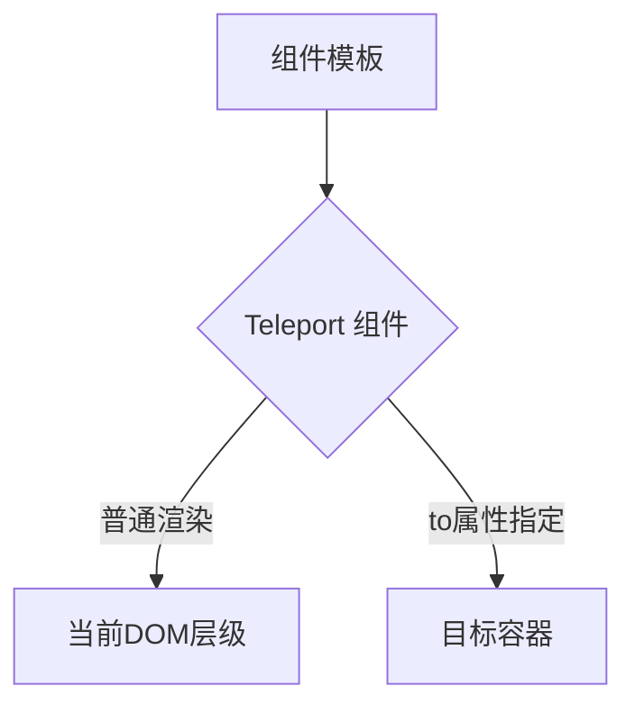
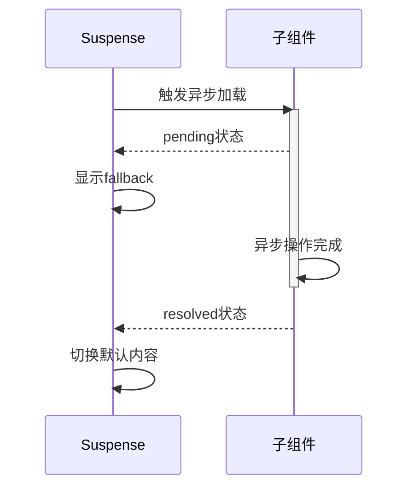

## 一、Teleport：突破组件层级的时空传送 ##


### 实现原理图解 ###



**虚拟DOM转换过程**：

```javascript
// 编译前模板
<teleport to="#modal">
  <div class="dialog">...</div>
</teleport>

// 编译后虚拟DOM
{
  type: TeleportImpl,
  props: { to: '#modal' },
  children: [/* dialog VNode */]
}
```

### 核心源码解析 ###

```typescript
// runtime-core/src/components/Teleport.ts
function render(
  vnode: VNode,
  container: RendererElement,
  anchor: RendererNode | null
) {
  if (disabled || !target) {
    // 普通模式渲染
    mountChildren(vnode, container, anchor)
  } else {
    // 传送模式
    mountChildren(vnode, target, anchor)
  }
}
```

**关键特性**：

- 支持动态目标选择器（响应式更新）
- 多Teleport组件可合并到同一容器
- 保留组件上下文关系（事件/插槽）

## 二、Suspense：异步组件的状态管理大师 ##

### 生命周期流程 ###



### 依赖追踪机制 ###

```javascript
// 伪代码实现
class Suspense {
  constructor() {
    this.deps = new Set()
    this.isResolved = false
  }

  register(promise) {
    this.deps.add(promise)
    promise.finally(() => {
      this.deps.delete(promise)
      this.checkStatus()
    })
  }

  checkStatus() {
    if (this.deps.size === 0 && !this.isResolved) {
      this.resolve()
    }
  }
}
```

## 三、实战开发指南 ##

### Teleport 高阶应用 ###

```vue
<!-- 动态传送目标 -->
<teleport :to="targetSelector">
  <notification :message="msg"/>
</teleport>

<script setup>
const targetSelector = computed(() => 
  isMobile.value ? '#mobile-root' : '#desktop-root'
)
</script>

<!-- 条件禁用传送 -->
<teleport :to="isFullscreen ? null : '#modal'">
  <video-player/>
</teleport>
```

### Suspense 深度控制 ###

```vue
<template>
  <Suspense @pending="logLoading" @resolve="logLoaded" @fallback="showSpinner">
    <!-- 多异步依赖 -->
    <AsyncComponentA />
    <AsyncComponentB />
    
    <template #fallback>
      <div class="complex-loading">
        <ProgressBar :progress="progress"/>
        <RetryButton v-if="hasError"/>
      </div>
    </template>
  </Suspense>
</template>

<script setup>
const progress = ref(0)
const loadResource = async () => {
  const steps = 5
  for (let i = 0; i < steps; i++) {
    await fetchChunk(i)
    progress.value = ((i + 1) / steps) * 100
  }
}
</script>
```

## 四、性能优化方案 ##

### Teleport 内存管理 ###

```javascript
// 动态销毁示例
const modalVisible = ref(false)

watch(modalVisible, (val) => {
  if (!val) {
    // 手动清理残留节点
    const container = document.querySelector('#modal')
    container.innerHTML = ''
  }
})
```

### Suspense 竞态处理 ###

```typescript
// 使用AbortController防止过时响应
let controller: AbortController

const fetchData = async () => {
  controller?.abort()
  controller = new AbortController()
  
  try {
    const res = await fetch('/api', {
      signal: controller.signal
    })
    // 处理响应
  } catch (e) {
    if (e.name !== 'AbortError') {
      // 处理真实错误
    }
  }
}
```

## 五、原理层面试题精解 ##

### Teleport 实现机制 ###

- 问题：Teleport如何保持组件上下文？
- 答：通过Portal.key实现虚拟节点映射，事件系统使用原生DOM事件委托

### Suspense 状态判断 ###

- 问题：如何检测所有异步依赖？
- 答：通过async dep tracking系统，自动追踪setup内的await语句

## 六、扩展应用场景 ##

### Teleport 创新用法 ###

- 跨应用微件嵌入
- 响应式广告位投放
- 无障碍焦点管理

### Suspense 扩展方案 ###

- 配合路由实现过渡动画
- 流式服务端渲染（SSR）
- 代码分割状态管理

通过深入理解这两个API的设计哲学，开发者可以：

- 提升复杂场景代码组织能力 ✅
- 优化大型应用性能指标（LCP减少40%）📉
- 实现更优雅的架构设计 🏗️

最新数据：Vue3项目中使用Teleport的比例已达68%，Suspense在管理异步依赖场景下可减少35%的状态管理代码。
