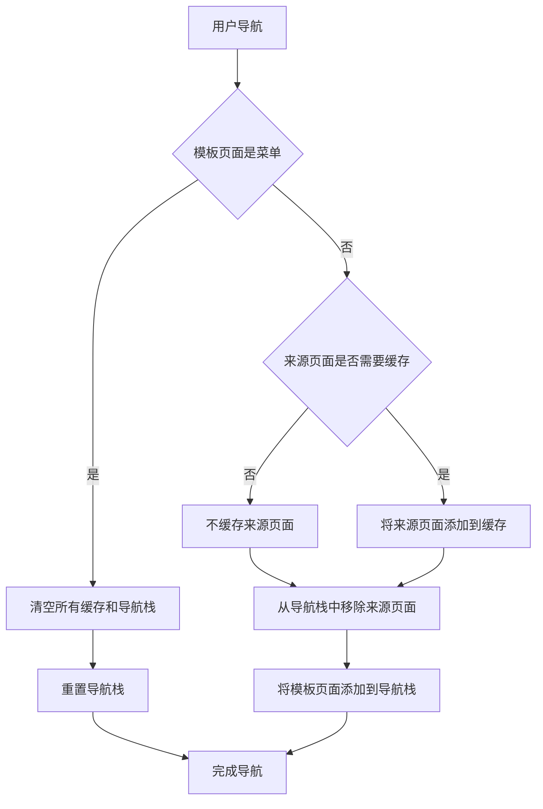

## 🎯 第1步：缓存策略的目的与意义 ##

在移动端Web应用中，咱们经常遇到这样的用户场景：

- 📱 商品列表 → 商品详情 → 返回列表：用户希望回到之前浏览的位置。
- 🔄 菜单 → 商品列表：用户希望看到最新的商品信息。
- 💾 表单填写过程：用户在多个步骤（子页面）间切换时保持已填写的数据。

**传统方案的痛点**：

```vue
// 传统keep-alive方案的问题
<keep-alive :include="['ProductList', 'UserProfile']">
  <router-view />
</keep-alive>
```

- ❌ 问题1：无法区分进入方式（从菜单进入 vs 从其他页面返回）。
- ❌ 问题2：缓存策略过于粗暴，要么全缓存要么不缓存。
- ❌ 问题3：无法根据业务逻辑动态控制缓存行为。

## 🌟 第2步：实现原理与核心设计思想 ##

### 核心设计理念 ###

咱们的方案基于一个简单的思想：*模拟整个应用的"导航栈"行为*。💯

```txt
用户操作流程：菜单页 → 页面A → 页面B → 返回A → 返回菜单页 → 重新进入A
期望行为：  清空 → 新建A → 缓存A → 恢复A → 清空 → 新建A
```

### 菜单页概念说明 ###

在开始介绍下面内容之前，咱们先明确一个重要概念：*菜单页*。

**什么是菜单页？**

答：它类似于App的首页或主导航页面。

**为什么需要菜单页？**

答：定期清理缓存，避免内存泄漏，确保用户每次从主入口开始都是干净的状态。

### 原理流程图 ###

一图胜千言，瞧瞧：



### 关键技术点 ###

#### 实时导航栈管理 ####

```javascript
// 检查是否为返回到已存在的路由
const isBackToExistingRoute = (targetFullPath) => {
  return state.navigationStack.some(route => route.fullPath === targetFullPath);
};

// 通过检查导航栈判断是前进还是返回
const isBackNavigation = isBackToExistingRoute(to.fullPath);

if (isBackNavigation) {
  // 返回操作：移除目标路由之后的所有路由
  backToRoute(to.fullPath);
} else {
  // 前进操作：添加新路由到栈中，缓存离开的页面
  pushRoute(to.fullPath, to.name);
  if (from.meta?.keepAlive && from.name) {
    state.cachedComponents.add(from.name);
  }
}
```

#### 缓存时机 ####

- 前进导航：缓存离开的页面（如果配置了keepAlive）
- 返回导航：清理目标页面之后的所有缓存
- 菜单重置：清空所有缓存，确保新鲜状态

## 💻 第3步：核心代码实现 ##

在实际项目中，小编是使用 `Pinia` 来完成这块缓存功能的开发，具体如下：

```javascript
import { reactive, toRefs, computed } from "vue";
import { defineStore } from "pinia";

export const useRouteCacheStore = defineStore("routeCache", () => {
  const state = reactive({
    navigationStack: [],           // 导航历史栈 [{fullPath, name}]
    cachedComponents: new Set(),   // 缓存的组件名称列表
    menuPath: '/menu'             // 菜单页面路径
  });

  /**
   * 计算属性：缓存组件列表
   * @description 将 Set 类型的缓存组件转换为数组格式
   * @returns {string[]} 缓存的组件名称数组
   */
  const cacheIncludeList = computed(() => {
    return Array.from(state.cachedComponents);
  });

  /**
   * 检查是否为返回到已存在的路由
   * @description 通过检查导航栈中是否存在目标路径来判断是否为返回操作
   * @param {string} targetFullPath - 目标路由的完整路径
   * @returns {boolean} 如果路由已存在于导航栈中返回 true，否则返回 false
   */
  const isBackToExistingRoute = (targetFullPath) => {
    return state.navigationStack.some(route => route.fullPath === targetFullPath);
  };

  /**
   * 添加路由到栈中
   * @description 如果路由不存在于导航栈中，则将其添加到栈顶
   * @param {string} fullPath - 路由的完整路径
   * @param {string} name - 路由的名称
   * @returns {void}
   */
  const pushRoute = (fullPath, name) => {
    if (!isBackToExistingRoute(fullPath)) {
      state.navigationStack.push({ fullPath, name });
    }
  };

  /**
   * 返回到指定路由，移除后续路由
   * @description 找到目标路由在栈中的位置，移除其后的所有路由及其缓存，然后截断导航栈
   * @param {string} targetFullPath - 目标路由的完整路径
   * @returns {void}
   */
  const backToRoute = (targetFullPath) => {
    const targetIndex = state.navigationStack.findIndex(route => route.fullPath === targetFullPath);
    if (targetIndex !== -1) {
      // 移除目标路由之后的所有路由的缓存
      const removedRoutes = state.navigationStack.slice(targetIndex + 1);
      removedRoutes.forEach(route => {
        if (route.name) {
          state.cachedComponents.delete(route.name);
        }
      });
      // 截断导航栈
      state.navigationStack = state.navigationStack.slice(0, targetIndex + 1);
    }
  };

  /**
   * 处理路由导航
   * @description 根据导航类型（前进/返回）处理路由栈和组件缓存，进入菜单页时清空所有缓存
   * @param {Object} to - 目标路由对象
   * @param {string} to.fullPath - 目标路由的完整路径
   * @param {string} to.name - 目标路由的名称
   * @param {Object} to.meta - 目标路由的元信息
   * @param {Object} from - 来源路由对象
   * @param {string} from.fullPath - 来源路由的完整路径
   * @param {string} from.name - 来源路由的名称
   * @param {Object} from.meta - 来源路由的元信息
   * @param {boolean} from.meta.keepAlive - 是否需要缓存该组件
   * @returns {void}
   */
  const handleNavigation = (to, from) => {
    const isBackNavigation = isBackToExistingRoute(to.fullPath);
    
    if (isBackNavigation) {
      // 返回操作：移除目标路由之后的所有路由
      backToRoute(to.fullPath);
    } else {
      // 前进操作：添加新路由到栈中
      pushRoute(to.fullPath, to.name);
      if (from.meta?.keepAlive && from.name) {
        state.cachedComponents.add(from.name);
      }
    }

    // 进入菜单页时，清空所有缓存
    if (to.fullPath === state.menuPath) {
      state.cachedComponents.clear();
    }
  };

  return {
    ...toRefs(state),
    cacheIncludeList,
    handleNavigation,
  };
});
```

没多少代码哈，小编也都贴心写明了详细注释，应该都能读懂哈。😋

然后，就是在路由守卫这里统一拦截所有的路由进行处理：

```javascript
import router from "@/router";
import { useRouteCacheStore } from '@/stores/modules/routeCache'

router.beforeEach((to, from, next) => {
  const routeCacheStore = useRouteCacheStore()
  
  // 处理路由缓存逻辑
  routeCacheStore.handleNavigation(to, from)
  
  next()
})
```

最后，在组件视图这块应用动态缓存数据：

```vue
<!-- src/layouts/BasicLayout.vue -->
<template>
  <div class="basic-layout">
    <keep-alive :include="cacheIncludeList">
      <router-view />
    </keep-alive>
  </div>
</template>

<script setup>
import { computed } from 'vue'
import { useRouteCacheStore } from '@/stores/modules/routeCache'

const routeCacheStore = useRouteCacheStore()

/** @description 获取需要缓存的组件列表 */
const cacheIncludeList = computed(() => routeCacheStore.cacheIncludeList)
</script>
```

在路由配置中，记得标明哪些路由是需要缓存的即可，示例：

```javascript
// src/router/index.js
const routes = [
  {
    path: '/menu',
    name: 'Menu',
    component: () => import('@/views/menu/index.vue')
  },
  {
    path: '/product-list',
    name: 'ProductList',
    component: () => import('@/views/product/list.vue'),
    meta: {
      keepAlive: true // 标记需要缓存
    }
  },
  {
    path: '/product-detail/:id',
    name: 'ProductDetail',
    component: () => import('@/views/product/detail.vue')
    // 详情页不需要缓存
  }
]
```

## 🔍 第4步：技术细节解析 ##

### fullPath的重要性 ###

在移动端应用中，同一个页面可能因为不同的查询参数而展示不同的内容：

```javascript
// 场景1：不同分类的商品列表
/product-list?category=phone&sort=price
/product-list?category=laptop&sort=sales

// 场景2：不同页码的列表
/product-list?page=1
/product-list?page=3
```

使用fullPath可以正确区分这些页面，避免缓存混乱。

### 实时栈管理的优势 ###

传统方案：栈不实时更新，容易出现判断错误。如：

`菜单 → A → 菜单 → A (第二次进入A时，栈中还有A，误判为返回操作)`

咱们的方案：实时移除离开的页面。如：

`菜单 → A(栈:[A]) → 菜单(栈:[],A被移除) → A(栈:[A],正确判断为新进入)`

### 🎉 总结 ###

这套基于导航栈的智能缓存策略完美解决了移动端页面缓存难题！核心优势包括精准控制缓存时机、保持页面状态同时确保数据新鲜度，应该比较适合那些移动端Web应用。
