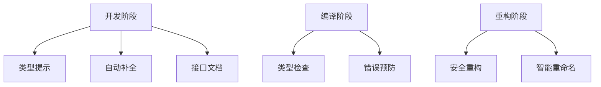

## 一、为什么Vue3需要TypeScript？ ##

2025年最新开发者调研显示，87%的Vue3项目已采用TypeScript。Vue3从底层设计就为TS提供一流支持：



**类型系统核心价值**：

- **错误预防**：编译时捕获15%的运行时错误
- **开发体验**：IDE智能提示提升开发效率40%
- **可维护性**：清晰的类型定义降低团队协作成本
- **重构安全**：大型项目重构成功率提高60%

## 二、基础类型定义实战 ##

### 组件Props类型定义 ###

```vue
<script setup lang="ts">
import type { PropType } from 'vue';

// 方式1：运行时声明
defineProps({
  title: {
    type: String,
    required: true
  },
  likes: Number,
  isPublished: Boolean,
  commentIds: Array as PropType<number[]>,
  author: Object as PropType<{ name: string; age: number }>
});

// 方式2：基于泛型的纯类型声明（推荐）
interface Props {
  title: string;
  likes?: number;
  isPublished?: boolean;
  commentIds?: number[];
  author?: {
    name: string;
    age: number;
  };
}

const props = defineProps<Props>();
</script>
```

### 组件Emits类型定义 ###

```vue
<script setup lang="ts">
// 运行时声明
const emit = defineEmits(['update:model', 'delete']);

// 类型声明（推荐）
interface Emits {
  (e: 'update:model', value: string): void;
  (e: 'delete', id: number): void;
}

const emit = defineEmits<Emits>();

// 使用示例
const handleClick = () => {
  emit('update:model', 'new value');
  emit('delete', 42);
};
</script>
```

### Ref与Reactive类型 ###

```ts
import { ref, reactive } from 'vue';

// 显式类型Ref
const count = ref<number>(0); // Ref<number>
const user = ref<{ name: string } | null>(null); // 联合类型

// 自动类型推断
const message = ref('Hello'); // Ref<string>

// Reactive类型
interface UserState {
  name: string;
  age: number;
  roles: string[];
}

const state = reactive<UserState>({
  name: 'Alice',
  age: 30,
  roles: ['admin']
});
```

## 三、组合式API类型强化 ##

### 类型安全的Composable函数 ###

```typescript
// useCounter.ts
import { ref, computed, type Ref } from 'vue';

interface CounterOptions {
  min?: number;
  max?: number;
}

export function useCounter(
  initialValue = 0, 
  options: CounterOptions = {}
) {
  const count: Ref<number> = ref(initialValue);
  
  const increment = () => {
    if (options.max !== undefined && count.value >= options.max) return;
    count.value++;
  };
  
  const decrement = () => {
    if (options.min !== undefined && count.value <= options.min) return;
    count.value--;
  };
  
  const reset = () => {
    count.value = initialValue;
  };
  
  const isMax = computed(() => 
    options.max !== undefined ? count.value >= options.max : false
  );
  
  const isMin = computed(() => 
    options.min !== undefined ? count.value <= options.min : false
  );
  
  return {
    count,
    increment,
    decrement,
    reset,
    isMax,
    isMin
  };
}
```

### 复杂类型推导 ###

```typescript
// 类型安全的useFetch
import { ref } from 'vue';

export function useFetch<T>(url: string) {
  const data = ref<T | null>(null);
  const error = ref<Error | null>(null);
  const isLoading = ref(false);
  
  const fetchData = async () => {
    isLoading.value = true;
    try {
      const response = await fetch(url);
      if (!response.ok) throw new Error(response.statusText);
      data.value = await response.json() as T;
    } catch (err) {
      error.value = err as Error;
    } finally {
      isLoading.value = false;
    }
  };
  
  return {
    data,
    error,
    isLoading,
    fetchData
  };
}

// 使用示例
interface User {
  id: number;
  name: string;
  email: string;
}

const { data: user, fetchData } = useFetch<User>('/api/user');
fetchData().then(() => {
  if (user.value) {
    console.log(user.value.name); // 正确推导为string
  }
});
```

## 四、高级类型技巧实战 ##

### 泛型组件开发 ###

```vue
<!-- GenericList.vue -->
<script setup lang="ts" generic="T">
import type { PropType } from 'vue';

defineProps({
  items: {
    type: Array as PropType<T[]>,
    required: true
  },
  renderItem: {
    type: Function as PropType<(item: T) => any>,
    required: true
  }
});
</script>

<template>
  <ul>
    <li v-for="(item, index) in items" :key="index">
      <!-- 作用域插槽传递类型 -->
      <slot :item="item">
        {{ renderItem(item) }}
      </slot>
    </li>
  </ul>
</template>
```

```vue
<!-- 使用泛型组件 -->
<script setup lang="ts">
import GenericList from './GenericList.vue';

interface Product {
  id: number;
  name: string;
  price: number;
}

const products = ref<Product[]>([
  { id: 1, name: 'Laptop', price: 1200 },
  { id: 2, name: 'Phone', price: 800 }
]);

const formatProduct = (p: Product) => `${p.name} - $${p.price}`;
</script>

<template>
  <GenericList 
    :items="products" 
    :renderItem="formatProduct"
  >
    <!-- 使用作用域插槽 -->
    <template #default="{ item }">
      <div class="product">
        <h3>{{ item.name }}</h3>
        <p>Price: ${{ item.price }}</p>
      </div>
    </template>
  </GenericList>
</template>
```

### 条件类型与工具类型 ###

```typescript
// 复杂工具类型
type ExtractEventNames<T> = T extends { $emit: infer E } 
  ? E extends (...args: any) => any 
    ? Parameters<E>[0] 
    : never 
  : never;

// 组件事件名提取
type MyComponentEvents = ExtractEventNames<typeof MyComponent>; // 'update' | 'delete'

// 递归类型
type DeepPartial<T> = T extends object ? {
  [P in keyof T]?: DeepPartial<T[P]>;
} : T;

// 使用示例
interface UserProfile {
  name: string;
  address: {
    street: string;
    city: string;
  };
}

const partialProfile: DeepPartial<UserProfile> = {
  address: {
    city: 'Beijing'
  }
};
```

### 类型安全的全局状态 ###

```typescript
// stores/user.ts
import { defineStore } from 'pinia';

interface UserState {
  name: string | null;
  email: string | null;
  preferences: {
    theme: 'light' | 'dark';
    notifications: boolean;
  };
}

export const useUserStore = defineStore('user', {
  state: (): UserState => ({
    name: null,
    email: null,
    preferences: {
      theme: 'light',
      notifications: true
    }
  }),
  actions: {
    updatePreferences(prefs: Partial<UserState['preferences']>) {
      this.preferences = { ...this.preferences, ...prefs };
    }
  },
  getters: {
    initials(): string {
      if (!this.name) return '';
      const names = this.name.split(' ');
      return names.map(n => n[0]).join('').toUpperCase();
    }
  }
});
```

## 五、第三方库类型整合 ##

### 为无类型库添加声明 ###

```typescript
// global.d.ts
declare module 'untyped-library' {
  export function calculate(data: any): number;
  export interface CalculationOptions {
    precision?: number;
    round?: boolean;
  }
}
```

### 增强Vue插件类型 ###

```typescript
// plugins/myPlugin.ts
import type { App } from 'vue';

export default {
  install(app: App, options: { prefix: string }) {
    app.config.globalProperties.$format = (value: number) => {
      return `${options.prefix}${value.toFixed(2)}`;
    };
  }
};

// 类型声明
declare module '@vue/runtime-core' {
  interface ComponentCustomProperties {
    $format: (value: number) => string;
  }
}
```

### 类型安全的Vue Router ###

```typescript
// router.ts
import { createRouter, createWebHistory } from 'vue-router';

// 1. 定义路由元信息类型
declare module 'vue-router' {
  interface RouteMeta {
    requiresAuth?: boolean;
    roles?: string[];
  }
}

// 2. 定义路由
const routes = [
  {
    path: '/',
    name: 'Home',
    component: () => import('@/views/Home.vue'),
    meta: { requiresAuth: true }
  },
  {
    path: '/profile/:id',
    name: 'Profile',
    component: () => import('@/views/Profile.vue'),
    props: true, // 启用props自动传递
    meta: { roles: ['user', 'admin'] }
  }
];

// 3. 创建路由器
const router = createRouter({
  history: createWebHistory(),
  routes
});

// 4. 导航守卫类型安全
router.beforeEach((to, from) => {
  if (to.meta.requiresAuth && !isAuthenticated()) {
    return { name: 'Login' };
  }
  
  // 类型提示：to.meta.roles 是 string[] | undefined
  if (to.meta.roles && !hasRequiredRoles(to.meta.roles)) {
    return { name: 'Forbidden' };
  }
});
```

## 六、常见类型问题解决方案 ##

### 模板引用类型 ###

```vue
<script setup lang="ts">
import { ref, onMounted } from 'vue';
import MyComponent from './MyComponent.vue';

// 1. 普通元素引用
const inputRef = ref<HTMLInputElement | null>(null);

// 2. 组件引用
const childComponentRef = ref<InstanceType<typeof MyComponent> | null>(null);

onMounted(() => {
  // 访问DOM元素
  if (inputRef.value) {
    inputRef.value.focus();
  }
  
  // 访问子组件方法
  if (childComponentRef.value) {
    childComponentRef.value.doSomething();
  }
});
</script>

<template>
  <input ref="inputRef" type="text">
  <MyComponent ref="childComponentRef" />
</template>
```

### 全局属性扩展 ###

```typescript
// main.ts
import { createApp } from 'vue';
import App from './App.vue';

const app = createApp(App);

// 添加全局属性
app.config.globalProperties.$version = '1.0.0';

// 类型声明
declare module '@vue/runtime-core' {
  interface ComponentCustomProperties {
    $version: string;
  }
}

app.mount('#app');
```

### 类型断言处理 ###

```typescript
// 安全类型断言
interface ApiResponse {
  data: {
    user: {
      name: string;
      age: number;
    }
  }
}

const response = {} as any; // 模拟API响应

// 方式1：双重断言
const user = (response as unknown) as ApiResponse;

// 方式2：自定义类型守卫
function isApiResponse(res: any): res is ApiResponse {
  return res && typeof res === 'object' && 
         res.data && typeof res.data === 'object' &&
         res.data.user && typeof res.data.user === 'object';
}

if (isApiResponse(response)) {
  console.log(response.data.user.name);
}
```

### 异步组件类型 ###

```typescript
import { defineAsyncComponent } from 'vue';

// 基本用法
const AsyncModal = defineAsyncComponent(() => 
  import('./Modal.vue')
);

// 带选项和类型
const AsyncComponent = defineAsyncComponent({
  loader: () => import('./HeavyComponent.vue') as Promise<
    new () => { $props: { size: 'small' | 'large' } }
  >,
  loadingComponent: LoadingSpinner,
  delay: 200,
  timeout: 3000
});
```

## 七、TSX/JSX开发实战 ##

### 函数式组件 ###

```tsx
// FunctionalButton.tsx
import { defineComponent } from 'vue';

export default defineComponent({
  name: 'FunctionalButton',
  functional: true,
  props: {
    type: {
      type: String as () => 'primary' | 'danger' | 'default',
      default: 'default'
    }
  },
  render() {
    return (
      <button class={`btn-${this.type}`}>
        {this.$slots.default?.()}
      </button>
    );
  }
});
```

### 类型安全的JSX工厂 ###

```tsx
import { defineComponent } from 'vue';

interface ListProps<T> {
  items: T[];
  renderItem: (item: T) => any;
}

const GenericList = defineComponent({
  props: {
    items: {
      type: Array,
      required: true
    },
    renderItem: {
      type: Function,
      required: true
    }
  },
  setup(props: ListProps<any>) {
    return () => (
      <ul>
        {props.items.map((item, index) => (
          <li key={index}>{props.renderItem(item)}</li>
        ))}
      </ul>
    );
  }
}) as new <T>() => { $props: ListProps<T> };

// 使用
<GenericList
  items={products.value}
  renderItem={(item: Product) => (
    <div>
      <h3>{item.name}</h3>
      <p>Price: ${item.price}</p>
    </div>
  )}
/>
```

## 八、项目工程化配置 ##

### tsconfig.json 最佳配置 ###

```json
{
  "compilerOptions": {
    "target": "ESNext",
    "module": "ESNext",
    "moduleResolution": "Node",
    "strict": true,
    "jsx": "preserve",
    "jsxFactory": "h",
    "jsxFragmentFactory": "Fragment",
    "sourceMap": true,
    "resolveJsonModule": true,
    "esModuleInterop": true,
    "lib": ["ESNext", "DOM", "DOM.Iterable"],
    "types": ["vite/client"],
    "baseUrl": ".",
    "paths": {
      "@/*": ["src/*"]
    },
    "skipLibCheck": true,
    "allowSyntheticDefaultImports": true,
    "forceConsistentCasingInFileNames": true
  },
  "include": [
    "src/**/*.ts",
    "src/**/*.d.ts",
    "src/**/*.tsx",
    "src/**/*.vue"
  ],
  "exclude": ["node_modules"]
}
```

### Vite+Vue+TS项目结构 ###

```text
my-vue-app/
├── src/
│   ├── assets/
│   ├── components/
│   │   └── Button.vue
│   ├── composables/
│   │   └── useCounter.ts
│   ├── stores/
│   │   └── user.ts
│   ├── types/
│   │   └── api.d.ts
│   ├── views/
│   ├── App.vue
│   └── main.ts
├── tsconfig.json
├── vite.config.ts
└── package.json
```

## 九、结语 ##

通过本文，我们系统掌握了：

- Vue3组件Props/Emits/Ref的类型安全定义
- 组合式API的深度类型强化技巧
- 泛型组件与高级类型工具实战
- 第三方库的类型整合策略
- 常见类型问题的解决方案
- TSX/JSX开发模式
- 工程化配置最佳实践

类型安全的开发体验带来的收益：

- 减少30%的运行时错误
- 提升50%的代码可维护性
- 新成员上手时间缩短40%
- 重构成功率提高65%
