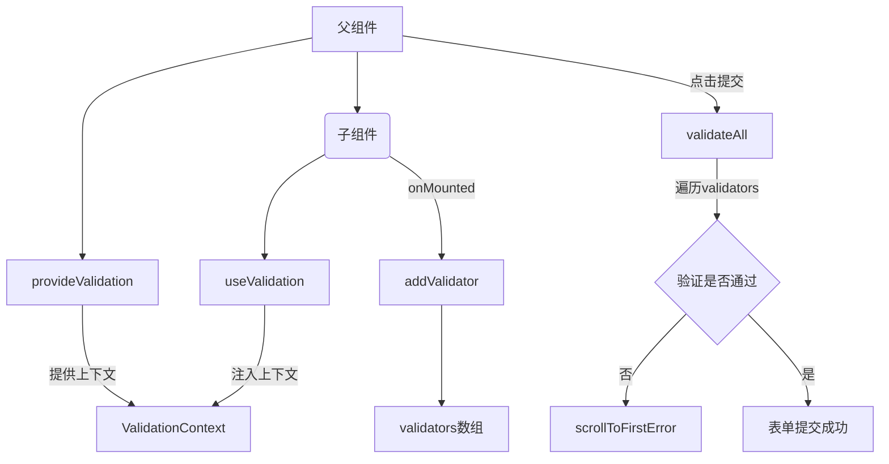

## 一、背景 ##

在现代的前端开发中，表单验证是用户交互中不可或缺的一部分；当表单结构复杂，尤其是包含多层级的子组件时，如何高效地实现校验并提升用户体验，成为了一个挑战。

在实际开发中，我们常常遇到这样的需求：一个页面包含多个子组件，这些子组件可能嵌套多层。当用户点击提交按钮时，需要校验所有输入框的内容，如果校验不通过，需要高亮显示错误的输入框，并且自动滚动到第一个出错的位置。这种需求在传统的校验方案中难以实现，尤其是在层级较深的组件结构中。

为了解决这一问题，我们需要一个灵活且高效的校验方案，同时结合自动滚动功能，以提升用户体验。本文将介绍一种基于 Vue 3 的解决方案，通过 `provide` 和 `inject` 机制以及 DOM 操作，实现多层级组件的校验与自动滚动。

## 二、方案 ##

### 深层校验 ###

为了应对多层级组件的校验需求，我们采用 Vue 3 的 `provide` 和 `inject` 功能来实现跨层级的校验逻辑。通过在父组件中提供一个校验上下文 `validationContext`，子组件可以通过 `inject` 获取并注册自己的校验逻辑，这种方式可以避免手动逐层调用子组件的校验方法，同时支持任意层级的子组件。

### 自动滚动 ###

当校验失败时，我们需要将页面滚动到第一个出错的输入框。为了实现这一功能，我们在校验上下文中记录所有校验失败的 DOM 元素引用。在提交表单时，通过调用 `scrollIntoView` 方法，将第一个校验失败的输入框滚动到视图中。

## 三、流程图 ##



总的来说，父组件生成一个全局状态管理，用于存储所有子组件自身的表单校验方法（子组件挂载时添加进去），在提交表单上，父组件依次执行校验方法，判断是否验证通过。

## 四、代码实现 ##

为了能够在多处复用 `校验` 逻辑，将具体的实现过程封装成 `hooks`，通过传入不同的 key，注入/获取不同的校验上下文。

### 类型定义 ###

```js
/**
 * 验证器函数类型
 * @param element - 需要验证的 DOM 元素
 * @returns 验证结果
 */
export interface Validator {
  (element: HTMLElement): boolean;
}

/**
 * 验证器项目接口
 * 包含验证器函数和对应的 DOM 元素
 */
interface ValidatorItem {
  /** 验证器函数 */
  validator: Validator;
  /** 关联的 DOM 元素 */
  element: HTMLElement;
}

/**
 * 验证上下文接口
 * 定义了验证管理的所有方法和属性
 */
export interface ValidationContext {
  /** 所有注册的验证器列表 */
  validators: ValidatorItem[];
  /** 验证失败的元素列表 */
  failedElements: HTMLElement[];
  /** 添加验证器 */
  addValidator: (validator: Validator, element: HTMLElement) => void;
  /** 执行所有验证 */
  validateAll: () => boolean;
  /** 滚动到第一个错误位置 */
  scrollToFirstError: () => void;
}
```

### InjectionKey生成 ###

由于在项目中存在多个地方使用了 inject、provide，这可能会导致 key 冲突，因此需要确保生成的 key 是唯一的，这里采用 Symbol 来生成唯一的键。

```js
/**
 * 存储不同上下文的注入键
 * 使用 Map 来管理多个验证上下文，支持多个组件同时使用
 */
const validationContextKeys = new Map<string, InjectionKey<ValidationContext>>();

/**
 * 获取或创建验证上下文的注入键
 * @param key - 上下文标识符
 * @returns 对应的注入键
 */
function getValidationContextKey(key: string): InjectionKey<ValidationContext> {
  if (!validationContextKeys.has(key)) {
    validationContextKeys.set(key, Symbol(key) as InjectionKey<ValidationContext>);
  }
  return validationContextKeys.get(key)!;
}
```

### provideValidation ###

```js
/**
 * 提供验证上下文
 * 在父组件中调用，创建并提供验证上下文给子组件使用
 * @param key - 上下文标识符
 * @returns 验证上下文对象
 */
export function provideValidation(key: string) {
  const validationContext = reactive<ValidationContext>({
    /** 验证器列表 */
    validators: [],
    /** 失败元素列表 */
    failedElements: [],

    /**
     * 添加验证器
     * @param validator - 验证器函数
     * @param element - 关联的 DOM 元素
     */
    addValidator(validator: Validator, element: HTMLElement) {
      this.validators.push({ validator, element });
    },

    /**
     * 执行所有验证
     * 会遍历所有注册的验证器，执行验证并收集失败的元素
     * @returns 验证结果
     */
    validateAll() {
      this.failedElements = [];
      // 执行所有验证器，收集失败的元素
      const results = this.validators.map(({ validator, element }) => {
        const isError = validator(element);
        if (isError) {
          this.failedElements.push(element);
        }
        return isError;
      });

      const result = results.every((isError) => !isError);

      if (!result) {
        this.scrollToFirstError();
      }

      return result;
    },

    /**
     * 如果存在验证失败的元素，将页面滚动到第一个失败元素的位置
     */
    scrollToFirstError() {
      if (this.failedElements.length > 0) {
        console.log('scrollToFirstError', this.failedElements[0], this.failedElements);
        this.failedElements[0]?.scrollIntoView({
          behavior: 'smooth',
          block: 'center'
        });
      }
    }
  });

  // 获取注入键并提供上下文
  const ValidationContextKey = getValidationContextKey(key);
  provide(ValidationContextKey, validationContext);

  return validationContext;
}
```

### useValidation ###

```js
/**
 * 使用验证上下文
 * 在子组件中调用，获取父组件提供的验证上下文
 * @param key - 上下文标识符，需要与 provideValidation 中的 key 一致
 * @returns 验证上下文对象
 */
export function useValidation(key: string) {
  const ValidationContextKey = getValidationContextKey(key);
  const injectedValidationContext = inject(ValidationContextKey);
  if (!injectedValidationContext) {
    return null;
  }
  return injectedValidationContext;
}
```

## 五、组件中使用 ##

**父组件**：生成一个校验上下文并注入，该组件的所有后代组件均可以使用该【校验上下文】，只需传递相同的 Key 值即可。

```vue
<template>
  <FormModule />
</template>

<script lang="ts" setup>
import FormModule from 'FormModule.vue'
import { provideValidation } from '@/hooks/use-validation';

const validationContext = provideValidation('test-form');
</script>
```

**子组件**：在页面挂载的时候，调用 `addValidator` 传入该组件自身的表单校验方法 `validate`，以及滚动的目标 DOM，同时 validate 中需要返回表单校验的结果。

```vue
<template>
  <div ref="messageNameRef">
    <Input
      v-model:value="messageName"
      :class="{ 'error-valid': validModel.isError && validModel.inputFocus }"
      @blur="onBlur($event)"
    />
  </div>
</template>

<script lang="ts" setup>
import { ref, onMounted, reactive } from 'vue';
import { Input } from 'ant-design-vue';
import { useValidation } from '@/hooks/use-validation';

const injectedValidationContext = useValidation('test-form');

const messageNameRef = ref<HTMLInputElement | null>(null);
const messageName = ref('');
const validModel = reactive({
  isError: false,
  inputFocus: false
});

const onBlur = () => {
  messageNameRef.value && validate(messageNameRef.value);
};

const validate = (): boolean => {
  validModel.isError = !messageName.value.trim();
  validModel.inputFocus = validModel.isError;
  return validModel.isError;
};

onMounted(() => {
  if (messageNameRef.value) {
    injectedValidationContext?.addValidator(validate, messageNameRef.value);
  }
});
</script>
```
