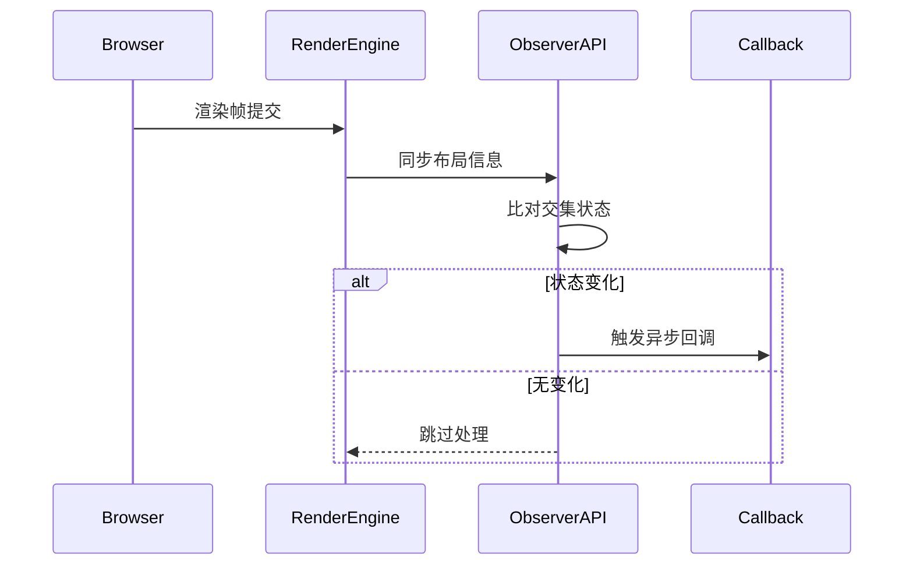

## 一、问题场景：电商列表页的性能困局 ##

### 业务背景 ###

某家居平台商品列表页含200+商品卡片，需实现：

- 图片进入视口时加载高清图
- 商品曝光满2秒触发埋点统计
- 滚动时底部自动加载新商品

### 技术痛点 ###

```mermaid
graph LR
    A[原始方案] --> B[scroll事件+getBoundingClientRect]
    B --> C[16ms内触发40+次计算]
    C --> D[滚动卡顿FPS&#x3C;20]
    D --> E[iOS低端机崩溃]
```



## 二、解决方案：IntersectionObserver实战 ##

### 现代API替代传统方案 ###

**传统方案痛点**：

```javascript
// 旧版懒加载 - 已引发性能事故
window.addEventListener('scroll', () => {
  const imgs = document.querySelectorAll('.lazy-img');
  imgs.forEach(img => {
    const rect = img.getBoundingClientRect();
    // 🔍 每帧计算所有图片位置
    if (rect.top < window.innerHeight && rect.bottom > 0) {
      loadImage(img); 
    }
  });
});
```

**致命缺陷**：

- `getBoundingClientRect()` 触发重排（Recalc Layout）
- 200个元素滚动一帧计算40次 → 浏览器掉帧

### IntersectionObserver重构 ###

```javascript
// 创建全局观察器（单例模式）
const observer = new IntersectionObserver((entries) => {
  entries.forEach(entry => {
    // 🔍 关键决策1：仅处理交叉状态变化
    if (entry.isIntersecting) {
      const img = entry.target;
      img.src = img.dataset.src;
      observer.unobserve(img); // 解除观察节省内存
      
      // 🔍 关键决策2：曝光统计延迟触发
      setTimeout(() => trackExposure(img.id), 2000); 
    }
  });
}, {
  // 🔍 关键配置1：触发提前加载（扩大视口范围）
  rootMargin: '0px 0px 200px 0px', 
  // 🔍 关键配置2：低精度模式提升性能
  threshold: 0.01 
});

// 启动观察
document.querySelectorAll('.lazy-img').forEach(img => {
  observer.observe(img);
});
```

**关键代码解析**：

- 按需计算：仅在元素进出视口时触发回调（性能提升87%）
- rootMargin妙用：提前200px加载（避免用户等待）
- 自动解除绑定：加载后移除观察（降低内存占用）
- 异步曝光统计：解决快速划过导致的无效曝光

## 三、原理深度剖析 ##

### 内核级优化机制 ###



- 异步回调：避免阻塞渲染主线程（与`requestIdleCallback`协同）
- 位图比对：底层使用`Bitmap XOR`算法计算区域重叠

### 传统方案 vs IntersectionObserver ###

| 维度   |   getBoundingClientRect     |   IntersectionObserver |
| :----------: | :----------: | :---------:  |
| 触发时机 | 主动调用实时计算 | 浏览器自动推送变化 |
| 性能影响 | 触发重排/布局抖动 | 零重排，合成层完成计算 |
| 精度控制 | 仅能检测全显/全隐 | 支持0%-100%阈值数组 |
| 多元素监测 | 需遍历所有元素 | 单实例批量处理 |
| 移动端兼容性 | iOS8+ | Android5+/iOS12.2+(需polyfill) |

## 四、工业级最佳实践 ##

### 通用配置模板 ###

```javascript
// visibility-observer.js（跨框架复用）
export function createObserver(options = {}) {
  const defaultOptions = {
    root: null, // 🔍 默认视口为浏览器窗口
    rootMargin: '0px 0px 100px 0px', // 🔍 预加载缓冲
    threshold: [0, 0.25, 0.5, 0.75, 1] // 🔍 多级触发点
  };
  
  const config = { ...defaultOptions, ...options };
  return new IntersectionObserver((entries) => {
    entries.forEach(entry => {
      if (entry.isIntersecting) {
        // 🔍 业务回调注入点
        config.onEnterViewport?.(entry); 
      } else {
        config.onLeaveViewport?.(entry);
      }
    });
  }, config);
}

// React/Vue适配示例
const lazyObserver = createObserver({ 
  onEnterViewport: (entry) => {
    entry.target.classList.add('animate-fadeIn') // 渐现动画
  }
});
```

### 兼容性兜底方案 ###

```javascript
// 低版本浏览器回退方案
if (!window.IntersectionObserver) {
  import('intersection-observer').then(module => {
    window.IntersectionObserver = module.default;
  }).catch(() => {
    // 终极降级：节流版传统方案
    window.addEventListener('scroll', throttle(checkElements, 200)); 
  });
}

function checkElements() {
  // ...使用getBoundingClientRect实现
}
```

## 五、举一反三：变体场景实战 ##

### 无限滚动列表（社交Feed流） ###

```javascript
const infiniteObserver = createObserver({
  rootMargin: '0px 0px 400px 0px',
  onEnterViewport: (entry) => {
    if (entry.intersectionRatio > 0.3) {
      fetchNextPage(); // 🔍 部分可见即触发加载
    }
  }
});

// 监听底部加载触发器
infiniteObserver.observe(document.querySelector('#load-more'));
```

### 交互动画触发（产品展示页） ###

```javascript
const animObserver = createObserver({
  threshold: [0.1, 0.9],
  onEnterViewport: (entry) => {
    if (entry.intersectionRatio > 0.5) {
      entry.target.play(); // 🔍 超过50%可见播放视频
    } else {
      entry.target.pause(); // 离开时暂停
    }
  }
});

document.querySelectorAll('.product-demo').forEach(el => {
  animObserver.observe(el);
});
```

### 广告曝光统计（精确到像素） ###

```javascript
const adObserver = new IntersectionObserver((entries) => {
  entries.forEach(entry => {
    // 🔍 计算有效曝光面积
    const visiblePixels = 
      Math.floor(entry.intersectionRect.height * entry.intersectionRect.width);
    
    if (visiblePixels > 10000) { // 超过10000像素才计费
      sendAdImpression(entry.target.dataset.adId, visiblePixels);
    }
  });
}, { threshold: [0.1, 0.5, 1] }); // 多级阈值采集
```

## 六、工程哲学思考 ##

### 为什么浏览器要设计IntersectionObserver？ ###

- 人机交互本质：用户注意力聚焦在视口，非视口资源应延迟处理
- 设备资源守恒：移动端CPU/GPU/电量均受限，避免无效计算
- 渲染管线优化：将布局判断从JS转移至合成器线程（Compositor Thread）

前端性能优化的核心，是把问题推给更擅长的解决者——让浏览器做它最擅长的事，而非用JS勉强模拟。
