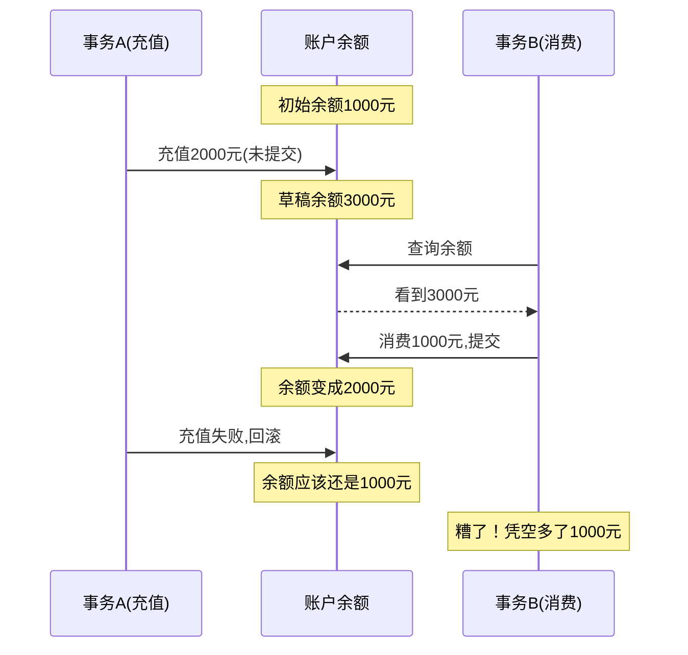
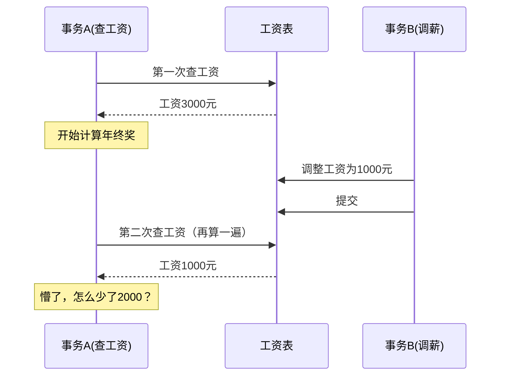
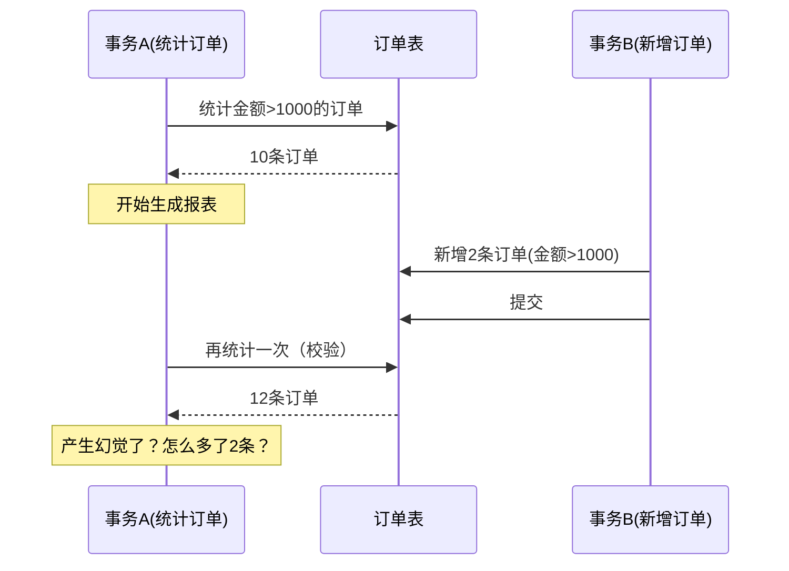
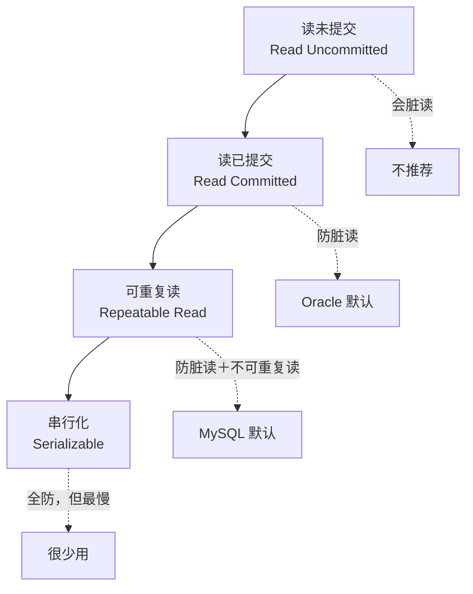

## 一句话说清楚 ##

- **脏读**：看了别人没保存的草稿
- **不可重复读**：同一句话听了两个版本
- **幻读**：眼前突然多了东西

这三个问题，都是多个事务同时操作数据库时产生的"视觉误差"。

## 先说个生活中的例子 ##

想象你在看电影：

- **脏读**：你偷看了导演正在剪辑的片段，结果这段最后被删了
- **不可重复读**：你看了开头，中场休息回来，发现片头被换了
- **幻读**：你明明看完了，突然发现后面多了一个彩蛋


## 问题一：脏读（读到别人的草稿） ##

### 什么情况会发生？ ###

事务A改了数据但还没提交，事务B就把这个"草稿数据"读出来了。万一A回滚了，B读到的就是错的。

### 真实案例：银行转账 ###



## 发生了什么？ ##

1. 你用手机给账户充值2000元（事务A，还没提交）
2. 你老婆在电脑上查余额，看到3000元
3. 她立马消费了1000元，提交成功
4. 你的充值因为网络问题失败了，回滚
5. 结果：实际余额1000，但老婆花了1000，系统显示2000

**用代码看看**：

```sql
-- 事务A：充值（未提交）
START TRANSACTION;
UPDATE accounts SET balance = balance + 2000 WHERE user_id = 123;
-- 这时候还没COMMIT

-- 事务B：读到了草稿余额
START TRANSACTION;
SELECT balance FROM accounts WHERE user_id = 123;  
-- 看到3000元（脏数据）
UPDATE accounts SET balance = balance - 1000 WHERE user_id = 123;
COMMIT;

-- 事务A回滚
ROLLBACK;  -- 充值失败

-- 结果：账户凭空多了钱
```

### 怎么避免？ ###

设置隔离级别为"读已提交"（Read Committed）：

```sql
SET SESSION TRANSACTION ISOLATION LEVEL READ COMMITTED;
```

这样B只能读到A提交后的数据。

## 问题二：不可重复读（同一个东西看两次不一样） ##

### 什么情况会发生？ ###

事务A读了一次数据，过了一会儿再读，发现数据变了（因为事务B改了并且提交了）。

### 真实案例：查工资 ###



### 发生了什么？ ###

1. 你查自己的工资：3000元
2. HR这时候调整了你的工资：1000元（并提交）
3. 你再查一次：1000元
4. 你懵了：刚才明明是3000，怎么变了？

**用代码看看**：

```sql
-- 事务A：计算奖金
START TRANSACTION;

-- 第一次查
SELECT salary FROM employees WHERE id = 123;  -- 结果：3000
-- 用这个工资算奖金...

-- 这期间，事务B改了工资
START TRANSACTION;
UPDATE employees SET salary = 1000 WHERE id = 123;
COMMIT;

-- 第二次查（想再确认一遍）
SELECT salary FROM employees WHERE id = 123;  -- 结果：1000

-- 懵了，两次不一样
```

### 和脏读的区别？ ###

- 脏读：读到的是*未提交*的数据（草稿）
- 不可重复读：读到的是*已提交*的数据，但前后不一致

### 怎么避免？ ###

设置隔离级别为"可重复读"（Repeatable Read）：

```sql
SET SESSION TRANSACTION ISOLATION LEVEL REPEATABLE READ;
```

MySQL会给你的事务拍个"快照"，在事务期间，你看到的数据始终是快照里的版本，不管别人怎么改。

## 问题三：幻读（突然多出来几条数据） ##

### 什么情况会发生？ ###

事务A按某个条件查了两次，第一次10条，第二次12条（因为事务B插入了2条新数据）。

### 真实案例：统计订单 ###



### 发生了什么？ ###

1. 你统计"金额大于1000元"的订单：10条
2. 同事这时候新增了2条大额订单，提交了
3. 你再统计一次想确认：12条
4. 你：刚才明明是10条，怎么变12条了？

**用代码看看**：

```sql
-- 事务A：统计订单
START TRANSACTION;

-- 第一次查
SELECT COUNT(*) FROM orders WHERE amount > 1000;  -- 结果：10

-- 这期间，事务B插入了新订单
START TRANSACTION;
INSERT INTO orders (amount) VALUES (1500), (2000);
COMMIT;

-- 第二次查
SELECT COUNT(*) FROM orders WHERE amount > 1000;  -- 结果：12

-- 懵了，多了2条
```

### 和不可重复读的区别？ ###

- 不可重复读：同一条数据的*值变了*（UPDATE）
- 幻读：数据的*行数变了*（INSERT/DELETE）

### 怎么避免？ ###

完全避免需要"串行化"（Serializable）：

```sql
SET SESSION TRANSACTION ISOLATION LEVEL SERIALIZABLE;
```

但这样太慢了。实际工作中，MySQL的"可重复读"级别通过"间隙锁"已经能防止大部分幻读。

或者加锁：

```sql
-- 锁住整个查询范围
SELECT * FROM orders WHERE amount > 1000 FOR UPDATE;
```

## 四个隔离级别 ##

MySQL有4个隔离级别，级别越高越安全，但也越慢：



| **隔离级别**        |      **脏读**      |     **不可重复读**      |     **幻读**      |     **性能**      |
| :------------- | :-----------: | :-----------: | :-----------: | :-----------: |
| 读未提交      | 会  | 会  | 会  | 最快  |
| 读已提交      | 不会  | 会  | 会  | 快  |
| 可重复读      | 不会  | 不会  | 部分会  | 一般  |
| 串行化      | 不会  | 不会  | 不会  | 最慢  |

## 实战场景该怎么选？ ##

### 场景1：银行转账 ###

**要求：绝对不能出错**

```sql
-- 用可重复读或串行化
SET TRANSACTION ISOLATION LEVEL REPEATABLE READ;

START TRANSACTION;
-- 查余额
SELECT balance FROM accounts WHERE user_id = 123 FOR UPDATE;
-- 转账
UPDATE accounts SET balance = balance - 500 WHERE user_id = 123;
UPDATE accounts SET balance = balance + 500 WHERE user_id = 456;
COMMIT;
```

### 场景2：电商商品详情页 ###

**要求：快，价格变了也没事**

```sql
-- 用读已提交就够了
SET TRANSACTION ISOLATION LEVEL READ COMMITTED;

-- 查商品价格，不用事务
SELECT price FROM products WHERE id = 789;
```

如果你刷新页面看到价格变了，这是正常的（不可重复读），不影响业务。

### 场景3：财务报表 ###

**要求：数据总量要对得上**

```sql
-- 用可重复读+加锁
SET TRANSACTION ISOLATION LEVEL REPEATABLE READ;

START TRANSACTION;
-- 锁住整个范围，防止幻读
SELECT SUM(amount) FROM orders WHERE date = '2024-01-01' FOR UPDATE;
-- 生成报表...
COMMIT;
```

### 场景4：秒杀库存 ###

**要求：又快又准**

```sql
-- 用读已提交+悲观锁
SET TRANSACTION ISOLATION LEVEL READ COMMITTED;

START TRANSACTION;
-- 锁住库存
SELECT stock FROM products WHERE id = 123 FOR UPDATE;
-- 减库存
UPDATE products SET stock = stock - 1 WHERE id = 123 AND stock > 0;
COMMIT;
```

## 实战中的坑 ##

### 坑1：以为可重复读就没幻读 ###

错！MySQL的可重复读只能防止*快照读*的幻读，但防不了*当前读*的幻读。

```sql
START TRANSACTION;

-- 快照读：没幻读
SELECT * FROM orders WHERE amount > 1000;  -- 10条

-- 别人插入了数据...

-- 再查：还是10条（因为读的是快照）
SELECT * FROM orders WHERE amount > 1000;  -- 还是10条

-- 当前读：有幻读
SELECT * FROM orders WHERE amount > 1000 FOR UPDATE;  -- 12条了！
```

### 坑2：隔离级别设太高 ###

有人觉得"串行化最安全"，然后把所有业务都设成串行化。结果：

- 系统巨慢
- 大量请求排队
- 用户体验极差

记住：*能用读已提交就别用可重复读，能用可重复读就别用串行化*。

### 坑3：忘了设隔离级别 ###

MySQL默认是"可重复读"，但有些系统（比如从Oracle迁移过来的）需要"读已提交"。如果不设置，可能会有性能问题。

## 总结 ##

**脏读、不可重复读、幻读的本质**：

- 都是多事务并发时"看到了不该看到的数据"
- 区别在于看到的是什么：草稿、旧版本、还是新增的

### 怎么选隔离级别？ ###

- 一般业务：读已提交（RC）
- 核心业务：可重复读（RR）
- 极致要求：串行化（但要想清楚）

**记住一句话**：

> 数据库的隔离级别，本质是"安全"和"速度"的平衡。
> 锁得越紧越安全，但开门越慢。

别盲目追求"最安全"，要根据业务选"最合适"。

**最后问你一个问题**：

你在项目中遇到过因为隔离级别设置不对导致的bug吗？比如：

- 脏读导致金额错误？
- 不可重复读导致数据对不上？
- 幻读导致统计数量不对？
