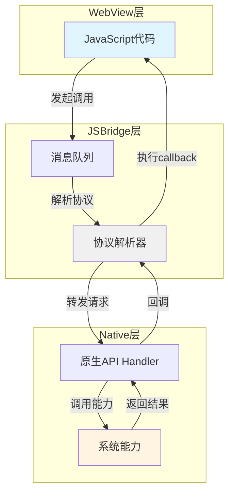
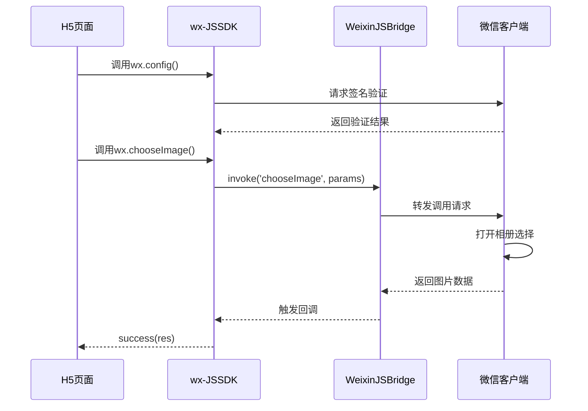
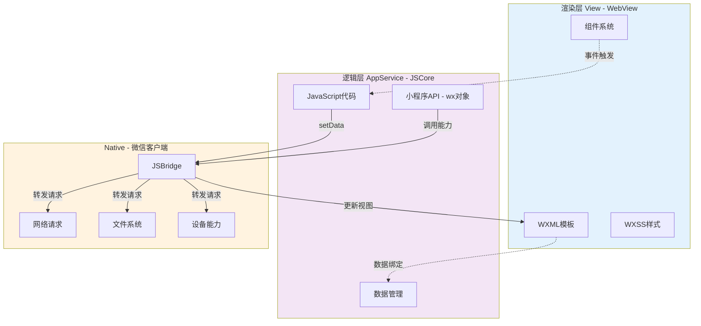
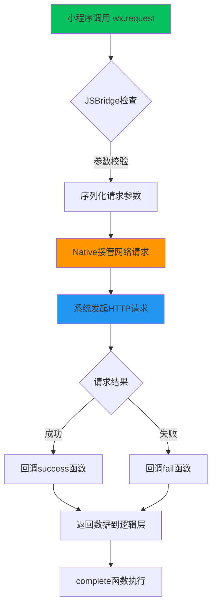
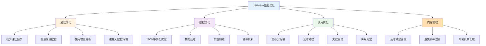
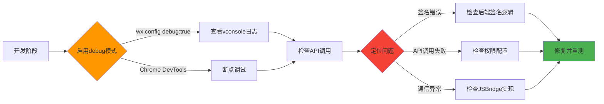

## 引言 ##

在移动互联网时代,Hybrid应用已成为主流开发模式之一。JSBridge作为连接JavaScript与Native的核心桥梁,让Web页面能够调用原生能力,实现了跨平台开发的完美平衡。微信作为国内最大的超级应用,其公众号JSSDK和小程序架构为我们提供了绝佳的JSBridge实践案例。本文将深入剖析这两套SDK的实现原理,帮助读者理解JSBridge的本质与设计思想。

## 一、JSBridge核心概念 ##

### 什么是JSBridge ###

JSBridge是JavaScript与Native之间的通信桥梁,它建立了双向消息通道,使得:

- JavaScript调用Native: Web页面可以调用原生能力(相机、地理位置、支付等)
- Native调用JavaScript: 原生代码可以向Web页面传递数据或触发事件

### JSBridge通信架构 ###



### 通信方式对比 ###

JSBridge主要有三种实现方式:

| **方式**        |      **原理**      | **优点**        |      **缺点**      |
| :------------- | :-----------: | :------------- | :-----------: |
| URL Schema拦截      | 通过iframe.src触发特定协议  | 兼容性好,iOS/Android通用      | 有URL长度限制,不支持同步返回  |
| 注入API      | Native向WebView注入全局对象  | 调用简单直接      | Android 4.2以下有安全风险  |
| MessageHandler      | WKWebView的postMessage机制  | 性能好,安全性高      | 仅iOS可用 |

## 二、微信公众号JSSDK实现原理

### JSSDK架构设计 ###

微信公众号的JSSDK基于WeixinJSBridge封装,提供了更安全和易用的接口。



### JSSDK初始化流程 ###

JSSDK的初始化需要完成配置验证和ready状态准备:

```javascript
// 步骤1: 引入JSSDK
<script src="https://res.wx.qq.com/open/js/jweixin-1.6.0.js"></script>

// 步骤2: 配置权限验证
wx.config({
  debug: false,
  appId: 'your-app-id',
  timestamp: 1234567890,
  nonceStr: 'random-string',
  signature: 'sha1-signature',
  jsApiList: ['chooseImage', 'uploadImage', 'getLocation']
});

// 步骤3: 监听ready事件
wx.ready(function() {
  // 配置成功后才能调用API
  console.log('JSSDK初始化完成');
});

wx.error(function(res) {
  console.error('配置失败:', res);
});
```

配置验证流程说明:

- 获取签名: 后端通过 `jsapi_ticket` 和当前URL生成SHA1签名
- 前端配置: 将签名等参数传入 `wx.config()`
- 客户端验证: 微信客户端校验签名的合法性
- 授权完成: 验证通过后触发 `ready` 事件

### WeixinJSBridge底层机制 ###

WeixinJSBridge是微信内部提供的原生接口,不对外公开但可以直接使用:

```javascript
// 检测WeixinJSBridge是否ready
function onBridgeReady() {
  WeixinJSBridge.invoke(
    'getBrandWCPayRequest',
    {
      appId: 'wx123456',
      timeStamp: '1234567890',
      nonceStr: 'randomstring',
      package: 'prepay_id=xxx',
      signType: 'MD5',
      paySign: 'signature'
    },
    function(res) {
      if (res.err_msg === 'get_brand_wcpay_request:ok') {
        console.log('支付成功');
      }
    }
  );
}

if (typeof WeixinJSBridge === 'undefined') {
  document.addEventListener('WeixinJSBridgeReady', onBridgeReady, false);
} else {
  onBridgeReady();
}
```

WeixinJSBridge与wx JSSDK的关系:

- `WeixinJSBridge`: 底层原生接口,直接由微信客户端注入,无需引入外部JS
- `wx JSSDK`: 基于WeixinJSBridge的高级封装,提供统一的API规范和安全验证

```mermaid
flowchart LR
    A[H5页面] -->|引入jweixin.js| B[wx JSSDK]
    B -->|封装调用| C[WeixinJSBridge]
    C -->|Native注入| D[微信客户端]
    D -->|系统能力| E[&#x26;#34;相机、支付、定位等&#x26;#34;]

    style B fill:#07c160
    style C fill:#ff9800
    style D fill:#576b95
```



### 典型API调用示例 ###

以选择图片为例,展示完整的调用链路:

```javascript
// 封装图片选择功能
function selectImages(count = 9) {
  return new Promise((resolve, reject) => {
    wx.chooseImage({
      count: count,          // 最多选择数量
      sizeType: ['original', 'compressed'],
      sourceType: ['album', 'camera'],
      success: function(res) {
        const localIds = res.localIds; // 返回本地图片ID列表
        resolve(localIds);
      },
      fail: function(err) {
        reject(err);
      }
    });
  });
}

// 使用示例
wx.ready(async function() {
  try {
    const imageIds = await selectImages(5);
    console.log('已选择图片:', imageIds);

    // 继续上传图片
    uploadImages(imageIds);
  } catch (error) {
    console.error('选择失败:', error);
  }
});

function uploadImages(localIds) {
  localIds.forEach(localId => {
    wx.uploadImage({
      localId: localId,
      isShowProgressTips: 1,
      success: function(res) {
        const serverId = res.serverId; // 服务器端图片ID
        // 将serverId发送给后端保存
        console.log('上传成功:', serverId);
      }
    });
  });
}
```

## 三、微信小程序双线程架构 ##

### 小程序架构设计 ###

微信小程序采用双线程模型,将渲染层与逻辑层完全隔离:



架构设计的核心优势:

- 安全隔离: 逻辑层无法直接操作DOM,防止XSS攻击
- 多WebView支持: 每个页面独立WebView,支持多页面并存
- 性能优化: 逻辑层使用JSCore,不加载DOM/BOM,执行更快

### 小程序JSBridge通信机制 ###

```mermaid
sequenceDiagram
    participant Logic as 逻辑层&#x3C;br/>(JSCore)
    participant Bridge as JSBridge
    participant Native as Native层
    participant View as 渲染层&#x3C;br/>(WebView)

    Note over Logic,View: 场景1: 数据更新
    Logic->>Bridge: setData({key: value})
    Bridge->>Native: 序列化数据
    Native->>View: 传递Virtual DOM diff
    View->>View: 更新页面渲染

    Note over Logic,View: 场景2: 事件响应
    View->>Bridge: bindtap事件触发
    Bridge->>Native: 序列化事件对象
    Native->>Logic: 调用事件处理函数
    Logic->>Logic: 执行业务逻辑

    Note over Logic,View: 场景3: API调用
    Logic->>Bridge: wx.request(options)
    Bridge->>Native: 转发网络请求
    Native->>Native: 发起HTTP请求
    Native-->>Bridge: 返回响应数据
    Bridge-->>Logic: 触发success回调
```



### 数据通信实现 ###

setData是小程序中最核心的通信API,用于逻辑层向渲染层传递数据:

```javascript
Page({
  data: {
    userInfo: {},
    items: []
  },

  onLoad: function() {
    // 通过setData更新数据,触发视图更新
    this.setData({
      userInfo: {
        name: '张三',
        avatar: 'https://example.com/avatar.jpg'
      },
      items: [1, 2, 3, 4, 5]
    });
  },

  // 优化建议: 只更新变化的字段
  updateUserName: function(newName) {
    this.setData({
      'userInfo.name': newName  // 使用路径语法,减少数据传输
    });
  },

  // 避免频繁setData
  handleScroll: function(e) {
    // 错误示范: 每次滚动都setData
    // this.setData({ scrollTop: e.detail.scrollTop });

    // 正确做法: 节流处理
    clearTimeout(this.scrollTimer);
    this.scrollTimer = setTimeout(() => {
      this.setData({ scrollTop: e.detail.scrollTop });
    }, 100);
  }
});
```

setData底层流程:

- 序列化数据: 将JS对象序列化为JSON字符串
- 通过JSBridge发送: Native层接收数据
- 传递到渲染层: Native将数据转发到WebView
- Virtual DOM Diff: 计算差异并更新视图

### 小程序API调用机制 ###

小程序的wx对象是Native注入的JSBridge接口:

```javascript
// 网络请求示例
function fetchUserData(userId) {
  return new Promise((resolve, reject) => {
    wx.request({
      url: `https://api.example.com/user/${userId}`,
      method: 'GET',
      header: {
        'content-type': 'application/json'
      },
      success(res) {
        if (res.statusCode === 200) {
          resolve(res.data);
        } else {
          reject(new Error(`请求失败: ${res.statusCode}`));
        }
      },
      fail(err) {
        reject(err);
      }
    });
  });
}

// 使用async/await优化
async function loadUserInfo() {
  wx.showLoading({ title: '加载中...' });

  try {
    const userData = await fetchUserData(123);
    this.setData({ userInfo: userData });
  } catch (error) {
    wx.showToast({
      title: '加载失败',
      icon: 'none'
    });
  } finally {
    wx.hideLoading();
  }
}
```

API调用流程图:



## 四、自定义JSBridge实现 ##

### 基础实现方案 ###

基于URL Schema拦截实现一个简单的JSBridge:

```javascript
class JSBridge {
  constructor() {
    this.callbacks = {};
    this.callbackId = 0;

    // 注册全局回调处理函数
    window._handleMessageFromNative = this._handleCallback.bind(this);
  }

  // JavaScript调用Native
  callNative(method, params = {}, callback) {
    const cbId = `cb_${this.callbackId++}`;
    this.callbacks[cbId] = callback;

    const schema = `jsbridge://${method}?params=${encodeURIComponent(
      JSON.stringify(params)
    )}&callbackId=${cbId}`;

    // 创建隐藏iframe触发schema
    const iframe = document.createElement('iframe');
    iframe.style.display = 'none';
    iframe.src = schema;
    document.body.appendChild(iframe);

    setTimeout(() => {
      document.body.removeChild(iframe);
    }, 100);
  }

  // Native回调JavaScript
  _handleCallback(callbackId, result) {
    const callback = this.callbacks[callbackId];
    if (callback) {
      callback(result);
      delete this.callbacks[callbackId];
    }
  }

  // 注册可被Native调用的方法
  registerHandler(name, handler) {
    this[name] = handler;
  }
}

// 使用示例
const bridge = new JSBridge();

// 调用Native方法
bridge.callNative('getLocation', {
  type: 'wgs84'
}, function(location) {
  console.log('位置信息:', location);
});

// 注册供Native调用的方法
bridge.registerHandler('updateTitle', function(title) {
  document.title = title;
});
```

### Promise风格封装 ###

将回调风格改造为Promise,提升开发体验:

```javascript
class ModernJSBridge extends JSBridge {
  invoke(method, params = {}) {
    return new Promise((resolve, reject) => {
      this.callNative(method, params, (result) => {
        if (result.code === 0) {
          resolve(result.data);
        } else {
          reject(new Error(result.message));
        }
      });
    });
  }
}

// 现代化使用方式
const bridge = new ModernJSBridge();

async function getUserLocation() {
  try {
    const location = await bridge.invoke('getLocation', {
      type: 'wgs84'
    });
    console.log('经度:', location.longitude);
    console.log('纬度:', location.latitude);
  } catch (error) {
    console.error('获取位置失败:', error.message);
  }
}
```

### Native端实现(以Android为例) ###

Android端需要拦截WebView的URL请求并解析协议:

```javascript
// 这是伪代码示意,用JavaScript语法描述Android的WebViewClient逻辑

class JSBridgeWebViewClient {
  shouldOverrideUrlLoading(view, url) {
    // 拦截自定义协议
    if (url.startsWith('jsbridge://')) {
      this.handleJSBridgeUrl(url);
      return true;  // 拦截处理,不加载URL
    }
    return false;  // 正常加载
  }

  handleJSBridgeUrl(url) {
    // 解析: jsbridge://getLocation?params=xxx&callbackId=cb_1
    const urlObj = new URL(url);
    const method = urlObj.hostname;  // getLocation
    const params = JSON.parse(
      decodeURIComponent(urlObj.searchParams.get('params'))
    );
    const callbackId = urlObj.searchParams.get('callbackId');

    // 调用原生能力
    switch(method) {
      case 'getLocation':
        this.getLocation(params, (location) => {
          // 回调JavaScript
          this.callJS(callbackId, {
            code: 0,
            data: location
          });
        });
        break;
    }
  }

  callJS(callbackId, result) {
    const script = `window._handleMessageFromNative('${callbackId}', ${
      JSON.stringify(result)
    })`;
    webView.evaluateJavascript(script, null);
  }

  getLocation(params, callback) {
    // 调用Android LocationManager获取位置
    // 这里是伪代码,实际需要原生Java/Kotlin实现
    const location = {
      longitude: 116.404,
      latitude: 39.915
    };
    callback(location);
  }
}
```

## 五、性能优化与最佳实践 ##

### 性能优化要点 ###



### 最佳实践 ###

#### 合理使用setData(小程序场景) ####

```javascript
// 不好的做法
for (let i = 0; i < 100; i++) {
  this.setData({
    [`items[${i}]`]: data[i]
  });  // 100次通信
}

// 好的做法
const updates = {};
for (let i = 0; i < 100; i++) {
  updates[`items[${i}]`] = data[i];
}
this.setData(updates);  // 1次通信
```

#### 实现超时与错误处理 ####

```javascript
class SafeJSBridge extends ModernJSBridge {
  invoke(method, params = {}, timeout = 5000) {
    return Promise.race([
      super.invoke(method, params),
      new Promise((_, reject) => {
        setTimeout(() => {
          reject(new Error(`调用${method}超时`));
        }, timeout);
      })
    ]);
  }
}

// 使用
try {
  const result = await bridge.invoke('slowMethod', {}, 3000);
} catch (error) {
  if (error.message.includes('超时')) {
    console.error('请求超时,请检查网络');
  }
}
```

#### 权限与安全检查 ####

```javascript
// JSSDK安全最佳实践
const secureConfig = {
  // 1. 签名在后端生成,前端不暴露secret
  getSignature: async function(url) {
    const response = await fetch('/api/wechat/signature', {
      method: 'POST',
      body: JSON.stringify({ url })
    });
    return response.json();
  },

  // 2. 动态配置jsApiList,按需授权
  init: async function() {
    const signature = await this.getSignature(location.href);
    wx.config({
      ...signature,
      jsApiList: ['chooseImage']  // 只申请需要的权限
    });
  }
};
```

## 六、调试技巧 ##

### 调试流程 ###



### 常见问题排查 ###

#### 微信JSSDK签名失败 ####

```javascript
// 调试签名问题
wx.config({
  debug: true,  // 开启调试模式
  // ... 其他配置
});

wx.error(function(res) {
  console.error('配置失败详情:', res);
  // 常见错误:
  // invalid signature - 签名错误,检查URL是否一致(不含#hash)
  // invalid url domain - 域名未配置到白名单
});

// 检查点:
// 1. 确保URL不包含hash部分
const url = location.href.split('#')[0];

// 2. 确保timestamp是整数
const timestamp = Math.floor(Date.now() / 1000);

// 3. 确保签名算法正确(SHA1)
// 签名原串: jsapi_ticket=xxx&noncestr=xxx&timestamp=xxx&url=xxx
```

#### 小程序setData性能问题 ####

```javascript
// 开启性能监控
wx.setEnableDebug({
  enableDebug: true
});

// 监控setData性能
const perfObserver = wx.createPerformanceObserver((entries) => {
  entries.getEntries().forEach((entry) => {
    if (entry.entryType === 'render') {
      console.log('渲染耗时:', entry.duration);
    }
  });
});

perfObserver.observe({ entryTypes: ['render', 'script'] });
```

## 七、总结 ##

JSBridge作为Hybrid开发的核心技术,通过建立JavaScript与Native的通信桥梁,实现了Web技术与原生能力的完美融合。本文通过剖析微信公众号JSSDK和小程序SDK,深入理解了以下关键点:

- 通信机制: URL Schema拦截、API注入、MessageHandler三种主流方式
- 架构设计: 微信小程序的双线程模型提供了安全性和性能的最佳平衡
- 实现原理: 从JSSDK的签名验证到小程序的setData机制,理解了完整的调用链路
- 最佳实践: 性能优化、错误处理、安全防护等工程化经验

掌握JSBridge原理不仅能帮助我们更好地使用微信生态的各种能力,也为构建自己的Hybrid框架提供了坚实的理论基础。在实际项目中,应根据具体场景选择合适的实现方案,并持续关注性能与安全,打造更优质的用户体验。
