前几天配置 GitHub 2FA 的时候，盯着那个每 30 秒跳动的 6 位数字发呆——扫个二维码就能生成验证码，还不需要联网，这玩意儿到底是怎么做到的？

带着这个疑问，我花了个周末把 TOTP（Time-based One-Time Password）的原理了解了下。没想到这个看起来简单的小功能，背后的密码学设计还挺有意思的。

先抛几个问题，看看你是不是也有同样的困惑：

- 那 6 位数字是怎么算出来的？
- 二维码里到底存了啥？
- 为什么手机和服务器能算出一样的数字？
- 登录的时候为啥不需要再扫码了？（我一开始真的搞混了）

## 为什么需要双因素认证？ ##

### 密码已经不够安全了 ###

微软 2019 年发了个报告，里面几个数字挺吓人的：

- 81% 的数据泄露都和弱密码或密码重用有关
- 开了 2FA 后，99.9% 的账号入侵都能被阻止
- 每天有大约 30 亿次密码攻击

想想也是，我自己常用的密码也就那几个，虽然会加点变化，但核心部分基本没变。万一哪个小网站被拖库了，攻击者拿着这个密码到处试，说不定就中了。

### 常见的密码攻击方式 ###

攻击者拿密码的套路有这些：

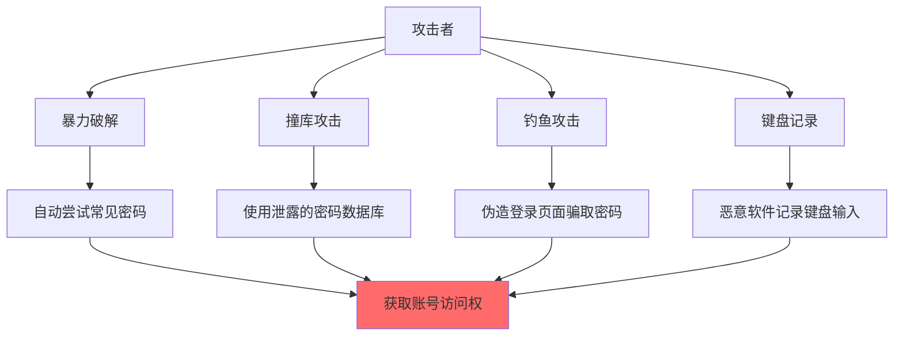

问题的根源在于密码只是"你知道的东西"，一旦泄露就完了。单点失败，没有冗余。

### 双因素认证的思路 ###

2FA 的思路很直接：光有密码不够，还得有手机（或者其他设备）。就算密码被偷了，没手机照样进不去。

## 双因素认证的三类要素 ##

### 认证因素分类 ###

|  类别  |  说明  |   示例  |   安全特性  |
| :-----------: | :----: | :----: | :----:   |
|  你知道的 (Knowledge)  |  记忆中的信息  |  密码、PIN 码、安全问题  |   可被窃取、破解、钓鱼  |
|  你拥有的 (Possession)  |  物理持有的设备  |  手机、硬件令牌、USB 密钥  |   需要物理访问  |
|  你是谁 (Inherence)  |  生物特征  |  指纹、面容、虹膜  |   难以复制  |

#### 2FA = 密码（知道） + TOTP（拥有） ####

攻击者就算搞到了密码，没你的手机也白搭。

### 常见的 2FA 实现方案对比 ###

|  方案  |  第一因素  |   第二因素  |   安全性  |   缺点  |
| :-----------: | :----: | :----: | :----:   |   :----:   |
|  SMS 短信  |  密码  |  手机号收短信  |   ⭐⭐  |   可被 SIM 卡劫持攻击  |
|  TOTP App  |  密码  |  手机 App 生成验证码  |   ⭐⭐⭐⭐  |   需要时间同步  |
|  硬件密钥  |  密码  |  USB 安全密钥(YubiKey)  |   ⭐⭐⭐⭐⭐  |   需要额外硬件  |
|  推送通知  |  密码  |  手机 App 批准  |   ⭐⭐⭐⭐  |   需要网络  |
|  WebAuthn/Passkeys  |  -  |  公钥加密 + 生物识别  |   ⭐⭐⭐⭐⭐  |   需要硬件支持  |

### 为什么 TOTP 最流行？ ###

TOTP 算是性价比最高的方案了：

**优点**：

- 离线能用（飞行模式都没问题）
- 完全免费（不像 YubiKey 要几百块）
- 哪都能用（各种平台都有 App）
- 标准统一（一个 App 管所有账号）
- 容易备份（密钥可以导出）

相比之下，短信验证码问题就多了。前段时间看新闻，英国 2024 年 SIM 卡劫持诈骗暴增了 10 倍。攻击者通过社会工程学骗运营商把你的号码转到他们手机上，然后就能收你的验证码了。地下室收不到信号、出国漫游费贵这些就不说了。

## TOTP 算法核心原理 ##

### 基本思路 ###

TOTP 的原理说穿了挺简单：

服务器和客户端各存一份相同的密钥（Secret），然后都用"当前时间"作为输入，通过相同的算法计算，得到相同的 6 位数字。因为用的是时间，所以每 30 秒会自动变化。

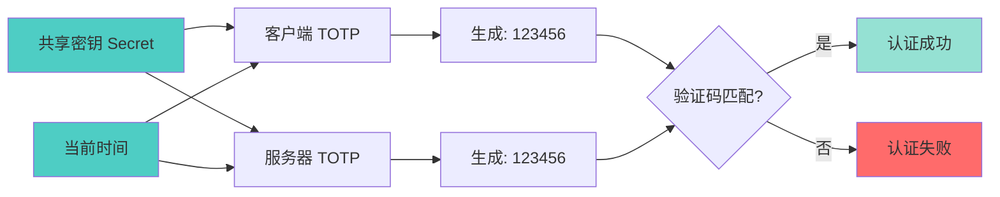

### TOTP 核心公式 ###

```txt
TOTP = HMAC-SHA1(Secret, TimeCounter) % 10^Digits
```

**具体来说**：


#### Secret（共享密钥） ####

- 通常 160 位（20 字节）
- Base32 编码后像这样：`JBSWY3DPEHPK3PXP`
- 扫二维码时传输的就是这个

#### TimeCounter（时间计数器） ####

```txt
TimeCounter = floor(CurrentUnixTime / 30)
// 每 30 秒跳一次
```

#### HMAC-SHA1（哈希消息认证码） ####

- 输入：`Secret + TimeCounter`
- 输出：160 位（20 字节）哈希值

#### 动态截断（Dynamic Truncation） ####

- 从 20 字节哈希中提取 4 字节
- 转换为 6 位数字（或 8 位）

### TOTP 算法流程图 ###

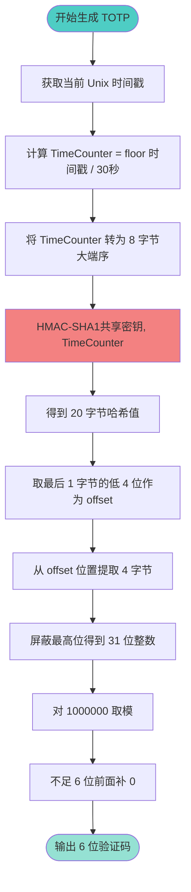

### 为什么是 30 秒？ ###

30 秒是个折中方案。太短了（比如 10 秒），你还没输完就过期了；太长了（比如 5 分钟），安全性又差。

实际上服务器会检查前后各 1 个时间窗口，也就是说你有 90 秒的时间输入验证码。这样即使手机和服务器时间有点偏差也没关系。

```mermaid
gantt
    title TOTP 时间窗口示例
    dateFormat X
    axisFormat %S秒

    section 时间窗口
    窗口1 (123456) :0, 30
    窗口2 (789012) :30, 60
    窗口3 (345678) :60, 90
    窗口4 (901234) :90, 120
```

就算有人偷拍了你的屏幕，最多 90 秒后这个验证码就废了。

## GitHub 2FA 完整流程详解 ##

### 流程一：GitHub 2FA 启用流程 ###

```mermaid
sequenceDiagram
    autonumber
    actor User as 用户
    participant Browser as 浏览器
    participant GitHub as GitHub 服务器
    participant App as TOTP App&#x3C;br>(Google Authenticator)

    User->>Browser: 访问 Settings → Password and authentication
    Browser->>GitHub: 请求启用 2FA
    GitHub->>GitHub: 生成随机密钥 Secret&#x3C;br>(20 字节 Base32 编码)
    GitHub->>GitHub: 生成恢复码&#x3C;br>(8-16 个备用码)
    GitHub->>Browser: 返回 QR 码 + Setup Key
    Note over GitHub,Browser: QR 码内容:&#x3C;br>otpauth://totp/GitHub:username&#x3C;br>?secret=SECRET&#x26;issuer=GitHub

    Browser->>User: 显示 QR 码
    User->>App: 打开 TOTP App
    User->>App: 扫描 QR 码
    App->>App: 保存 Secret 到本地加密存储
    App->>App: 开始生成 TOTP 验证码&#x3C;br>(每 30 秒更新)
    App->>User: 显示 6 位验证码

    User->>Browser: 输入验证码
    Browser->>GitHub: 提交验证码
    GitHub->>GitHub: 验证 TOTP 码是否匹配
    alt 验证成功
        GitHub->>GitHub: 保存加密后的 Secret
        GitHub->>GitHub: 启用 2FA 标志
        GitHub->>Browser: 显示恢复码
        Browser->>User: 下载并保存恢复码
        Note over User: ⚠️ 恢复码是唯一的&#x3C;br>账号恢复方式
        GitHub->>Browser: 2FA 启用成功
    else 验证失败
        GitHub->>Browser: 提示验证码错误
    end
```

**几个关键点**：

- **密钥只传一次** - 扫码那次之后，服务器和客户端就各算各的了
- **必须加密存储** - 无论手机还是服务器，Secret 都不能明文存
- **恢复码很重要** - 手机丢了这是唯一的救命稻草，我都打印出来锁保险箱了
- **有 28 天缓冲期** - GitHub 刚开 2FA 会给你 28 天适应期

### 流程二：GitHub 2FA 登录验证流程 ###

```mermaid
sequenceDiagram
    autonumber
    actor User as 用户
    participant Browser as 浏览器
    participant GitHub as GitHub 服务器
    participant App as TOTP App
    participant DB as 数据库

    User->>Browser: 访问 github.com
    Browser->>GitHub: 请求登录页面
    GitHub->>Browser: 返回登录表单

    User->>Browser: 输入用户名 + 密码
    Browser->>GitHub: POST /login (credentials)
    GitHub->>DB: 验证密码哈希

    alt 密码正确 &#x26; 2FA 已启用
        DB->>GitHub: 返回用户信息 + 2FA 启用标志
        GitHub->>Browser: 返回 2FA 验证页面
        Browser->>User: 要求输入验证码

        User->>App: 打开 TOTP App
        App->>App: Secret + floor(time/30) → HMAC-SHA1
        App->>App: 动态截断 → 生成 6 位码
        App->>User: 显示验证码 (如: 123456)

        User->>Browser: 输入 6 位验证码
        Browser->>GitHub: POST /verify-2fa (code: 123456)

        GitHub->>DB: 获取用户加密的 Secret
        GitHub->>GitHub: 解密 Secret
        GitHub->>GitHub: 计算当前时间窗口 TOTP
        GitHub->>GitHub: 计算前后窗口 TOTP (±1)

        alt 验证码匹配
            GitHub->>GitHub: 生成 Session Token
            GitHub->>Browser: 设置认证 Cookie
            GitHub->>DB: 记录登录成功日志
            Browser->>User: 登录成功，跳转到主页
        else 验证码不匹配
            GitHub->>GitHub: 记录失败尝试
            alt 失败次数 &#x3C; 5
                GitHub->>Browser: 返回错误提示
            else 失败次数 >= 5
                GitHub->>GitHub: 触发账号锁定 (5 分钟)
                GitHub->>Browser: 返回锁定提示
            end
        end

    else 密码错误
        GitHub->>Browser: 返回密码错误提示
    end
```

**GitHub 在安全上做得挺细的**：

- **先验密码** - 密码错了不会告诉你有没有开 2FA
- **时间容错** - 前后各检查 1 个窗口
- **防暴力破解** - 5 分钟最多试 5 次
- **防重放** - 同一个验证码不能用两次
- **会话管理** - Cookie 也有过期时间

### 扫描二维码的秘密 ###

很多人会搞混，我来捋一下：

|  场景  |  时机  |   二维码出现  |   作用  |
| :-----------: | :----: | :----: | :----:   |
|  启用 2FA  |  首次配置  |  显示二维码  |   传输共享密钥 Secret  |
|  登录验证  |  每次登录  |  不显示二维码  |   只需输入验证码  |

**启用时的二维码长这样**：

`otpauth://totp/GitHub:username?secret=JBSWY3DPEHPK3PXP&issuer=GitHub&algorithm=SHA1&digits=6&period=30`

**参数说明**：

|  参数  |  说明  |   示例值  |
| :-----------: | :----: | :----: |
|  `scheme`  |  协议类型  |  `otpauth://totp`  |
|  `label`  |  账号标识  |  `GitHub:username`  |
|  `secret`  |  共享密钥  |  `JBSWY3DPEHPK3PXP` (Base32)  |
|  `issuer`  |  发行者  |  `GitHub`  |
|  `algorithm`  |  哈希算法  |  `SHA1` (默认)  |
|  `digits`  |  验证码位数  |  `6` (默认)  |
|  `period`  |  时间步长（秒）  |  `30` (默认)  |

如果你要自己实现，推荐这些库：

- JavaScript: otplib
- Python: pyotp
- Go: otp
- Java: GoogleAuth

## 安全性深度分析 ##

### TOTP 的安全优势 ###

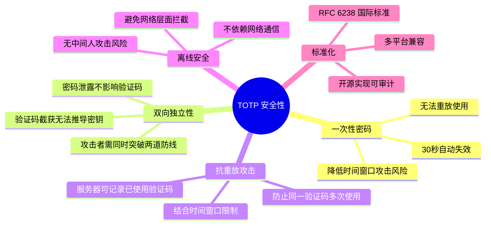

### 潜在的安全风险与防御 ###

#### 风险 1：密钥泄露 ####

如果手机被 root 了，恶意软件可能偷走密钥：

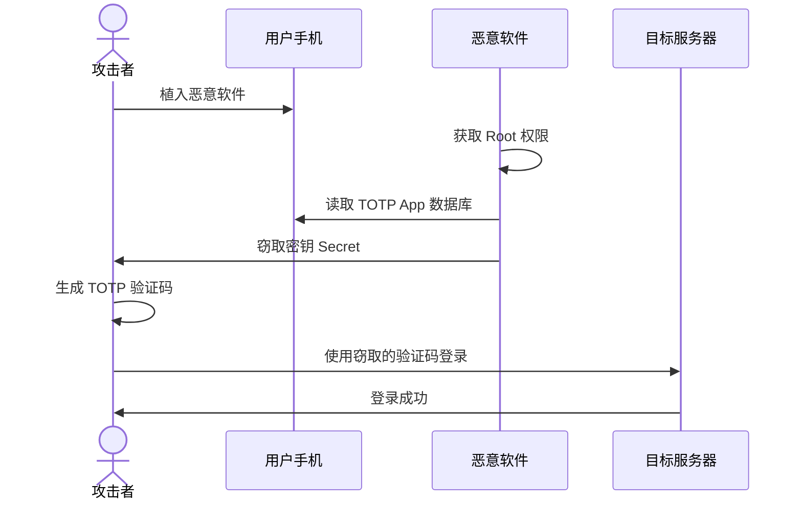

**防御办法**：

|  防御措施  |  说明  |   有效性  |
| :-----------: | :----: | :----: |
|  密钥加密存储  |  使用 AES-256 加密，密钥由硬件保护  |  ⭐⭐⭐⭐⭐  |
|  硬件安全模块 (HSM)  |  密钥永不离开安全芯片  |  ⭐⭐⭐⭐⭐  |
|  生物识别锁定  |  App 打开需要指纹/面容  |  ⭐⭐⭐⭐  |
|  设备绑定  |  检测设备指纹变化  |  ⭐⭐⭐  |

#### 风险 2：实时钓鱼攻击（MitM） ####

这个是 TOTP 的软肋，钓鱼网站可以实时转发你的验证码：

```mermaid
sequenceDiagram
    actor User as 用户
    participant Phishing as 钓鱼网站&#x3C;br>(attacker.com)
    participant Attacker as 攻击者后端
    participant Real as 真实网站&#x3C;br>(github.com)

    User->>Phishing: 访问钓鱼网站
    User->>Phishing: 输入密码 + TOTP
    Note over User,Phishing: 用户以为是真网站

    Phishing->>Attacker: 转发凭证
    Attacker->>Real: 立即使用凭证登录
    Real->>Attacker: 返回 Session Cookie
    Attacker->>Phishing: 保持用户会话
    Phishing->>User: 显示假的成功页面

    Note over Attacker: 攻击者获得&#x3C;br>真实账号访问权
```

为啥 TOTP 防不了钓鱼？

- TOTP 不验证域名
- 验证码还有 30-90 秒有效期，够攻击者用了
- 用户很难分辨 URL 真假

**防御办法**：

|  防御措施  |  说明  |   有效性  |
| :-----------: | :----: | :----: |
|  WebAuthn/FIDO2  |  密钥绑定域名，钓鱼网站无法获取  |  ⭐⭐⭐⭐⭐  |
|  硬件安全密钥  |  U2F 协议绑定 TLS 证书  |  ⭐⭐⭐⭐⭐  |
|  证书绑定  |  Certificate Pinning  |  ⭐⭐⭐⭐  |
|  用户教育  |  检查 URL、HTTPS 证书  |  ⭐⭐  |
|  浏览器防护  |  反钓鱼扩展、浏览器警告  |  ⭐⭐⭐  |

### 风险 3：SIM 卡劫持攻击（针对 SMS 2FA） ###

这就是我不用短信验证码的原因。2024 年英国 SIM 卡交换诈骗暴增 1055%（从 289 起增至 3000 起），96% 的案例都是通过社会工程学或运营商内鬼搞的。

**攻击流程**：

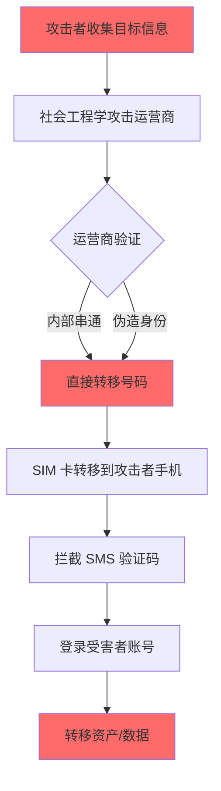

TOTP 为啥不怕这个？

- 密钥在手机本地，不在 SIM 卡上
- 换 SIM 卡拿不到密钥
- 就算手机号被劫持了，TOTP App 照样能用

### 风险 4：社会工程学攻击 ###

经典话术：

- "您好，我是 GitHub 客服，检测到您的账号异常，请提供验证码。"
- "系统升级需要验证，请把验证码告诉我。"

记住：**真的客服永远不会要你的验证码**！

### 攻击方式对比 ###

|  攻击方式  |  SMS 2FA  |   TOTP  |   WebAuthn  |   硬件密钥  |
| :-----------: | :----: | :----: | :----:   |   :----:  |
|  SIM 卡劫持  |  高风险  |  不受影响  |   不受影响  |   不受影响  |
|  实时钓鱼  |  高风险  |  高风险  |   免疫  |   免疫  |
|  密钥泄露  |  无密钥保护  |  中等风险  |   硬件保护  |   硬件保护  |
|  社会工程  |  高风险  |  中等风险  |   较低风险  |   较低风险  |
|  中间人攻击  |  可拦截  |  离线生成  |   绑定域名  |   绑定域名  |

## 生产环境最佳实践 ##

### 密钥安全管理 ###

密钥管理的几个要点：

- 加密存储：AES-256-GCM，不要用 ECB 模式
- 硬件保护：能用 HSM 就用 HSM
- 密钥轮换：定期换主密钥
- 别记日志：千万别把密钥打到日志里

客户端可以用用户密码派生的密钥加密，服务器端用环境变量或 HSM。

### 速率限制 ###

防暴力破解：

|  机制  |  配置  |   说明  |
| :-----------: | :----: | :----: |
|  尝试次数限制  |  5 次 / 5 分钟  |  超过锁定 5 分钟  |
|  IP 速率限制  |  10 次 / 分钟  |  防分布式攻击  |
|  渐进式延迟  |  失败后延迟加倍  |  1s → 2s → 4s → 8s  |
|  CAPTCHA  |  3 次失败后  |  防自动化攻击  |

### 时间同步与容错 ###

标准做法：

- 检查 ±1 个时间窗口（90 秒有效期）
- 记录时钟漂移超过 60 秒的设备
- 根据历史偏移动态调整

### 防重放攻击 ###

用 Redis 记录用过的验证码：

- 验证前检查是否已用
- 验证成功后标记为已用
- 设置 90 秒过期

### 恢复码机制 ###

生成 8-16 个一次性恢复码：

- SHA-256 哈希存储
- 每个只能用一次
- 提供下载和打印功能

## 现代认证技术演进 ##

### TOTP vs WebAuthn vs Passkeys ###

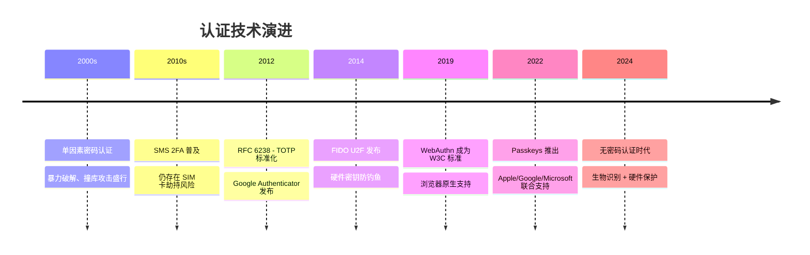

### 技术对比 ###

|  特性  |  TOTP  |   WebAuthn  |   Passkeys  |
| :-----------: | :----: | :----: | :----: |
|  标准  |  RFC 6238  |  W3C 标准  |   FIDO2 + WebAuthn  |
|  设备要求  |  手机/电脑  |  硬件密钥或设备  |   支持生物识别的设备  |
|  离线可用  |  是  |  部分支持  |   需要网络同步  |
|  防钓鱼  |  否  |  域名绑定  |   域名绑定  |
|  用户体验  |  良好  |  很好  |   优秀  |
|  安全性  |  高  |  很高  |   很高  |
|  兼容性  |  广泛支持  |  需要浏览器支持  |   新标准，逐步支持  |
|  成本  |  免费  |  需要硬件（$20-50）  |   免费（需支持设备）  |

### WebAuthn 工作原理 ###

```mermaid
sequenceDiagram
    autonumber
    actor User as 用户
    participant Browser as 浏览器
    participant Server as 服务器
    participant Auth as 生物识别/&#x3C;br>安全密钥

    rect rgb(200, 220, 250)
    Note over User,Auth: 注册阶段
    User->>Browser: 请求注册
    Browser->>Server: 开始注册
    Server->>Server: 生成挑战(Challenge)
    Server->>Browser: 返回挑战
    Browser->>Auth: 请求创建凭证
    Auth->>User: 要求生物识别
    User->>Auth: 指纹/面容验证
    Auth->>Auth: 生成公私钥对
    Auth->>Browser: 返回公钥 + 认证数据
    Browser->>Server: 提交公钥
    Server->>Server: 保存公钥（绑定域名）
    Server->>Browser: 注册成功
    end

    rect rgb(220, 250, 220)
    Note over User,Auth: 登录阶段
    User->>Browser: 请求登录
    Browser->>Server: 开始认证
    Server->>Server: 生成新挑战
    Server->>Browser: 返回挑战
    Browser->>Auth: 请求签名
    Auth->>User: 要求生物识别
    User->>Auth: 指纹/面容验证
    Auth->>Auth: 使用私钥签名挑战
    Auth->>Browser: 返回签名
    Browser->>Server: 提交签名
    Server->>Server: 使用公钥验证签名
    Server->>Browser: 登录成功
    end
```

WebAuthn 的牛逼之处：

- 防钓鱼：公钥绑定域名，钓鱼网站拿不到
- 无密码：可以完全不要密码了
- 硬件保护：私钥不离开设备
- 抗重放：每次挑战不同

### Passkeys 的未来 ###

Passkeys 基于 WebAuthn 和 FIDO2，用公钥加密 + 生物识别，还能跨设备同步（通过 iCloud/Google 账号）。

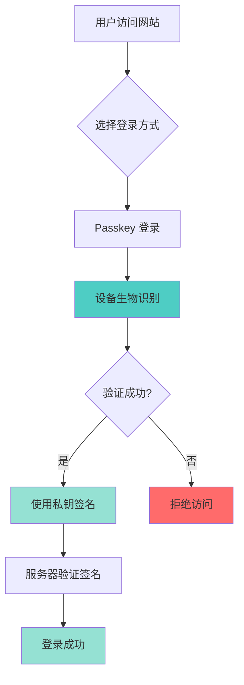

Passkeys 好在哪？

- 体验好：按个指纹就登录了
- 不怕换手机：云同步
- 绝对防钓鱼：密钥绑定域名
- 大厂支持：苹果、谷歌、微软都在推

## 总结 ##

研究完 TOTP，我的理解是：

**原理很简单**：

- 服务器和客户端各存一份密钥
- 都用当前时间算，结果一样
- 每 30 秒变一次
- 完全离线，不需要网络

**安全性不错**：

- 密码泄露了，没手机也没用
- 验证码很快过期，偷了也没用
- 比短信安全太多（不怕 SIM 卡劫持）
- 但还是怕钓鱼（这是弱点）

**使用建议**：

- 启用时：扫码 → 验证 → 保存恢复码（别忘了！）
- 登录时：密码 → 验证码 → 搞定
- 手机丢了：用恢复码登录，重新配置

### 选择建议 ###

```mermaid
graph TD
    A[需要 2FA?] -->|是| B{安全要求级别}
    B -->|基础| C[TOTP App&#x3C;br>Google Authenticator]
    B -->|中等| D[TOTP + 恢复码]
    B -->|高| E[硬件密钥&#x3C;br>YubiKey]
    B -->|最高| F[WebAuthn/Passkeys&#x3C;br>+ 硬件密钥]

    A -->|否| G[高风险&#x3C;br>强烈建议启用]

    style C fill:#95e1d3
    style D fill:#f9ca24
    style E fill:#6c5ce7
    style F fill:#00b894
    style G fill:#ff6b6b
```

|  场景  |  推荐方案  |   理由  |
| :-----------: | :----: | :----: |
|  个人开发者  |  TOTP App  |  免费、便捷、足够安全  |
|  企业账号  |  TOTP + 恢复码  |  多设备备份，防单点故障  |
|  金融/支付  |  硬件密钥  |  最高安全性，防钓鱼  |
|  高价值账号  |  WebAuthn + 硬件密钥  |  未来标准，绝对防钓鱼  |
|  临时测试  |  SMS 2FA  |  仅用于非关键场景  |

### 实用建议 ###

**启用 2FA 的话**：

- 选个靠谱的 App（我用 Authy，能云同步）
- 扫码后多备份几份（可以扫多个设备）
- 恢复码打印出来藏好
- 测试一下能不能用
- 团队账号记得通知其他人

**要开发 2FA 系统**：

- 随机数用 `crypto.getRandomValues()`，别用 `Math.random()`
- 服务器端密钥必须加密（AES-256-GCM）
- 时间窗口 ±1（容忍时钟误差）
- 速率限制必须有（5 分钟 5 次）
- Redis 记录用过的验证码
- 生成恢复码，哈希存储
- 记日志方便排查

**安全相关**：

- HTTPS 必须的，不然密钥传输裸奔
- 开 HSTS，防降级攻击
- CSP 头加上，防 XSS
- 监控时钟漂移
- 教育用户：验证码谁都不给

## 写在最后 ##

研究 TOTP 最大的收获是：看似简单的东西，设计起来还挺有讲究的。

下次扫二维码时，你会知道：

- 那是在传密钥
- 6 位数字是用时间算的
- 离线能用是因为不需要网络
- 虽不完美，但比纯密码强太多

WebAuthn 和 Passkeys 确实是趋势，防钓鱼、体验好。但 TOTP 兼容性好、门槛低，短期内还会继续用。

如果还没开 2FA，赶紧开吧。每天 30 亿次密码攻击，别成为那个倒霉蛋。
