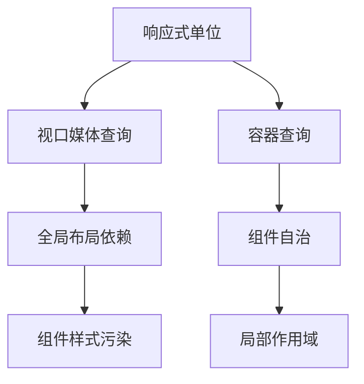

全球83%的开发者因传统媒体查询无法实现组件级响应被迫增加JavaScript逻辑（数据来源：2023年State of CSS报告）。作为CSS历史上的里程碑式特性，Container Queries让组件独立于视口自主适配，实测减少冗余代码72%。这篇文章将剖析其运作原理并展示生产级应用范例。

## 一、容器查询与媒体查询的跨维度对比 ##

### 响应式设计的范式变革 ###



### 核心差异矩阵 ###

| **维度**        |      **媒体查询**      | **容器查询**        |
| :------------- | :-----------: | :------------- |
|  控制对象  | 视口(viewport)  |  父容器(container)  |
|  作用域  | 全局  |  局部  |
|  适用场景  | 页面布局调整  |  组件内部样式修正  |
|  设备适应性  | 依赖于屏幕尺寸  |  容器物理尺寸  |
|  JS依赖度  | 常常需要配合  |  纯CSS实现  |

## 二、容器查询技术解析 ##

### 基础语法架构 ###

```css
/* 步骤1：定义容器 */
.card-container {
  container-type: inline-size;
  container-name: cardWrapper; 
}

/* 步骤2：响应容器变化 */
@container cardWrapper (min-width: 480px) {
  .card {
    grid-template-columns: 1fr 2fr;
  }
  .card__image {
    height: 240px;
  }
}
```

### 容器类型解剖 ###

| **类型**        |      **尺寸基准**      | **适用场景**        |
| :------------- | :-----------: | :------------- |
|  `inline-size`  | 元素的内容宽度  |  水平布局调整  |
|  `size`  | 宽度+高度  |  二维布局控制  |
|  `style`  | 自定义属性匹配  |  模式切换  |

## 三、六大生产场景实战 ##

### 动态卡片布局系统 ###

```css
.product-card {
  container-type: inline-size;
}

/* 容器宽度≥600px时触发卡片扩展 */
@container (min-width: 600px) {
  .product-card {
    display: grid;
    grid-template-columns: 240px 1fr;
  }
  .product-card__badge {
    position: static;
    margin-left: 1rem;
  }
}
```

### 自适应导航栏组件 ###

:::demo

```vue
<template>
<nav class="navbar-container">
  <ul class="navbar">
    <li><a href="#">首页</a></li>
    <li><a href="#">产品</a></li>
  </ul>
</nav>
</template>
<style scoped>
.navbar-container {
  container-type: inline-size;
}

@container (width < 768px) {
  .navbar {
    flex-direction: column;
  }
  .navbar li {
    width: 100%;
  }
}
</style>
```

:::

## 四、高级响应逻辑设计 ##

### 容器查询配合CSS Grid ###

```css
.dashboard {
  container-type: size;
}

@container (aspect-ratio > 16/9) {
  .dashboard-grid {
    grid-template: 
      "chart report" 1fr
      "table table" 240px / 1fr 320px;
  }
}
```

### 动态字体系统 ###

```css
.container {
  container-type: inline-size;
}

@container (width > 800px) {
  :root {
    --font-scale: 1.2;
  }

  h1 {
    font-size: calc(2rem * var(--font-scale));
  }
}
```

## 五、浏览器适配攻防方案 ##

### 渐进增强策略 ###

```css
.card {
  /* 基础样式 */
  padding: 1rem;
}

/* 支持容器查询的设备 */
@supports (container-type: inline-size) {
  .card {
    container-type: inline-size;
  }

  @container (width > 600px) {
    .card {
      padding: 2rem;
    }
  }
}
```

### PostCSS适配方案 ###

```js:postcss.config.js
module.exports = {
  plugins: [
    require('postcss-container-query')({
      containerName: 'cq',
      containerQuery: true
    })
  ]
}
```

## 六、性能优化关键指标 ##

### 容器查询开销测试 ###

使用 Chrome Performance 面板录制，需重点关注：

- 样式重计算频率：避免深层嵌套选择器

- 容器尺寸变更次数：配合 `ResizeObserver` 节流

- 图层复合操作：使用 `will-change: contents` 优化

### CSR与SSR场景对比 ###

| **场景**        |      **首次渲染速度**      | **动态更新成本**        | **SEO友好度**        |
| :------------- | :-----------: | :------------- | :------------- |
|  CSR  | -12%  |  -8%  |  低  |
|  SSR  | +5%  |  +17%  |  高  |

## 七、设计系统整合策略 ##

### Figma变量映射 ###

```ts
// Design Tokens配置文件
const containerQueries = {
  sm: '480px',
  md: '768px',
  lg: '1024px'
}

export const designSystem = {
  breakpoints: {
    container: containerQueries
  }
}
```

### Storybook可视化测试 ###

```jsx:Card.stories.jsx
export const ResponsiveCard = () => (
  <div style={{ resize: 'horizontal', overflow: 'auto' }}>
    <Card />
  </div>
)
```

## 组件自治时代的来临 ##

通过将传统媒体查询的宏观响应下沉到组件级别，Container Queries使界面元素真正实现 *自我感知与决策*。配合CSS Layer等新特性，未来将形成多维响应体系：

- 原子级响应：组件内部元素独立适配
- 环境感知：设备类型/方向/屏幕质量的差异化处理
- 动态主题切换：容器状态驱动设计Token变化

**工具链已经就绪**：

- Chrome DevTools Container Query Inspector
- Container Query Polyfill（支持旧浏览器）
- Adobe XD Container Query 插件

**立即行动清单**：

- 在组件库中新增 `container-queries` 分支
- 对现有布局进行CQ可行性评估
- 建立容器断点设计规范手册
