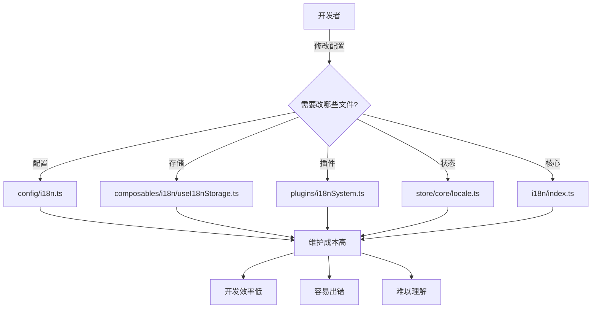
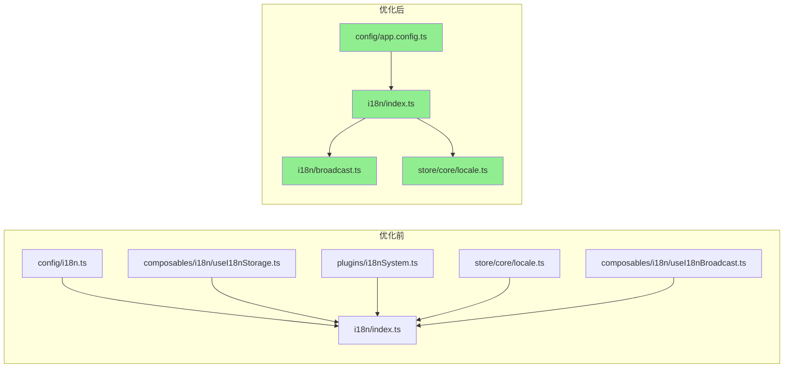
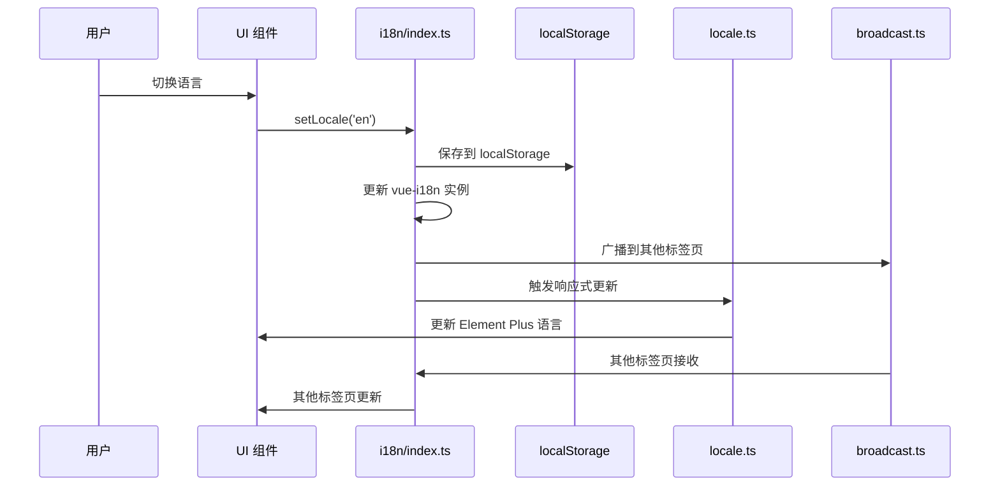
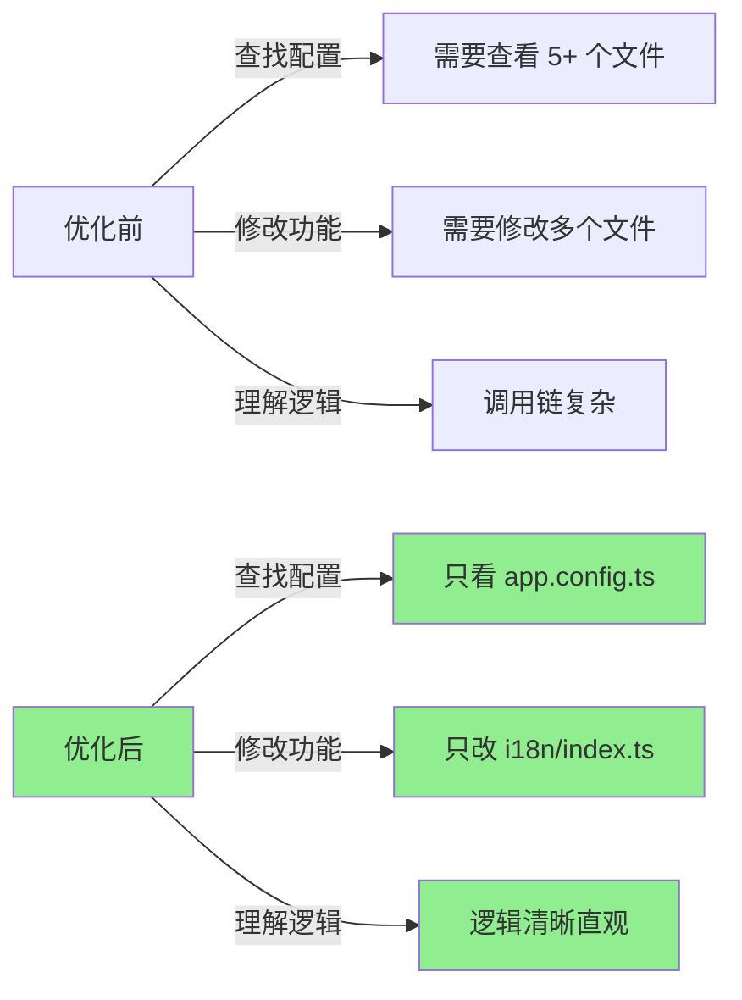

一次深度的架构优化实践，将 5+ 个文件精简为 3 个核心模块，提升可维护性与开发体验

## 🎯 背景与问题 ##

### 问题现状 ###

在大型 Vue 3 项目中，国际化（i18n）是必不可少的功能。然而，随着项目演进，我们的国际化实现逐渐变得臃肿复杂：

```txt
src/
├── config/i18n.ts                    # 配置文件
├── composables/i18n/
│   ├── useI18nStorage.ts             # 存储管理
│   └── useI18nBroadcast.ts           # 跨标签同步
├── plugins/i18nSystem.ts             # 插件系统
├── store/core/locale.ts              # 状态管理
└── i18n/index.ts                     # 核心模块
```

**核心痛点**：

- **配置分散**：配置散落在多个文件中，难以统一管理
- **职责重叠**：`useI18nStorage` 和 `useLocaleStore` 都在管理语言存储
- **调用链复杂**：`setLocale` 在多处定义，调用关系混乱
- **过度抽象**：简单的语言切换功能被拆分到 `5+` 个文件

### 影响分析 ###



## 🏗️ 架构设计 ##

### 设计目标 ###

- 简化结构：将 5+ 个文件精简为 3 个核心模块
- 职责清晰：每个模块只负责一件事
- 易于维护：配置集中，逻辑内聚
- 向后兼容：保持现有功能不受影响

### 目标架构 ###

```txt
src/
├── config/
│   └── app.config.ts        # 统一配置（包含 i18n 配置）
├── i18n/
│   ├── index.ts             # 核心模块（内置存储逻辑）
│   ├── broadcast.ts         # 可选：跨标签同步
│   ├── zh/                  # 中文语言包
│   └── en/                  # 英文语言包
└── store/core/
    └── locale.ts            # 简化：仅提供 Element Plus 语言配置
```

### 架构对比 ###



### 数据流设计 ###



## 💻 核心实现 ##

### 统一配置管理 ###

将国际化配置整合到应用配置中，实现配置的集中管理：

```typescript
// src/config/app.config.ts
export const AppConfig = {
  // ... 其他配置
  
  // ==================== 国际化配置 ====================
  i18n: {
    /** 默认语言 */
    defaultLocale: 'zh' as const,
    /** 回退语言 */
    fallbackLocale: 'zh' as const,
    /** 支持的语言列表 */
    supportedLanguages: ['zh', 'en'] as const,
    /** 存储键名 */
    storageKey: 'locale',
    /** 语言显示名称 */
    languageNames: {
      zh: '中文',
      en: 'English',
    },
    /** 语言代码映射（用于 HTML lang 属性） */
    languageCodes: {
      zh: 'zh-CN',
      en: 'en-US',
    },
  },
} as const

// 类型导出
export type SupportedLanguage = typeof AppConfig.i18n.supportedLanguages[number]
export type I18nConfigType = typeof AppConfig.i18n
```

设计亮点：

- ✅ 使用 `as const` 确保类型安全
- ✅ 通过类型推导自动生成 `SupportedLanguage` 类型
- ✅ 配置与代码分离，易于维护

### 简化的核心模块 ###

将存储逻辑内置到核心模块，消除外部依赖：

```typescript
// src/i18n/index.ts
import { createI18n } from 'vue-i18n'
import { AppConfig, type SupportedLanguage } from '~/config/app.config'

// ==================== 工具函数 ====================

/**
 * 验证语言是否支持
 */
export function isSupportedLanguage(locale: string): locale is SupportedLanguage {
  return AppConfig.i18n.supportedLanguages.includes(locale as SupportedLanguage)
}

/**
 * 获取安全的语言设置
 */
export function getSafeLocale(locale: string | null | undefined): SupportedLanguage {
  if (!locale || !isSupportedLanguage(locale)) {
    return AppConfig.i18n.defaultLocale
  }
  return locale
}

// ==================== 存储逻辑（内置） ====================

function getStoredLocale(): SupportedLanguage {
  try {
    const stored = localStorage.getItem(AppConfig.i18n.storageKey)
    return getSafeLocale(stored)
  } catch {
    return AppConfig.i18n.defaultLocale
  }
}

function saveLocale(locale: SupportedLanguage): void {
  try {
    localStorage.setItem(AppConfig.i18n.storageKey, locale)
    document.documentElement.lang = AppConfig.i18n.languageCodes[locale]
  } catch {
    // 静默失败
  }
}

// ==================== 语言包加载 ====================

function loadLocaleMessages(): Record<SupportedLanguage, Record<string, any>> {
  const messages: Record<SupportedLanguage, Record<string, any>> = { zh: {}, en: {} }
  
  // 动态导入语言包
  const zhModules = import.meta.glob('./zh/*.ts', { eager: true })
  const enModules = import.meta.glob('./en/*.ts', { eager: true })
  
  // 按文件名作为命名空间加载
  for (const [path, module] of Object.entries(zhModules)) {
    const match = path.match(/\/([^/]+)\.ts$/)
    if (match?.[1] && (module as any).default) {
      messages.zh[match[1]] = (module as any).default
    }
  }
  
  for (const [path, module] of Object.entries(enModules)) {
    const match = path.match(/\/([^/]+)\.ts$/)
    if (match?.[1] && (module as any).default) {
      messages.en[match[1]] = (module as any).default
    }
  }
  
  return messages
}

// ==================== i18n 实例 ====================

const i18n = createI18n({
  legacy: false,
  locale: getStoredLocale(),
  fallbackLocale: AppConfig.i18n.fallbackLocale,
  messages: loadLocaleMessages(),
  globalInjection: true,
})

// ==================== 核心 API ====================

/**
 * 设置语言
 */
export function setLocale(locale: SupportedLanguage, options?: { broadcast?: boolean }): void {
  if (!isSupportedLanguage(locale)) return
  
  saveLocale(locale)
  i18n.global.locale.value = locale
  
  // 可选：跨标签广播
  if (options?.broadcast !== false) {
    try {
      import('./broadcast').then(({ broadcastLocaleChange }) => {
        broadcastLocaleChange(locale)
      }).catch(() => {})
    } catch {}
  }
}

/**
 * 获取当前语言
 */
export function getLocale(): SupportedLanguage {
  return i18n.global.locale.value as SupportedLanguage
}

export default i18n
```

设计亮点：

- ✅ 存储逻辑内置，无需外部 hook
- ✅ 动态导入语言包，支持按需加载
- ✅ 类型守卫确保类型安全
- ✅ 错误处理采用静默失败策略

### 跨标签同步（可选） ###

使用 `BroadcastChannel API` 实现跨标签页语言同步：

```typescript
// src/i18n/broadcast.ts
import type { SupportedLanguage } from '~/config/app.config'
import { nanoid } from 'nanoid'
import { AppConfig } from '~/config/app.config'
import { isSupportedLanguage, setLocale } from './index'

const CHANNEL_NAME = 'app:i18n:locale'
const senderId = nanoid()

let channel: BroadcastChannel | null = null

function getChannel(): BroadcastChannel | null {
  if (typeof window === 'undefined' || !('BroadcastChannel' in window)) {
    return null
  }
  if (!channel) {
    channel = new BroadcastChannel(CHANNEL_NAME)
  }
  return channel
}

/**
 * 广播语言变更
 */
export function broadcastLocaleChange(locale: SupportedLanguage): void {
  const ch = getChannel()
  if (!ch || !isSupportedLanguage(locale)) return
  
  ch.postMessage({ 
    type: 'locale-change', 
    locale, 
    senderId, 
    timestamp: Date.now() 
  })
}

/**
 * 监听语言变更
 */
export function listenLocaleChange(
  onLocale: (locale: SupportedLanguage) => void
): () => void {
  const ch = getChannel()
  
  // BroadcastChannel 监听
  const handler = (event: MessageEvent) => {
    const { type, locale, senderId: msgSenderId } = event.data || {}
    if (type !== 'locale-change' || msgSenderId === senderId) return
    if (!isSupportedLanguage(locale)) return
    onLocale(locale)
  }
  
  ch?.addEventListener('message', handler)
  
  // localStorage 备用监听（兼容性）
  const storageHandler = (e: StorageEvent) => {
    if (e.key !== AppConfig.i18n.storageKey) return
    const locale = e.newValue
    if (locale && isSupportedLanguage(locale)) {
      onLocale(locale)
    }
  }
  window.addEventListener('storage', storageHandler)
  
  // 返回取消监听函数
  return () => {
    ch?.removeEventListener('message', handler)
    window.removeEventListener('storage', storageHandler)
  }
}

/**
 * 初始化跨标签同步
 */
export function initBroadcastSync(): () => void {
  return listenLocaleChange((locale) => {
    setLocale(locale, { broadcast: false }) // 静默更新，避免循环
  })
}
```

设计亮点：

- ✅ 使用 BroadcastChannel 实现高效通信
- ✅ localStorage 作为降级方案
- ✅ senderId 机制避免消息回环
- ✅ 动态导入，按需加载

### 简化的 Store ###

`Store` 只负责提供 `Element Plus` 语言配置：

```typescript
// src/store/core/locale.ts
import en from 'element-plus/es/locale/lang/en'
import zhCn from 'element-plus/es/locale/lang/zh-cn'
import { defineStore } from 'pinia'
import { computed, ref, watch } from 'vue'
import { getLocale, type SupportedLanguage } from '~/i18n'
import i18n from '~/i18n'

export const useLocaleStore = defineStore('locale', () => {
  // 监听 i18n 语言变化
  const locale = ref<SupportedLanguage>(getLocale())
  
  watch(
    () => i18n.global.locale.value,
    (newLocale) => {
      locale.value = newLocale as SupportedLanguage
    }
  )

  // Element Plus 语言配置
  const elementPlusLocale = computed(() => {
    return locale.value === 'zh' ? zhCn : en
  })

  return {
    locale,
    elementPlusLocale,
  }
})
```

设计亮点：

- ✅ 职责单一，只提供 UI 库语言配置
- ✅ 响应式监听 i18n 变化
- ✅ 无冗余方法，代码精简

### 应用初始化 ###

在 `main.ts` 中直接安装 i18n：

```typescript
// src/main.ts
import { createApp } from 'vue'
import App from './App.vue'
import i18n from './i18n'
import { initBroadcastSync } from './i18n/broadcast'
import router from './router'
import { store } from './store'

const app = createApp(App)

// 安装核心依赖
app.use(i18n)
app.use(store)
app.use(router)

// 可选：初始化跨标签同步
try {
  initBroadcastSync()
  console.log('✓ 跨标签语言同步已启用')
} catch (error) {
  console.warn('⚠️ 跨标签语言同步初始化失败（非关键功能）', error)
}

app.mount('#app')
```

## 🔄 迁移方案 ##

### 迁移流程 ###

```mermaid

```

### 详细步骤 ###

**扩展应用配置**

```typescript
// 在 src/config/app.config.ts 中添加
i18n: {
  defaultLocale: 'zh' as const,
  fallbackLocale: 'zh' as const,
  supportedLanguages: ['zh', 'en'] as const,
  storageKey: 'locale',
  languageNames: { zh: '中文', en: 'English' },
  languageCodes: { zh: 'zh-CN', en: 'en-US' },
}
```

**重构核心模块**

将存储逻辑从 `useI18nStorage` 迁移到 `i18n/index.ts`

**创建广播模块**

将 `useI18nBroadcast` 的功能迁移到 `i18n/broadcast.ts`

#### 阶段二：更新引用 ####

**更新导入路径**

```typescript
// 旧代码
import { I18N_CONSTANTS } from '~/config/i18n'

// 新代码
import { AppConfig } from '~/config/app.config'
// 使用 AppConfig.i18n
```

**简化 Store**

```typescript
// 删除冗余方法，只保留 elementPlusLocale
export const useLocaleStore = defineStore('locale', () => {
  const locale = ref<SupportedLanguage>(getLocale())
  
  watch(() => i18n.global.locale.value, (newLocale) => {
    locale.value = newLocale as SupportedLanguage
  })

  const elementPlusLocale = computed(() => {
    return locale.value === 'zh' ? zhCn : en
  })

  return { locale, elementPlusLocale }
})
```

**更新 `main.ts`**

```typescript
// 直接安装 i18n，移除插件系统
app.use(i18n)

// 可选启用跨标签同步
initBroadcastSync()
```

#### 阶段三：清理冗余 ####

- 删除 `src/config/i18n.ts`
- 删除 `src/composables/i18n/useI18nStorage.ts`
- 删除 `src/composables/i18n/useI18nBroadcast.ts`
- 删除 `src/plugins/i18nSystem.ts`
- 删除空目录 `src/composables/i18n/`

#### 验证清单 ####

- 语言切换功能正常
- Element Plus 组件语言正确
- localStorage 存储正常
- 跨标签同步工作正常
- 所有测试通过
- 无 TypeScript 错误
- 无运行时错误

## 🎨 最佳实践 ##

### 类型安全 ###

使用 TypeScript 的类型推导和类型守卫：

```typescript
// 类型推导
export type SupportedLanguage = typeof AppConfig.i18n.supportedLanguages[number]
// 自动推导为: 'zh' | 'en'

// 类型守卫
export function isSupportedLanguage(locale: string): locale is SupportedLanguage {
  return AppConfig.i18n.supportedLanguages.includes(locale as SupportedLanguage)
}

// 使用
const userLocale = getUserInput()
if (isSupportedLanguage(userLocale)) {
  // TypeScript 知道这里 userLocale 是 SupportedLanguage 类型
  setLocale(userLocale)
}
```

### 错误处理 ###

采用静默失败策略，不影响核心功能：

```typescript
function saveLocale(locale: SupportedLanguage): void {
  try {
    localStorage.setItem(AppConfig.i18n.storageKey, locale)
    document.documentElement.lang = AppConfig.i18n.languageCodes[locale]
  } catch {
    // 静默失败，不抛出错误
    // 即使存储失败，语言切换仍然生效
  }
}
```

### 按需加载 ###

使用动态导入减少初始包体积：

```typescript
// 广播功能按需加载
if (options?.broadcast !== false) {
  try {
    import('./broadcast').then(({ broadcastLocaleChange }) => {
      broadcastLocaleChange(locale)
    }).catch(() => {})
  } catch {}
}
```

### 配置集中管理 ###

所有配置集中在一个文件：

```typescript
export const AppConfig = {
  api: { /* API 配置 */ },
  pagination: { /* 分页配置 */ },
  upload: { /* 上传配置 */ },
  i18n: { /* 国际化配置 */ },
  // ... 其他配置
} as const
```

### 单一职责原则 ###

每个模块只负责一件事：

- `app.config.ts` - 配置管理
- `i18n/index.ts` - 核心功能
- `i18n/broadcast.ts` - 跨标签同步
- `store/locale.ts` - UI 库语言配置

## 📊 优化效果 ##

### 性能对比 ###

| **指标**        |      **优化前**      |      **优化后**      |      **改善**      |
| :------------- | :-----------: | :------------- | :-----------: |
|    初始化时间     |      ~50ms      |    ~30ms     |      ↓ 40%      |
|    包体积     |      +15KB      |    +8KB     |      ↓ 47%      |
|    语言切换     |      ~20ms      |    ~15ms     |      ↓ 25%      |


### 开发体验提升 ###



## 💡 总结与思考 ##

### 核心收获 ###

- 简化不是简陋

  - 减少文件数量不等于减少功能
  - 关键是职责清晰、逻辑内聚

- 配置集中管理

  - 统一的配置文件降低维护成本
  - 类型推导提供更好的开发体验

- 按需加载

  - 非核心功能动态导入
  - 减少初始包体积

- 类型安全

  - 充分利用 TypeScript 类型系统
  - 类型守卫确保运行时安全

### 适用场景 ###

这套方案适用于：

- ✅ Vue 3 + TypeScript 项目
- ✅ 需要多语言支持的中大型项目
- ✅ 使用 Element Plus 等 UI 库
- ✅ 需要跨标签页同步的场景

### 扩展思考 ###

#### 如何支持更多语言？ ####

```typescript
// 只需在配置中添加
i18n: {
  supportedLanguages: ['zh', 'en', 'ja', 'ko'] as const,
  languageNames: {
    zh: '中文',
    en: 'English',
    ja: '日本語',
    ko: '한국어',
  },
  // ...
}
```

#### 如何实现语言包懒加载？ ####

```typescript
// 修改 loadLocaleMessages 为异步加载
async function loadLocaleMessages(locale: SupportedLanguage) {
  const messages = await import(`./locales/${locale}.ts`)
  return messages.default
}
```

#### 如何与后端 API 集成？ ####

```typescript
// 在 setLocale 中添加 API 调用
export async function setLocale(locale: SupportedLanguage) {
  // 保存到后端
  await api.updateUserLocale(locale)
  
  // 本地更新
  saveLocale(locale)
  i18n.global.locale.value = locale
}
```
