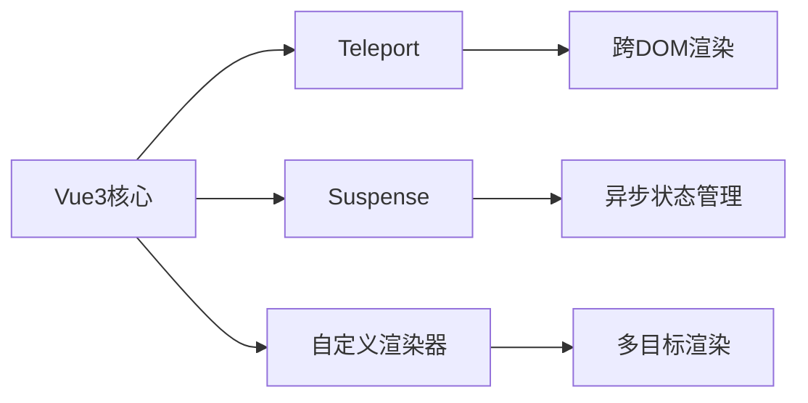

## 一、高级渲染特性全景概览 ##

Vue3引入了三大革命性渲染特性，彻底改变了开发体验：

| **特性**        |      **解决的问题**      |     **典型应用场景**      |
| :------------- | :-----------: | :-----------: |
|    Teleport     |      DOM结构受限      |      模态框、通知、菜单      |
|    Suspense     |      异步加载状态管理      |      数据加载、代码分割      |
|    自定义渲染器     |      渲染目标受限      |      Canvas、WebGL、PDF渲染      |



## 二、Teleport：突破DOM层级限制 ##

### 基础使用：创建全局模态框 ###

```vue
<template>
  <button @click="showModal = true">打开模态框</button>
  
  <!-- 将模态框渲染到body末尾 -->
  <Teleport to="body">
    <div v-if="showModal" class="modal">
      <div class="modal-content">
        <h2>标题</h2>
        <p>模态框内容...</p>
        <button @click="showModal = false">关闭</button>
      </div>
    </div>
  </Teleport>
</template>

<script setup>
import { ref } from 'vue';
const showModal = ref(false);
</script>

<style scoped>
.modal {
  position: fixed;
  top: 0;
  left: 0;
  right: 0;
  bottom: 0;
  background: rgba(0,0,0,0.5);
  display: flex;
  align-items: center;
  justify-content: center;
}

.modal-content {
  background: white;
  padding: 20px;
  border-radius: 8px;
}
</style>
```

### 进阶用法：多目标Teleport ###

```vue
<Teleport to="#notifications">
  <Notification :message="infoMsg" type="info" />
</Teleport>

<Teleport to="#notifications">
  <Notification :message="errorMsg" type="error" />
</Teleport>

<!-- index.html -->
<div id="app"></div>
<div id="notifications"></div> <!-- 通知容器 -->
```

### 动态目标与禁用功能 ###

```vue
<script setup>
import { ref, computed } from 'vue';

const target = ref('body');
const isMobile = ref(false);

// 根据条件动态改变目标
const teleportTarget = computed(() => {
  return isMobile.value ? '#mobile-container' : 'body';
});

// 禁用Teleport
const disableTeleport = ref(false);
</script>

<template>
  <Teleport :to="teleportTarget" :disabled="disableTeleport">
    <PopupContent />
  </Teleport>
</template>
```

## 三、Suspense：优雅处理异步依赖 ##

### 基础用法：异步组件加载 ###

```vue
<template>
  <Suspense>
    <template #default>
      <AsyncComponent />
    </template>
    <template #fallback>
      <div class="loading">加载中...</div>
    </template>
  </Suspense>
</template>

<script setup>
import { defineAsyncComponent } from 'vue';

const AsyncComponent = defineAsyncComponent(() => 
  import('./HeavyComponent.vue')
);
</script>
```

### 组合API中的异步 `setup` ###

```vue:UserProfile.vue
<script setup>
const { data: user } = await fetch('/api/user').then(r => r.json());
</script>

<template>
  <div>
    <h2>{{ user.name }}</h2>
    <p>{{ user.email }}</p>
  </div>
</template>

<!-- 父组件 -->
<template>
  <Suspense>
    <UserProfile />
    
    <template #fallback>
      <SkeletonLoader />
    </template>
  </Suspense>
</template>
```

### 高级模式：嵌套Suspense与错误处理 ###

```vue
<template>
  <Suspense @pending="onPending" @resolve="onResolve" @fallback="onFallback">
    <template #default>
      <MainContent />
      
      <!-- 嵌套Suspense -->
      <Suspense>
        <SecondaryContent />
        <template #fallback>
          <SmallLoader />
        </template>
      </Suspense>
    </template>
    
    <template #fallback>
      <GlobalLoader />
    </template>
  </Suspense>
</template>

<script setup>
import { useErrorHandling } from './errorHandling';

const { handleAsyncError } = useErrorHandling();

function onPending() {
  console.log('异步依赖开始加载');
}

function onResolve() {
  console.log('所有异步依赖加载完成');
}

function onFallback() {
  console.log('显示fallback内容');
}

// 错误处理
onErrorCaptured((err) => {
  handleAsyncError(err);
  return true; // 阻止错误继续向上传播
});
</script>
```

## 四、自定义渲染器开发实战 ##

### 创建Canvas渲染器 ###

```javascript
// canvas-renderer.js
import { createRenderer } from 'vue';

const { createApp: baseCreateApp } = createRenderer({
  createElement(type) {
    // 创建Canvas元素
    if (type === 'circle') {
      return { type: 'circle' };
    }
    return { type };
  },
  
  insert(el, parent) {
    // 将元素添加到Canvas
    if (parent && parent.context) {
      parent.context.addChild(el);
    }
  },
  
  setElementText(node, text) {
    // Canvas文本处理
    if (node.type === 'text') {
      node.text = text;
    }
  },
  
  createText(text) {
    return { type: 'text', text };
  },
  
  patchProp(el, key, prevValue, nextValue) {
    // 更新Canvas元素属性
    el[key] = nextValue;
  },
  
  // 其他必要钩子...
});

export function createApp(rootComponent) {
  const app = baseCreateApp(rootComponent);
  
  return {
    mount(canvas) {
      // 创建Canvas上下文
      const ctx = canvas.getContext('2d');
      app._context = ctx;
      
      // 创建根节点
      const root = { type: 'root', context: ctx, children: [] };
      app.mount(root);
      
      // 渲染循环
      function render() {
        ctx.clearRect(0, 0, canvas.width, canvas.height);
        renderNode(root);
        requestAnimationFrame(render);
      }
      render();
    }
  };
}

function renderNode(node) {
  if (node.type === 'circle') {
    const { x, y, radius, fill } = node;
    ctx.beginPath();
    ctx.arc(x, y, radius, 0, Math.PI * 2);
    ctx.fillStyle = fill;
    ctx.fill();
  }
  // 其他元素渲染...
}
```

### 在Vue中使用Canvas渲染器 ###

```vue
<!-- App.vue -->
<script>
export default {
  setup() {
    const circles = ref([
      { x: 50, y: 50, radius: 20, fill: '#f00' },
      { x: 150, y: 80, radius: 30, fill: '#0f0' }
    ]);
    
    const addCircle = () => {
      circles.value.push({
        x: Math.random() * 300,
        y: Math.random() * 150,
        radius: 10 + Math.random() * 20,
        fill: `#${Math.floor(Math.random()*16777215).toString(16)}`
      });
    };
    
    return { circles, addCircle };
  }
}
</script>

<template>
  <circle 
    v-for="(circle, index) in circles" 
    :key="index"
    :x="circle.x"
    :y="circle.y"
    :radius="circle.radius"
    :fill="circle.fill"
  />
  <button @click="addCircle">添加圆形</button>
</template>
```

```js:main.js
import { createApp } from './canvas-renderer';
import App from './App.vue';

const canvas = document.getElementById('app');
const app = createApp(App);
app.mount(canvas);
```

## 五、渲染函数与JSX高级技巧 ##

### 动态组件工厂 ###

```jsx
// ComponentFactory.jsx
export default {
  setup() {
    const components = {
      text: (props) => <span>{props.content}</span>,
      image: (props) => ,
      button: (props) => <button onClick={props.action}>{props.label}</button>
    };
    
    const config = ref([
      { type: 'text', content: '欢迎使用JSX' },
      { type: 'image', src: '/logo.png', alt: 'Logo' },
      { type: 'button', label: '点击我', action: () => alert('点击!') }
    ]);
    
    return () => (
      <div>
        {config.value.map(item => {
          const Comp = components[item.type];
          return Comp ? <Comp {...item} /> : null;
        })}
      </div>
    );
  }
}
```

### 高阶组件实现 ###

```javascript
// withLogging.js
import { h } from 'vue';

export default function withLogging(WrappedComponent) {
  return {
    name: `WithLogging(${WrappedComponent.name})`,
    setup(props) {
      console.log(`组件 ${WrappedComponent.name} 已创建`);
      
      return () => {
        console.log(`渲染 ${WrappedComponent.name}`);
        return h(WrappedComponent, props);
      };
    }
  };
}

// 使用
import Button from './Button.vue';
const ButtonWithLogging = withLogging(Button);
```

## 六、实战案例：PDF文档渲染器 ##

### PDF渲染器实现 ###

```javascript
// pdf-renderer.js
import { createRenderer } from 'vue';
import { PDFDocument, StandardFonts } from 'pdf-lib';

export function createPDFRenderer() {
  const { createApp: baseCreateApp } = createRenderer({
    // 实现PDF渲染接口...
  });
  
  return function createApp(rootComponent) {
    const app = baseCreateApp(rootComponent);
    
    return {
      async mount() {
        const pdfDoc = await PDFDocument.create();
        const timesRomanFont = await pdfDoc.embedFont(StandardFonts.TimesRoman);
        
        app._context = {
          pdfDoc,
          currentPage: null,
          fonts: { timesRoman: timesRomanFont }
        };
        
        const root = { type: 'root', children: [] };
        await app.mount(root);
        
        // 生成PDF
        const pdfBytes = await pdfDoc.save();
        return pdfBytes;
      }
    };
  };
}
```

### PDF文档组件 ###

```vue:PDFDocument.vue
<script>
export default {
  props: ['title', 'author'],
  setup(props, { slots }) {
    return () => (
      <document>
        <page size="A4">
          <text x={50} y={800} font="timesRoman" size={24}>
            {props.title}
          </text>
          <text x={50} y={780} font="timesRoman" size={12}>
            作者: {props.author}
          </text>
          {slots.default?.()}
        </page>
      </document>
    );
  }
}
</script>
```

```vue:Invoice.vue
<script>
import PDFDocument from './PDFDocument.vue';

export default {
  setup() {
    const invoiceData = reactive({
      number: 'INV-2023-001',
      date: new Date().toLocaleDateString(),
      items: [
        { name: '服务费', price: 1000 },
        { name: '材料费', price: 500 }
      ]
    });
    
    return () => (
      <PDFDocument title="发票" author="ABC公司">
        <text x={50} y={700}>发票号: {invoiceData.number}</text>
        <text x={50} y={680}>日期: {invoiceData.date}</text>
        
        <text x={50} y={650}>项目明细:</text>
        {invoiceData.items.map((item, index) => (
          <text x={70} y={630 - index * 20}>
            {item.name}: ¥{item.price}
          </text>
        ))}
      </PDFDocument>
    );
  }
}
</script>
```

```js:main.js
import { createPDFRenderer } from './pdf-renderer';
import Invoice from './Invoice.vue';

const createApp = createPDFRenderer();
const app = createApp(Invoice);

const generatePDF = async () => {
  const pdfBytes = await app.mount();
  const blob = new Blob([pdfBytes], { type: 'application/pdf' });
  saveAs(blob, 'invoice.pdf');
};

generatePDF();
```

## 七、高级特性最佳实践 ##

### Teleport 使用准则 ###

- 使用场景：模态框、通知、上下文菜单
- 位置选择：优先选择 `body` 或专用容器
- 响应式控制：在移动端可能需要禁用或改变目标
- 可访问性：确保焦点管理和键盘导航

### Suspense 最佳实践 ###

- 粒度控制：在组件级别使用，避免全局 `Suspense`
- 错误处理：必须配合 `onErrorCaptured` 处理异步错误
- 骨架屏：使用有意义的加载状态，避免简单加载动画
- 超时处理：设置合理的 `timeout` 避免无限加载

### 自定义渲染器注意事项 ###

- 性能优化：实现批处理更新
- 生命周期：正确处理组件的创建和销毁
- 事件系统：实现自定义事件处理
- 测试策略：针对渲染器编写专用测试

通过本文，我们深入探索了Vue3的三大高级渲染特性：

- `Teleport`：突破DOM层级限制，实现灵活组件放置
- `Suspense`：优雅处理异步依赖，提升用户体验
- 自定义渲染器：拓展Vue能力边界，实现多平台渲染

这些特性让Vue3的应用场景从传统Web扩展到更广阔的领域，如：

- 移动端原生渲染（Weex/NativeScript）
- 桌面应用（Electron）
- 复杂可视化（Canvas/WebGL）
- 文档生成（PDF/Word）

## defineProps 与 defineEmits 深度解析 ##

还在为 Vue 组件间的类型安全头疼吗？每次传参都像在玩“猜猜我是谁”，运行时错误频出，调试起来让人抓狂？别担心，今天我要带你彻底掌握 Vue 3 中的 `defineProps` 和 `defineEmits`，这对 TypeScript 的完美搭档将彻底改变你的开发体验。

读完本文，你将获得一套完整的类型安全组件通信方案，从基础用法到高级技巧，再到实战中的最佳实践。更重要的是，你会发现自己写出的代码更加健壮、可维护，再也不用担心那些烦人的类型错误了。

### 为什么需要 defineProps 和 defineEmits？ ###

在 Vue 2 时代，我们在组件中定义 props 和 emits 时，类型检查往往不够完善。虽然可以用 `PropTypes`，但和 TypeScript 的配合总是差那么点意思。很多时候，我们只能在运行时才发现传递了错误类型的数据，这时候已经为时已晚。

想象一下这样的场景：你写了一个按钮组件，期望接收一个 `size` 属性，只能是 `'small'`、`'medium'` 或 `'large'` 中的一个。但在使用时，同事传了个 `'big'`，TypeScript 编译时没报错，直到用户点击时才发现样式不对劲。这种问题在大型项目中尤其致命。

Vue 3 的 Composition API 与 TypeScript 的深度集成解决了这个问题。`defineProps` 和 `defineEmits` 这两个编译器宏，让组件的输入输出都有了完整的类型推导和检查。

### defineProps：让组件输入类型安全 ###

`defineProps` 用于定义组件的 `props`，它最大的优势就是与 TypeScript 的无缝集成。我们来看几种不同的用法。

基础用法很简单，但功能强大：

```typescript
// 定义一个按钮组件
// 使用类型字面量定义 props
const props = defineProps<{
  size: 'small' | 'medium' | 'large'
  disabled?: boolean
  loading?: boolean
}>()

// 在模板中直接使用
// 现在有了完整的类型提示和检查
```

这种写法的好处是，当你使用这个组件时，TypeScript 会严格检查传入的 `size` 值。如果你试图传递 `'big'`，编译器会立即报错，而不是等到运行时。

但有时候我们需要给 `props` 设置默认值，这时候可以这样写：

```typescript
// 使用 withDefaults 辅助函数设置默认值
interface ButtonProps {
  size: 'small' | 'medium' | 'large'
  disabled?: boolean
  loading?: boolean
}

const props = withDefaults(defineProps<ButtonProps>(), {
  size: 'medium',
  disabled: false,
  loading: false
})
```

`withDefaults` 帮我们处理了默认值，同时保持了类型的完整性。这样即使父组件没有传递这些 `props`，子组件也能正常工作。

还有一种情况，我们需要混合使用运行时声明和类型声明：

```typescript
// 运行时声明与类型声明结合
const props = defineProps({
  // 运行时声明
  label: {
    type: String,
    required: true
  },
  // 类型声明
  count: {
    type: Number,
    default: 0
  }
})

// 定义类型
interface Props {
  label: string
  count?: number
}

// 这种写法在某些复杂场景下很有用
```

这种混合写法在处理一些动态 `prop` 时特别有用，比如需要根据某些条件决定 `prop` 的类型。

### defineEmits：组件输出的类型守卫 ###

`defineEmits` 用于定义组件发出的事件，同样提供了完整的类型支持。这确保了我们在触发事件时传递正确的数据，也让使用者知道应该如何处理这些事件。

先看一个基础示例：

```typescript
// 定义表单组件的事件
// 使用类型字面量定义 emits
const emit = defineEmits<{
  // submit 事件携带一个表单数据对象
  submit: [formData: FormData]
  // cancel 事件不携带数据
  cancel: []
  // input 事件携带字符串值
  input: [value: string]
}>()

// 在方法中触发事件
function handleSubmit() {
  const formData = gatherFormData()
  // TypeScript 会检查 formData 是否符合 FormData 类型
  emit('submit', formData)
}

function handleCancel() {
  // 不传递参数，符合类型定义
  emit('cancel')
}
```

这种写法的优势在于，当你在组件内调用 `emit` 时，TypeScript 会严格检查参数的类型和数量。如果你试图 `emit('submit')` 而不传递 `formData`，或者传递错误类型的参数，编译器会立即提醒你。

对于更复杂的场景，我们可以使用接口来定义事件：

```typescript
// 使用接口定义事件类型
interface FormEvents {
  submit: (data: FormData) => void
  cancel: () => void
  validate: (isValid: boolean, errors: string[]) => void
}

const emit = defineEmits<FormEvents>()

// 在验证方法中触发复杂事件
function performValidation() {
  const isValid = validateForm()
  const errors = getValidationErrors()
  
  // TypeScript 确保我们传递正确的参数类型
  emit('validate', isValid, errors)
}
```

这种接口方式的定义让代码更加清晰，特别是当事件类型比较复杂时。你可以把所有的事件定义放在一个地方，便于维护和理解。

### 实战技巧：高级用法与最佳实践 ###

在实际项目中，我们经常会遇到一些复杂场景，这时候就需要一些高级技巧来应对。

一个常见的需求是，我们需要基于已有的 `props` 类型来定义事件。比如在一个可搜索的表格组件中：

```typescript
// 定义表格组件的 props 和 emits
interface TableProps {
  data: any[]
  columns: Column[]
  searchable?: boolean
  pagination?: boolean
}

const props = defineProps<TableProps>()

// 事件定义基于 props 的某些特性
const emit = defineEmits<{
  // 只有当 searchable 为 true 时才会有 search 事件
  search: [query: string]
  // 只有当 pagination 为 true 时才会有 pageChange 事件
  pageChange: [page: number]
  // 始终存在的选择事件
  rowSelect: [row: any]
}>()

// 在搜索方法中条件性触发事件
function handleSearch(query: string) {
  if (props.searchable) {
    // TypeScript 知道这个事件是有效的
    emit('search', query)
  }
}
```

另一个有用的技巧是泛型组件的定义。当我们想要创建可重用的通用组件时：

```typescript
// 定义一个通用的列表组件
interface ListProps<T> {
  items: T[]
  keyField: keyof T
  renderItem?: (item: T) => any
}

// 使用泛型定义 props
function defineListProps<T>() {
  return defineProps<ListProps<T>>()
}

// 在具体组件中使用
interface User {
  id: number
  name: string
  email: string
}

// 为 User 类型特化组件
const props = defineListProps<User>()
```

这种泛型组件的方式在组件库开发中特别有用，它提供了极大的灵活性，同时保持了类型安全。

在处理异步操作时，我们通常需要定义加载状态和错误处理：

```typescript
// 异步操作组件的完整类型定义
interface AsyncProps {
  data?: any
  loading?: boolean
  error?: string | null
}

interface AsyncEmits {
  retry: []
  reload: [force?: boolean]
  success: [data: any]
}

const props = defineProps<AsyncProps>()
const emit = defineEmits<AsyncEmits>()

// 在异步操作完成时触发事件
async function fetchData() {
  try {
    const result = await api.fetch()
    emit('success', result)
  } catch (error) {
    // 错误处理
  }
}
```

### 常见陷阱与解决方案 ###

虽然 `defineProps` 和 `defineEmits` 很强大，但在使用过程中还是有一些需要注意的地方。

一个常见的错误是试图在运行时访问类型信息：

```typescript
// 错误的做法：试图在运行时使用类型
const props = defineProps<{
  count: number
}>()

// 这在运行时是 undefined，因为类型信息在编译时就被移除了
console.log(props.count.type) // undefined

// 正确的做法：使用运行时声明
const props = defineProps({
  count: {
    type: Number,
    required: true
  }
})
```

另一个陷阱是关于可选参数的处理：

```typescript
// 定义带有可选参数的事件
const emit = defineEmits<{
  // 第二个参数是可选的
  search: [query: string, options?: SearchOptions]
}>()

// 使用时要注意参数顺序
function handleSearch(query: string) {
  // 可以只传递必填参数
  emit('search', query)
}

function handleAdvancedSearch(query: string, options: SearchOptions) {
  // 也可以传递所有参数
  emit('search', query, options)
}
```

在处理复杂的嵌套对象时，类型定义可能会变得冗长：

```typescript
// 使用类型别名简化复杂类型
type UserProfile = {
  personal: {
    name: string
    age: number
  }
  preferences: {
    theme: 'light' | 'dark'
    language: string
  }
}

const props = defineProps<{
  profile: UserProfile
}>()

// 这样既保持了类型安全，又让代码更清晰
```

### 与其它 Composition API 的配合 ###

`defineProps` 和 `defineEmits` 可以很好地与 Vue 3 的其它 Composition API 配合使用，创造出强大的组合逻辑。

比如与 `provide`/`inject` 的配合：

```typescript
// 父组件提供数据
const props = defineProps<{
  theme: 'light' | 'dark'
  locale: string
}>()

// 基于 props 提供全局配置
provide('appConfig', {
  theme: props.theme,
  locale: props.locale
})

// 子组件注入并使用
const config = inject('appConfig')
```

与 `watch` 和 `computed` 的配合：

```typescript
const props = defineProps<{
  items: any[]
  filter: string
}>()

const emit = defineEmits<{
  filtered: [results: any[]]
}>()

// 监听 props 变化并触发事件
watch(() => props.filter, (newFilter) => {
  const filtered = filterItems(props.items, newFilter)
  emit('filtered', filtered)
})

// 基于 props 计算衍生数据
const sortedItems = computed(() => {
  return props.items.sort(sortFunction)
})
```

### 性能优化与最佳实践 ###

虽然类型安全很重要，但我们也要注意性能影响。以下是一些优化建议：

对于大型对象，考虑使用浅层响应式：

```typescript
const props = defineProps<{
  // 对于大型配置对象，使用 shallowRef 避免不必要的响应式开销
  config: AppConfig
  // 对于频繁变化的数据，保持深度响应式
  items: any[]
}>()
```

合理使用 `PropType` 进行复杂类型验证：

```typescript
import type { PropType } from 'vue'

const props = defineProps({
  // 使用 PropType 进行运行时类型验证
  complexData: {
    type: Object as PropType<ComplexData>,
    required: true,
    validator: (value: ComplexData) => {
      return validateComplexData(value)
    }
  }
})
```

### 总结 ###

`defineProps` 和 `defineEmits` 是 Vue 3 与 TypeScript 完美结合的代表作。它们不仅提供了编译时的类型安全，还大大提升了开发体验。通过本文的学习，你应该能够在组件中正确定义类型安全的 `props` 和 `emits`，充分利用 TypeScript 的类型推导能力，处理各种复杂场景下的类型需求，避免常见的陷阱和错误。

## Vue 中的 inheritAttrs 属性：深入理解与实战应用 ##

在 Vue.js 中，`inheritAttrs` 是一个组件选项，它控制父组件绑定的非 `props` 属性是否可以被子组件继承。默认情况下，`inheritAttrs` 的值为 `true`，这意味着子组件会自动继承父组件绑定的非 `props` 属性。然而，在某些情况下，我们可能需要对这些属性进行更精细的控制，这就是 `inheritAttrs` 发挥作用的地方。

### 一、inheritAttrs 的默认行为 ###

默认情况下，`inheritAttrs` 的值为 `true`，Vue 会将父组件绑定的非 `props` 属性应用到子组件的根元素上。例如：

```vue
<template>
  <ChildComponent class="parent-class" id="parent-id" />
</template>

<script>
import ChildComponent from './ChildComponent.vue';

export default {
  components: {
    ChildComponent
  }
};
</script>
```

```vue
<template>
  <div>
    <p>这是子组件的内容</p>
  </div>
</template>
```

在这个例子中，`class="parent-class"` 和 `id="parent-id"` 会被自动应用到子组件的根元素 `<div>` 上，最终渲染的 HTML 结构如下：

```html
<div class="parent-class" id="parent-id">
  <p>这是子组件的内容</p>
</div>
```

这种行为在大多数情况下是符合预期的，但有时候我们可能希望对这些属性进行更精细的控制。

### 二、设置 inheritAttrs 为 false ###

当我们希望子组件不继承父组件的非 `props` 属性时，可以在子组件中将 `inheritAttrs` 设置为 `false`。例如：

```vue
<!-- 子组件 ChildComponent.vue -->
<template>
  <div>
    <p>这是子组件的内容</p>
  </div>
</template>

<script>
export default {
  inheritAttrs: false
};
</script>
```

此时，父组件绑定的非 `props` 属性将不会被应用到子组件的根元素上。在上面的例子中，最终渲染的 HTML 结构如下：

```html
<div>
  <p>这是子组件的内容</p>
</div>
```

可以看到，`class="parent-class"` 和 `id="parent-id"` 没有被应用到子组件的根元素上。

### 三、使用 $attrs 访问非 props 属性 ###

即使将 `inheritAttrs` 设置为 `false`，我们仍然可以通过 `$attrs` 访问父组件绑定的非 `props` 属性。`$attrs` 是一个对象，包含了父组件绑定的非 `props` 属性。例如：

```vue:ChildComponent.vue
<template>
  <div :class="$attrs.class" :id="$attrs.id">
    <p>这是子组件的内容</p>
  </div>
</template>

<script>
export default {
  inheritAttrs: false
};
</script>
```

此时，虽然 `inheritAttrs` 为 `false`，但通过 `$attrs`，我们仍然可以将父组件绑定的 `class` 和 `id` 应用到子组件的根元素上。最终渲染的 HTML 结构如下：

```html
<div class="parent-class" id="parent-id">
  <p>这是子组件的内容</p>
</div>
```

### 四、实战应用 ###

#### 自定义表单组件 ####

在开发自定义表单组件时，我们通常希望组件能够接收父组件传递的 class、style 等属性，但又不希望这些属性被自动应用到组件的根元素上。通过设置 `inheritAttrs` 为 `false`，我们可以更灵活地控制这些属性的使用。例如：

```vue
<template>
  <div :class="$attrs.class" :style="$attrs.style">
    <input v-model="value" />
  </div>
</template>

<script>
export default {
  inheritAttrs: false,
  props: {
    value: {
      type: String,
      default: ''
    }
  }
};
</script>
```

这样，父组件传递的 `class` 和 `style` 属性将被应用到自定义表单组件的根元素上，而不会被自动应用到 `<input>` 元素上。

#### 高阶组件 ####

在开发高阶组件时，我们可能需要将父组件传递的属性转发给子组件。通过设置 `inheritAttrs` 为 `false`，我们可以更灵活地控制属性的转发。例如：

```vue
<template>
  <div :class="$attrs.class">
    <slot />
  </div>
</template>

<script>
export default {
  inheritAttrs: false
};
</script>
```

此时，父组件传递的 `class` 属性将被应用到高阶组件的根元素上，而不会被自动应用到子组件上。我们可以通过 `$attrs` 将这些属性转发给子组件。

### 五、总结 ###

`inheritAttrs` 是 Vue.js 中一个非常实用的组件选项，它允许我们对父组件绑定的非 `props` 属性进行更精细的控制。通过合理使用 `inheritAttrs`，我们可以开发出更加灵活和可复用的组件。在实际开发中，我们可以结合 `$attrs` 来实现更复杂的属性转发逻辑，从而满足各种业务需求。

## Vue 3 定时器清理的最佳实践 ##

在 Vue 3 中，清理定时器的最佳位置取决于组件的使用场景和定时器的用途。我将设计一个直观的示例来演示不同生命周期钩子中定时器的清理方式。

### 设计思路 ###

- 展示不同生命周期钩子中定时器的创建和清理
- 提供可视化界面展示定时器状态
- 允许用户手动创建和清理定时器
- 演示组件卸载时的自动清理

### 功能说明 ###

这个示例演示了在 Vue 3 中管理定时器的最佳实践：

**定时器创建和清理**：

- 在 `onMounted` 钩子中创建定时器
- 在 `onUnmounted` 钩子中清理定时器（必须）
- 也可在 `onBeforeUnmount` 中清理

**生命周期演示**：

- 通过切换子组件显示/隐藏来演示组件卸载时的定时器清理
- 在控制台输出生命周期事件

**手动管理**：

- 提供手动创建和清理定时器的功能
- 显示所有活动定时器的状态和进度

**最佳实践代码示例**：

- 展示在 Vue 3 组件中正确管理定时器的代码模式

这个示例强调了在 Vue 3 中，无论定时器是在哪个生命周期创建的，都必须在 `onUnmounted` 或 `onBeforeUnmount` 中清理，以防止内存泄漏。

### 最终实现代码 ###

```html
<!DOCTYPE html>
<html lang="zh-CN">
<head>
    <meta charset="UTF-8">
    <meta name="viewport" content="width=device-width, initial-scale=1.0">
    <title>Vue 3 定时器生命周期管理</title>
    <script src="https://unpkg.com/vue@3/dist/vue.global.js"></script>
    <style>
        * {
            margin: 0;
            padding: 0;
            box-sizing: border-box;
            font-family: 'Segoe UI', Tahoma, Geneva, Verdana, sans-serif;
        }
        
        body {
            background: linear-gradient(135deg, #1a2a6c, #b21f1f, #fdbb2d);
            color: #fff;
            min-height: 100vh;
            padding: 20px;
        }
        
        .container {
            max-width: 1200px;
            margin: 0 auto;
            background: rgba(0, 0, 0, 0.7);
            border-radius: 15px;
            padding: 30px;
            box-shadow: 0 10px 30px rgba(0, 0, 0, 0.5);
        }
        
        header {
            text-align: center;
            margin-bottom: 30px;
        }
        
        h1 {
            font-size: 2.5rem;
            margin-bottom: 10px;
            text-shadow: 2px 2px 4px rgba(0, 0, 0, 0.5);
        }
        
        .subtitle {
            font-size: 1.2rem;
            opacity: 0.8;
            margin-bottom: 20px;
        }
        
        .content {
            display: grid;
            grid-template-columns: 1fr 1fr;
            gap: 30px;
        }
        
        @media (max-width: 768px) {
            .content {
                grid-template-columns: 1fr;
            }
        }
        
        .card {
            background: rgba(255, 255, 255, 0.1);
            border-radius: 10px;
            padding: 20px;
            margin-bottom: 20px;
        }
        
        .card h2 {
            margin-bottom: 15px;
            color: #fdbb2d;
            border-bottom: 1px solid rgba(255, 255, 255, 0.2);
            padding-bottom: 10px;
        }
        
        .timer-controls {
            display: flex;
            flex-wrap: wrap;
            gap: 15px;
            margin-bottom: 20px;
        }
        
        .control-group {
            flex: 1;
            min-width: 200px;
        }
        
        label {
            display: block;
            margin-bottom: 8px;
            font-weight: 600;
        }
        
        input, select, button {
            width: 100%;
            padding: 12px;
            border: none;
            border-radius: 5px;
            font-size: 1rem;
        }
        
        input, select {
            background: rgba(255, 255, 255, 0.9);
        }
        
        button {
            background: #4CAF50;
            color: white;
            cursor: pointer;
            transition: all 0.3s;
            font-weight: bold;
            margin-top: 10px;
        }
        
        button:hover {
            background: #45a049;
            transform: translateY(-2px);
            box-shadow: 0 5px 15px rgba(0, 0, 0, 0.3);
        }
        
        .danger-btn {
            background: #f44336;
        }
        
        .danger-btn:hover {
            background: #d32f2f;
        }
        
        .warning-btn {
            background: #ff9800;
        }
        
        .warning-btn:hover {
            background: #f57c00;
        }
        
        .timer-list {
            margin-top: 20px;
        }
        
        .timer-item {
            display: flex;
            justify-content: space-between;
            align-items: center;
            background: rgba(255, 255, 255, 0.1);
            padding: 15px;
            margin-bottom: 10px;
            border-radius: 8px;
            transition: all 0.3s;
        }
        
        .timer-item:hover {
            background: rgba(255, 255, 255, 0.15);
            transform: translateX(5px);
        }
        
        .timer-info {
            flex: 1;
        }
        
        .timer-id {
            font-weight: bold;
            font-size: 1.1rem;
        }
        
        .timer-details {
            display: flex;
            gap: 15px;
            margin-top: 5px;
            font-size: 0.9rem;
            opacity: 0.8;
        }
        
        .timer-actions {
            display: flex;
            gap: 10px;
        }
        
        .timer-actions button {
            margin: 0;
            padding: 8px 15px;
            width: auto;
        }
        
        .status {
            padding: 5px 10px;
            border-radius: 20px;
            font-size: 0.8rem;
            font-weight: bold;
        }
        
        .status-active {
            background: #4CAF50;
        }
        
        .status-cleared {
            background: #f44336;
        }
        
        .lifecycle-info {
            margin-top: 30px;
            padding: 20px;
            background: rgba(0, 0, 0, 0.3);
            border-radius: 10px;
        }
        
        .lifecycle-info h3 {
            margin-bottom: 15px;
            color: #fdbb2d;
        }
        
        .lifecycle-info ul {
            padding-left: 20px;
            margin-bottom: 15px;
        }
        
        .lifecycle-info li {
            margin-bottom: 8px;
            line-height: 1.5;
        }
        
        .highlight {
            color: #fdbb2d;
            font-weight: bold;
        }
        
        .component-demo {
            margin-top: 30px;
            padding: 20px;
            border: 2px dashed rgba(255, 255, 255, 0.3);
            border-radius: 10px;
        }
        
        .toggle-btn {
            background: #2196F3;
            width: 100%;
        }
        
        .toggle-btn:hover {
            background: #0b7dda;
        }
        
        .stats {
            display: flex;
            justify-content: space-between;
            margin-top: 30px;
            padding-top: 20px;
            border-top: 1px solid rgba(255, 255, 255, 0.2);
        }
        
        .stat-box {
            text-align: center;
            flex: 1;
        }
        
        .stat-value {
            font-size: 2rem;
            font-weight: bold;
            margin-bottom: 5px;
        }
        
        .stat-label {
            font-size: 0.9rem;
            opacity: 0.8;
        }
        
        .empty-state {
            text-align: center;
            padding: 40px;
            opacity: 0.7;
        }
        
        .pulse {
            animation: pulse 2s infinite;
        }
        
        @keyframes pulse {
            0% { transform: scale(1); }
            50% { transform: scale(1.05); }
            100% { transform: scale(1); }
        }
        
        .progress-bar {
            height: 5px;
            background: rgba(255, 255, 255, 0.2);
            border-radius: 5px;
            margin-top: 10px;
            overflow: hidden;
        }
        
        .progress {
            height: 100%;
            background: #4CAF50;
            width: 0%;
            transition: width 0.5s;
        }
        
        .code-block {
            background: rgba(0, 0, 0, 0.5);
            padding: 15px;
            border-radius: 5px;
            font-family: monospace;
            margin: 15px 0;
            overflow-x: auto;
        }
    </style>
</head>
<body>
    <div id="app">
        <div class="container">
            <header>
                <h1>Vue 3 定时器生命周期管理</h1>
                <p class="subtitle">演示在不同生命周期钩子中创建和清理定时器的最佳实践</p>
            </header>
            
            <div class="content">
                <div>
                    <div class="card">
                        <h2>定时器控制面板</h2>
                        <div class="timer-controls">
                            <div class="control-group">
                                <label for="timerType">定时器类型</label>
                                <select id="timerType" v-model="timerType">
                                    <option value="timeout">setTimeout (一次性)</option>
                                    <option value="interval">setInterval (重复)</option>
                                </select>
                            </div>
                            
                            <div class="control-group">
                                <label for="timerDuration">持续时间 (毫秒)</label>
                                <input type="number" id="timerDuration" v-model.number="timerDuration" min="100" max="100000">
                            </div>
                            
                            <div class="control-group">
                                <label for="timerMessage">定时器消息</label>
                                <input type="text" id="timerMessage" v-model="timerMessage" placeholder="输入定时器执行时显示的消息">
                            </div>
                        </div>
                        
                        <button @click="addTimer" class="pulse">添加定时器</button>
                        <button @click="clearAllTimers" class="danger-btn">清理所有定时器</button>
                    </div>
                    
                    <div class="card">
                        <h2>活动定时器 ({{ activeTimersCount }})</h2>
                        <div class="timer-list">
                            <div v-if="activeTimers.length === 0" class="empty-state">
                                暂无活动定时器
                            </div>
                            <div v-else v-for="timer in activeTimers" :key="timer.id" class="timer-item">
                                <div class="timer-info">
                                    <div class="timer-id">定时器 #{{ timer.id }}</div>
                                    <div class="timer-details">
                                        <span>类型: {{ timer.type === 'timeout' ? 'setTimeout' : 'setInterval' }}</span>
                                        <span>持续时间: {{ timer.duration }}ms</span>
                                        <span>消息: "{{ timer.message }}"</span>
                                    </div>
                                    <div class="progress-bar">
                                        <div class="progress" :style="{ width: timer.progress + '%' }"></div>
                                    </div>
                                </div>
                                <div class="timer-actions">
                                    <span class="status status-active">活动</span>
                                    <button class="danger-btn" @click="clearTimer(timer.id)">清理</button>
                                </div>
                            </div>
                        </div>
                    </div>
                </div>
                
                <div>
                    <div class="card">
                        <h2>生命周期演示</h2>
                        <div class="lifecycle-info">
                            <h3>Vue 3 定时器清理最佳实践</h3>
                            <ul>
                                <li><span class="highlight">onMounted</span> - 在组件挂载后创建定时器</li>
                                <li><span class="highlight">onUnmounted</span> - 在组件卸载前清理定时器（必须）</li>
                                <li><span class="highlight">onBeforeUnmount</span> - 在组件卸载前清理定时器的替代方案</li>
                                <li><span class="highlight">watchEffect</span> - 响应式地创建和清理定时器</li>
                                <li><span class="highlight">手动清理</span> - 在需要时手动清理特定定时器</li>
                            </ul>
                            
                            <div class="code-block">
// 最佳实践示例<br>
import { onMounted, onUnmounted, ref } from 'vue'<br><br>

const timerId = ref(null)<br><br>

onMounted(() => {<br>
&nbsp;&nbsp;// 创建定时器<br>
&nbsp;&nbsp;timerId.value = setInterval(() => {<br>
&nbsp;&nbsp;&nbsp;&nbsp;// 定时器逻辑<br>
&nbsp;&nbsp;}, 1000)<br>
})<br><br>

onUnmounted(() => {<br>
&nbsp;&nbsp;// 清理定时器<br>
&nbsp;&nbsp;if (timerId.value) {<br>
&nbsp;&nbsp;&nbsp;&nbsp;clearInterval(timerId.value)<br>
&nbsp;&nbsp;}<br>
})
                            </div>
                        </div>
                        
                        <div class="component-demo">
                            <h3>组件卸载演示</h3>
                            <p>点击按钮切换子组件显示/隐藏，观察控制台输出</p>
                            <button class="toggle-btn" @click="toggleComponent">
                                {{ showChildComponent ? '隐藏' : '显示' }}子组件
                            </button>
                            
                            <div v-if="showChildComponent">
                                <child-component></child-component>
                            </div>
                        </div>
                    </div>
                    
                    <div class="stats">
                        <div class="stat-box">
                            <div class="stat-value">{{ activeTimersCount }}</div>
                            <div class="stat-label">活动定时器</div>
                        </div>
                        <div class="stat-box">
                            <div class="stat-value">{{ clearedTimersCount }}</div>
                            <div class="stat-label">已清理定时器</div>
                        </div>
                        <div class="stat-box">
                            <div class="stat-value">{{ totalTimersCount }}</div>
                            <div class="stat-label">总定时器</div>
                        </div>
                    </div>
                </div>
            </div>
        </div>
    </div>

    <script>
        const { createApp, ref, onMounted, onUnmounted, computed, onBeforeUnmount } = Vue;
        
        // 子组件演示生命周期
        const ChildComponent = {
            template: `
                <div class="card" style="margin-top: 15px;">
                    <h3>子组件生命周期演示</h3>
                    <p>组件状态: <span style="color: #4CAF50;">已挂载</span></p>
                    <p>定时器ID: {{ timerId || '无' }}</p>
                    <p>计时: {{ count }} 秒</p>
                    <button class="warning-btn" @click="stopTimer">停止定时器</button>
                </div>
            `,
            setup() {
                const timerId = ref(null);
                const count = ref(0);
                
                // 在 onMounted 中创建定时器
                onMounted(() => {
                    console.log('子组件已挂载，创建定时器');
                    timerId.value = setInterval(() => {
                        count.value++;
                        console.log(`子组件定时器执行: ${count.value} 秒`);
                    }, 1000);
                });
                
                // 在 onUnmounted 中清理定时器 (最佳实践)
                onUnmounted(() => {
                    console.log('子组件即将卸载，清理定时器');
                    if (timerId.value) {
                        clearInterval(timerId.value);
                        console.log('定时器已清理');
                    }
                });
                
                // 也可以在 onBeforeUnmount 中清理
                onBeforeUnmount(() => {
                    console.log('onBeforeUnmount: 清理定时器');
                });
                
                const stopTimer = () => {
                    if (timerId.value) {
                        clearInterval(timerId.value);
                        timerId.value = null;
                        console.log('手动停止定时器');
                    }
                };
                
                return {
                    timerId,
                    count,
                    stopTimer
                };
            }
        };
        
        const app = createApp({
            components: {
                ChildComponent
            },
            setup() {
                // 定时器数据
                const timers = ref([]);
                const timerIdCounter = ref(1);
                const timerType = ref('timeout');
                const timerDuration = ref(3000);
                const timerMessage = ref('定时器已触发！');
                const showChildComponent = ref(false);
                
                // 计算属性
                const activeTimers = computed(() => 
                    timers.value.filter(t => t.status === 'active')
                );
                
                const activeTimersCount = computed(() => activeTimers.value.length);
                
                const clearedTimersCount = computed(() => 
                    timers.value.filter(t => t.status === 'cleared').length
                );
                
                const totalTimersCount = computed(() => timers.value.length);
                
                // 添加定时器
                const addTimer = () => {
                    if (timerDuration.value < 100) {
                        alert('请输入有效的持续时间（至少100毫秒）');
                        return;
                    }
                    
                    const timerId = timerIdCounter.value++;
                    let timerRef;
                    
                    // 创建定时器对象
                    const timerObj = {
                        id: timerId,
                        type: timerType.value,
                        duration: timerDuration.value,
                        message: timerMessage.value,
                        status: 'active',
                        startTime: Date.now(),
                        progress: 0
                    };
                    
                    // 根据类型设置定时器
                    if (timerType.value === 'timeout') {
                        timerRef = setTimeout(() => {
                            handleTimerCompletion(timerId);
                            console.log(`定时器 #${timerId}: ${timerMessage.value}`);
                        }, timerDuration.value);
                        
                        timerObj.ref = timerRef;
                    } else {
                        timerRef = setInterval(() => {
                            console.log(`定时器 #${timerId}: ${timerMessage.value}`);
                        }, timerDuration.value);
                        
                        timerObj.ref = timerRef;
                    }
                    
                    timers.value.push(timerObj);
                    updateProgressBars();
                };
                
                // 处理定时器完成
                const handleTimerCompletion = (timerId) => {
                    const timer = timers.value.find(t => t.id === timerId);
                    if (timer) {
                        timer.status = 'completed';
                    }
                };
                
                // 清理单个定时器
                const clearTimer = (timerId) => {
                    const timer = timers.value.find(t => t.id === timerId);
                    if (timer && timer.status === 'active') {
                        if (timer.type === 'timeout') {
                            clearTimeout(timer.ref);
                        } else {
                            clearInterval(timer.ref);
                        }
                        timer.status = 'cleared';
                        console.log(`定时器 #${timerId} 已清理`);
                    }
                };
                
                // 清理所有定时器
                const clearAllTimers = () => {
                    if (timers.value.length === 0) {
                        alert('没有活动定时器可清理');
                        return;
                    }
                    
                    if (confirm(`确定要清理所有 ${timers.value.length} 个定时器吗？`)) {
                        timers.value.forEach(timer => {
                            if (timer.status === 'active') {
                                if (timer.type === 'timeout') {
                                    clearTimeout(timer.ref);
                                } else {
                                    clearInterval(timer.ref);
                                }
                                timer.status = 'cleared';
                            }
                        });
                        
                        console.log('所有定时器已清理');
                    }
                };
                
                // 更新进度条
                const updateProgressBars = () => {
                    const activeTimersList = timers.value.filter(t => t.status === 'active');
                    
                    activeTimersList.forEach(timer => {
                        const elapsed = Date.now() - timer.startTime;
                        const progress = Math.min(100, (elapsed / timer.duration) * 100);
                        timer.progress = progress;
                        
                        // 如果是interval类型，进度条会循环
                        if (timer.type === 'interval' && progress >= 100) {
                            timer.startTime = Date.now();
                        }
                    });
                };
                
                // 切换子组件显示
                const toggleComponent = () => {
                    showChildComponent.value = !showChildComponent.value;
                };
                
                // 设置一个定时器来更新进度条
                onMounted(() => {
                    setInterval(updateProgressBars, 100);
                });
                
                return {
                    timers,
                    timerType,
                    timerDuration,
                    timerMessage,
                    showChildComponent,
                    activeTimers,
                    activeTimersCount,
                    clearedTimersCount,
                    totalTimersCount,
                    addTimer,
                    clearTimer,
                    clearAllTimers,
                    toggleComponent
                };
            }
        });
        
        app.mount('#app');
    </script>
</body>
</html>
```

## Vue3 定义组件的 4 种方式 ##

### 背景 ###

Vue 作为一款流行的前端框架，提供了多种方式来定义组件，包括单文件组件 (SFC)、渲染函数 (Render Functions)、JSX/TSX 以及函数式组件 (Functional Components)。不同的方式适用于不同的场景，开发者在选择时需要考虑可读性、性能和灵活性等因素。本文将对这四种方式进行详细对比，帮助你找到最适合自己项目的方案。

### SFC (Single-File Component) ###

单文件组件，以 `*.vue` 作为文件扩展名，是 Vue 官方推荐的方式。

特点:

- 模板和逻辑分离，结构清晰，官方推荐。
- 支持 Vue 内置功能，如 `script setup`、CSS 作用域、单文件组件热更新等。
- 适合大多数 Vue 项目，代码组织更直观。

```vue:Test.vue
<script setup lang="ts">
import { ref } from "vue";
defineProps<{
  text: string;
}>();

const num = ref(0);
</script>
<template>
  <div class="aaa">
    {{ text }}
    <div @click="num++">{{ num }}</div>
  </div>
</template>
```

优点:

- 代码结构清晰，符合 MVVM 模式，模板部分易读。
- `script setup` 提供更简洁的语法，减少模板和逻辑之间的代码切换。
- 具有良好的工具链支持 (Vue 官方生态、Vite、Vue Loader 等)。

缺点:

- 需要额外的构建工具 (如 Vite 或 Webpack) 进行编译，不能直接在浏览器运行。
- 在某些场景下 (如动态创建组件) 可能不如渲染函数灵活。

### 渲染函数 (Render Functions) ###

Vue 提供了一个 `h()` 函数用于创建虚拟节点 vnodes。

特点:

- 需要引入 `h` 和 `defineComponent` 函数，没有模板语法。
- 适合动态组件或 UI 库开发。

`h` 是一个 helper 函数，用于创建虚拟 DOM（VNode）。它是 `createElement` 的别名，类似于 React 里的 `React.createElement`。

```ts
import { defineComponent, h, ref } from "vue";

export default defineComponent({
  props: {
    text: {
      type: String,
      required: true
    }
  },
  setup(props) {
    const num = ref(0);
    return () =>
      h("div", { class: "aaa" }, [props.text, h("div", { onClick: () => num.value++ }, num.value)]);
  }
});
```

优点:

- 代码更灵活，适用于需要动态控制 `VNode` 结构的场景，如表单渲染器、可拖拽组件等。
- 体积更小，不需要 `SFC` 解析器。

缺点:

- 代码可读性较低，没有模板语法，编写复杂组件时维护成本较高。
- 开发体验不如 `SFC` 友好，特别是对于不熟悉 JSX/TSX 的开发者。

### JSX / TSX ###

JSX 和 TSX 是 React 的语法扩展，Vue 也支持这种语法。

特点:

- 语法类似 React，允许在 Vue 组件中使用 JSX/TSX 语法。
- 适用于更灵活的逻辑处理，且无需引入 `h()` 函数。

tsconfig.json 需要配置:

```json:tsconfig.json
{
  "compilerOptions": {
    "jsx": "preserve",
    "jsxImportSource": "vue"
    // ...
  }
}
```

`vite.config.ts` 需要配置 `vueJsx` 插件:

```ts:vite.config.ts
import { defineConfig } from "vite";
import vue from "@vitejs/plugin-vue";
import vueJsx from "@vitejs/plugin-vue-jsx";

export default defineConfig({
  plugins: [vue(), vueJsx()]
  // ...
});
```

Test.tsx 代码如下:

```tsx:Test.tsx
import { defineComponent, ref } from "vue";

export default defineComponent({
  props: {
    text: {
      type: String,
      required: true
    }
  },
  setup(props) {
    const num = ref(0);
    return () => (
      <div class="aaa">
        {props.text}
        <div onClick={() => num.value++}>{num.value}</div>
      </div>
    );
  }
});
```

优点:

- 代码灵活，适用于复杂 UI 组件开发。
- 在 TypeScript 项目中拥有更好的类型推导支持。

缺点:

- 需要额外的 `@vitejs/plugin-vue-jsx` 插件支持，并在 `tsconfig.json` 配置 `JSX` 选项。
- 代码风格不符合 Vue 传统的模板语法，可能不适合所有团队。

### 函数式组件 (Functional Components) — 不推荐 ###

特点:

- 组件本质上是一个纯函数，`ref` 只能定义在组件外部，属于全局共享状态。
- 适用于只依赖 `props` 进行渲染，且无状态 (stateless) 的组件。

Test.tsx 代码如下:

```ts:Test.tsx
import { ref, type FunctionalComponent } from "vue";

interface Props {
  text: string;
}

const num = ref(0);
export const TestFunctionalCom: FunctionalComponent<Props> = (props) => {
  return (
    <div class="aaa">
      {props.text}
      <div onClick={() => num.value++}>{num.value}</div>
    </div>
  );
};
```

优点:

- 代码简单，适用于简单的展示组件 (如按钮、图标等)。
- 没有响应式数据追踪开销，性能更高。

缺点:

- 不能在组件内部使用 `ref` 或 `reactive`，状态必须是全局变量或 `props` 传入。
- 全局 `ref` 可能导致多个组件实例共享状态，引发意外的状态同步问题。

### 总结 ###

|    方式     |      适用场景      |    优点     |      缺点      |
| :------------- | :-----------: | :------------- | :-----------: |
|    SFC (单文件组件)     |      适用于大多数 Vue 项目      |    结构清晰、官方推荐、支持 `script setup`     |      需要构建工具      |
|    渲染函数 (Render Functions)     |      适用于动态组件/UI 库      |    代码更灵活，适用于动态 `VNode` 结构     |      可读性较低，维护成本高      |
|    JSX / TSX     |      适用于复杂逻辑组件      |    代码灵活，可与 TypeScript 结合     |      需要额外配置，不符合 Vue 传统语法      |
|    函数式组件     |      适用于无状态小组件      |    代码简单、性能较高     |      不能使用 `ref`，全局状态共享有风险      |

在实际开发中，*SFC 是最推荐的方式*，大多数 Vue 组件都可以用 `SFC` 实现。对于动态 `VNode` 结构，可以考虑 *渲染函数* 或 *JSX/TSX*。*函数式组件* 在 Vue 3 中的使用场景很少，通常不推荐使用。

## Vue3 的defineAsyncComponent不宜过度使用 ##

### 概述 ###

随着前端应用的复杂度不断提升，*代码分割（Code Splitting）* 和*懒加载（Lazy Loading）* 成为优化应用性能的重要手段。Vue3 提供了 `defineAsyncComponent` API，允许开发者按需加载组件，减少初始包体积，提升页面加载速度。

然而，*过度使用 `defineAsyncComponent` 可能导致应用性能不升反降*，甚至增加代码维护成本。以下将探讨：

- `defineAsyncComponent` 的核心原理
- 适用场景与潜在问题
- 最佳实践与优化策略

### 什么是 defineAsyncComponent？ ###

`defineAsyncComponent 是` Vue3 提供的一个高阶函数，用于定义异步组件。它的核心作用是：

- *延迟加载组件代码*，减少初始 JavaScript 包体积
- 提供 *Loading 状态* 和 *Error 处理* 能力

#### 基本用法 ####

```javascript
import { defineAsyncComponent } from 'vue';

const AsyncComponent = defineAsyncComponent(() =>
  import('./MyComponent.vue')
);
```

这样，MyComponent 不会在初始加载时被包含在主包中，而是按需加载。

#### 高级配置 ####

`defineAsyncComponent` 支持更精细的控制：


```javascript
const AsyncComponent = defineAsyncComponent({
  loader: () => import('./MyComponent.vue'), // 动态导入
  loadingComponent: LoadingSpinner, // 加载中的占位组件
  errorComponent: ErrorDisplay,     // 加载失败时的错误组件
  delay: 200,                      // 延迟显示 loading 组件（避免闪烁）
  timeout: 3000,                   // 超时时间（默认无限）
  suspensible: true,               // 是否支持 `<Suspense>`（SSR 相关）
});
```

### 为什么不宜过度使用 defineAsyncComponent？ ###

虽然异步组件能优化首屏加载，但滥用可能导致以下问题：

#### 网络请求瀑布流（Waterfall） ####

- 每个异步组件都会触发独立的网络请求

- 如果多个组件同时懒加载，可能导致请求竞争，反而拖慢渲染

示例问题：

```javascript
// 不推荐：多个小组件分别异步加载，导致多次请求
const ComponentA = defineAsyncComponent(() => import('./A.vue'));
const ComponentB = defineAsyncComponent(() => import('./B.vue'));
const ComponentC = defineAsyncComponent(() => import('./C.vue'));
```

#### 调试复杂度增加 ####

- 异步组件的生命周期与同步组件不同，调试时难以追踪加载状态
- 错误处理需要额外逻辑（如 `onError` 回调）

#### 打包生成额外chunck ####

无论异步组件大小，和路由懒加载一样，会额外生成 `chunk`，过度使用，会导致打包后的代码过度分散，碎片化严重

#### 组件通信更复杂 ####

- 异步加载的组件可能尚未渲染完成，但父组件已经触发 `mounted`
- 需要通过 `v-if` 或 `Suspense` 控制渲染顺序

### 适用场景：何时应该使用 defineAsyncComponent？ ###

#### 路由级懒加载（最佳实践） ####

结合 Vue Router 的 `import()` 动态导入，实现路由级代码分割：

```javascript
const routes = [
  {
    path: '/dashboard',
    component: defineAsyncComponent(() => import('./Dashboard.vue')),
  },
];
```

#### 大型弹窗/模态框 ####

例如，只在用户点击时才加载的复杂弹窗：

```javascript
const Modal = defineAsyncComponent(() => import('./HeavyModal.vue'));
```

#### 折叠内容（非首屏关键组件） ####

如 Tab 切换内容、长页面的下半部分：

```javascript
const ExpensiveSection = defineAsyncComponent({
  loader: () => import('./ExpensiveSection.vue'),
  loadingComponent: LoadingSkeleton, // 骨架屏提升体验
});
```

### 最佳实践：如何优化异步组件？ ###

#### 合理分组，减少请求次数 ####

避免过度拆分，将相关组件打包成一个 `chunk`：

```javascript
// 推荐：将多个小组件合并成一个异步加载模块
const AdminComponents = defineAsyncComponent(() =>
  import('./admin/*.vue') // 使用 Vite 的 Glob 导入
);
```

#### 预加载策略 ####

在浏览器空闲时预加载可能需要的组件：

```javascript
// 使用 `preload`（适用于已知后续会使用的组件）
const preloadComponent = () => import('./FutureComponent.vue');

// 在合适的时机触发预加载（如 hover 时）
button.addEventListener('mouseover', preloadComponent);
```

#### 结合 `<Suspense>` 管理加载状态 ####

Vue3 的 `<Suspense>` 可以统一管理异步组件的加载状态：

```vue
<template>
  <Suspense>
    <template #default>
      <AsyncComponent />
    </template>
    <template #fallback>
      <LoadingSpinner />
    </template>
  </Suspense>
</template>
```

#### 错误处理与重试机制 ####

```javascript
const AsyncComponent = defineAsyncComponent({
  loader: () => import('./NetworkHeavyComponent.vue'),
  errorComponent: ErrorRetry,
  onError(error, retry) {
    // 可加入日志上报
    console.error('加载失败:', error);
    // 提供重试按钮
    retry();
  },
});
```

### 总结 ###

`defineAsyncComponent` 是 Vue3 强大的性能优化工具，但必须谨慎使用：

- ✅ 适合：路由级懒加载、大型弹窗、非关键内容，真正的大型组件
- ❌ 避免：过度拆分小组件、滥用导致请求瀑布流

优化方向：

- 合理分组，减少 HTTP 请求
- 预加载关键组件
- 结合 `<Suspense>` 提升用户体验
- 完善的错误处理机制
- 减少非必要组件使用

总之不要为了优化而优化！！
