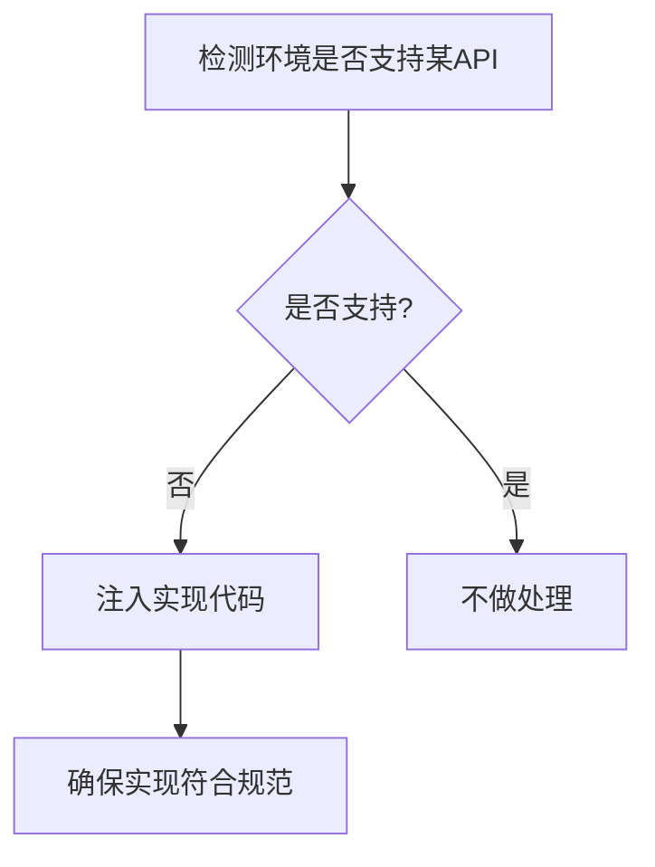

## 一、core-js 是什么？ ##

`core-js` 是一个模块化、标准化的 JavaScript 标准库 **polyfill** 解决方案，它为不同 JavaScript 环境提供了符合 ECMAScript 规范的底层 API 实现。简单来说，· 让开发者能够在旧版浏览器或环境中使用最新的 JavaScript 特性。

### 核心定位 ###

`core-js` 主要解决三个核心问题：

- 填补浏览器/环境缺失的标准 API

- 实现最新的 ECMAScript 提案特性

- 提供模块化的按需加载能力

## 二、为什么需要 core-js？ ##

### JavaScript 的版本碎片化问题 ###

ECMAScript 标准每年都在更新，但用户使用的浏览器/Node.js 版本却各不相同：

|    环境     |     ES 支持情况       |
| :------------- | :-----------: |
|   Chrome 最新版  |   支持大部分 ES2022 特性    |
|  IE 11   |   仅支持 ES5    |
|  Node.js 14  |   支持到 ES2020 大部分特性   |
|  移动端浏览器  |  支持程度差异巨大  |

### 兼容性需求场景 ###

- **企业级应用**：需要支持旧版浏览器（如 IE）

- **跨平台开发**：确保不同环境行为一致

- **使用新特性**：在旧环境中提前使用新语法

- **提案阶段特性**：使用尚未被广泛实现的提案

## 三、core-js 的核心功能 ##

### 完整的 Polyfill 覆盖 ###

`core-js` 提供了几乎所有 ECMAScript 标准的 polyfill：

- **ES5**：`Array.prototype.forEach`, `Object.keys` 等

- **ES6+**：`Promise`, `Map`, `Set`, `Array.from` 等

- **ES 提案**：如 `Array.prototype.flatten`（阶段3）

- **Web 标准**：`URL`, `setImmediate` 等

### 模块化结构 ###

`core-js` 采用精细的模块化设计，支持按需引入：

```javascript
// 全量引入（不推荐）
import 'core-js';

// 按需引入
import 'core-js/features/array/flat';
import 'core-js/features/promise';

// 仅引入稳定特性
import 'core-js/stable';
```

### 版本策略 ###

`core-js` 采用严格的版本控制：

- **v2.x**：旧版架构
- **v3.x**：完全重写，支持更多特性
- **v4.x（开发中）**：进一步优化和特性更新

## 四、技术实现深度解析 ##

### Polyfill 实现原理 ###

`core-js` 的核心工作流程：



### 关键实现技术 ###

- **原型链扩展**：如 `Array.prototype.includes`
- **全局对象修补**：如 `Promise`, `Symbol`
- **特性检测**：避免覆盖原生实现
- **规范兼容性**：严格遵循 TC39 规范

### 代码示例：Promise Polyfill ###

以下是简化版的 `core-js` Promise 实现逻辑：

```javascript
if (!('Promise' in window)) {
  function Promise(executor) {
    // 状态管理
    this.state = 'pending';
    this.value = undefined;
    
    // 回调队列
    this.onFulfilledCallbacks = [];
    this.onRejectedCallbacks = [];

    const resolve = (value) => {
      if (this.state === 'pending') {
        this.state = 'fulfilled';
        this.value = value;
        this.onFulfilledCallbacks.forEach(fn => fn());
      }
    };

    const reject = (reason) => {
      if (this.state === 'pending') {
        this.state = 'rejected';
        this.value = reason;
        this.onRejectedCallbacks.forEach(fn => fn());
      }
    };

    try {
      executor(resolve, reject);
    } catch (err) {
      reject(err);
    }
  }

  Promise.prototype.then = function(onFulfilled, onRejected) {
    // then 方法实现...
  };

  window.Promise = Promise;
}
```

## 五、实际应用场景 ##

### 与 Babel 配合使用 ###

`core-js` 通常与 Babel 一起使用，形成完整的转译方案：

```javascript:babel.config.js
module.exports = {
  presets: [
    ['@babel/preset-env', {
      useBuiltIns: 'usage', // 按需加载
      corejs: 3 // 指定 core-js 版本
    }]
  ]
};
```

### 不同引入方式对比 ###

|    方式     |     优点       |    缺点       |
| :------------- | :-----------: | :-----------: |
|   全量引入   |    简单    |  体积大   |
|  按需引入   |  体积最优  |  配置复杂   |
|  CDN 引入   | 无需构建  |   依赖网络   |

### 体积优化策略 ###

- **按需加载**：配合 `@babel/preset-env` 的 `useBuiltIns: 'usage'`

- **目标环境配置**：设置准确的 browserslist

- **代码分割**：结合构建工具分割 polyfill

## 六、高级应用技巧 ##

### 自定义 Polyfill ###

当 `core-js` 未提供某些 `polyfill` 时，可以自行扩展：

```javascript
// 自定义 Array.prototype.unique
if (!Array.prototype.unique) {
  Array.prototype.unique = function() {
    return [...new Set(this)];
  };
}
```

### 服务端渲染(SSR)适配 ###

在 Node.js 环境中使用：

```javascript
// 在服务端入口文件顶部引入
if (typeof window === 'undefined') {
  global.window = {};
  require('core-js/stable');
  require('regenerator-runtime/runtime');
}
```

### 动态 Polyfill 服务 ###

根据用户浏览器动态返回需要的 polyfill：

```html
<script src="https://polyfill.io/v3/polyfill.min.js?features=es2015%2Ces2016%2Ces2017"></script>
```

## 七、性能优化方案 ##

### 现代模式构建 ###

使用 `babel-preset-env` 的现代模式：

```javascript:babel.config.js
module.exports = {
  presets: [
    ['@babel/preset-env', {
      targets: {
        esmodules: true // 面向支持 ES 模块的浏览器
      }
    }]
  ]
};
```

### 差异化加载策略 ###

通过 `<script type="module">` 和 `<script nomodule>` 实现：

```html
<!-- 现代浏览器 -->
<script type="module" src="modern.js"></script>

<!-- 旧浏览器 -->
<script nomodule src="legacy.js"></script>
```

### 体积分析工具 ###

使用 `webpack-bundle-analyzer` 分析 `polyfill` 占比：

```javascript:webpack.config.js
const BundleAnalyzerPlugin = require('webpack-bundle-analyzer').BundleAnalyzerPlugin;

module.exports = {
  plugins: [
    new BundleAnalyzerPlugin()
  ]
};
```

## 八、常见问题解决方案 ##

### 全局污染问题 ###

**问题**：某些 `polyfill` 会修改全局原型链

**解决方案**：

```javascript
// 使用 @babel/plugin-transform-runtime
{
  "plugins": [
    ["@babel/plugin-transform-runtime", {
      "corejs": 3
    }]
  ]
}
```

### 版本冲突问题 ###

**问题**：多个依赖要求不同版本的 `core-js`

**解决方案**：

- 统一升级到最新版

- 使用 `resolutions` 字段（yarn）

```json:package.json
{
  "resolutions": {
    "core-js": "3.25.0"
  }
}
```

### 不必要的 Polyfill ###

**问题**：构建结果包含目标环境已支持的 `polyfill`

**解决方案**：精确配置 `browserslist`

```json:package.json
{
  "browserslist": [
    "> 1%",
    "not ie 11"
  ]
}
```

## 九、最佳实践指南 ##

- **版本锁定**：固定 `core-js` 版本号
- **按需加载**：避免全量引入
- **环境检测**：设置准确的 browserslist
- **定期更新**：跟随 ECMAScript 标准演进
- **体积监控**：持续关注打包大小变化

## 十、未来发展趋势 ##

- **更智能的 Polyfill 服务**：基于用户环境的动态分发
- **WASM 集成**：高性能的 polyfill 实现
- **标准对齐**：紧跟 TC39 提案进程
- **模块化增强**：更细粒度的按需加载
- **Tree-shaking 优化**：更好的无用代码消除

## 结语 ##

`core-js` 作为 JavaScript 生态的基础设施，为开发者屏蔽了环境差异，让我们能够专注于业务逻辑实现。理解其工作原理和最佳实践，有助于构建更健壮、兼容性更好的前端应用。随着 Web 技术的不断发展，`core-js` 也将继续演进，为 JavaScript 的跨环境一致性提供坚实保障。

在实际项目中，建议：

- 新项目使用 `core-js@3+`
- 配合 `@babel/preset-env` 实现按需加载
- 定期评估 `polyfill` 的必要性
- 关注 `core-js@4` 的发展动态

通过合理使用 `core-js`，开发者可以在享受最新语言特性的同时，确保应用的广泛兼容性。

## 基于 RsBuild 实战 ##

```ts:rsbuild.config.ts
import { defineConfig, loadEnv } from '@rsbuild/core'
import { pluginVue } from '@rsbuild/plugin-vue'
import { pluginBabel } from '@rsbuild/plugin-babel'
import { pluginVueJsx } from '@rsbuild/plugin-vue-jsx'
import { pluginLess } from '@rsbuild/plugin-less'
import { pluginEslint } from '@rsbuild/plugin-eslint'
import { pluginTypeCheck } from '@rsbuild/plugin-type-check'
import { pluginImageCompress } from '@rsbuild/plugin-image-compress'
import { pluginCssMinimizer } from '@rsbuild/plugin-css-minimizer'
import { pluginRem } from '@rsbuild/plugin-rem'
import { pluginAssetsRetry } from '@rsbuild/plugin-assets-retry'
import { pluginBasicSsl } from '@rsbuild/plugin-basic-ssl'
import AutoImport from 'unplugin-auto-import/rspack'
import Components from 'unplugin-vue-components/rspack'
import { VantResolver } from '@vant/auto-import-resolver'
import path from 'path'
import UnoCSS from '@unocss/postcss'

const { publicVars } = loadEnv({ prefixes: ['VUE_APP_'] })

export default defineConfig({
  environments: {
    h5: {
      source: {
        entry: {
          index: './src/index.ts'
        }
      },
      output: {
        distPath: {
          root: 'dist/h5'
        }
      }
    },
    wechat: {
      source: {
        include: [{ not: /[\\/]core-js[\\/]/ }],
        entry: {
          index: './src/mini-index.ts'
        }
      },
      output: {
        distPath: {
          root: 'dist/wechat'
        }
      }
    }
  },
  plugins: [
    pluginVue(),
    pluginBabel({
      include: /\.(?:jsx|tsx)$/
    }),
    pluginVueJsx(),
    pluginLess({
      lessLoaderOptions(config) {
        config.additionalData = `@import "${path.resolve('./src/assets/style/variables.less')}";`
        config.lessOptions = {
          math: 'always', // 括号内才使用数学计算
          modifyVars: {
            hack: `true; @import "${path.resolve('./src/assets/style/index.less')}";`
          },
          javascriptEnabled: false
        }
      }
    }),
    pluginEslint({
      enable: false,
      eslintPluginOptions: {
        exclude: ['node_modules', 'dist']
      }
    }),
    pluginTypeCheck(),
    pluginImageCompress([
      { use: 'jpeg', test: /\.(?:jpg|jpeg|jpe)$/ },
      { use: 'png', minQuality: 50 },
      'ico'
    ]),
    pluginCssMinimizer(),
    pluginRem({
      screenWidth: 750,
      pxtorem: {
        exclude: /node_module/i
      }
    }),
    pluginAssetsRetry()
    // pluginBasicSsl({
    //   filename: "vant-tools.pem",
    //   outputPath: path.join(__dirname, "public/cert"),
    //   selfsignedAttrs: [{ name: "commonName", value: "80.0.20.24" }],
    //   selfsignedOptions: {
    //     days: 100,
    //   },
    // })
  ],
  dev: {
    progressBar: true,
    setupMiddlewares: [
      middleware => {
        console.log('middleware', middleware)
      }
    ],
    client: {}
  },
  html: {
    title({ entryName }) {
      return process.env.PUBLIC_TITLE
    },
    meta: {
      description: 'a description of the page',
      viewport:
        'width=device-width, initial-scale=1.0, maximum-scale=1.0, minimum-scale=1.0, viewport-fit=cover'
    },
    mountId: 'app',
    appIcon: {
      icons: [{ src: './public/favicon.svg', size: 180 }]
    },
    favicon: './public/favicon.svg',
    template: './public/index.html'
  },
  source: {
    define: publicVars
  },
  resolve: {
    alias: {
      '@/*': './src/*'
    }
  },
  // 生产优化
  performance: {
    // removeConsole: true, // 生产环境的 console 移除
    chunkSplit: {
      strategy: 'split-by-experience'
    }
  },
  tools: {
    swc: {
      env: {
        // 明确指定目标环境模式，SWC 会据此进行更精准的降级
        mode: 'entry', // 或 ‘entry’， ‘entry’ 模式更激进
        coreJs: '3.47' // 与你安装的 core-js 大版本一致
      }
    },
    postcss: {
      postcssOptions: {
        plugins: [UnoCSS()]
      }
    },
    rspack: {
      plugins: [
        AutoImport({
          resolvers: [VantResolver()]
        }),
        Components({
          resolvers: [VantResolver()]
        })
      ]
    }
  },
  server: {
    port: 3300,
    proxy: {
      // '/n/extend/tools/api': {
      //   target: 'http://80.0.10.21:3300',
      //   // pathRewrite: { '^/n/extend/tools/api': '/' },
      //   secure: false
      // },
      '/n/extend/tools/api': {
        target: 'http://192.168.10.161:5224',
        pathRewrite: { '^/n/extend/tools/api': '/api/v1.0' },
        secure: false
      }
      // '/n/extend/tools/api': {
      //   target: 'http://localhost:5224',
      //   pathRewrite: { '/n/extend/tools/api': '/api/v1.0' },
      // }
    }
  },
  output: {
    polyfill: 'entry',
    // @ts-ignore
    assetPrefix: import.meta.env.VUE_APP_BASE_URL
    // @ts-ignore
    // distPath: import.meta.env.VUE_APP_BASE_URL
  }
})
```

```ts:mini-index.ts
import { createApp, h, toRaw } from 'vue'

import router, { closeSelf, isAuthorized } from './router'

import './index.css'

import 'vant/es/toast/style'
import 'vant/es/dialog/style'
import 'vant/es/notify/style'
import 'vant/es/image-preview/style'

import '@vant/touch-emulator'

import { Wechat, MauiApp } from 'maui-wechat'
import 'maui-wechat/dist/maui-wechat.css'

import 'core-js/stable';

const app = createApp(h(MauiApp, {
    primaryColor: import.meta.env.VUE_APP_PRIMARY_COLOR,
    baseFont: import.meta.env.VUE_APP_FONT_FAMILY,
    onTokenParsed(token) {
        miniSession.value.accessToken = token
    },
    onNavButtonLeftClicked() {
        goHome()
    }
}))

import 'animate.css'

import layout from './layout'
app.use(layout)

import pinia, { miniSession } from './stores'
app.use(pinia)

import { utils } from 'maui-shell'
app.use(utils)

app.use(router)

import { useEzRouter } from 'maui-shell'
import { defaultHomePath, defaultRootPath, goHome } from './router'

Wechat.waitReady(() => {
    useEzRouter(router, pinia, {
        allowList: ['error', 'splash', 'blank'],
        defaultTitle: '携带工具审批',
        defaultRootPath: defaultRootPath,
        defaultHomePath: defaultHomePath,
        allowAnonymous: false,
        isAuthorized: isAuthorized,
        onChallenge: function () {
            closeSelf()
        },

    })
        .isReady()
        .then(() => {
            app.mount('#app')
        })
        .catch(error => {
            console.error('Router initialization failed:', error)
            if (error.message.includes('__vrv_devtools')) {
                console.warn('检测到 Devtools 相关错误，检查路由初始化顺序')
            }
        })
}).finally(() => {
    console.log('app ready')
})
```
