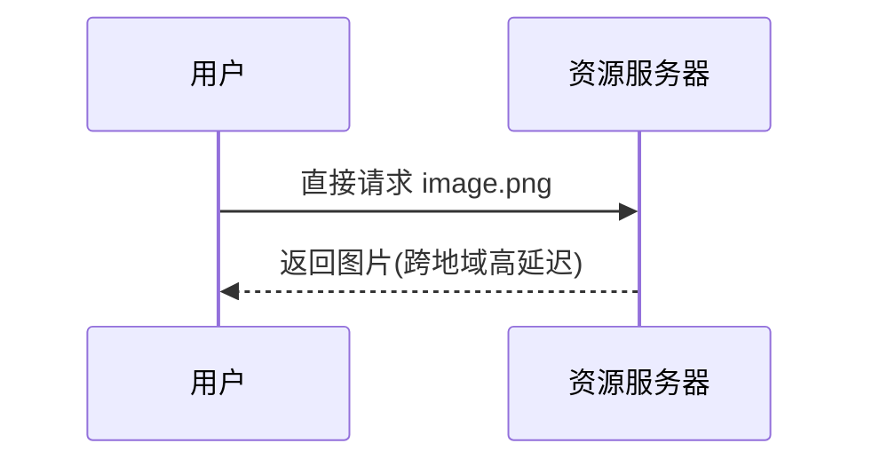
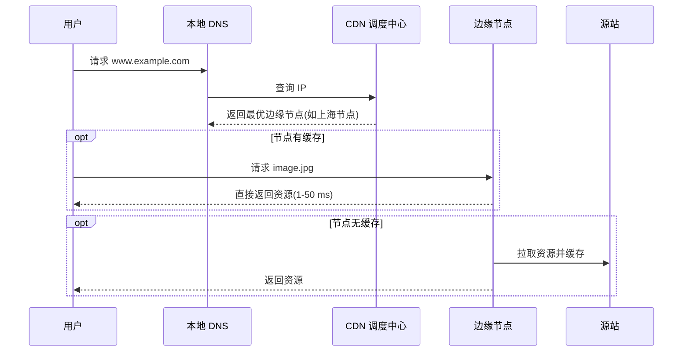
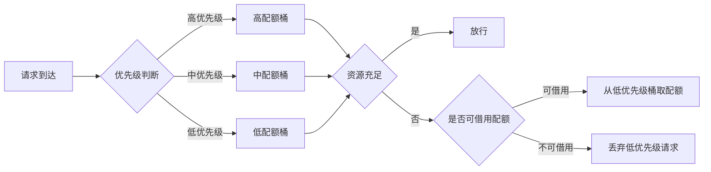
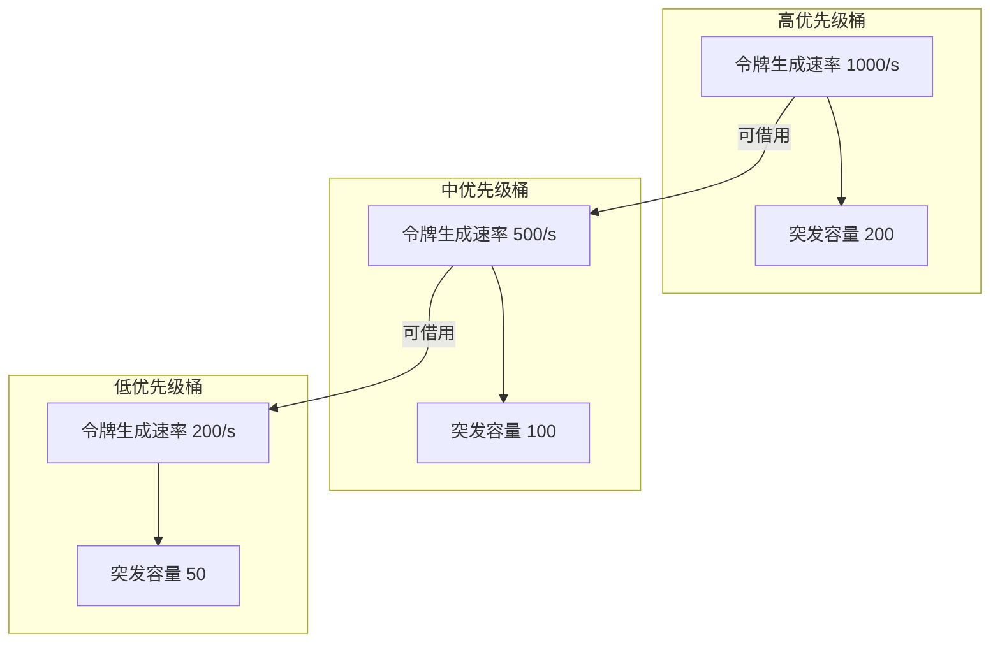
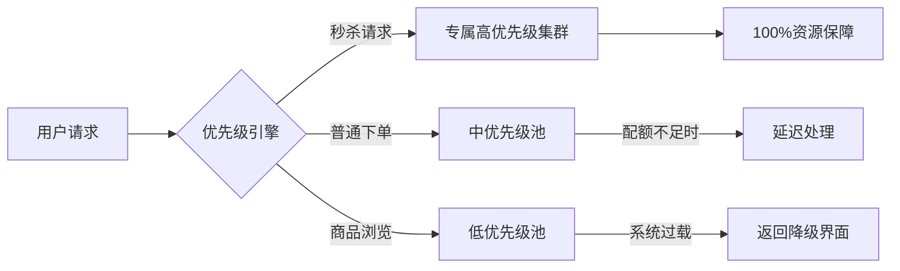

## 一、核心概念：动态限流 ##

### 为什么需要动态限流？ ###

静态限流策略在面对复杂多变的流量场景时往往力不从心。动态限流的价值在于：

- 适应性：根据实时系统负载动态调整限流参数
- 灵活性：不同业务场景采用不同的限流策略
- 资源优化：最大化系统资源利用率，避免过度限流或保护不足

### 动态限流实现方式 ###

```yaml
实现机制：
  1. 监控指标采集：CPU使用率、内存占用、接口响应时间、队列长度等
  2. 策略调整：基于监控数据动态调整令牌生成速率、窗口大小等参数
  3. 反馈控制：根据系统状态形成闭环控制回路
```

## 二、分布式系统中的限流算法演进 ##

### 算法类型对比 ###

|  **算法类型**  |   **代表算法**   | **适用场景**  |   **优势**   |
| :--------: | :------: |:--------: | :------: |
|  去中心化算法  | 分布式令牌桶、Gossip协同  |  分布式系统全局限流  | 避免中心节点瓶颈  |
|  混合型算法  | 令牌+漏桶、SmoothWarmUp  |  需要平衡灵活性与稳定性  | 兼顾流量整形和突发处理  |
|  自适应算法  | 反馈式限流、队列长度限流  |  复杂多变的流量场景  | 基于系统状态智能调整  |

## 三、流量路径全链路限流解析 ##

### 各节点限流职责详解 ###

#### CDN（内容分发网络） ####

- 核心功能：就近分发静态资源，减轻源站压力

- 限流维度：

  - 单IP请求频率
  - 缓存失效时间控制
  - 地域带宽限制

- 防护重点：防止缓存穿透冲击源站





#### 负载均衡器（网络层入口） ####

- 架构选择：

  - 四层LB（LVS）：传输层TCP/IP，适合高并发连接
  - 七层LB（Nginx）：应用层HTTP，支持精细化路由
  - 混合架构：LVS + Nginx应对超大规模流量

- 限流能力：

  - 全局流量/带宽峰值限制
  - 单IP连接资源限制（并发连接数、带宽）
  - 防护网络层攻击（DDoS）

#### API网关（业务层入口） ####

- 业务过滤：基于HTTP信息的精细化限流

- 限流维度：

  - 接口路径限流
  - 用户身份（IP、Token）
  - 请求参数（如秒杀商品ID）
  - 业务优先级控制

#### 应用服务器（业务处理节点） ####

- 保护重点：服务器自身资源

- 限流方式：

  - 业务代码级限流（分布式限流）
  - 资源限制（线程池、数据库连接池）
  - 本地接口QPS控制

#### 数据库/缓存（数据存储层） ####

- 系统瓶颈：最终的性能瓶颈点

- 限流策略：

  - 最大连接数限制
  - 查询频率控制
  - 特定SQL执行频率限制

## 四、Nginx限流配置实战 ##

### 基础限流配置 ###

#### 限制请求频率（基于接口/IP） ####

**基于接口业务限流**：

```bash
下单接口 为 核心接口：限制 每秒最多 50 次请求。允许 10 个 突发请求，避免瞬间流量峰值被全部拦截。。
正常流量（≤50r/s）：所有请求 正常转发到 订单服务。
流量峰值（如 60r/s）：短时间内允许 60r/s 的突发请求。超过 60 次的请求返回 429。
```

```nginx
# 定义 接口限流区域&限流规则：以请求URI为key，限制每秒50次请求。
limit_req_zone $request_uri zone=order_create:10m rate=50r/s;
# zone=order_create:10m 	限流区域：名字 & 限流区域大小。
  # 存储以 $request_uri 为 key 的限流状态数据。
  # 如：每个 URI 的请求计数器、最近一次请求时间等。
# rate=50r/s 							每秒最多50次请求。

server {
  listen 80;
  server_name api.myshop.com;

  # 下单接口：限流规则
  location /api/order/create {
    # 应用order_create限流区域
    limit_req zone=order_create burst=10 nodelay;
    # burst=10 	允许10个突发请求（超过50r/s时，最多额外处理10个）。
    # nodelay 	突发请求不排队，直接处理（避免用户等待）。

    # 限流后返回429状态码（默认也是429，可自定义）
    limit_req_status 429;
    
    # 自定义限流提示页面
    error_page 429 /error/too_many_requests.html;

    # 转发到后端订单服务
    proxy_pass http://order_service;
    proxy_set_header Host $host;
    proxy_set_header X-Real-IP $remote_addr;
  }

  # 静态资源：限流提示页面
  location /error/ {
    root /usr/share/nginx/html;
  }
}
```

**基于IP的动态限流**：

```nginx
# 定义 映射关系：客户端IP（$remote_addr）映射为 新变量$comment_limit_key。
# 动态区分 内/外IP：内部IP 不参与限流（key为空）。外部IP 以IP为限流key。
map $remote_addr $comment_limit_key {
  default $remote_addr;  # 外部IP：以IP为 限流key。
  192.168.1.0/24 "";     # 内部IP：不参与限流（key为空）。
}

# 定义 评论接口限流区域&规则：基于IP，每秒5次请求
limit_req_zone $comment_limit_key zone=comment_limit:10m rate=5r/s;

server {
  listen 80;
  server_name api.myshop.com;

  # 评论 接口限流（基于IP）
  location /api/comment/add {
    limit_req zone=comment_limit burst=3 nodelay;  # 单IP最多5+3=8次/秒
    proxy_pass http://comment_service;
  }
}
```

*限制并发连接数*

```nginx
http {
    # 定义并发连接限制区域
    limit_conn_zone $proxy_host zone=backend_conn:10m;
    limit_conn_zone $remote_addr zone=per_ip_conn:10m;

    server {
        location /api/order {
            limit_conn backend_conn 200;    # 业务总并发200
            limit_conn per_ip_conn 10;      # 单IP并发10
            limit_conn_status 503;
            
            proxy_pass http://order_server;
        }
    }
}
```

### 高级限流策略 ###

#### 多接口差异化限流 ####

```nginx
# 不同接口配置不同限流策略
limit_req_zone $request_uri zone=login_limit:10m rate=10r/s;
limit_req_zone $request_uri zone=goods_list_limit:10m rate=200r/s;
limit_req_zone $request_uri zone=pay_limit:10m rate=30r/s;

location /api/user/login {
    limit_req zone=login_limit burst=5 nodelay;      # 登录接口
    proxy_pass http://user_service;
}

location /api/goods/list {
    limit_req zone=goods_list_limit burst=50 nodelay; # 商品列表接口
    proxy_pass http://goods_service;
}

location /api/pay {
    limit_req zone=pay_limit burst=5 nodelay;        # 支付接口
    proxy_pass http://pay_service;
}
```

#### 限流与缓存结合优化 ####

- ❶ 缓存命中时：返回缓存数据。不请求后端，也不占用限流配额。响应时间从 200ms 降至 10ms。
- ❷ 缓存未命中：限流为 120r/s（100+20）。避免被高频请求击垮。

```nginx
# 商品详情接口：限流+缓存组合策略
limit_req_zone $request_uri zone=goods_detail_limit:10m rate=100r/s;

proxy_cache_path /var/cache/nginx/goods_cache
    levels=1:2
    keys_zone=goods_cache:100m
    max_size=10g
    inactive=30m
    use_temp_path=off;

location /api/goods/detail {
    # 缓存配置
    proxy_cache goods_cache;
    proxy_cache_key $request_uri;
    proxy_cache_valid 200 1h;
    
    # 限流配置（仅未命中缓存时生效）
    limit_req zone=goods_detail_limit burst=20 nodelay;
    proxy_pass http://goods_service;
}
```

## 五、优先级限流：业务价值的守护者 ##

### 优先级限流核心思想 ###

**关键认知**：

- 流量不平等原则：不同业务请求具有不同的价值权重
- 延迟处理策略：非关键请求可以适当延迟，释放资源给高优先级请求
- 动态调整机制：限流策略需要根据系统状态实时调整

### 优先级限流架构设计 ###

|  **维度**  |   **传统限流**   | **优先级限流**  |
| :--------: | :------: |:--------: |
|  资源分配  | 所有请求平台竞争  |  高优先级请求获得更多配额  |
|  目标  | 防止系统过载  |  关键业务不中断 ＋ 系统保护  |
|  策略灵活性  | 固定规则(如IP限流)  |  动态策略(基于业务价值、用户身份等)  |
|  牺牲对象  | 随机丢弃请求  |  精准牺牲低价值请求  |

**工作流程**：

- 请求分类器：根据业务规则为请求打上优先级标签
- 优先级队列：不同优先级请求进入不同队列
- 资源调度器：优先处理高优先级队列的请求
- 动态调整器：根据系统负载动态调整各队列的处理速率

**图解工作流**：








### 生产环境应用示例 ###

**配置示例**：

```nginx
# 定义不同优先级的限流区域
limit_req_zone $priority_key zone=high_priority:10m rate=1000r/s;
limit_req_zone $priority_key zone=medium_priority:10m rate=500r/s;
limit_req_zone $priority_key zone=low_priority:10m rate=100r/s;

# 根据请求特征设置优先级
map $http_x_priority $priority_zone {
    "high"    "high_priority";
    "medium"  "medium_priority";
    "low"     "low_priority";
    default   "medium_priority";
}

location /api/ {
    # 动态选择限流区域
    set $priority_key $remote_addr:$priority_zone;
    limit_req zone=$priority_zone burst=50 nodelay;
    
    # 根据优先级设置超时时间
    proxy_connect_timeout 5s;
    proxy_read_timeout 10s;
    
    proxy_pass http://backend_service;
}
```
