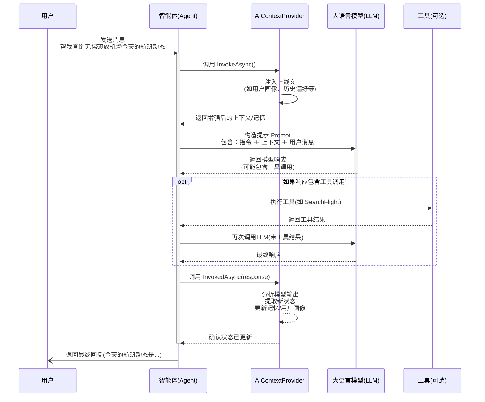

## 背景 ##

近期在做的一个项目，增加了一些AI相关的模块。在开发过程中，使用了微软最新的智能体开发框架，[SemanticKernel Agent Framework](https://learn.microsoft.com/en-us/semantic-kernel/frameworks/agent/?pivots=programming-language-csharp)

算是有一点不成熟的经验吧，想拿出来聊聊，首先SemanticKernel（以下简称SK）是微软开源的智能体开发框架，它的定位就是企业级的AI开发框架，致力于将智能业务和本地业务结合，开发出智能化的功能模块。

更多内容大家可以查看上面给出的官方文档，这里不再赘述。

## 配置服务 ##

SK框架支持兼容OpenAI接口风格的模型，所以大部分国内的模型都是可以使用的，我这里封装了3个，分别是Kimi，Qwen和DeepSeek，其他看情况修改即可。

基本代码如下，这里返回值是一个Kernel，所以注意编写的时候引入合适的命名空间，博客篇幅有限我就不灌太多代码了。

```csharp
public static Kernel CreateKernel(IConfiguration configuration)
{
    var builder = Kernel.CreateBuilder();
    var provider = configuration["AI:Provider"]!;

    // 添加 OpenAI 兼容的模型服务
    builder.AddOpenAIChatCompletion(
        modelId: model,
        apiKey: key,
        endpoint: new Uri(endpoint));

    return builder.Build();
}
```

> 即便我们在国内使用GPT，Gemini，Claude等国际模型有困难，但国内的AI行业发展的也不容小觑，因此完全没必要为此苦恼，我们可以使用国内的大模型来做我们的业务底座，性能，效果甚至可能更好。

## 编写插件 ##

配置完成后，我们可以先编写服务插件，当然这个步骤不是绝对的，看个人习惯和项目情况。代码实际上比较简单，按照你项目的架构风格编写业务代码即可，需要注意的是，插件方法的头部要增加一些标记，让SK框架可以认出这些插件，看一下案例代码

```csharp
[KernelFunction("query_by_project_id")] // 👈--注意这个要使用蛇形命名法
[Description("通过项目ID查询项目详细信息")] // 👈--这个说明也很重要
public async Task<string> QueryByProjectIdAsync(
    [Description("项目ID，如 720540936868229")] long projectId)
{
    ConsoleHelper.WriteLine($"=== 智能体命中插件，通过项目ID查询项目信息{DateTime.Now} ===");
    ConsoleHelper.WriteLine($"项目ID: {projectId}");

    try
    {
        if (_decProjectProvider != null)
        {
            var result = await _decProjectProvider.GetDecProjectDetail(projectId);

            if (!result.IsSuccess || result.Value == null)
            {
                return $"未找到项目ID为 {projectId} 的项目信息。";
            }

            return FormatProjectInfo(result.Value);
        }
        return "记录不存在";
    }
    catch (Exception ex)
    {
        ConsoleHelper.WriteLine($"项目ID查询失败: {ex.Message}");
        return $"查询失败: {ex.Message}";
    }
}
```

上面代码比较简单，就是一次简单的业务信息查询，但需要说明的是，方法体头部的 `KernelFunction` 标记，建议使用 snake_case（蛇形命名法）命名函数，以提高与主流大模型工具调用协议的兼容性。还一个要注意的是需要编写方法说明和参数说明，这个在模型执行工具调用的时候也很重要，算是明确的提示词吧，这些就当个规范记住就好。

## 定义智能体 ##

这里智能体的定义，也是根据实际情况，看如何操作更加方便，我这里是定义了一个基类，在基类中先定好了智能体要定义的属性，方法等，然后所有派生类都要集成这个基类，并实现独特的智能体角色。

因此我这里定义专属智能体的代码就非常简单

```csharp
public class MyBusinessAgent : ModernAgentBase
{
    public override string Name => "MyBusinessAgent";
    public override string Description => "业务智能体";

    protected override string Instructions => "你是专业的业务助手...";

    public MyBusinessAgent(Kernel kernel) : base(kernel) { }
}
```

比如刚刚的查询插件，我这里在这个基类的先定下，可以这样定义(部分代码)

```csharp
public class ModernProjectQueryAgent : ModernAgentBase
 {
     private readonly ProjectQueryPlugin _projectQueryPlugin;

     public override string Name => "ModernProjectQueryAgent";

     public override string Description => "现代化项目信息查询智能体，支持通过项目ID查询项目详情";

     protected override string Instructions => "你是专业的项目信息查询助手，能够根据用户提供的项目ID查询项目信息。你拥有 query_by_project_id 查询工具，支持6位以上数字的项目ID查询。请始终以专业、高效的方式为用户提供准确的项目查询服务。";

     // 注意这里的几个参数，对智能体的调用结果十分重要，大家可以自行了解一下
     protected override KernelArguments DefaultArguments => CreateStandardArguments(
         temperature: 0.3,
         topP: 0.8,
         maxTokens: 1500,
         enableFunctionCalling: true
     );

     public ModernProjectQueryAgent(Kernel kernel, IServiceProvider serviceProvider) : base(kernel)
     {
         _projectQueryPlugin = new ProjectQueryPlugin(serviceProvider);
     }
     
    /// <summary>
    /// 配置智能体插件
    /// </summary>
    protected override void ConfigurePlugins(ChatCompletionAgent agent)
    {
        AddPlugin(_projectQueryPlugin, "ProjectQuery");
    
        ConsoleHelper.WriteLine($"=== {Name} 插件配置完成 ===",ConsoleColor.Green);
        ConsoleHelper.WriteLine($"已加载插件数量: {_kernel.Plugins.Count}",ConsoleColor.Green);
        foreach (var plugin in _kernel.Plugins)
        {
            ConsoleHelper.WriteLine($"插件: {plugin.Name}", ConsoleColor.Green);
            foreach (var function in plugin)
            {
                ConsoleHelper.WriteLine($"  - 函数: {function.Name} - {function.Description}", ConsoleColor.Green);
            }
        }
    }

    /// <summary>
    /// 智能查询项目信息
    /// </summary>
    public async Task<string> SmartQueryAsync(string userInput, CancellationToken cancellationToken = default)
    {
        if (string.IsNullOrWhiteSpace(userInput))
        {
            return GetUsageHelp();
        }
        try
        {
            var chatHistory = new ChatHistory();
            var queryPrompt = $"请分析以下用户输入并执行相应的项目查询：\n{userInput}";
           
            var response = await GetResponseAsync(queryPrompt, chatHistory, cancellationToken);
            var result = response.Content ?? "查询失败，未获取到有效响应";
    
            return result;
        }
        catch (Exception ex)
        {
            return FormatErrorResponse(userInput, ex.Message);
        }
    }

     /// <summary>
    /// 执行智能体对话（获取单一响应）
    /// </summary>
    public virtual async Task<ChatMessageContent> GetResponseAsync(
        string userMessage, 
        ChatHistory? chatHistory = null, 
        CancellationToken cancellationToken = default)
    {
        // 如果没有提供历史记录，创建新的
        chatHistory ??= new ChatHistory();    
        // 添加用户消息
        chatHistory.AddUserMessage(userMessage);    
        // 获取响应
        ChatMessageContent? lastResponse = null;
        await foreach (var response in InvokeAsync(chatHistory, cancellationToken))
        {
            lastResponse = response;
            // 将助手响应添加到历史记录
            chatHistory.Add(response);
        }
    
        return lastResponse ?? throw new InvalidOperationException("智能体未返回有效响应");
    }
 }

// 基类的实现这里就不在罗列主要是思路，我们定义了一个通用的智能体基类 ModernAgentBase，它封装了 Kernel 初始化、插件注册和对话调用等通用逻辑，具体实现细节因项目而异，此处略去
```

注意啊，受篇幅限制，我不能把全部的定义都放上来。整个智能体的定义流程基本就是，定义基本属性-->注入插件-->调用服务.

上面这个例子主要实在 `ConfigurePlugins` 这个重载方法里，注入了需要的插件。实际上这么看智能体的定义也有想想我们传统的分层业务，定义仓储，开放接口，然后在宿主项目中引入，最后在开发成 `webapi` 或者页面服务，开发思路都是一样的，也是要保持单一职责，所以如果我们的智能体模块要好用，就需要多个智能体，多个插件，互相不干扰，也要保持智能体角色的单一性。

## 创建智能服务 ##

前面的工作完成后，可以创建一个智能服务，来统一的接受宿主层发过来的请求，比如我们就把场景限定在一个对话框，但这个对话框不仅仅是可以聊天，还能智能识别你的聊天意图，自动的去调用不同角色的智能体来实现本地化的服务

```csharp
public async Task<string> SendMessageAsync(
    string userInput, 
    string? sessionId = null, 
    CancellationToken ct = default)
{
    try
    {
        
        // 前置业务省略
        // ...

        // 智能选择智能体
        var selectedAgent = SelectAppropriateAgent(userInput);
        ConsoleHelper.WriteLine($"选择的智能体: {selectedAgent}");
        string response;
        if (selectedAgent == AgentType.ProjectQuery)
        {
            // 使用项目查询智能体
            response = await _projectQueryAgent.SmartQueryAsync(finalUserInput, ct);
        }
        else
        {
            // 使用客服智能体，提供历史上下文
            var contextInfo = ExtractContextInfo(history, referencedContent);
            response = await _customerSupportAgent.GetSmartResponseAsync(
                finalUserInput, 
                history, 
                contextInfo, 
                ct);
        }

        // 6. 只有生成了有效回复才继续存储到Redis
        if (!string.IsNullOrWhiteSpace(response))
        {
           // 保存聊天历史业务，略
        }
        return response;
    }
    catch (Exception ex)
    {
        ConsoleHelper.WriteLine($"处理消息失败: {ex.Message}");
        return "抱歉，系统暂时无法响应，请稍后再试。";
    }
}
```

## 注入容器 ##

前面的工作完成后，就可以在宿主系统里注入服务了，这部分代码很

```csharp
var kernel = ModernAgentConfiguration.CreateKernel(configuration);
services.AddSingleton(kernel);

// 注册智能体
services.AddSingleton<ModernProjectQueryAgent>();
services.AddSingleton<ModernCustomerSupportAgent>();

// 注册统一服务
services.AddSingleton<ICompatibleAgentService, ModernAgentService>();
```

## 测试效果 ##

宿主系统完成服务注入后，就可以看一下效果怎么样了，我这边是在 WPF 的项目里创建了一个对话框，代码就不贴了，看下执行效果吧

可以看到，智能体和常见的聊天机器人还是有区别，我们可以在定义的时候限制它的聊天能力，让它不要回答与角色无关的内容。然后问到业务相关的事情时，又能准确的识别我们的意图，给出正确的回复

{data-zoomable}

好了，至此，一个智能体就顺利集成到我们原有的项目里啦，收工！

## 结束语 ##

我觉得现阶段开发的大部分的传统项目，都应该尽可能的去集成一个AI模块，即便你确实没有明确的需求也要去尝试一下。

记得前阵子看过微软CEO的一个演讲，他提到一个观点，大概是说，我们开发的软件，由于最终使用者都是人，所以需要投入大量精力在界面，交互等工作上面，即便是服务端的开发有时候也需要顺应这种交互，而在AI的时代，仅仅通过自然语言，AI就可以帮我们更高效的完成很多复杂的任务，而在将任务交给AI的时候，是不需要太多交互和界面设计的，我们只需要等一个结果就好。

当然这是一个愿景，但从AI的发展速度来看，距离这个愿景的实现可能越来越近了，作为开发者，我们也应该积极的顺应这个时代，从认知到实践，都应该积极的做出改变。可能你的项目真的不需要一个AI模块，但也要为这种即将到来的风暴变革做好准备。

## 前言 ##

最近一直在写业务，感觉思维都快麻木了，趁着周末的时间，看了一下微软最新推出的智能体开发框架—— ·Microsoft Agent Framework·，以下简称 `MAF`。

跟着官方文档跑了几个案例，感觉还是非常有意思的。它不是传统意义上的 LLM SDK，而是一个面向开发者构建智能代理（Agent）的完整工具链，支持多轮对话、函数调用、工具集成、可观测性等高级功能。

## 什么是 Microsoft Agent Framework？ ##

概念性的东西，就不多说了，但这个新框架我觉得还是有必要介绍一下，这里就直接引用了微软官方文档的介绍了，我用翻译软件翻译了一下

> Microsoft Agent Framework 是一款面向 .NET 和 Python 的开源开发套件，用于构建人工智能代理及多智能体工作流。它整合并扩展了 Semantic Kernel 和 AutoGen 项目中的诸多理念，既继承了两者的优势，又增添了全新功能。该框架由同一团队打造，将成为未来构建人工智能代理的统一基础。
>
> Agent Framework 提供两大类核心能力：
> AI 代理：独立的智能体，可利用大语言模型处理用户输入，调用工具和 MCP 服务器执行相应操作，并生成回复。这些代理支持多种模型提供商，包括 Azure OpenAI、OpenAI 和 Azure AI。
> 工作流：基于图结构的工作流，可将多个代理和功能连接起来，以完成复杂且多步骤的任务。工作流支持基于类型的路由、嵌套、检查点以及人机协同场景下的请求与响应模式。
> 此外，该框架还提供了基础构建模块，包括模型客户端（用于聊天补全与回复）、用于状态管理的代理线程、为代理记忆提供上下文的服务提供者、用于拦截代理行为的中间件，以及用于工具集成的 MCP 客户端。这些组件共同赋予您灵活强大的能力，助您构建交互性好、稳健可靠且安全的人工智能应用。

说起来，大家可能想到微软之前的智能体框架 `Semantic Kernel` 和 `AutoGen`，这次的MAF简单来说就是两者的集合体，官方文档里也对他们的关系做了说明，大家可以自行搜一下资料，如果你以前没了解过 `SK` 和 `AutoGen`，那恭喜你，不用专门去了解他们了，直接上手MAF即可，如果了解过，也不用有错付之类的负担，因为MAF就是基于两者，所以你有这些基础经验，上手会更顺滑。

## 上手案例 ##

概念引入完了，咱就直接甩案例吧，其实微软官方文档的案例写的已经很详细了，但如果没接触过模型开发或者对不太熟悉的小伙伴来说，这个文档还是多少有点门槛的。起码OpenAI或者AzureOpenAI的访问问题就需要耽搁一段时间。

事实上，在SK时期，就有这个问题，到了MAF时代，这个问题处理起来更加直接，这篇我照着文档跑了几个案例，来一一介绍下

为了方便大家对照，我在每个案例开头都附上官方文档的地址

基础框架

[简介](https://learn.microsoft.com/en-us/agent-framework/overview/agent-framework-overview)

第一个案例就是搭建MAF框架，然后跑通一个最基础的案例。

1. 创建一个控制台项目

```bash
dotnet new console -o AgentFrameworkQuickStart
```

2. 引入核心插件，注意这里因为MAF还是预览版，通过命令行引入的话要加上 --preview参数，在IDE（如vs）里，要勾选“预览版”选项

```bash
dotnet add package Azure.AI.OpenAI --prerelease
dotnet add package Microsoft.Agents.AI.OpenAI --prerelease
```

这里官方文档里还安装了 `Azure.Identity`，这个我们可以不用，因为我们要接入国内平台的大模型。而且只是测试跑案例，暂时不需要它。

3. 定义Provider

我这里是使用的国内硅基流动平台，也可以使用其他的。

定义一个类

```csharp
public class ModelProvider
{
    public string ApiKey { get; init; } = string.Empty;
    public string ModelId { get; init; } = string.Empty;
    public string Endpoint { get; init; } = string.Empty;
}
```

对应的搞一个配置文件参数，测试阶段的话不搞也没事，这样方便一点

```json
{
  "ModelProvider": {
    "EndPoint": "https://api.moonshot.cn/v1",
    "ApiKey": "{你的key}",
    "ModelId": "kimi-k2-0905-preview"
  }
}
```

然后常规操作，就ok了

```csharp
var config = new ConfigurationBuilder()
    .AddJsonFile($"llm.json", optional: false, reloadOnChange: true)
    .Build();
var modelProvider = new ModelProvider()
{
    ApiKey = config["ModelProvider:ApiKey"] ?? string.Empty,
    ModelId = config["ModelProvider:ModelId"] ?? string.Empty,
    Endpoint = config["ModelProvider:Endpoint"] ?? string.Empty,
};
Console.WriteLine($"正在使用【${modelProvider.ModelId}】模型",ConsoleColor.Yellow);
```

### 第一个智能体 ###

[第一个智能体](https://learn.microsoft.com/en-us/agent-framework/overview/agent-framework-overview)

文档里第一个案例是一个笑话大师的案例，咱们小小的改造一下

```csharp
var agent = new OpenAIClient(
    new ApiKeyCredential(modelProvider.ApiKey),
    new OpenAIClientOptions { Endpoint = new Uri(modelProvider.Endpoint) })
    .GetChatClient(modelProvider.ModelId)
    .CreateAIAgent(instructions: "你是个脱口秀大师，可以很轻松的逗笑大家.", name: "脱口秀大师");

await foreach (var update in agent.RunStreamingAsync("来一段简短的脱口秀表演"))
{
    Console.Write(update);
}
```

### 视觉智能体 ###

[https://learn.microsoft.com/en-us/agent-framework/tutorials/agents/images](https://learn.microsoft.com/en-us/agent-framework/tutorials/agents/images)

在试试视觉能力，注意，此时要换一个有视觉能力的模型，我前面使用的 `kimi` 不支持，可以换成其他模型，比如 `qwen` 系列

```csharp
var agent = new OpenAIClient(
    new ApiKeyCredential(modelProvider.ApiKey),
    new OpenAIClientOptions { Endpoint = new Uri(modelProvider.Endpoint) })
    .GetChatClient(modelProvider.ModelId)
    .CreateAIAgent(instructions: "你是一个能够分析图像的实用助手。.", name: "视觉代理");

ChatMessage message = new ChatMessage(ChatRole.User, [
    new TextContent("你在这张图片中看到了什么？"),
    new UriContent("{图片实际地址}", "image/png")
    ]);
// Console.WriteLine(await agent.RunAsync(message));

await foreach (var update in agent.RunStreamingAsync(message))
{
    Console.Write(update);
}
```

### Function Tool ###

```csharp
var agent = new OpenAIClient(
    new ApiKeyCredential(modelProvider.ApiKey),
    new OpenAIClientOptions { Endpoint = new Uri(modelProvider.Endpoint) })
    .GetChatClient(modelProvider.ModelId)
    .CreateAIAgent(instructions: "你是一个智能助手。", tools: [AIFunctionFactory.Create(GetWeather)]);

Console.WriteLine(await agent.RunAsync("保定的天气怎么样?"));

[Description("Get the weather for a given location.")]
static string GetWeather([Description("The location to get the weather for.")] string location)
    => $"The weather in {location} is cloudy with a high of 15°C.";
```

这个呢，我没怎么修改，基本就是按照官方文档的例子来的。
需要多说一点的是，定义工具函数时，不再需要像SK时代，标记方法工具名特性了，直接写工具作用的描述就可以了，更加简洁。

工具调用在LLM发展初期就比较普及了，这也是Agent的灵魂，使Agent不再只是“回答问题”，而是能像人一样去“执行动作”。

### 需要人批准的函数工具 ###

[ents/function-tools-approvals?pivots=programming-language-csharp](https://learn.microsoft.com/en-us/agent-framework/tutorials/agents/function-tools-approvals?pivots=programming-language-csharp)

这个实际上是MAF框架的一个重要特性，在实际的业务场景中，很多时候我们不能或者不应该让智能体直接去执行一些操作，而是需要得到人类的授权后，再决定是否执行，也就是“人机协同”模式，案例给的比较简单，实际我们可以在这个基础上扩充进很多业务进来，比如权限模块等等。

它的价值就会实现安全可控的自动化流程，避免误操作。

```csharp
AIFunction weatherFunction = AIFunctionFactory.Create(GetWeather);
AIFunction approvalRequiredWeatherFunction = new ApprovalRequiredAIFunction(weatherFunction);

var agent = new OpenAIClient(
    new ApiKeyCredential(modelProvider.ApiKey),
    new OpenAIClientOptions { Endpoint = new Uri(modelProvider.Endpoint) })
    .GetChatClient(modelProvider.ModelId)
    .CreateAIAgent(instructions: "你是一个智能助手。", tools: [approvalRequiredWeatherFunction]);

AgentThread thread = agent.GetNewThread();
AgentRunResponse response = await agent.RunAsync("保定的天气如何?", thread);

var functionApprovalRequests = response.Messages
    .SelectMany(x => x.Contents)
    .OfType<FunctionApprovalRequestContent>()
    .ToList();
FunctionApprovalRequestContent requestContent = functionApprovalRequests.First();
Console.WriteLine($"我需要您的批准才能执行 '{requestContent.FunctionCall.Name}'");
var approvalMessage = new ChatMessage(ChatRole.User, [requestContent.CreateResponse(true)]);
Console.WriteLine(await agent.RunAsync(approvalMessage, thread));


[Description("Get the weather for a given location.")]
static string GetWeather([Description("The location to get the weather for.")] string location)
    => $"The weather in {location} is cloudy with a high of 15°C.";
```

### 将 Agent 暴露为 MCP 工具 ###

通过 MAF，我可以轻松把我的 Agent 包装成一个 MCP Server，然后在任意MCP客户端中注册这个工具，就可以直接调用它！

```csharp
var agent = new OpenAIClient(
        new ApiKeyCredential(modelProvider.ApiKey),
        new OpenAIClientOptions { Endpoint = new Uri(modelProvider.Endpoint) })
    .GetChatClient(modelProvider.ModelId)
    .CreateAIAgent(instructions: "你是个笑话大师.", name: "笑话大师");
var jokerMcpTool = McpServerTool.Create(agent.AsAIFunction());
var builder = Host.CreateEmptyApplicationBuilder(settings: null);
builder.Services
    .AddMcpServer()
    .WithStdioServerTransport()
    .WithTools([jokerMcpTool]);
await builder
    .Build()
    .RunAsync();
```

然后在 `Cline` 中调用他的效果

是的，现在通过MAF框架创建一个MCPServer，就像写接口一样，非常丝滑。

## 结语 ##

好了，本次我就跑了这几个案例，感觉还是非常不错的。微软通过 MAF 提供了一条清晰的技术路径，让我们这些开发者也能轻松构建属于自己的“智能助手”。

接下来，还是会继续对MAF的探索之旅，因为我现在做的项目也要接入智能体框架。这东西我觉得绝不是所谓“锦上添花”之类的定位，而是办公效率提质增效的核心因素，当然这有一个必要条件，就是你的业务系统里基础操作是稳定的，可靠的，基于此，智能体的接入才能彻底释放生产力！

本篇对MAF的介绍只是冰山一角，还有更有特点的工作流，AG-UI，DevUI等，等下次有机会在细聊，晚安啦攻城狮们。

## 前言 ##

书接上回，关于MAF框架的探索，上次只聊了几个基本的Agent创建，本篇将深入探讨MAF框架的三个核心进阶特性：可观测性集成、聊天记录存储与持久化，以及为智能体赋予记忆能力。

我这里的案例代码都是跟着微软的官方文档，将智能体的角色案例改造成了一个“汽车大师”，包含了一些自己的理解，可能存在偏差和错误，推荐大家优先查阅官方文档。

由于MAF框架，以及其相关的生态包，目前都是Preview状态（截止到2026.1.12），所以这里只是探索，目前上生产的话还是要慎重。

## 可观测性 ##

这一趴，对应的文档地址是：[https://learn.microsoft.com/en-us/agent-framework/tutorials/agents/enable-observability?pivots=programming-language-csharp](https://learn.microsoft.com/en-us/agent-framework/tutorials/agents/enable-observability?pivots=programming-language-csharp)

> 实际上，微软的文档是有一个机翻的中文版的，但机翻的效果我个人感觉有点拉，不如直接看原版，然后用翻译软件或者AI助手翻译，效果更好，当然能无障碍阅读原版是最好了。

这一节，主要是展示MAF框架如何方便的开启可观测性。核心的目标是利用OpenTelemetry标准来自动记录和导出智能体育用户之间的交互数据。

整个接入流程可以概括为

1. 安装必要的Nuget包
2. 启用OpenTelemtry（TracerProvider）
3. 配置代理
4. 查看输出结果

好了，更具体的内容大家可以参考文档，我这里直接给出我的测试案例

```csharp
using Azure.AI.OpenAI;
using Microsoft.Agents.AI;
using OpenAI;
using OpenTelemetry;
using OpenTelemetry.Trace;
using System;
using System.ClientModel;

namespace AgentFrameworkQuickStart
{
    public class ObservabilityAgent
    {
        public readonly ModelProvider modelProvider;
        public ObservabilityAgent(ModelProvider modelProvider)
        {
            this.modelProvider = modelProvider;
        }

        public async Task ObservabilityDemo()
        {
            using var tracerProvider = Sdk.CreateTracerProviderBuilder()
            .AddSource("agent-telemetry-source")
            .AddConsoleExporter()
            .Build();

            var agent = new OpenAIClient(
               new ApiKeyCredential(modelProvider.ApiKey),
               new OpenAIClientOptions { Endpoint = new Uri(modelProvider.Endpoint) })
               .GetChatClient(modelProvider.ModelId)
               .CreateAIAgent(instructions: "你是个资深汽车大师，了解很多汽车知识，包括配置，价格，驾驶体验的等等，回复内容尽可能简短高效，突出优缺点，给出综合购买建议，避免长篇大论", name: "汽车大师")
               .AsBuilder()
               .UseOpenTelemetry(sourceName: "agent-telemetry-source")
               .Build();

            await foreach (var update in agent.RunStreamingAsync("介绍一下新款宝马X3 25L这款车"))
            {
                Console.Write(update);
            }
        }
    }
}
```

然后可以在看一下运行效果

## 存储聊天记录 ##

官方文档在可观测性之后，详细介绍了持久化对话和第三方外部存储。为了聚焦核心概念，本文将直接展示如何实现一个自定义的聊天记录存储，该方法也涵盖了持久化的核心思想，大家可以参考官网查看完整的教程。

默认情况下，`ChatClientAgent` 的聊天记录存储在 `AgentThread` 对象中，也就是内存当中，为了实现对话的持久化、跨会话恢复或大规模历史管理，开发者需要提供自定义存储实现。

本文的案例就是基于官方教程，创建了一个自定义存储类，继承抽象类  `ChatMessageStore` 并分别实现一个存储（`AddMessagesAsync`）和检索（`GetMessagesAsync`）的关键方法。这里要注意的是，在检索方法里要考虑Token的限制，不过我们这里是技术验证阶段，这个也可以先跳过，降低一些心智负担。

**代码的大体逻辑是**

1. 提供一个 `InMemoryVectorStore` 示例类 `VectorChatMessageStore`
2. 在第一次添加消息时生成一个唯一的 `ThreadDbKey`
3. 定义了一个内部类 `ChatHistoryItem` 来保存消息文本、时间戳和序列化后的消息体。
4. `Serialize` 方法只返回 `ThreadDbKey` 这样下次加载线程时，就能根据这个 Key 找回历史。

**来看下代码**

```csharp
using AgentFrameworkQuickStart.Models;
using Microsoft.Agents.AI;
using Microsoft.Extensions.AI;
using Microsoft.Extensions.VectorData;
using Microsoft.SemanticKernel.Connectors.InMemory;
using OpenAI;
using Spectre.Console;
using System.ClientModel;
using System.Text.Json;

namespace AgentFrameworkQuickStart;

public class InMemoryChatHistoryAgent
{
    private readonly ModelProvider _modelProvider;
    private readonly string _threadStatePath;
    private readonly VectorStore _vectorStore = new InMemoryVectorStore();

    public InMemoryChatHistoryAgent(ModelProvider modelProvider, string threadStateFileName = "thread_state.json")
    {
        _modelProvider = modelProvider ?? throw new ArgumentNullException(nameof(modelProvider));
        _threadStatePath = Path.Combine(Directory.GetCurrentDirectory(), threadStateFileName);
    }

    public async Task RunInteractiveChatAsync()
    {
        // 创建带自定义消息存储的 Agent
        var agent = new OpenAIClient(
                new ApiKeyCredential(_modelProvider.ApiKey),
                new OpenAIClientOptions { Endpoint = new Uri(_modelProvider.Endpoint) })
            .GetChatClient(_modelProvider.ModelId)
            .CreateAIAgent(
            new ChatClientAgentOptions
            {
                Name = "记忆大师",
                Description = "你是一个有长期记忆的助手，能记住之前的对话。",
                ChatMessageStoreFactory = ctx => new VectorChatMessageStore(_vectorStore, ctx.SerializedState, ctx.JsonSerializerOptions)
            });


        // 尝试恢复线程
        AgentThread thread;
        if (File.Exists(_threadStatePath))
        {
            Console.WriteLine("检测到已保存的对话状态，正在恢复...");
            string json = await File.ReadAllTextAsync(_threadStatePath);
            var element = JsonSerializer.Deserialize<JsonElement>(json, JsonSerializerOptions.Web);
            thread = agent.DeserializeThread(element, JsonSerializerOptions.Web);
            Console.WriteLine("对话已恢复！");
        }
        else
        {
            Console.WriteLine("开始新对话（使用 InMemory 向量存储记录历史）...");
            thread = agent.GetNewThread();
        }

        while (true)
        {
            Console.Write("\n💬 你: ");
            string? input = Console.ReadLine();

            if (string.IsNullOrWhiteSpace(input)) continue;

            if (input.Equals("exit", StringComparison.OrdinalIgnoreCase))
            {
                var state = thread.Serialize(JsonSerializerOptions.Web).GetRawText();
                await File.WriteAllTextAsync(_threadStatePath, state);
                Console.WriteLine("线程状态已保存，再见！");
                break;
            }

            if (input.Equals("clear", StringComparison.OrdinalIgnoreCase))
            {
                if (File.Exists(_threadStatePath)) 
                    File.Delete(_threadStatePath);
                thread = agent.GetNewThread();
                Console.WriteLine("已开启全新对话（旧历史不可见）");
                continue;
            }

            try
            {
                var response = await agent.RunAsync(input, thread);
                Console.WriteLine($"\n助手: {response}");
            }
            catch (Exception ex)
            {
                Console.WriteLine($"错误: {ex.Message}");
                continue;
            }

            var updatedState = thread.Serialize(JsonSerializerOptions.Web).GetRawText();
            await File.WriteAllTextAsync(_threadStatePath, updatedState);
        }
    }

    //这个基本和文档的案例一致👇，我引入了AnsiConsole美化输出
    private sealed class VectorChatMessageStore : ChatMessageStore
    {
        private readonly VectorStore _vectorStore;
        public string? ThreadDbKey { get; private set; }

        public VectorChatMessageStore(
            VectorStore vectorStore,
            JsonElement serializedStoreState,
            JsonSerializerOptions? jsonSerializerOptions = null)
        {
            _vectorStore = vectorStore ?? throw new ArgumentNullException(nameof(vectorStore));
            if (serializedStoreState.ValueKind == JsonValueKind.String)
                ThreadDbKey = serializedStoreState.Deserialize<string>(jsonSerializerOptions);
        }

        public override async Task AddMessagesAsync(
            IEnumerable<ChatMessage> messages,
            CancellationToken cancellationToken = default)
        {
            ThreadDbKey ??= Guid.NewGuid().ToString("N");

            AnsiConsole.MarkupLine($"[cyan]【Add】 ThreadKey: {ThreadDbKey}, 消息数: {messages.Count()}[/]");

            var collection = _vectorStore.GetCollection<string, ChatHistoryItem>("ChatHistory");
            await collection.EnsureCollectionExistsAsync(cancellationToken);

            await collection.UpsertAsync(
                messages.Select(msg => new ChatHistoryItem
                {
                    Key = $"{ThreadDbKey}_{msg.MessageId}",
                    ThreadId = ThreadDbKey,
                    Timestamp = DateTimeOffset.UtcNow,
                    SerializedMessage = JsonSerializer.Serialize(msg, SourceGenerationContext.Default.ChatMessage),
                    MessageText = msg.Text ?? ""
                }),
                cancellationToken);
        }

        public override async Task<IEnumerable<ChatMessage>> GetMessagesAsync(
            CancellationToken cancellationToken = default)
        {
            if (string.IsNullOrEmpty(ThreadDbKey))
                return [];

            AnsiConsole.MarkupLine($"[yellow]【Get】 从 ThreadKey: {ThreadDbKey} 读取消息[/]");


            var collection = _vectorStore.GetCollection<string, ChatHistoryItem>("ChatHistory");
            await collection.EnsureCollectionExistsAsync(cancellationToken);

            // 获取该线程的所有消息（按时间倒序取最新 10 条）
            var records = collection.GetAsync(
                filter: x => x.ThreadId == ThreadDbKey,
                top: 10,
                options: new() { OrderBy = x => x.Descending(y => y.Timestamp) },
                cancellationToken);

            var messages = new List<ChatMessage>();
            await foreach (var record in records)
            {
                messages.Add(JsonSerializer.Deserialize<ChatMessage>(
                    record.SerializedMessage!,
                    SourceGenerationContext.Default.ChatMessage)!);
            }

            messages.Reverse();
            return messages;
        }

        public override JsonElement Serialize(JsonSerializerOptions? options = null)
            => JsonSerializer.SerializeToElement(ThreadDbKey, options);

        private sealed class ChatHistoryItem
        {
            [VectorStoreKey] public string? Key { get; set; }
            [VectorStoreData] public string? ThreadId { get; set; }
            [VectorStoreData] public DateTimeOffset? Timestamp { get; set; }
            [VectorStoreData] public string? SerializedMessage { get; set; }
            [VectorStoreData] public string? MessageText { get; set; }
        }
    }
}
```


## 为智能体添加记忆 ##

本节对应文档的地址：[https://learn.microsoft.com/en-us/agent-framework/tutorials/agents/memory?pivots=programming-language-csharp](https://learn.microsoft.com/en-us/agent-framework/tutorials/agents/memory?pivots=programming-language-csharp)

这一章关于概念性的内容我这里不过多介绍了，这里简单总结一下，我觉得这一篇是MAF的基础文档介绍中最为压轴的一篇，通过 `AIContextProvider` 可以让 `Agent` 具备“学习”和“个性化”的能力，构建出复杂交互系统。如文档所示

> `AIContextProvider` 是一个抽象类，您可以从中继承，并且可以与 `AgentThread` 关联以用于 `ChatClientAgent`。 该功能允许：
>
> - 在代理调用基础推理服务之前和之后运行自定义逻辑。
> - 在调用基础推理服务之前，向代理提供其他上下文。
> - 检查代理提供和生成的所有消息。

`AIContextProvider` 本质上是一个拦截器或者说中间件，像是在 `Agent` 从“接受输入（`InvokingAsync`）”到“调用模型（`InvokedAsync`）”这个执行流程上切了2刀，这个过程可以参考以下流程图。



更多概念性内容大家还是参考文档吧，我这里就不再赘述了。咱们看案例吧

```csharp
using AgentFrameworkQuickStart.Models;
using AgentFrameworkQuickStart.Tools;
using Microsoft.Agents.AI;
using Microsoft.Extensions.AI;
using Microsoft.Extensions.VectorData;
using Microsoft.SemanticKernel.Connectors.InMemory;
using OpenAI;
using Spectre.Console;
using System.ClientModel;
using System.Text;
using System.Text.Json;

namespace AgentFrameworkQuickStart
{
    public class CarMasterMemory : AIContextProvider
    {
        private readonly IChatClient _innerClient;
        public CarPreference Preference { get; private set; }

        public CarMasterMemory(IChatClient client, CarPreference? pref = null)
        {
            _innerClient = client;
            Preference = pref ?? new CarPreference();
        }

        public CarMasterMemory(IChatClient client, JsonElement serializedState, JsonSerializerOptions? options = null)
        {
            _innerClient = client;
            Preference = serializedState.ValueKind == JsonValueKind.Object
                ? serializedState.Deserialize<CarPreference>(options) ?? new CarPreference()
                : new CarPreference();
        }

        public override ValueTask<AIContext> InvokingAsync(InvokingContext context, CancellationToken ct = default)
        {
            var sb = new StringBuilder("\n[后台画像已加载]");
            if (Preference.BudgetMax > 0) sb.Append($" | 预算上限：{Preference.BudgetMax}万");
            if (Preference.EnergyType != "未指定") sb.Append($" | 能源偏好：{Preference.EnergyType}");
            if (Preference.MustHaves.Any()) sb.Append($" | 关键需求：{string.Join("、", Preference.MustHaves)}");

            return new ValueTask<AIContext>(new AIContext { Instructions = sb.ToString() });
        }


        public override async ValueTask InvokedAsync(InvokedContext context, CancellationToken ct = default)
        {
            if (context.RequestMessages.Any(m => m.Role == ChatRole.User))
            {
                try
                {
                    var lastUserMessage = context.RequestMessages.LastOrDefault(m => m.Role == ChatRole.User)?.Text;
                    if (string.IsNullOrEmpty(lastUserMessage)) return;

                    var analysisOptions = new ChatOptions
                    {
                        ResponseFormat = ChatResponseFormat.Json,
                        Instructions = """
                    你是一个数据提取器。请分析用户的输入，提取购车意向。
                    返回 JSON 格式如下：
                    {
                      "BudgetMax": 数字 (如果是30万请写30, 必须是万为单位的数字),
                      "EnergyType": "字符串 (如: 纯电/燃油/混动)",
                      "MustHaves": ["需求点1", "需求点2"] (如果没有提到任何具体配置或功能需求，请返回空数组 [])
                    }
                    注意：如果是配置需求(如: 智驾、全景天窗、大空间)，请放入 MustHaves。
                    """
                    };

                    var extraction = await _innerClient.GetResponseAsync<CarPreference>(
                        context.RequestMessages.TakeLast(2), // 只看最近一两轮
                        analysisOptions);

                    if (extraction.Result != null)
                    {
                        var newInfo = extraction.Result;

                        if (newInfo.BudgetMax > 5000) newInfo.BudgetMax /= 10000;
                        if (newInfo.BudgetMax > 0) this.Preference.BudgetMax = newInfo.BudgetMax;

                        if (!string.IsNullOrEmpty(newInfo.EnergyType) && newInfo.EnergyType != "未指定" && newInfo.EnergyType != "null")
                        {
                            this.Preference.EnergyType = newInfo.EnergyType;
                        }

                        if (newInfo.MustHaves != null && newInfo.MustHaves.Any())
                        {
                            var validNewItems = newInfo.MustHaves
                                .Where(s => !string.IsNullOrWhiteSpace(s) && s != "无" && s != "null");

                            var updatedList = this.Preference.MustHaves.Union(validNewItems, StringComparer.OrdinalIgnoreCase).ToList();
                            this.Preference.MustHaves = updatedList;
                        }
                    }
                }
                catch (Exception ex)
                {
                    // 调试用
                    // Console.WriteLine($"[DEBUG] 提取失败: {ex.Message}");
                }
            }
        }
        public override JsonElement Serialize(JsonSerializerOptions? options = null)
            => JsonSerializer.SerializeToElement(Preference, options);
    }

    public class CarMasterAgent : BaseAgent
    {
        private readonly VectorStore _vectorStore = new InMemoryVectorStore();

        public CarMasterAgent(ModelProvider modelProvider) : base(modelProvider) { }

        public async Task RunMasterAsync()
        {
            var client = new OpenAIClient(
                new ApiKeyCredential(modelProvider.ApiKey),
                new OpenAIClientOptions { Endpoint = new Uri(modelProvider.Endpoint) });

            var chatClient = client.GetChatClient(modelProvider.ModelId);

            var agent = chatClient.CreateAIAgent(new ChatClientAgentOptions
            {
                Name = "汽车大师",
                Description = "你是一个毒舌但专业的汽车大师。你会根据后台画像（预算、需求）给出精准建议。",
                // 1. 对话记录存入向量数据库（你写的逻辑）
                ChatMessageStoreFactory = ctx => new VectorChatMessageStore(_vectorStore, ctx.SerializedState, ctx.JsonSerializerOptions),
                // 2. 画像提炼存入上下文提供者（我优化的逻辑）
                AIContextProviderFactory = ctx => new CarMasterMemory(chatClient.AsIChatClient(), ctx.SerializedState, ctx.JsonSerializerOptions)
            });

            var thread = agent.GetNewThread();

            while (true)
            {
                var input = AnsiConsole.Ask<string>("[white]你:[/]");
                if (input == "exit") break;

                var response = await agent.RunAsync(input, thread);
                AnsiConsole.MarkupLine($"\n[cyan]大师: {response}[/]");

                var mem = thread.GetService<CarMasterMemory>()?.Preference;
                AnsiConsole.MarkupLine($"[grey]>>> 系统画像更新 | 预算: {mem?.BudgetMax}w | 能源: {mem?.EnergyType} | 需求数: {mem?.MustHaves.Count}[/]");
            }
        }

        public async Task RunMasterStreamAsync()
        {
            var client = new OpenAIClient(
                new ApiKeyCredential(modelProvider.ApiKey),
                new OpenAIClientOptions { Endpoint = new Uri(modelProvider.Endpoint) });

            var chatClient = client.GetChatClient(modelProvider.ModelId);

            var agent = chatClient.CreateAIAgent(new ChatClientAgentOptions
            {
                Name = "汽车大师",
                Description = "你是一个既毒舌又专业的汽车大师。你会根据后台画像（预算、需求）给出精准建议。重点突出优缺点，有没有排面，不要长篇大论，扯一些没用的。",
                // 对话记录存入向量数据库
                ChatMessageStoreFactory = ctx => new VectorChatMessageStore(_vectorStore, ctx.SerializedState, ctx.JsonSerializerOptions),
                // 画像提炼存入上下文提供者
                AIContextProviderFactory = ctx => new CarMasterMemory(chatClient.AsIChatClient(), ctx.SerializedState, ctx.JsonSerializerOptions)
            });

            var thread = agent.GetNewThread();

            AnsiConsole.MarkupLine("[bold green]--- 汽车大师已上线 (流式模式) ---[/]");

            while (true)
            {
                var input = AnsiConsole.Ask<string>("\n[white]你:[/]");
                if (input == "exit") break;

                AnsiConsole.Markup("[cyan]大师:[/] ");

                await foreach (var chunk in agent.RunStreamingAsync(input, thread))
                {
                    // 直接输出片段，不换行
                    Console.Write(chunk);
                }

                Console.WriteLine(); // 结束后手动换行

                await Task.Delay(500);
                var mem = thread.GetService<CarMasterMemory>()?.Preference;

                var panel = new Panel($"""
            [yellow]预算限制：[/] {mem?.BudgetMax} 万
            [yellow]能源偏好：[/] {mem?.EnergyType}
            [yellow]核心需求：[/] {(mem?.MustHaves.Any() == true ? string.Join("、", mem.MustHaves) : "尚不明确")}
            """)
                {
                    Header = new PanelHeader("🚗 [bold]当前画像记录[/]"),
                    Border = BoxBorder.Rounded
                };

                AnsiConsole.Write(panel);
            }
        }

        public async Task RunMasterWithToolsAsync()
        {
            var chatClient = new OpenAIClient(
                new ApiKeyCredential(modelProvider.ApiKey),
                new OpenAIClientOptions { Endpoint = new Uri(modelProvider.Endpoint) })
                .GetChatClient(modelProvider.ModelId);

            var agent = chatClient.CreateAIAgent(new ChatClientAgentOptions
            {
                Name = "汽车大师",
                Description = "一个从业20年的专业汽车顾问，擅长结合用户画像进行精准推荐。",

                // 将推理相关的配置放入 ChatOptions
                ChatOptions = new ChatOptions
                {
                    Instructions = "你是一个专业的汽车推荐助手。请优先参考后台画像。如果用户询问具体推荐，请调用 SearchCars 工具。",
                    Tools = [AIFunctionFactory.Create(new CarTool().SearchCars)]
                },

                AIContextProviderFactory = ctx => new CarMasterMemory(
                    chatClient.AsIChatClient(),
                    ctx.SerializedState,
                    ctx.JsonSerializerOptions),

                ChatMessageStoreFactory = ctx => new VectorChatMessageStore(
                    _vectorStore,
                    ctx.SerializedState,
                    ctx.JsonSerializerOptions)
            });

            var thread = agent.GetNewThread();

            while (true)
            {
                var input = AnsiConsole.Ask<string>("\n[white]你:[/]");
                if (input == "exit") break;

                // 使用流式输出
                AnsiConsole.Markup("[cyan]大师:[/] ");
                await foreach (var chunk in agent.RunStreamingAsync(input, thread))
                {
                    Console.Write(chunk);
                }
                Console.WriteLine();

                var mem = thread.GetService<CarMasterMemory>()?.Preference;
                AnsiConsole.Write(new Panel($"预算: {mem?.BudgetMax}w | 能源: {mem?.EnergyType}").Border(BoxBorder.Rounded));
            }
        }
    }
}
```

简单说明一下，这个案例，前半部分的代码是核心，重载了 `InvokingAsync` 和 `InvokedAsync` 两个方法，分别在调用模型前，和调用模型后做一些业务相关的操作，比如这个案例是根据用户输入，提炼一个用户画像，有多少预算，倾向买什么车等。

后半部分，定义了3个智能体，其中 `RunMasterAsync` 和 `RunMasterStreamAsync` 实际只有一个输出方式的区别，而 `RunMasterWithToolsAsync` 则包含了一个工具的调用，智能体会在合适的时机调用工具执行操作。

## 结语 ##

好了，受篇幅限制，就写到这里吧，下一篇再来聊聊工作流的部分。

> 附一条小插曲，截止到笔者发文，刚刚看到C#获得了2025年年度编程语言，多年来，C#经历了根本性的变革。从语言设计的角度来看，C#常常率先采纳主流语言中的新趋势。与此同时，它成功完成了两次重大范式转变：从仅限Windows到跨平台，以及从微软专有到开源。C#始终能在恰当的时机实现与时俱进的演进。
