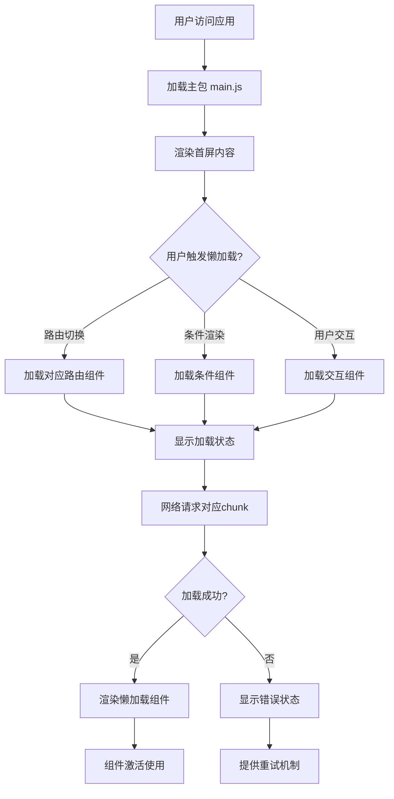

## 摘要

组件懒加载是现代前端性能优化的核心技术，Vue3 提供了多种强大的懒加载方案。本文将深入探讨 Vue3 中组件懒加载的实现原理、使用场景、性能优化策略，通过详细的代码示例、执行流程分析和实际项目案例，帮助你全面掌握 Vue3 组件懒加载的完整知识体系。

## 一、 什么是组件懒加载？为什么需要它？

### 传统组件加载的问题

在传统的 Vue 应用中，所有组件通常被打包到一个 JavaScript 文件中：

```javascript
// 传统同步导入方式
import Home from "./components/Home.vue";
import About from "./components/About.vue";
import Contact from "./components/Contact.vue";

const app = createApp({
  components: {
    Home,
    About,
    Contact,
  },
});
```

**传统方式的问题**：

- 首屏加载缓慢：用户需要下载整个应用代码才能看到首屏内容
- 资源浪费：用户可能永远不会访问某些页面，但依然加载了对应组件
- 用户体验差：特别是对于移动端用户和网络条件较差的场景
- 缓存效率低：整个应用打包成一个文件，任何改动都会使缓存失效

### 组件懒加载的解决方案

懒加载（Lazy Loading）也称为代码分割（Code Splitting），它允许我们将代码分割成多个 chunk，只在需要时加载：

```javascript
// 懒加载方式
const Home = () => import("./components/Home.vue");
const About = () => import("./components/About.vue");
const Contact = () => import("./components/Contact.vue");
```

**懒加载的优势**：

- 更快的首屏加载：只加载当前页面需要的代码
- 按需加载：根据用户操作动态加载组件
- 更好的缓存：独立的 chunk 可以独立缓存
- 优化用户体验：减少初始加载时间

## 二、 Vue3 组件懒加载核心概念

### 懒加载的工作原理

流程图：组件懒加载完整工作流程



### 懒加载的核心概念

- 代码分割：将代码拆分成多个小块（chunks）
- 动态导入：使用 `import()` 函数在运行时加载模块
- 组件工厂：返回 `Promise` 的函数，解析为组件定义
- 加载状态：在组件加载期间显示的回退内容
- 错误处理：加载失败时的降级方案

## 三、 Vue3 组件懒加载基础实现

### 使用 defineAsyncComponent 实现懒加载

Vue3 提供了 `defineAsyncComponent` 函数来创建异步组件：

```vue
<template>
  <div class="basic-lazy-demo">
    <h2>基础懒加载示例</h2>

    <div class="controls">
      <button
        @click="showLazyComponent = !showLazyComponent"
        class="btn-primary"
      >
        {{ showLazyComponent ? "隐藏" : "显示" }} 懒加载组件
      </button>
    </div>

    <div class="component-area">
      <!-- 同步加载的组件 -->
      <div v-if="!showLazyComponent" class="sync-component">
        <h3>同步加载的组件</h3>
        <p>这个组件在主包中，立即可用</p>
      </div>

      <!-- 懒加载的组件 -->
      <Suspense v-else>
        <template #default>
          <LazyBasicComponent />
        </template>
        <template #fallback>
          <div class="loading-state">
            <div class="spinner"></div>
            <p>懒加载组件加载中...</p>
          </div>
        </template>
      </Suspense>
    </div>

    <div class="bundle-info">
      <h3>打包信息分析</h3>
      <div class="info-grid">
        <div class="info-item">
          <span>主包大小:</span>
          <strong>~15KB</strong>
        </div>
        <div class="info-item">
          <span>懒加载组件大小:</span>
          <strong>~8KB (单独chunk)</strong>
        </div>
        <div class="info-item">
          <span>加载方式:</span>
          <strong>按需加载</strong>
        </div>
      </div>
    </div>
  </div>
</template>

<script setup>
import { ref, defineAsyncComponent } from "vue";

const showLazyComponent = ref(false);

// 使用 defineAsyncComponent 定义懒加载组件
const LazyBasicComponent = defineAsyncComponent(
  () => import("./components/LazyBasicComponent.vue"),
);
</script>

<style scoped>
.basic-lazy-demo {
  padding: 20px;
  max-width: 800px;
  margin: 0 auto;
  font-family: Arial, sans-serif;
}

.controls {
  margin: 20px 0;
  text-align: center;
}

.btn-primary {
  padding: 12px 24px;
  background: #42b883;
  color: white;
  border: none;
  border-radius: 6px;
  cursor: pointer;
  font-size: 16px;
  transition: background 0.3s;
}

.btn-primary:hover {
  background: #369870;
}

.component-area {
  margin: 30px 0;
  min-height: 200px;
}

.sync-component {
  padding: 30px;
  background: #e3f2fd;
  border: 2px solid #2196f3;
  border-radius: 8px;
  text-align: center;
}

.sync-component h3 {
  margin: 0 0 15px 0;
  color: #1976d2;
}

.loading-state {
  padding: 40px;
  background: #fff3e0;
  border: 2px dashed #ff9800;
  border-radius: 8px;
  text-align: center;
  color: #e65100;
}

.spinner {
  width: 40px;
  height: 40px;
  border: 4px solid #f3f3f3;
  border-top: 4px solid #ff9800;
  border-radius: 50%;
  animation: spin 1s linear infinite;
  margin: 0 auto 16px;
}

@keyframes spin {
  0% {
    transform: rotate(0deg);
  }
  100% {
    transform: rotate(360deg);
  }
}

.bundle-info {
  margin-top: 30px;
  padding: 20px;
  background: #f5f5f5;
  border-radius: 8px;
}

.bundle-info h3 {
  margin: 0 0 15px 0;
  color: #333;
}

.info-grid {
  display: grid;
  grid-template-columns: repeat(auto-fit, minmax(200px, 1fr));
  gap: 15px;
}

.info-item {
  display: flex;
  justify-content: space-between;
  padding: 12px;
  background: white;
  border-radius: 6px;
  border-left: 4px solid #42b883;
}

.info-item span {
  color: #666;
}

.info-item strong {
  color: #2c3e50;
}
</style>
```

**LazyBasicComponent.vue**

```vue
<template>
  <div class="lazy-basic-component">
    <h3>🚀 懒加载组件已加载!</h3>
    <div class="component-content">
      <p>这个组件是通过懒加载方式动态加载的</p>
      <div class="features">
        <div class="feature">
          <span class="icon">📦</span>
          <span>独立 chunk</span>
        </div>
        <div class="feature">
          <span class="icon">⚡</span>
          <span>按需加载</span>
        </div>
        <div class="feature">
          <span class="icon">🎯</span>
          <span>性能优化</span>
        </div>
      </div>
      <p class="load-time">组件加载时间: {{ loadTime }}</p>
    </div>
  </div>
</template>

<script setup>
import { ref, onMounted } from "vue";

const loadTime = ref("");

onMounted(() => {
  loadTime.value = new Date().toLocaleTimeString();
  console.log("LazyBasicComponent 已挂载");
});
</script>

<style scoped>
.lazy-basic-component {
  padding: 30px;
  background: #e8f5e8;
  border: 2px solid #4caf50;
  border-radius: 8px;
  text-align: center;
}

.lazy-basic-component h3 {
  margin: 0 0 20px 0;
  color: #2e7d32;
  font-size: 24px;
}

.component-content {
  max-width: 400px;
  margin: 0 auto;
}

.features {
  display: flex;
  justify-content: space-around;
  margin: 25px 0;
  padding: 20px;
  background: white;
  border-radius: 8px;
}

.feature {
  display: flex;
  flex-direction: column;
  align-items: center;
  gap: 8px;
}

.feature .icon {
  font-size: 24px;
}

.feature span:last-child {
  font-size: 14px;
  color: #666;
}

.load-time {
  margin: 20px 0 0 0;
  padding: 10px;
  background: #2c3e50;
  color: white;
  border-radius: 4px;
  font-family: "Courier New", monospace;
  font-size: 14px;
}
</style>
```

### 路由级别的懒加载

在实际项目中，路由级别的懒加载是最常见的应用场景：

```javascript:router/index.js
import { createRouter, createWebHistory } from 'vue-router'

const routes = [
  {
    path: '/',
    name: 'Home',
    component: () => import('@/views/Home.vue')  // 懒加载首页
  },
  {
    path: '/about',
    name: 'About',
    component: () => import('@/views/About.vue') // 懒加载关于页
  },
  {
    path: '/products',
    name: 'Products',
    component: () => import('@/views/Products.vue') // 懒加载产品页
  },
  {
    path: '/contact',
    name: 'Contact',
    component: () => import('@/views/Contact.vue') // 懒加载联系页
  }
]

const router = createRouter({
  history: createWebHistory(),
  routes
})

export default router
```

**带加载状态的路由懒加载**：

```vue
<template>
  <div class="route-lazy-demo">
    <h2>路由级别懒加载示例</h2>

    <nav class="nav-tabs">
      <router-link
        v-for="tab in tabs"
        :key="tab.path"
        :to="tab.path"
        class="nav-tab"
        active-class="active"
      >
        {{ tab.name }}
      </router-link>
    </nav>

    <div class="route-content">
      <RouterView v-slot="{ Component }">
        <Suspense>
          <template #default>
            <component :is="Component" />
          </template>
          <template #fallback>
            <div class="route-loading">
              <div class="loading-content">
                <div class="spinner large"></div>
                <p>页面加载中...</p>
                <div class="loading-dots">
                  <span></span>
                  <span></span>
                  <span></span>
                </div>
              </div>
            </div>
          </template>
        </Suspense>
      </RouterView>
    </div>

    <div class="route-info">
      <h3>路由懒加载信息</h3>
      <div class="chunk-status">
        <div
          v-for="chunk in chunkStatus"
          :key="chunk.name"
          class="chunk-item"
          :class="chunk.status"
        >
          <span class="chunk-name">{{ chunk.name }}</span>
          <span class="chunk-status">{{ chunk.status }}</span>
          <span class="chunk-size">{{ chunk.size }}</span>
        </div>
      </div>
    </div>
  </div>
</template>

<script setup>
import { ref, watch } from "vue";
import { useRoute } from "vue-router";

const route = useRoute();

const tabs = [
  { path: "/", name: "首页" },
  { path: "/about", name: "关于我们" },
  { path: "/products", name: "产品服务" },
  { path: "/contact", name: "联系我们" },
];

const chunkStatus = ref([
  { name: "home", status: "loaded", size: "15KB" },
  { name: "about", status: "pending", size: "12KB" },
  { name: "products", status: "pending", size: "25KB" },
  { name: "contact", status: "pending", size: "8KB" },
]);

// 监听路由变化，模拟 chunk 加载状态
watch(
  () => route.name,
  (newRouteName) => {
    const chunkName = newRouteName.toLowerCase();
    chunkStatus.value.forEach((chunk) => {
      if (chunk.name === chunkName) {
        chunk.status = "loaded";
      }
    });
  },
);
</script>

<style scoped>
.route-lazy-demo {
  max-width: 1000px;
  margin: 0 auto;
  padding: 20px;
}

.nav-tabs {
  display: flex;
  background: #f8f9fa;
  border-radius: 8px;
  padding: 5px;
  margin: 20px 0;
}

.nav-tab {
  flex: 1;
  padding: 12px 20px;
  text-align: center;
  text-decoration: none;
  color: #666;
  border-radius: 6px;
  transition: all 0.3s;
}

.nav-tab:hover {
  background: #e9ecef;
  color: #333;
}

.nav-tab.active {
  background: #42b883;
  color: white;
}

.route-content {
  min-height: 400px;
  margin: 30px 0;
}

.route-loading {
  display: flex;
  align-items: center;
  justify-content: center;
  min-height: 300px;
  background: #f8f9fa;
  border-radius: 8px;
  border: 2px dashed #dee2e6;
}

.loading-content {
  text-align: center;
  color: #666;
}

.spinner.large {
  width: 60px;
  height: 60px;
  border: 6px solid #f3f3f3;
  border-top: 6px solid #42b883;
  border-radius: 50%;
  animation: spin 1s linear infinite;
  margin: 0 auto 20px;
}

.loading-dots {
  display: flex;
  justify-content: center;
  gap: 4px;
  margin-top: 15px;
}

.loading-dots span {
  width: 8px;
  height: 8px;
  border-radius: 50%;
  background: #42b883;
  animation: bounce 1.4s infinite ease-in-out;
}

.loading-dots span:nth-child(1) {
  animation-delay: -0.32s;
}
.loading-dots span:nth-child(2) {
  animation-delay: -0.16s;
}

@keyframes bounce {
  0%,
  80%,
  100% {
    transform: scale(0);
  }
  40% {
    transform: scale(1);
  }
}

.route-info {
  margin-top: 30px;
  padding: 20px;
  background: #2c3e50;
  border-radius: 8px;
  color: white;
}

.route-info h3 {
  margin: 0 0 15px 0;
  color: #42b883;
}

.chunk-status {
  display: flex;
  flex-direction: column;
  gap: 10px;
}

.chunk-item {
  display: flex;
  justify-content: space-between;
  padding: 12px 15px;
  background: #34495e;
  border-radius: 6px;
  transition: all 0.3s;
}

.chunk-item.loaded {
  border-left: 4px solid #27ae60;
}

.chunk-item.pending {
  border-left: 4px solid #f39c12;
  opacity: 0.7;
}

.chunk-name {
  font-weight: bold;
  color: #ecf0f1;
}

.chunk-status {
  padding: 2px 8px;
  border-radius: 12px;
  font-size: 12px;
  font-weight: bold;
  text-transform: uppercase;
}

.chunk-item.loaded .chunk-status {
  background: #27ae60;
  color: white;
}

.chunk-item.pending .chunk-status {
  background: #f39c12;
  color: white;
}

.chunk-size {
  color: #bdc3c7;
  font-family: "Courier New", monospace;
}
</style>
```

## 四、 高级懒加载配置与优化

### 完整的异步组件配置

Vue3 的 `defineAsyncComponent` 支持完整的配置选项：

```vue
<template>
  <div class="advanced-lazy-demo">
    <h2>高级懒加载配置</h2>

    <div class="controls">
      <button @click="loadComponent('success')" class="btn-success">
        加载成功组件
      </button>
      <button @click="loadComponent('error')" class="btn-error">
        加载错误组件
      </button>
      <button @click="loadComponent('timeout')" class="btn-warning">
        加载超时组件
      </button>
      <button @click="loadComponent('delay')" class="btn-info">
        加载延迟组件
      </button>
    </div>

    <div class="component-area">
      <AdvancedAsyncComponent v-if="currentComponent" :key="componentKey" />
    </div>

    <div class="config-info">
      <h3>异步组件配置说明</h3>
      <div class="config-grid">
        <div class="config-item">
          <h4>loader</h4>
          <p>组件加载函数，返回 Promise</p>
        </div>
        <div class="config-item">
          <h4>loadingComponent</h4>
          <p>加载过程中显示的组件</p>
        </div>
        <div class="config-item">
          <h4>errorComponent</h4>
          <p>加载失败时显示的组件</p>
        </div>
        <div class="config-item">
          <h4>delay</h4>
          <p>延迟显示加载状态（避免闪烁）</p>
        </div>
        <div class="config-item">
          <h4>timeout</h4>
          <p>加载超时时间</p>
        </div>
        <div class="config-item">
          <h4>onError</h4>
          <p>错误处理回调函数</p>
        </div>
      </div>
    </div>
  </div>
</template>

<script setup>
import { ref, defineAsyncComponent } from "vue";
import LoadingSpinner from "./components/LoadingSpinner.vue";
import ErrorDisplay from "./components/ErrorDisplay.vue";

const currentComponent = ref(null);
const componentKey = ref(0);

// 模拟不同加载场景的组件
const componentConfigs = {
  success: () => import("./components/SuccessComponent.vue"),
  error: () => Promise.reject(new Error("模拟加载错误")),
  timeout: () => new Promise(() => {}), // 永远不会 resolve
  delay: () =>
    new Promise((resolve) => {
      setTimeout(() => {
        resolve(import("./components/DelayedComponent.vue"));
      }, 3000);
    }),
};

// 高级异步组件配置
const AdvancedAsyncComponent = defineAsyncComponent({
  // 加载器函数
  loader: () =>
    currentComponent.value?.loader() || Promise.reject(new Error("未选择组件")),

  // 加载中显示的组件
  loadingComponent: LoadingSpinner,

  // 加载失败显示的组件
  errorComponent: ErrorDisplay,

  // 延迟显示加载状态（避免闪烁）
  delay: 200,

  // 超时时间（毫秒）
  timeout: 5000,

  // 错误处理函数
  onError: (error, retry, fail, attempts) => {
    console.error(`组件加载失败 (尝试次数: ${attempts}):`, error);

    // 最多重试 3 次
    if (attempts <= 3) {
      console.log(`第 ${attempts} 次重试...`);
      retry();
    } else {
      fail();
    }
  },

  // 可挂起（Suspense 相关）
  suspensible: false,
});

const loadComponent = (type) => {
  currentComponent.value = {
    loader: componentConfigs[type],
    type: type,
  };
  componentKey.value++; // 强制重新创建组件
};
</script>

<style scoped>
.advanced-lazy-demo {
  padding: 20px;
  max-width: 1000px;
  margin: 0 auto;
}

.controls {
  display: flex;
  gap: 15px;
  justify-content: center;
  margin: 30px 0;
  flex-wrap: wrap;
}

.btn-success {
  background: #27ae60;
}
.btn-error {
  background: #e74c3c;
}
.btn-warning {
  background: #f39c12;
}
.btn-info {
  background: #3498db;
}

.btn-success,
.btn-error,
.btn-warning,
.btn-info {
  color: white;
  border: none;
  padding: 12px 20px;
  border-radius: 6px;
  cursor: pointer;
  font-size: 14px;
  transition: all 0.3s;
}

.btn-success:hover {
  background: #229954;
}
.btn-error:hover {
  background: #c0392b;
}
.btn-warning:hover {
  background: #e67e22;
}
.btn-info:hover {
  background: #2980b9;
}

.component-area {
  min-height: 300px;
  margin: 30px 0;
  border: 2px dashed #ddd;
  border-radius: 8px;
  display: flex;
  align-items: center;
  justify-content: center;
}

.config-info {
  margin-top: 40px;
  padding: 25px;
  background: #f8f9fa;
  border-radius: 8px;
}

.config-info h3 {
  margin: 0 0 20px 0;
  color: #2c3e50;
  text-align: center;
}

.config-grid {
  display: grid;
  grid-template-columns: repeat(auto-fit, minmax(250px, 1fr));
  gap: 20px;
}

.config-item {
  padding: 20px;
  background: white;
  border-radius: 8px;
  border-left: 4px solid #42b883;
  box-shadow: 0 2px 8px rgba(0, 0, 0, 0.1);
}

.config-item h4 {
  margin: 0 0 10px 0;
  color: #42b883;
  font-size: 16px;
}

.config-item p {
  margin: 0;
  color: #666;
  line-height: 1.5;
}
</style>
```

**LoadingSpinner.vue**

```vue
<template>
  <div class="loading-spinner">
    <div class="spinner-container">
      <div class="spinner"></div>
      <p>组件加载中...</p>
      <div class="progress">
        <div class="progress-bar" :style="progressStyle"></div>
      </div>
      <p class="hint">这通常很快，请耐心等待</p>
    </div>
  </div>
</template>

<script setup>
import { ref, onMounted, onUnmounted } from "vue";

const progress = ref(0);
let progressInterval;

onMounted(() => {
  progressInterval = setInterval(() => {
    progress.value = Math.min(progress.value + Math.random() * 10, 90);
  }, 200);
});

onUnmounted(() => {
  clearInterval(progressInterval);
});

const progressStyle = {
  width: `${progress.value}%`,
};
</script>

<style scoped>
.loading-spinner {
  display: flex;
  align-items: center;
  justify-content: center;
  padding: 40px;
  text-align: center;
}

.spinner-container {
  max-width: 300px;
}

.spinner {
  width: 50px;
  height: 50px;
  border: 4px solid #f3f3f3;
  border-top: 4px solid #42b883;
  border-radius: 50%;
  animation: spin 1s linear infinite;
  margin: 0 auto 20px;
}

@keyframes spin {
  0% {
    transform: rotate(0deg);
  }
  100% {
    transform: rotate(360deg);
  }
}

.progress {
  width: 100%;
  height: 6px;
  background: #f0f0f0;
  border-radius: 3px;
  margin: 15px 0;
  overflow: hidden;
}

.progress-bar {
  height: 100%;
  background: linear-gradient(90deg, #42b883, #369870);
  border-radius: 3px;
  transition: width 0.3s ease;
}

.hint {
  font-size: 12px;
  color: #999;
  margin: 10px 0 0 0;
}
</style>
```

**ErrorDisplay.vue**

```vue
<template>
  <div class="error-display">
    <div class="error-container">
      <div class="error-icon">❌</div>
      <h3>组件加载失败</h3>
      <p class="error-message">{{ error?.message || "未知错误" }}</p>
      <div class="error-actions">
        <button @click="retry" class="retry-btn">🔄 重试加载</button>
        <button @click="reset" class="reset-btn">🏠 返回首页</button>
      </div>
      <p class="error-hint">如果问题持续存在，请联系技术支持</p>
    </div>
  </div>
</template>

<script setup>
const props = defineProps({
  error: {
    type: Error,
    default: null,
  },
});

const emit = defineEmits(["retry"]);

const retry = () => {
  emit("retry");
};

const reset = () => {
  window.location.href = "/";
};
</script>

<style scoped>
.error-display {
  display: flex;
  align-items: center;
  justify-content: center;
  padding: 40px;
  text-align: center;
}

.error-container {
  max-width: 400px;
  padding: 30px;
  background: #fff5f5;
  border: 2px solid #fed7d7;
  border-radius: 8px;
}

.error-icon {
  font-size: 48px;
  margin-bottom: 20px;
}

.error-container h3 {
  margin: 0 0 15px 0;
  color: #e53e3e;
}

.error-message {
  color: #718096;
  margin-bottom: 20px;
  padding: 10px;
  background: white;
  border-radius: 4px;
  font-family: "Courier New", monospace;
  font-size: 14px;
}

.error-actions {
  display: flex;
  gap: 10px;
  justify-content: center;
  margin-bottom: 15px;
}

.retry-btn,
.reset-btn {
  padding: 10px 20px;
  border: none;
  border-radius: 6px;
  cursor: pointer;
  font-size: 14px;
  transition: all 0.3s;
}

.retry-btn {
  background: #4299e1;
  color: white;
}

.retry-btn:hover {
  background: #3182ce;
}

.reset-btn {
  background: #e2e8f0;
  color: #4a5568;
}

.reset-btn:hover {
  background: #cbd5e0;
}

.error-hint {
  font-size: 12px;
  color: #a0aec0;
  margin: 0;
}
</style>
```

### 条件懒加载与预加载

```vue
<template>
  <div class="conditional-lazy-demo">
    <h2>条件懒加载与预加载策略</h2>

    <div class="strategies">
      <div class="strategy">
        <h3>1. 条件懒加载</h3>
        <div class="demo-section">
          <label class="toggle-label">
            <input type="checkbox" v-model="enableHeavyComponent" />
            启用重型组件
          </label>
          <div class="component-container">
            <HeavyComponent v-if="enableHeavyComponent" />
          </div>
        </div>
      </div>

      <div class="strategy">
        <h3>2. 预加载策略</h3>
        <div class="demo-section">
          <div class="preload-buttons">
            <button @click="preloadComponent('chart')" class="preload-btn">
              预加载图表组件
            </button>
            <button @click="preloadComponent('editor')" class="preload-btn">
              预加载编辑器
            </button>
          </div>
          <div class="preload-status">
            <div
              v-for="item in preloadStatus"
              :key="item.name"
              class="status-item"
              :class="item.status"
            >
              <span>{{ item.name }}</span>
              <span class="status-dot"></span>
            </div>
          </div>
        </div>
      </div>

      <div class="strategy">
        <h3>3. 可见时加载</h3>
        <div class="demo-section">
          <div class="scroll-container">
            <div v-for="n in 10" :key="n" class="scroll-item">
              <p>内容区块 {{ n }}</p>
              <LazyWhenVisible v-if="n === 5" />
            </div>
          </div>
        </div>
      </div>
    </div>
  </div>
</template>

<script setup>
import { ref, reactive, defineAsyncComponent, onMounted } from "vue";

// 1. 条件懒加载
const enableHeavyComponent = ref(false);
const HeavyComponent = defineAsyncComponent(
  () => import("./components/HeavyComponent.vue"),
);

// 2. 预加载策略
const preloadStatus = reactive([
  { name: "图表组件", status: "pending" },
  { name: "编辑器组件", status: "pending" },
]);

const preloadedComponents = {};

const preloadComponent = async (type) => {
  const index = preloadStatus.findIndex((item) => item.name.includes(type));
  if (index === -1) return;

  preloadStatus[index].status = "loading";

  try {
    if (type === "chart") {
      preloadedComponents.chart =
        await import("./components/ChartComponent.vue");
    } else if (type === "editor") {
      preloadedComponents.editor =
        await import("./components/EditorComponent.vue");
    }

    preloadStatus[index].status = "loaded";
    console.log(`${type} 组件预加载完成`);
  } catch (error) {
    preloadStatus[index].status = "error";
    console.error(`${type} 组件预加载失败:`, error);
  }
};

// 3. 可见时加载
const LazyWhenVisible = defineAsyncComponent(
  () => import("./components/LazyWhenVisible.vue"),
);

// 模拟预加载
onMounted(() => {
  // 空闲时预加载可能用到的组件
  if ("requestIdleCallback" in window) {
    requestIdleCallback(() => {
      preloadComponent("chart");
    });
  }
});
</script>

<style scoped>
.conditional-lazy-demo {
  padding: 20px;
  max-width: 1200px;
  margin: 0 auto;
}

.strategies {
  display: grid;
  grid-template-columns: repeat(auto-fit, minmax(350px, 1fr));
  gap: 30px;
  margin: 30px 0;
}

.strategy {
  padding: 25px;
  background: #f8f9fa;
  border-radius: 8px;
  border: 1px solid #e9ecef;
}

.strategy h3 {
  margin: 0 0 20px 0;
  color: #2c3e50;
  font-size: 18px;
}

.demo-section {
  min-height: 200px;
}

.toggle-label {
  display: flex;
  align-items: center;
  gap: 10px;
  margin-bottom: 15px;
  cursor: pointer;
  font-weight: bold;
  color: #333;
}

.component-container {
  min-height: 150px;
  border: 2px dashed #ddd;
  border-radius: 6px;
  display: flex;
  align-items: center;
  justify-content: center;
}

.preload-buttons {
  display: flex;
  gap: 10px;
  margin-bottom: 15px;
}

.preload-btn {
  padding: 10px 16px;
  background: #3498db;
  color: white;
  border: none;
  border-radius: 4px;
  cursor: pointer;
  font-size: 14px;
  transition: background 0.3s;
}

.preload-btn:hover {
  background: #2980b9;
}

.preload-status {
  display: flex;
  flex-direction: column;
  gap: 8px;
}

.status-item {
  display: flex;
  justify-content: space-between;
  align-items: center;
  padding: 10px 12px;
  background: white;
  border-radius: 4px;
  border-left: 4px solid #bdc3c7;
}

.status-item.pending {
  border-left-color: #f39c12;
}

.status-item.loading {
  border-left-color: #3498db;
}

.status-item.loaded {
  border-left-color: #27ae60;
}

.status-item.error {
  border-left-color: #e74c3c;
}

.status-dot {
  width: 8px;
  height: 8px;
  border-radius: 50%;
  background: #bdc3c7;
}

.status-item.pending .status-dot {
  background: #f39c12;
}
.status-item.loading .status-dot {
  background: #3498db;
  animation: pulse 1.5s infinite;
}
.status-item.loaded .status-dot {
  background: #27ae60;
}
.status-item.error .status-dot {
  background: #e74c3c;
}

@keyframes pulse {
  0%,
  100% {
    opacity: 1;
  }
  50% {
    opacity: 0.5;
  }
}

.scroll-container {
  height: 300px;
  overflow-y: auto;
  border: 1px solid #e0e0e0;
  border-radius: 6px;
  padding: 10px;
}

.scroll-item {
  padding: 20px;
  margin: 10px 0;
  background: white;
  border-radius: 4px;
  border: 1px solid #f0f0f0;
  min-height: 80px;
  display: flex;
  align-items: center;
  justify-content: center;
}

.scroll-item p {
  margin: 0;
  color: #666;
}
</style>
```

## 五、 性能优化与最佳实践

### Webpack 打包优化配置

```javascript:vue.config.js
const { defineConfig } = require('@vue/cli-service')
const BundleAnalyzerPlugin = require('webpack-bundle-analyzer').BundleAnalyzerPlugin

module.exports = defineConfig({
  transpileDependencies: true,

  configureWebpack: {
    optimization: {
      splitChunks: {
        chunks: 'all',
        cacheGroups: {
          // 第三方库单独打包
          vendor: {
            test: /[\\/]node_modules[\\/]/,
            name: 'vendors',
            priority: 20,
            chunks: 'all'
          },
          // Vue 相关库单独打包
          vue: {
            test: /[\\/]node_modules[\\/](vue|vue-router|vuex)[\\/]/,
            name: 'vue-vendors',
            priority: 30,
            chunks: 'all'
          },
          // 公共代码提取
          common: {
            name: 'common',
            minChunks: 2,
            priority: 10,
            chunks: 'all'
          }
        }
      }
    },
    plugins: [
      // 打包分析工具（开发时使用）
      process.env.NODE_ENV === 'development' &&
      new BundleAnalyzerPlugin({
        analyzerMode: 'server',
        openAnalyzer: false
      })
    ].filter(Boolean)
  },

  chainWebpack: config => {
    // 预加载配置
    config.plugin('preload').tap(options => {
      options[0] = {
        rel: 'preload',
        as(entry) {
          if (/\.css$/.test(entry)) return 'style'
          if (/\.(woff|woff2)$/.test(entry)) return 'font'
          return 'script'
        },
        include: 'initial',
        fileBlacklist: [/\.map$/, /hot-update\.js$/]
      }
      return options
    })

    //  prefetch 配置
    config.plugin('prefetch').tap(options => {
      options[0] = {
        rel: 'prefetch',
        include: 'asyncChunks'
      }
      return options
    })
  }
})
```

### 性能监控与错误追踪

```vue
<template>
  <div class="performance-monitor">
    <h2>懒加载性能监控</h2>

    <div class="metrics-dashboard">
      <div class="metric-cards">
        <div class="metric-card">
          <div class="metric-value">{{ metrics.totalLoads }}</div>
          <div class="metric-label">总加载次数</div>
        </div>
        <div class="metric-card">
          <div class="metric-value">{{ metrics.averageLoadTime }}ms</div>
          <div class="metric-label">平均加载时间</div>
        </div>
        <div class="metric-card">
          <div class="metric-value">{{ metrics.successRate }}%</div>
          <div class="metric-label">成功率</div>
        </div>
        <div class="metric-card">
          <div class="metric-value">{{ metrics.cacheHits }}</div>
          <div class="metric-label">缓存命中</div>
        </div>
      </div>

      <div class="load-timeline">
        <h3>组件加载时间线</h3>
        <div class="timeline">
          <div
            v-for="event in loadEvents"
            :key="event.id"
            class="timeline-event"
            :class="event.status"
          >
            <div class="event-time">{{ event.timestamp }}</div>
            <div class="event-name">{{ event.name }}</div>
            <div class="event-duration">{{ event.duration }}ms</div>
          </div>
        </div>
      </div>
    </div>
  </div>
</template>

<script setup>
import { ref, reactive, onMounted } from "vue";

const metrics = reactive({
  totalLoads: 0,
  averageLoadTime: 0,
  successRate: 100,
  cacheHits: 0,
});

const loadEvents = ref([]);

// 监控组件加载性能
const monitorComponentLoad = (componentName) => {
  const startTime = performance.now();
  const eventId = Date.now();

  const loadEvent = {
    id: eventId,
    name: componentName,
    timestamp: new Date().toLocaleTimeString(),
    status: "loading",
    duration: 0,
  };

  loadEvents.value.unshift(loadEvent);
  if (loadEvents.value.length > 10) {
    loadEvents.value.pop();
  }

  metrics.totalLoads++;

  return {
    success: () => {
      const endTime = performance.now();
      const duration = endTime - startTime;

      loadEvent.status = "success";
      loadEvent.duration = Math.round(duration);

      // 更新平均加载时间
      const totalTime =
        metrics.averageLoadTime * (metrics.totalLoads - 1) + duration;
      metrics.averageLoadTime = Math.round(totalTime / metrics.totalLoads);
    },
    error: () => {
      const endTime = performance.now();
      const duration = endTime - startTime;

      loadEvent.status = "error";
      loadEvent.duration = Math.round(duration);

      // 更新成功率
      const successCount = Math.floor(
        metrics.totalLoads * (metrics.successRate / 100),
      );
      metrics.successRate = Math.round(
        (successCount / metrics.totalLoads) * 100,
      );
    },
    cacheHit: () => {
      metrics.cacheHits++;
    },
  };
};

// 示例：监控组件加载
const loadMonitoredComponent = async (componentName) => {
  const monitor = monitorComponentLoad(componentName);

  try {
    // 模拟组件加载
    await new Promise((resolve) =>
      setTimeout(resolve, Math.random() * 1000 + 500),
    );

    // 检查是否缓存命中
    if (Math.random() > 0.7) {
      monitor.cacheHit();
    }

    monitor.success();
    return true;
  } catch (error) {
    monitor.error();
    return false;
  }
};

// 模拟一些加载事件
onMounted(async () => {
  const components = ["首页", "用户面板", "设置页面", "数据分析", "文档查看"];

  for (const component of components) {
    await loadMonitoredComponent(component);
    await new Promise((resolve) => setTimeout(resolve, 1000));
  }
});
</script>

<style scoped>
.performance-monitor {
  padding: 20px;
  max-width: 1000px;
  margin: 0 auto;
}

.metrics-dashboard {
  margin: 30px 0;
}

.metric-cards {
  display: grid;
  grid-template-columns: repeat(auto-fit, minmax(200px, 1fr));
  gap: 20px;
  margin-bottom: 30px;
}

.metric-card {
  padding: 25px;
  background: white;
  border-radius: 8px;
  box-shadow: 0 2px 10px rgba(0, 0, 0, 0.1);
  text-align: center;
  border-top: 4px solid #42b883;
}

.metric-value {
  font-size: 32px;
  font-weight: bold;
  color: #2c3e50;
  margin-bottom: 8px;
}

.metric-label {
  color: #7f8c8d;
  font-size: 14px;
}

.load-timeline {
  background: white;
  border-radius: 8px;
  padding: 25px;
  box-shadow: 0 2px 10px rgba(0, 0, 0, 0.1);
}

.load-timeline h3 {
  margin: 0 0 20px 0;
  color: #2c3e50;
}

.timeline {
  display: flex;
  flex-direction: column;
  gap: 10px;
}

.timeline-event {
  display: flex;
  justify-content: space-between;
  align-items: center;
  padding: 12px 15px;
  border-radius: 6px;
  border-left: 4px solid #bdc3c7;
  transition: all 0.3s;
}

.timeline-event.loading {
  border-left-color: #3498db;
  background: #ebf5fb;
}

.timeline-event.success {
  border-left-color: #27ae60;
  background: #eafaf1;
}

.timeline-event.error {
  border-left-color: #e74c3c;
  background: #fdedec;
}

.event-time {
  font-size: 12px;
  color: #7f8c8d;
  min-width: 80px;
}

.event-name {
  flex: 1;
  font-weight: 500;
  color: #2c3e50;
}

.event-duration {
  font-family: "Courier New", monospace;
  font-weight: bold;
  color: #34495e;
  min-width: 60px;
  text-align: right;
}
</style>
```

## 六、 实际项目中的应用场景

### 大型管理系统的懒加载策略

```javascript:src/utils/lazyLoading.js
export const createLazyComponent = (loader, options = {}) => {
  const defaultOptions = {
    loadingComponent: () => import('@/components/Loading/LoadingState.vue'),
    errorComponent: () => import('@/components/Error/ErrorState.vue'),
    delay: 200,
    timeout: 10000,
    retryAttempts: 3
  }

  return defineAsyncComponent({
    loader,
    ...defaultOptions,
    ...options
  })
}

// 业务组件懒加载
export const LazyUserManagement = createLazyComponent(
  () => import('@/views/UserManagement.vue'),
  { timeout: 15000 }
)

export const LazyDataAnalytics = createLazyComponent(
  () => import('@/views/DataAnalytics.vue')
)

export const LazyReportGenerator = createLazyComponent(
  () => import('@/views/ReportGenerator.vue')
)

// 功能模块懒加载
export const LazyRichEditor = createLazyComponent(
  () => import('@/components/Editors/RichEditor.vue')
)

export const LazyChartLibrary = createLazyComponent(
  () => import('@/components/Charts/ChartLibrary.vue')
)

// 预加载策略
export const preloadCriticalComponents = () => {
  if ('requestIdleCallback' in window) {
    requestIdleCallback(() => {
      // 预加载关键组件
      import('@/views/Dashboard.vue')
      import('@/components/Common/SearchBox.vue')
    })
  }
}

// 路由级别的分组懒加载
export const createRouteGroup = (groupName) => {
  return {
    user: () => import(/* webpackChunkName: "user-group" */ `@/views/${groupName}/User.vue`),
    profile: () => import(/* webpackChunkName: "user-group" */ `@/views/${groupName}/Profile.vue`),
    settings: () => import(/* webpackChunkName: "user-group" */ `@/views/${groupName}/Settings.vue`)
  }
}
```

### 基于用户行为的智能预加载

```vue
<template>
  <div class="smart-preload-demo">
    <h2>智能预加载策略</h2>

    <div class="user-journey">
      <div class="journey-step" @mouseenter="preloadStep('products')">
        <h3>1. 浏览产品</h3>
        <p>鼠标悬停预加载产品详情</p>
      </div>

      <div class="journey-step" @click="preloadStep('checkout')">
        <h3>2. 加入购物车</h3>
        <p>点击预加载结算页面</p>
      </div>

      <div class="journey-step" @touchstart="preloadStep('payment')">
        <h3>3. 结算支付</h3>
        <p>触摸预加载支付组件</p>
      </div>
    </div>

    <div class="preload-strategies">
      <h3>预加载策略状态</h3>
      <div class="strategy-grid">
        <div
          v-for="strategy in strategies"
          :key="strategy.name"
          class="strategy-item"
          :class="strategy.status"
        >
          <div class="strategy-icon">{{ strategy.icon }}</div>
          <div class="strategy-info">
            <div class="strategy-name">{{ strategy.name }}</div>
            <div class="strategy-desc">{{ strategy.description }}</div>
          </div>
          <div class="strategy-status">{{ strategy.status }}</div>
        </div>
      </div>
    </div>
  </div>
</template>

<script setup>
import { ref, reactive, onMounted } from "vue";

const strategies = reactive([
  {
    name: "悬停预加载",
    description: "鼠标悬停时预加载目标组件",
    icon: "🖱️",
    status: "等待触发",
    trigger: "mouseenter",
  },
  {
    name: "点击预加载",
    description: "用户点击时预加载下一页面",
    icon: "👆",
    status: "等待触发",
    trigger: "click",
  },
  {
    name: "触摸预加载",
    description: "移动端触摸时预加载",
    icon: "📱",
    status: "等待触发",
    trigger: "touchstart",
  },
  {
    name: "空闲预加载",
    description: "浏览器空闲时预加载",
    icon: "💤",
    status: "等待触发",
    trigger: "idle",
  },
]);

const preloadedComponents = new Set();

const preloadStep = async (step) => {
  const strategy = strategies.find((s) => s.trigger === step);
  if (strategy && strategy.status === "等待触发") {
    strategy.status = "加载中...";

    try {
      // 模拟组件预加载
      await new Promise((resolve) => setTimeout(resolve, 1000));

      strategy.status = "已加载";
      preloadedComponents.add(step);
      console.log(`✅ ${step} 组件预加载完成`);
    } catch (error) {
      strategy.status = "加载失败";
      console.error(`❌ ${step} 组件预加载失败:`, error);
    }
  }
};

// 空闲时预加载
onMounted(() => {
  if ("requestIdleCallback" in window) {
    requestIdleCallback(() => {
      const idleStrategy = strategies.find((s) => s.trigger === "idle");
      if (idleStrategy) {
        idleStrategy.status = "已加载";
        preloadedComponents.add("common");
        console.log("🕒 空闲时预加载完成");
      }
    });
  }
});
</script>

<style scoped>
.smart-preload-demo {
  padding: 20px;
  max-width: 1000px;
  margin: 0 auto;
}

.user-journey {
  display: grid;
  grid-template-columns: repeat(auto-fit, minmax(250px, 1fr));
  gap: 20px;
  margin: 30px 0;
}

.journey-step {
  padding: 30px;
  background: white;
  border: 2px solid #e0e0e0;
  border-radius: 8px;
  text-align: center;
  cursor: pointer;
  transition: all 0.3s;
}

.journey-step:hover {
  border-color: #42b883;
  transform: translateY(-2px);
  box-shadow: 0 4px 15px rgba(66, 184, 131, 0.2);
}

.journey-step h3 {
  margin: 0 0 10px 0;
  color: #2c3e50;
}

.journey-step p {
  margin: 0;
  color: #7f8c8d;
  font-size: 14px;
}

.preload-strategies {
  margin-top: 40px;
}

.preload-strategies h3 {
  margin: 0 0 20px 0;
  color: #2c3e50;
}

.strategy-grid {
  display: grid;
  grid-template-columns: repeat(auto-fit, minmax(300px, 1fr));
  gap: 15px;
}

.strategy-item {
  display: flex;
  align-items: center;
  gap: 15px;
  padding: 20px;
  background: white;
  border-radius: 8px;
  border-left: 4px solid #bdc3c7;
  transition: all 0.3s;
}

.strategy-item.等待触发 {
  border-left-color: #f39c12;
}

.strategy-item.加载中 {
  border-left-color: #3498db;
}

.strategy-item.已加载 {
  border-left-color: #27ae60;
}

.strategy-item.加载失败 {
  border-left-color: #e74c3c;
}

.strategy-icon {
  font-size: 24px;
}

.strategy-info {
  flex: 1;
}

.strategy-name {
  font-weight: bold;
  color: #2c3e50;
  margin-bottom: 4px;
}

.strategy-desc {
  font-size: 12px;
  color: #7f8c8d;
}

.strategy-status {
  padding: 4px 8px;
  border-radius: 12px;
  font-size: 12px;
  font-weight: bold;
  text-transform: uppercase;
}

.strategy-item.等待触发 .strategy-status {
  background: #fff3cd;
  color: #856404;
}

.strategy-item.加载中 .strategy-status {
  background: #d1ecf1;
  color: #0c5460;
}

.strategy-item.已加载 .strategy-status {
  background: #d4edda;
  color: #155724;
}

.strategy-item.加载失败 .strategy-status {
  background: #f8d7da;
  color: #721c24;
}
</style>
```

## 七、 总结

### Vue3 组件懒加载的核心价值

- 性能优化：显著减少首屏加载时间，提升用户体验
- 资源效率：按需加载，避免资源浪费
- 缓存优化：独立的 chunk 可以更好地利用浏览器缓存
- 用户体验：合理的加载状态和错误处理提升用户满意度

### 懒加载实现方式总结

| **方式**               |    **适用场景**    |         **优点**         |       **缺点**       |
| :--------------------- | :----------------: | :----------------------: | :------------------: |
| `defineAsyncComponent` |    条件渲染组件    |  配置灵活，错误处理完善  | 需要手动管理加载状态 |
| 路由懒加载             |     页面级组件     | 天然的业务分割，实现简单 |  页面切换可能有延迟  |
| Suspense + 异步组件    | 需要加载状态的场景 |     声明式，代码简洁     |    需要 Vue3 支持    |
| 动态 `import()`        |    模块级懒加载    |    标准语法，通用性强    |   需要配合构建工具   |

### 性能优化最佳实践

- 合理分割代码：按照业务模块和功能进行代码分割
- 预加载策略：根据用户行为预测并预加载可能需要的组件
- 加载状态管理：提供友好的加载反馈和错误处理
- 缓存策略：利用浏览器缓存和 Service Worker
- 监控分析：持续监控加载性能，优化分割策略

### 注意事项

- 避免过度分割：太多的 chunk 会增加 HTTP 请求开销
- 错误处理：必须处理加载失败的情况
- 测试覆盖：确保懒加载组件在各种网络条件下的表现
- SEO 考虑：服务端渲染时需要考虑懒加载组件的处理

Vue3 的组件懒加载为现代前端应用提供了强大的性能优化手段。通过合理运用各种懒加载策略，可以显著提升应用性能，改善用户体验。
