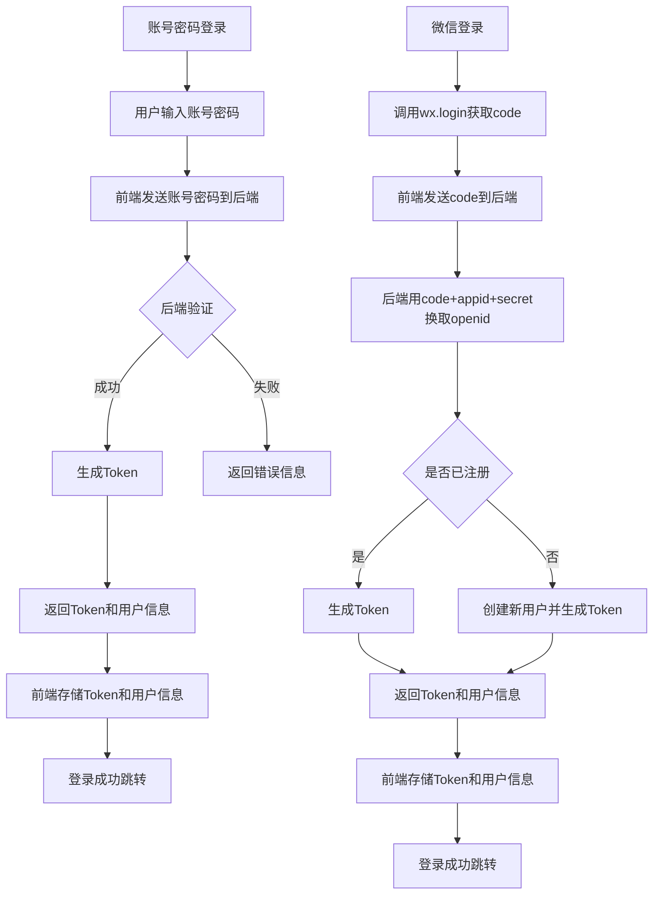
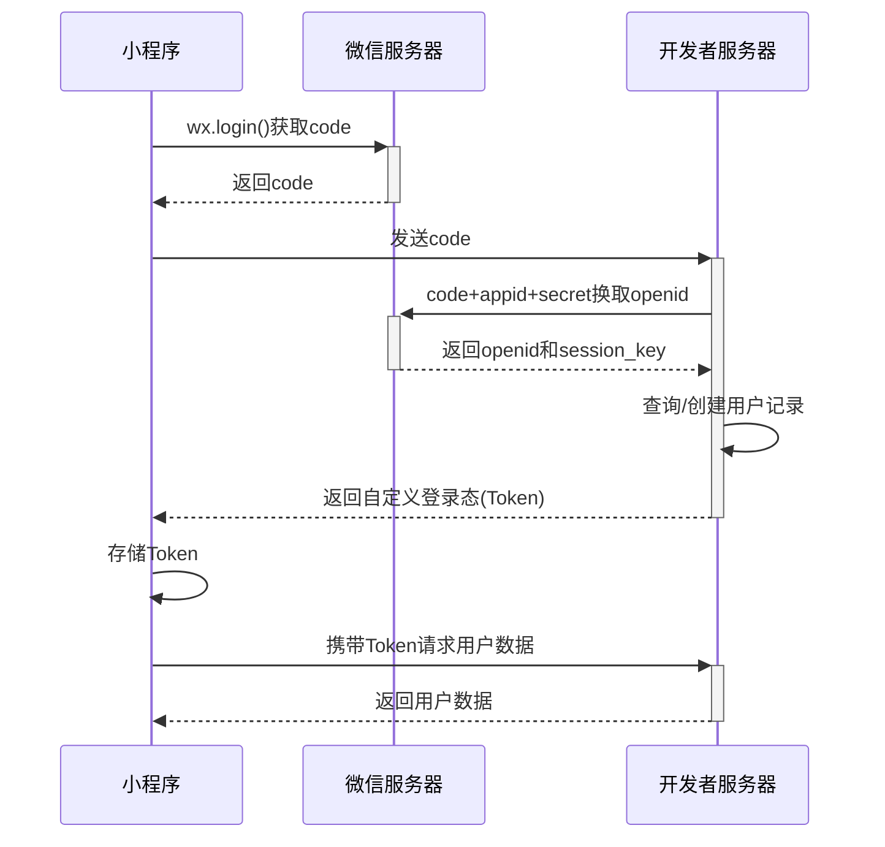

## 前言 ##

随着微信小程序的普及,如何设计一个安全可靠的登录系统变得尤为重要。本文将从实践角度详细介绍微信小程序中账号密码登录和微信登录的完整解决方案。

## 一、登录方案设计 ##

### 登录方式选择 ###

在小程序开发中,我们通常会遇到两种登录场景:

#### 账号密码登录 ####

- 适用于已有用户系统的迁移
- 用户可使用原有账号直接登录
- 支持更细粒度的权限控制

#### 微信登录 ####

- 一键快捷登录,用户体验好
- 可获取用户微信资料
- 适合新系统快速落地

### 技术方案对比 ###



## 二、账号密码登录实现 ##

### 界面实现 ###

因为先是做了pc端的项目，把pc端的功能都开发好之后要转到微信小程序的开发上，pc端的登录功能做了好多遍了但微信小程序还没做过，学了一下，账号密码登录的还是用后端的接口就行，逻辑是一样的，重点是微信登录实现。

```tsx
  <!-- 登录表单 -->
    <view class="form-container" hidden="{{activeTab !== 'login'}}">
      <form bindsubmit="handleLogin">
        <view class="form-item input-wrap">
          <text class="iconfont icon-icon_user"></text>
          <input name="username" model:value="{{loginForm.username}}"
           bindinput="handleInput"
           data-form="loginForm"
           data-field="username"
           placeholder="请输入用户名" />
        </view>
        
        <view class="form-item input-wrap">
            <text class="iconfont icon-icon_lock"></text>
            <input name="password" model:value="{{loginForm.password}}" 
            type="password" 
            bindinput="handleInput"
            data-form="loginForm"
            data-field="password"
            placeholder="请输入密码" />
        </view>

        <view class="form-item verify-code">
          <view class="input-wrap">
            <text class="iconfont icon-iconkey"></text>
            <input name="captcha" model:value="{{loginForm.captcha}}" 
            maxlength="5" 
            bindinput="handleInput"
            data-form="loginForm"
            data-field="captcha"
            placeholder="请输入验证码" />
          </view>
          <image class="code-img" src="{{verifyCodeUrl}}" bindtap="refreshVerifyCode"></image>
        </view>

        <button class="submit-btn" form-type="submit" bindtap="handleLogin">立即登录</button>
      </form>
    </view>

    <view class="register-link" bindtap="switchTab" data-tab="register" hidden="{{activeTab !== 'login'}}">
    还没有账号？<text bindtap="goRegister">立即注册</text>
  </view>
```

```ts
Page({
  data: {
     activeTab: 'login',
    // 登录表单数据
    loginForm: {
      username: '',
      password: '',
      captcha: '',
      uuid: ''
    },
  },


   // 切换登录/注册标签
  switchTab(e) {
    const tab = e.currentTarget.dataset.tab
    this.setData({
      activeTab: tab
    })
  },

  // 处理输入框获取焦点
  handleFocus(e) {
    const { field, form } = e.currentTarget.dataset
    this.clearError(form, field)
  },

  // 处理输入框内容变化
  handleInput(e) {
    const { field, form } = e.currentTarget.dataset;
    const value = e.detail.value;
    this.setData({
      [`${form}.${field}`]: value
    });
  },
 // 处理登录
  async handleLogin() {
    console.log(this.data.loginForm);
    if (!this.validateLoginForm()) return
    
    try {
      wx.showLoading({
        title: '登录中...',
        mask: true
      })
      
      const res = await request('/sys/auth/login',this.data.loginForm,'POST')
      
      wx.hideLoading()
      
      if (!res || !res.data) {
        throw new Error('服务器返回数据异常')
      }
      
      console.log('登录响应:', res.data)
      
      if (res.code === 0) {
        // 登录成功
        wx.showToast({
          title: '登录成功',
          icon: 'success'
        })
        // 保存token
        wx.setStorageSync('token', res.data.access_token)
        // 跳转到首页
        wx.switchTab({
          url: '/pages/home/home'
        })
      } else {
        // 登录失败
        wx.showToast({
          title: res.msg || '用户名或密码错误',
          icon: 'none'
        })
        this.refreshVerifyCode()
      }
    } catch (error) {
      wx.hideLoading()
      console.error('登录失败:', error)
      wx.showToast({
        title: error.message || '登录失败，请重试',
        icon: 'none'
      })
      this.refreshVerifyCode()
    }
  },
})
```

在微信小程序的 `<input>` 组件中，`name` 属性主要有以下两个核心作用：

#### 表单提交时作为字段标识 ####

当使用 `<form>` 表单提交时（通过 `bindsubmit` 事件），`name` 会成为数据对象的 `key`，例如：

```html
<form bindsubmit="handleSubmit"> 
    <input name="username" value="张三" />
    <button form-type="submit">提交</button>
</form>
```

提交后的事件对象中会包含：

```ts
e.detail.value = { username: "张三" // name作为字段名 }
```

#### 区分不同输入框（配合统一处理函数） ####

在 handleInput 场景下：

```html
<input name="username" bindinput="handleInput" />
```

可以通过 `e.currentTarget.dataset` 或 `e.detail` 获取输入框标识：

```javascript
handleInput(e) {
const field = e.currentTarget.dataset.name || e.currentTarget.dataset.field
const value = e.detail.value
this.setData({ [`loginForm.${field}`]: value }) }
```

**核心属性解析**

- `name="username"`

  - 表单提交时作为字段标识（与 `<form>` 配合使用）

  - 在 `bindsubmit` 事件中会生成 `e.detail.value.username` 的字段名

- `value="{loginForm.username}"`

  - 实现数据双向绑定的关键

  - 显示 `login.js` 中 `data.loginForm.username` 的初始值

  - 用户输入时会通过 `bindinput` 事件更新对应数据

- `bindinput="handleInput"`

  - 绑定输入事件处理函数

  - 每次输入内容变化时触发 `handleInput`方法

- `data-id="username"`

  - 自定义数据属性（非官方标准属性）

  - 可通过 `e.currentTarget.dataset.id` 获取值

  - 通常用于在统一处理函数中区分不同输入框

**特别注意事项**：

- 如果同时使用 `name` 和 `data-id` 会造成冗余，建议：

  - 表单提交场景保留 `name`

  - 非表单场景可只用 `data-id`

- 微信小程序新版支持 `model:value` 实现自动双向绑定：

```tsx
<input model:value="{{loginForm.username}}" />
```

## 三、微信登录实现 ##

微信小程序的微信登录是基于微信开放能力的一种便捷登录方式，其核心逻辑是通过微信提供的接口获取用户标识，然后与开发者服务器进行交互完成登录流程。

### 前端实现流程 ###

#### 调用 `wx.login` 获取临时 `code` ####

```javascript
// 小程序端代码
wx.login({
  success: (res) => {
    if (res.code) {
      // 获取到临时登录凭证code
      console.log('获取到的code:', res.code);
      this.sendCodeToServer(res.code);
    } else {
      console.log('登录失败！' + res.errMsg);
    }
  }
});
```

#### 将 `code` 发送到开发者服务器 ####

```javascript
sendCodeToServer(code) {
  wx.request({
    url: 'https://your-server.com/api/wechat-login',
    method: 'POST',
    data: { code },
    success: (res) => {
      if (res.data.token) {
        // 登录成功处理
        this.handleLoginSuccess(res.data);
      }
    }
  });
}
```

### 后端处理流程 ###

#### 接受小程序传来的 `code` ####

```js
// Node.js 示例
router.post('/api/wechat-login', async (ctx) => {
  const { code } = ctx.request.body;
  
  if (!code) {
    ctx.status = 400;
    ctx.body = { code: 400, message: '缺少code参数' };
    return;
  }
  
});
```

#### 使用 `code` 换取 `openid` 和 `session_key` ####

```js
const axios = require('axios');

async function getOpenId(code) {
  const appId = '你的小程序appid';
  const appSecret = '你的小程序appsecret';
  
  const url = `https://api.weixin.qq.com/sns/jscode2session?appid=${appId}&secret=${appSecret}&js_code=${code}&grant_type=authorization_code`;
  
  try {
    const response = await axios.get(url);
    return response.data;
  } catch (error) {
    console.error('获取openid失败:', error);
    return null;
  }
}
```

#### 处理用户信息（两种场景） ####

**场景1：新用户首次登录**

```javascript
// 检查用户是否存在
const user = await UserModel.findOne({ openid: sessionData.openid });

if (!user) {
  // 创建新用户
  const newUser = new UserModel({
    openid: sessionData.openid,
    createdAt: new Date(),
    lastLogin: new Date()
  });
  
  await newUser.save();
  return newUser;
}
```

**场景2： 老用户登录**

```ts
// 更新老用户登录信息
await UserModel.updateOne(
  { openid: sessionData.openid },
  { $set: { lastLogin: new Date() } }
);
```

#### 生成自定义登录态（Token） ####

```ts
const jwt = require('jsonwebtoken');

function generateToken(user) {
  return jwt.sign(
    {
      userId: user._id,
      openid: user.openid
    },
    'your-secret-key',
    { expiresIn: '7d' }
  );
}
```

#### 返回 Token 和用户消息给小程序 ####

```ts
ctx.body = {
  code: 200,
  message: '登录成功',
  token: generateToken(user),
  userInfo: {
    openid: user.openid,
    // 其他的用户信息
  }
};
```



