## 一、签名机制概述 ##

在Web应用开发中，API接口的安全性至关重要。随着前后端分离架构的普及，如何确保API调用的合法性、防止数据篡改、抵御重放攻击，成为每个开发者必须面对的问题。通常情况都是签名机制，但如何设计和实现签名机制需要仔细考虑，既不能过于繁琐，带来开发负担，也不能太少，缺乏安全性。

本文将介绍一套完整的*动态盐值* + *接口签名*安全方案，该方案具有以下特点：

- 多层防护：动态盐值 + 接口签名双重验证
- 防重放攻击：基于时间戳的有效期控制
- 防篡改：参数签名确保数据完整性
- 灵活配置：支持含参数/不含参数两种签名模式
- 易于扩展：支持多种算法（SHA-256、SM3等）

### 适用场景 ###

- 前后端分离的Web应用
- H5页面、小程序等多端调用
- 需要较高安全性的业务接口（支付、交易、敏感数据操作等）
- 需要防止接口被恶意调用或刷量

### 两种签名模式 ###

根据调用方是否能安全存储密钥，本方案支持两种签名模式：

#### 模式1：前端签名（需要动态盐值） ####

**适用场景**： 前端（H5、小程序、移动App）调用后端接口

**核心问题**： 前端无法安全存储密钥（secretKey），密钥一旦暴露在前端代码中，任何人都可以获取并伪造签名。

**解决方案**： 使用*动态盐值*作为中间层保护

- 前端请求动态盐值生成接口（公开接口，无需密钥）
- 服务端生成动态盐值并返回
- 前端携带动态盐值请求签名生成接口
- 服务端验证动态盐值后，使用密钥生成签名并返回
- 前端携带签名调用业务接口

**关键点**： 密钥始终存储在服务端，前端只能通过动态盐值换取签名，无法直接获取密钥。

#### 模式2：后端签名（无需动态盐值） ####

**适用场景**： 后端服务（微服务、定时任务、内部系统）调用后端接口

**核心优势**： 后端可以安全存储密钥（环境变量、配置中心、密钥管理系统），无需担心密钥泄露。

**简化流程**：

- 后端直接使用密钥生成签名：`SHA256(appCode + secretKey + apiPath + timestamp)`
- 后端携带签名调用业务接口
- 业务接口验证签名

**关键点**： 跳过动态盐值步骤，直接使用密钥签名，流程更简洁高效。

### 两种模式对比 ###


|  对比项  |  前端签名（需要动态盐值） |   后端签名（无需动态盐值）  |
| :-----------: | :----: | :----: |
| 密钥存储 |  ❌ 前端无法安全存储  |  ✅ 后端可以安全存储 |
| 动态盐值 |  ✅ 必须使用  |  ❌ 不需要 |
| 请求次数 |  3次（盐值+签名+业务）  |  1次（业务接口） |
| 安全性 |  高（密钥不暴露）  |  高（密钥安全存储） |
| 流程复杂度 |  较复杂  |  简单 |
| 典型场景 |  H5、小程序、App  |  微服务、定时任务、内部系统 |

> 重要提示： 本文主要介绍"前端签名"模式，如果你的场景是后端服务调用，可以直接跳到第四章，仅使用"不含参数签名算法"或"含参数签名算法"即可，无需实现动态盐值相关逻辑。

### 核心组件 ###

本方案包含以下核心组件：

|  组件  |  说明  |
| :-----------: | :----: |
| API调用者表 (api_users) |  存储调用方身份标识（appCode）和密钥（secretKey）  |
| API接口信息表 (api_info) |  存储接口路径、接口固定盐值、限流策略等  |
| API权限表 (api_auth) |  控制调用方对具体接口的访问权限  |
| 动态盐值生成接口 |  为后续调用生成一次性动态盐值  |
| 签名生成接口 |  基于动态盐值和密钥生成接口调用签名  |
| 业务接口拦截器 |  在业务接口调用前验证签名的合法性  |

## 二、签名机制原理 ##

### 整体流程 ###

签名机制的核心思想是：通过多次握手确保调用方身份可信，并为每次业务请求生成唯一签名。

完整的调用流程如下：

```mermaid
sequenceDiagram
    participant H5 as H5前端页面
    participant DynamicSaltGenerate as 动态盐值生成接口
    participant SignGenerate as 签名生成接口
    participant SubmitInterface as 某提交接口

    Note over H5,DynamicSaltGenerate: 1. 请求生成动态盐值（根据调用方和提交接口）
    H5->>DynamicSaltGenerate: 请求生成提交接口的动态盐值&#x3C;br/>（传参调用方和提交接口路径）
    DynamicSaltGenerate->>DynamicSaltGenerate: 根据调用方和提交接口生成动态盐值&#x3C;br/>hash(调用方 + 提交接口路径 + 提交接口盐值 + 当前时间戳)
    DynamicSaltGenerate-->>H5: 返回动态盐值信息&#x3C;br/>(提交接口动态盐值、动态盐值生成时间戳、提交接口路径)

    Note over H5, SignGenerate: 2. 请求生成接口调用签名（根据接口动态盐值和接口路径）
    H5->>H5: 解析参数(接口动态盐值、动态盐值生成时间戳、提交接口路径)
    H5->>SignGenerate: 请求签名&#x3C;br/>(调用方、接口动态盐值、提交接口路径、盐值生成时间戳)

    Note over SignGenerate: 3. 生成并返回接口调用签名（根据调用方和秘钥以及接口路径）
    SignGenerate->>SignGenerate: 权限校验(时效性、本签名接口权限、提交接口权限)
    SignGenerate->>SignGenerate: 动态盐值校验（算法需与生成时一致）&#x3C;br>check(调用方 + 提交接口路径 + 提交接口盐值 + 盐值生成时间戳)
    SignGenerate->>SignGenerate: 生成接口调用签名&#x3C;br/>hash(调用方 + 秘钥 + 当前时间戳 + 提交接口路径或参数) &#x3C;br/>注意：签名与校验算法需保持一致，如果只hash(调用方 + 秘钥 + 当前时间戳)也可以。
    SignGenerate-->>H5: 返回签名结果&#x3C;br/>(提交接口路径、签名、签名时间戳)

    Note over H5, SubmitInterface: 4. 调用某提交接口（携带签名）
    H5->>SubmitInterface: 提交数据，携带签名信息&#x3C;br/>(调用方+接口路径+签名+签名时间戳)

    Note over SubmitInterface: 5. 接口签名校验（保存前检查）
    SubmitInterface->>SubmitInterface: 权限校验(时效性、本提交接口权限)
    SubmitInterface->>SubmitInterface: 签名校验(校验算法与前面签名需保持一致)&#x3C;br/>check(调用方 + 秘钥 + 签名时间戳 + 接口路径或参数)
    SubmitInterface-->>H5: 返回处理结果
```



### 为什么需要"动态盐值"？ ###

你可能会问：*为什么不直接生成签名，而要先生成动态盐值？*

> 核心原因：前端无法安全存储密钥。

在前端签名场景中，如果前端直接持有 `secretKey` 并生成签名，密钥会被暴露在前端代码中（JavaScript、移动App的配置文件等），任何人都可以通过浏览器开发者工具或反编译获取密钥，从而伪造签名。

**动态盐值的作用**：

动态盐值本质上是一个**换签凭证**，它解决了前端无法持有密钥的问题：

- 密钥隔离：密钥（secretKey）始终保存在服务端，前端永远无法获取
- 时效保护：动态盐值作为"一次性令牌"，有独立的过期时间（如24小时）
- 接口隔离：每个接口有独立的固定盐值，动态盐值基于固定盐值生成，确保不同接口的签名互不影响
- 双重时效控制：动态盐值有效期（长，如24h） + 签名有效期（短，如10min），形成双层防护

**对比示意**：

```txt
❌ 不安全方式（前端直接持有密钥）：
前端代码：const secretKey = "abc123";  // 密钥暴露
前端生成签名：sign = SHA256(appCode + secretKey + path + time);

✅ 安全方式（动态盐值）：
前端获取动态盐值：dynamicSalt = 请求服务端;  // 无需密钥
前端换取签名：sign = 请求服务端(dynamicSalt);  // 服务端验证后返回签名
前端调用业务接口：携带 sign
```

**重要说明**： 如果是*后端签名场景*（如微服务调用、定时任务），后端可以安全存储密钥，无需使用动态盐值，直接使用密钥生成签名即可。

### 关键设计思想 ###

|  设计点  |  说明  |
| :-----------: | :----: |
| 双重时间戳 |  动态盐值时间戳（长效，如24h） + 签名时间戳（短效，如10min）  |
| 分层验证 |  先验证动态盐值有效性，再验证签名有效性  |
| 权限分离 |  API调用者权限、接口权限、调用者-接口映射权限三层管理  |
| 算法灵活 |  支持 SHA-256、SM3 等多种哈希算法  |

## 三、动态盐值机制 ##

> 适用场景说明： 本章节介绍的动态盐值机制适用于*前端签名场景*。如果你的场景是后端服务调用（密钥可安全存储），可以跳过本章，直接阅读第四章的签名算法。

### 动态盐值的生成 ###

动态盐值生成算法如下：

```java
// 伪代码
String dynamicSalt = SHA256(appCode + apiPath + interfaceSalt + saltTimestamp);
```

参数说明：

- `appCode`：调用方标识（如 "h5"、"miniapp"）
- `apiPath`：目标接口路径（如 "/api/order/submit"）
- `interfaceSalt`：接口固定盐值（从 api_info 表读取）
- `saltTimestamp`：动态盐值生成时间戳（毫秒）

实际代码实现：

```java
public DynamicSalt generateDynamicSalt(String appCode, String apiPath,
                                       String interfaceSalt, Long saltTimestamp) {
    // 拼接原始字符串
    String saltSource = appCode + apiPath + interfaceSalt + saltTimestamp;

    // 使用 SHA-256 计算动态盐值
    String dynamicSaltValue = sha256(saltSource);

    // 计算过期时间
    Long ttl = signConfig.getDynamicSaltTtl(); // 默认 24 小时
    LocalDateTime expireTime = Instant.ofEpochMilli(saltTimestamp + ttl)
            .atZone(ZoneId.systemDefault())
            .toLocalDateTime();

    return new DynamicSalt(appCode, apiPath, dynamicSaltValue, expireTime, saltTimestamp);
}
```

### 动态盐值的校验 ###

在签名生成接口中，需要先校验前端传来的动态盐值是否合法：

```java
// 伪代码
boolean validateDynamicSalt(String appCode, String apiPath, String interfaceSalt,
                           String dynamicSalt, Long saltTimestamp) {
    // 重新计算动态盐值
    String expectedSalt = SHA256(appCode + apiPath + interfaceSalt + saltTimestamp);

    // 比对是否一致
    return expectedSalt.equals(dynamicSalt);
}
```

校验逻辑：

- 使用相同的参数重新计算动态盐值
- 将计算结果与客户端传来的动态盐值比对
- 校验时间戳是否在有效期内（通过 `saltTimestamp + ttl` 判断）

## 两种校验模式 ##

动态盐值支持两种校验模式：


|  模式  |  说明 |   适用场景  |
| :-----------: | :----: | :----: |
| 算法校验 |  不存储动态盐值，每次通过算法重新计算并比对 |  默认模式，性能高，无需额外存储 |
| 数据库校验 |  将动态盐值存入 `api_dynamic_salt_log` 表，校验时查询数据库 |  需要严格控制一次性使用（防止重复使用） |

配置方式（`application.yml`）：

```yaml
sign:
  dynamic-salt:
    ttl: 86400000  # 24小时
    validate-from-database: false  # true 表示使用数据库校验
```

## 四、签名算法（含参数与不含参数） ##

### 不含参数的签名算法 ###

**使用场景**： GET请求、无需校验参数完整性的场景

**生成算法**：

```java
// 伪代码
String signature = SHA256(appCode + secretKey + apiPath + timestamp);
```

**实际代码实现**：

```java
public Sign generateSign(String appCode, String secretKey, String path) {
    // 获取当前时间戳
    long timestamp = System.currentTimeMillis();

    // 构建签名源字符串
    String signSource = appCode + secretKey + path + timestamp;

    // 使用 SHA-256 计算签名
    String signValue = sha256(signSource);

    // 计算过期时间
    long expireTimestamp = timestamp + signConfig.getSignatureTtl(); // 默认 10 分钟

    return new Sign(appCode, path, signValue, timestamp, expireTime);
}
```

**校验算法**：

```java
// 伪代码
boolean validateSign(String appCode, String secretKey, String path,
                    String signValue, Long timestamp) {
    // 重新计算签名
    String expectedSign = SHA256(appCode + secretKey + path + timestamp);

    // 比对是否一致
    return expectedSign.equals(signValue);
}
```

### 含参数的签名算法 ###

**使用场景**： POST请求、需要防止参数篡改的场景

**生成算法**：

```java
// 伪代码
String paramsString = buildSignatureSource(params); // 参数按 ASCII 排序后拼接
String signature = SM3(paramsString + appCode + secretKey + apiPath + timestamp);
```

**实际代码实现**：

```java
public Sign generateSignWithParams(String appCode, String secretKey, String path,
                                   Map<String, Object> params) {
    // 获取当前时间戳
    long timestamp = System.currentTimeMillis();

    // 构建参数字符串（按 ASCII 排序）
    String paramsSource = SignatureUtil.buildSignatureSource(params);

    // 构建签名源字符串
    String signSource = paramsSource + appCode + secretKey + path + timestamp;

    // 使用 SM3 算法计算签名
    String signValue = SmUtil.sm3(signSource);

    return new Sign(appCode, path, signValue, timestamp, expireTime);
}
```

### 参数签名的关键：参数排序 ###

为确保前后端参数拼接顺序一致，需要对参数进行*ASCII字典序*排序：

```java
public static String buildSignatureSource(Map<String, Object> parameters) {
    if (parameters.isEmpty()) {
        return "";
    }

    // 1. 按字典序排序参数键
    List<String> sortedKeys = new ArrayList<>(parameters.keySet());
    Collections.sort(sortedKeys);

    StringBuilder signatureBuilder = new StringBuilder();
    boolean first = true;

    for (String key : sortedKeys) {
        Object paramValue = parameters.get(key);

        // 2. 跳过 null 和复杂类型
        if (paramValue == null || isComplexType(paramValue)) {
            continue;
        }

        String valueStr = paramValue.toString();
        // 3. 跳过空串
        if (valueStr.isEmpty()) {
            continue;
        }

        if (!first) {
            signatureBuilder.append("&");
        }
        first = false;
        signatureBuilder.append(key).append("=").append(valueStr);
    }

    return signatureBuilder.toString();
}
```

**示例**：

假设请求参数为：

```json
{
  "userName": "张三",
  "mobile": "19212341234",
  "userId": "321123",
  "emptyParam": null,
  "emptyNo": ""
}
```

经过排序和过滤后，参数字符串为：

```txt
mobile=19212341234&userId=321123&userName=张三
```

注意：`null` 和空字符串会被跳过。

### 两种算法的对比 ###

|  对比项  |  不含参数签名  |   含参数签名  |
| :-----------: | :----: | :----: |
| 算法 |  SHA-256  |  SM3（国密算法） |
| 签名内容 |  appCode + secretKey + path + timestamp  |  params + appCode + secretKey + path + timestamp |
| 安全性 |  中等，仅防止路径篡改  |  高，防止参数篡改 |
| 性能 |  较快  |  稍慢（需解析参数） |
| 适用场景 |  GET、无敏感参数的接口  |  POST、支付、交易等敏感接口 |

## 五、签名机制的作用 ##

### 核心安全作用 ###

|  作用  |  说明  |   实现方式  |
| :-----------: | :----: | :----: |
| 身份验证 |  验证调用方身份是否合法  |  通过 appCode + secretKey 验证 |
| 防重放攻击 |  防止攻击者截获请求后重复发送  |  通过时间戳 + TTL 限制签名有效期 |
| 防篡改 |  防止请求参数或路径被篡改  |  通过签名校验确保数据完整性 |
| 权限控制 |  控制不同调用方对不同接口的访问权限  |  通过 api_auth 表管理权限 |
| 限流防刷 |  防止接口被恶意刷量  |  通过 api_info 表配置限流策略 |

### 具体防护场景 ###

#### 场景1：防止请求重放 ####

攻击者截获了一次合法请求：

```txt
POST /api/order/submit

Headers:
  Sign-appCode: h5
  Sign-sign: abc123...
  Sign-time: 1672531200000
```

当攻击者尝试重放该请求时：

- 如果当前时间超过 `Sign-time + TTL`（如10分钟），签名已过期，验证失败
- 即使在有效期内，由于动态盐值已过期（24小时），无法通过动态盐值验证

#### 场景2：防止参数篡改 ####

正常请求：

```json
{
  "amount": 100,
  "productId": "12345"
}
```

攻击者篡改参数：

```json
{
  "amount": 1,  // 篡改
  "productId": "12345"
}
```

由于参数变化，重新计算的签名与原签名不匹配，验证失败。

#### 场景3：防止越权访问 ####

调用方 `"h5"` 尝试访问未授权的接口 `"/api/admin/delete"`：

- 在 api_auth 表中查不到 `("h5", "/api/admin/delete")` 的授权记录
- 拦截器拒绝访问，返回 401

## 六、如何取舍？既不过度增加开发负担，又能保证安全可靠 ##

### 四种安全级别方案 ###

根据业务场景和调用方类型，可以选择不同的安全级别：

#### 方案0：后端直接签名（推荐后端服务使用）⭐ ####

- 适用场景： 后端服务调用后端接口（微服务、定时任务、内部系统）

- 核心优势： 后端可以安全存储密钥，无需动态盐值，流程最简洁

- 实现步骤：

  - 后端服务读取密钥（从环境变量、配置中心等）
  - 后端直接生成签名：`SHA256(appCode + secretKey + apiPath + timestamp)`
  - 后端携带签名调用业务接口（Header: Sign-appCode, Sign-sign, Sign-time, Sign-path）
  - 业务接口验证签名

- 示例代码（Java）：

```java
// 后端服务中的签名生成
public String generateSignForBackend(String appCode, String secretKey, String apiPath) {
    long timestamp = System.currentTimeMillis();
    String signSource = appCode + secretKey + apiPath + timestamp;
    String signature = DigestUtils.sha256Hex(signSource);

    // 设置到请求 Header
    httpRequest.setHeader("Sign-appCode", appCode);
    httpRequest.setHeader("Sign-sign", signature);
    httpRequest.setHeader("Sign-time", String.valueOf(timestamp));
    httpRequest.setHeader("Sign-path", apiPath);

    return signature;
}
```

**优点**：

- 流程最简单，只需1次请求
- 性能最高，无需额外的动态盐值请求
- 密钥安全存储在后端

**缺点**： 

- 无

配置示例（application.yml）：

```yaml
sign:
  signature:
    ttl: 600000  # 10分钟
    default-with-params: false  # 如需防参数篡改，设为 true
  # 无需配置 dynamic-salt
```

**重要提示**： 后端服务调用时，密钥应通过环境变量或配置中心管理，不要硬编码在代码中。

#### 方案1：基础签名（低安全性，前端场景） ####

**适用场景**： 前端调用，内部系统、低敏感度接口、信任环境

**配置**：

- 仅使用"不含参数签名"
- 不启用动态盐值（⚠️ 注意：前端需调用签名生成接口，而非直接持有密钥）
- 签名有效期较长（如30分钟或2小时）

**实现步骤**：

- 前端直接调用签名生成接口（不需要先获取动态盐值）,或进入页面后由后端生成签名返回给前端
- 后端生成签名：`SHA256(appCode + secretKey + path + timestamp)`
- 前端携带签名调用业务接口

**优点**： 开发简单，性能高

**缺点**： 安全性较低，不防参数篡改，前端仍需额外请求签名

#### 方案2：标准签名（中安全性，前端场景）⭐ 前端推荐 ####

**适用场景**： 前端调用，大多数业务场景、前后端分离应用

**配置**：

- 使用"不含参数签名"
- 启用动态盐值（算法校验模式）
- 动态盐值有效期：24小时
- 签名有效期：10分钟

**实现步骤**：

- 前端请求动态盐值生成接口
- 前端携带动态盐值请求签名生成接口
- 后端验证动态盐值 → 生成签名
- 前端携带签名调用业务接口
- 后端验证签名

**优点**： 安全性好，开发负担适中

**缺点**： 需要多一次动态盐值请求

**配置示例（application.yml）**：

```yaml
sign:
  dynamic-salt:
    ttl: 86400000  # 24小时
    validate-from-database: false  # 算法校验
  signature:
    ttl: 600000  # 10分钟
    default-with-params: false  # 不含参数
```

#### 方案3：高安全签名（高安全性，前端场景） ####

**适用场景**： 前端调用，支付、交易、敏感数据操作

**配置**：

- 使用"含参数签名"（SM3算法）
- 启用动态盐值（数据库校验模式）
- 动态盐值一次性使用（used 字段标记）
- 签名有效期：10分钟

**实现步骤**：

- 前端请求动态盐值生成接口
- 后端生成动态盐值并存入数据库（api_dynamic_salt_log表）
- 前端携带动态盐值请求签名生成接口
- 后端从数据库查询动态盐值，校验后标记为已使用
- 后端生成含参数签名
- 前端携带签名和参数调用业务接口
- 后端提取参数，验证签名（包含参数）

**优点**： 安全性最高，防参数篡改，防动态盐值重放

**缺点**： 开发复杂度高，性能稍低（需读写数据库）

**配置示例（application.yml）**：

```yaml
sign:
  dynamic-salt:
    ttl: 86400000
    validate-from-database: true  # 数据库校验
  signature:
    ttl: 300000  # 5分钟
    default-with-params: true  # 含参数
```

### 方案对比 ###

|  对比项  |  后端直接签名⭐  |  基础签名（前端） |  标准签名（前端）⭐  |  高安全签名（前端）  |
| :-----------: | :----: | :----: | :----: | :----: |
| 调用方 |  后端服务  |  前端 |  前端 |  前端 |
| 密钥存储 |  ✅ 后端安全存储  |  ❌ 前端无法持有 |  ❌ 前端无法持有 |  ❌ 前端无法持有 |
| 动态盐值 |  ❌ 不需要  |  ❌ 不使用 |  ✅ 算法校验 |  ✅ 数据库校验 |
| 参数签名 |  可选  |  ❌ 不含参数 |  ❌ 不含参数 |  ✅ 含参数（SM3或SHA256） |
| 请求次数 |  1次（直接调用）  |  2次（换签+业务） |  3次（盐值+签名+业务） |  3次（盐值+签名+业务） |
| 安全级别 |  ⭐⭐⭐⭐  |  ⭐⭐ |  ⭐⭐⭐⭐ |  ⭐⭐⭐⭐⭐ |
| 开发复杂度 |  极低  |  低 |  中 |  高 |
| 性能 |  最高  |  高 |  中 |  中低 |
| 典型场景 |  微服务、定时任务  |  内部前端系统 |  一般前端应用 |  支付、交易前端 |

**选择建议**：

- 后端服务调用 → *方案0：后端直接签名*
- 前端一般应用 → *方案2：标准签名*
- 前端支付交易 → *方案3：高安全签名*

### 实施建议 ###

#### 区分调用方类型 ####

首先明确调用方是前端还是后端：

```java
// 后端服务调用 - 直接使用密钥签名，无需动态盐值
@Service
public class BackendServiceClient {
    @Value("${api.app-code}")
    private String appCode;

    @Value("${api.secret-key}")
    private String secretKey;

    public void callRemoteApi(String apiPath, Map<String, Object> params) {
        // 直接生成签名
        long timestamp = System.currentTimeMillis();
        String signSource = appCode + secretKey + apiPath + timestamp;
        String signature = DigestUtils.sha256Hex(signSource);

        // 发送请求
        HttpHeaders headers = new HttpHeaders();
        headers.set("Sign-appCode", appCode);
        headers.set("Sign-sign", signature);
        headers.set("Sign-time", String.valueOf(timestamp));
        headers.set("Sign-path", apiPath);

        // ... 发送 HTTP 请求
    }
}
```

#### 按接口分级保护 ####

可以为不同接口设置不同的安全级别：

```java
// 查询接口 - 不含参数签名
@RequireSign(withParams = WithParams.FALSE)
public ApiResponse getUserInfo() { ... }

// 提交接口 - 不含参数签名
@RequireSign(withParams = WithParams.FALSE)
public ApiResponse submitOrder() { ... }

// 支付接口 - 含参数签名（高安全）
@RequireSign(withParams = WithParams.TRUE)
public ApiResponse payment() { ... }
```

#### 渐进式升级 ####

- 第一阶段：后端服务使用方案0（直接签名）
- 第二阶段：前端使用方案2（动态盐值 + 不含参数签名）
- 第三阶段：为敏感接口升级到方案3（含参数签名）

#### 监控与告警 ####

记录签名验证失败的日志，设置告警：

```java
if (!isValid) {
    log.warn("签名验证失败 - appCode={}, path={}, sign={}",
             appCode, serverPath, sign);
    // 触发告警（如钉钉、邮件）
}
```

#### 白名单机制 ####

为特定调用方（如运维工具）设置白名单，跳过签名验证：

```java
@IgnoreSignHeader  // 跳过签名验证
public ApiResponse healthCheck() { ... }
```

## 七、代码示例 ##

### 前端示例代码（JavaScript） ###

```javascript
// 1. 获取动态盐值
async function getDynamicSalt(appCode, apiPath) {
  const saltTimestamp = Date.now();
  const response = await fetch('/api/sign/dynamic-salt/generate', {
    method: 'POST',
    headers: { 'Content-Type': 'application/json' },
    body: JSON.stringify({ appCode, apiPath, saltTimestamp })
  });
  return await response.json(); // { dynamicSalt, saltTimestamp, apiPath }
}

// 2. 获取签名
async function getSignature(appCode, apiPath, dynamicSalt, dynamicSaltTime) {
  const response = await fetch('/api/sign/generate', {
    method: 'POST',
    headers: { 'Content-Type': 'application/json' },
    body: JSON.stringify({ appCode, apiPath, dynamicSalt, dynamicSaltTime })
  });
  return await response.json(); // { signValue, timestamp, apiPath }
}

// 3. 调用业务接口
async function submitOrder(orderData) {
  // 3.1 获取动态盐值
  const { dynamicSalt, saltTimestamp } = await getDynamicSalt('h5', '/api/order/submit');

  // 3.2 获取签名
  const { signValue, timestamp } = await getSignature('h5', '/api/order/submit',
                                                       dynamicSalt, saltTimestamp);

  // 3.3 调用业务接口
  const response = await fetch('/api/order/submit', {
    method: 'POST',
    headers: {
      'Content-Type': 'application/json',
      'Sign-appCode': 'h5',
      'Sign-sign': signValue,
      'Sign-time': timestamp.toString(),
      'Sign-path': '/api/order/submit'
    },
    body: JSON.stringify(orderData)
  });

  return await response.json();
}
```

## 八、总结 ##

本文详细介绍了一套完整的API接口安全方案，通过动态盐值 + 接口签名的双重验证机制，有效防止了重放攻击、参数篡改和越权访问。

**核心要点**：

- 区分调用方类型

  - 后端服务调用：密钥可安全存储，直接使用密钥签名，无需动态盐值
  - 前端调用：密钥无法安全存储，必须使用动态盐值作为"换签凭证"

- 动态盐值的作用

  - 解决前端无法持有密钥的核心问题
  - 作为"一次性令牌"，增强安全性
  - 仅适用于前端签名场景

- 灵活的签名模式

  - 支持"含参数/不含参数"两种签名模式
  - 支持多种哈希算法（SHA-256、SM3等）
  - 通过注解灵活控制接口级别的签名策略

- 四种安全方案

  - 方案0：后端直接签名（后端服务推荐）
  - 方案1：基础签名（前端低安全场景）
  - 方案2：标准签名（前端一般场景推荐）
  - 方案3：高安全签名（前端支付交易场景）

**实施建议**：

- 后端服务调用 → 使用方案0，直接持有密钥签名，性能最优
- 前端一般应用 → 使用方案2（动态盐值 + 不含参数签名）
- 前端支付交易 → 使用方案3（动态盐值 + 含参数签名）
- 按接口分级保护，灵活组合不同方案

**关键提醒**：

- ⚠️ 前端永远不要持有密钥（secretKey），必须通过动态盐值换取签名
- ✅ 后端可以安全持有密钥，无需使用动态盐值，简化流程
- 🔒 密钥应通过环境变量、配置中心等安全方式管理

> 希望本文能帮助你在实际项目中快速落地API接口安全方案！如有任何疑问或建议，欢迎留言探讨。
