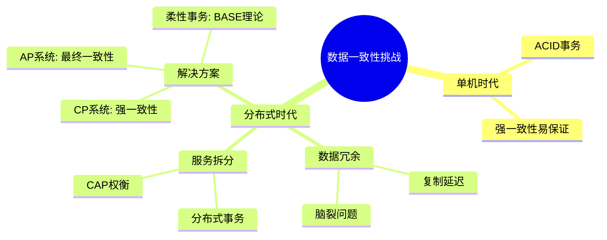
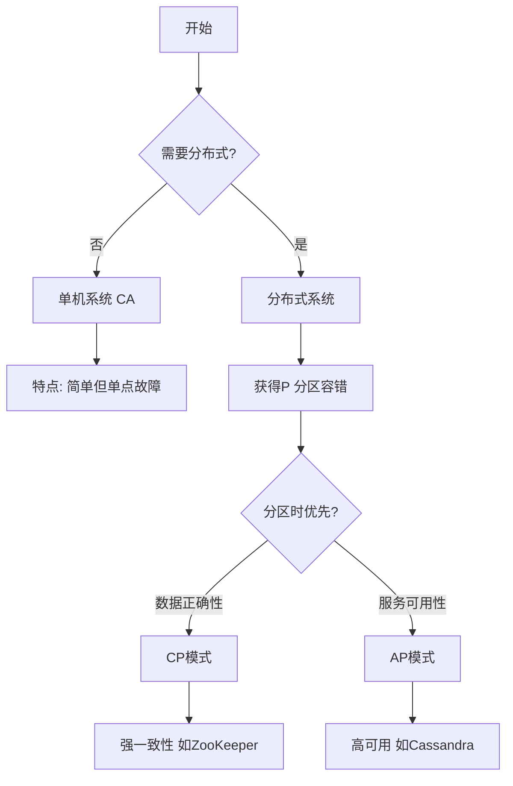
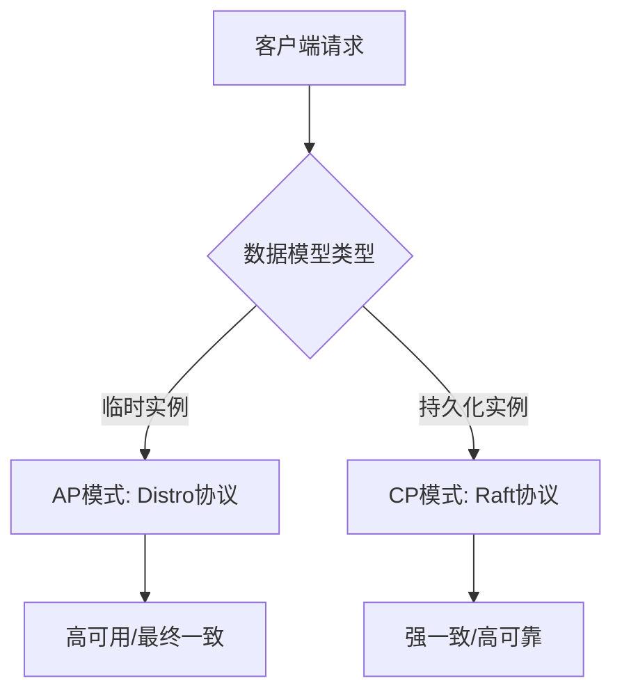

## 前言 ##

在构建一个单机系统时，我们通常无需担心数据一致性和服务可用性之间的深刻矛盾。然而，一旦迈入分布式系统的领域，事情就变得复杂起来。网络变得不可靠，机器会随时宕机。我们该如何设计系统，使其既能横向扩展，又能保持稳定可靠？

这个问题没有完美的解决方案。CAP 理论也因此出现，揭示了这一分布式系统领域根本性的权衡法则。理解 CAP，是理解所有现代分布式数据库、中间件和系统架构设计的关键起点。

本文主要介绍了什么是CAP理论，以及在实践中如何进行选取和衡量。随着系统变复杂，数据状态管理如何成为核心挑战，下图给出系统复杂以后的数据一致性挑战脑图，仅供参考：

## 什么是 CAP 理论？ ##

CAP 理论由计算机科学家 Eric Brewer 在 2000 年提出。它指出，对于一个分布式计算系统来说，以下三个核心特性不可能同时完全满足，最多只能同时满足两项：

- 一致性（Consistency）
- 可用性（Availability）
- 分区容错性（Partition Tolerance）

### C：一致性（Consistency） ###

*一句话概括：“所有节点在同一时间看到的数据是完全相同的。”*

这里的一致性指的是强一致性。当你向分布式系统写入一条数据后，无论之后从哪个节点读取，都应该能读到最新写入的值。就像单机数据库一样，系统表现得“好像”只有一个数据副本。

例子：你在银行账户A向账户B转账100元。转账成功后，无论你从哪个ATM机（即系统中的不同节点）查询，账户A的余额都应该准确减少100元，账户B的余额准确增加100元。

### A：可用性（Availability） ###

*一句话概括： “每一个非故障的节点都必须对每一个请求做出响应。”*

系统的任何请求都能在有限时间内获得一个非错的响应。重点是“每一个”和“有限时间”，这意味着系统不能以等待数据同步为由而拒绝服务或无限期延迟响应。

例子：即使发生网络故障，导致部分ATM机无法与总行数据中心同步，这些ATM机仍然可以提供服务，比如允许你查询余额（可能是稍早的数据）或进行小额取款，而不是直接显示“系统繁忙”或“服务中断”。

### P：分区容错性（Partition Tolerance） ###

*一句话概括： “系统在遇到网络分区（脑裂）的情况下，仍然能够继续对外提供服务。”*

网络分区是指由于网络故障，导致分布式系统中的节点被分割成不同的孤岛，彼此之间无法通信。分区容错性要求系统能够容忍这种网络故障的发生，而不是整体崩溃。

例子：公司的两个数据中心之间网络光缆被挖断，导致两个数据中心无法同步数据。系统需要有能力处理这种状况，而不是完全宕机。

关键洞察： 在分布式系统中，网络分区（P）是必然会发生的故障，无法避免。因此，分区容错性（P）是必须选择的。这就使得设计者实际上只能在一致性（C）和可用性（A）之间做出艰难的选择。

补充说明：A（可用性）和P（分区容错性）在目标上有相似之处，它们都致力于让系统保持“可服务”状态。A和P的最终目的都是为了系统能继续干活。但是也存在如下的区别：

- 可用性：注重但节点故障，要求系统持续对请求做出响应。
- 分区容错性：要求系统在出现分区联系故障时，仍然能继续对外提供服务。

### 三选二：并非完全弃一，而是侧重权衡 ###

CAP理论最关键的洞察在于，它定义了分布式系统在面临*特定故障（即网络分区）* 时的行为边界。它并非要求系统在任何时候都完全牺牲掉三个属性中的一个，而是揭示了当最坏情况发生时，系统设计师必须做出的根本性取舍。

*更准确的描述是*： 在分布式系统正常运行（无网络分区） 时，系统有可能同时较好地满足一致性（C）和可用性（A）。然而，一旦发生网络分区（P），由于节点之间无法通信，维持强一致性（C）就要求系统阻止部分操作，从而与保证所有节点可用（A）产生了不可调和的矛盾。此时，系统必须根据其设计目标，优先保障其中一方。

上面的流程图清晰地展示了逻辑链条：

- 架构选择：你的第一个，也是最根本的选择，是是否采用分布式架构。如果你选择“否”，即构建一个单机系统（或通过共享存储等特殊方式避免网络分区），那么你的系统在理论上就是CA的。它的代价是扩展性和可靠性受限于单点。
- P是分布式系统的天然属性：如果你选择“是”，即构建一个分布式系统，那么由于你引入了网络，分区容错性就成为了一个你必须面对和处理的固有属性。在这种情况下，你的设计就不再是“是否选择P”，而是变成了“当P必然发生时，我该如何在C和A之间权衡”。

## CAP对应的模型和应用 ##

### CP without A：一致性优先模型 ###

- 核心特征：当分区（P）发生时，系统优先保证强一致性（C），为此不惜牺牲可用性（A）。系统会阻塞写入操作或使部分节点不可用，直到数据同步问题解决，以避免出现数据不一致的情况。
- 工作机制：通常基于共识算法（如 Paxos、Raft）实现，要求写操作必须被大多数节点确认。一旦发生分区，无法形成多数派的节点分区将无法处理写请求，从而保证数据强一致。
- 常见应用：
  - 分布式数据库与存储：Etcd, ZooKeeper, HBase。这些系统通常作为分布式系统的“真相之源”，存储元数据、配置或锁信息，一致性是首要目标。
  - 分布式锁服务：锁的状态必须全局一致，否则会导致业务逻辑错误。
  - 金融核心系统：如分布式账本，数据的正确性远高于服务的短暂中断。

### AP without C：可用性优先模型 ###

- 核心特征：当分区（P）发生时，系统优先保证高可用性（A），允许数据出现暂时的不一致（即放弃强一致性C）。每个节点都能独立响应请求，保证服务不中断。
- 工作机制：采用最终一致性模型。分区期间，不同节点可独立处理写操作。分区恢复后，系统通过版本向量、冲突解决算法（如“最后写入获胜”LWW）或CRDTs等手段解决数据冲突，最终达成一致。
- 常见应用：
  - 大多数 NoSQL 数据库：Cassandra, DynamoDB, Couchbase。它们为海量数据和高并发访问设计，可用性和扩展性是关键。
  - Web 缓存与 CDN：保证用户能快速访问内容，即使内容不是最新的。
  - 域名系统（DNS）：全球DNS查询需要极高的可用性，允许各级缓存存在短暂的刷新延迟。

### CA without P：非分布式或特定集群模型 ###

- 核心特征：理论上，放弃分区容错性（P）可以同时保证强一致性（C）和高可用性（A）。但这在真正的多主分布式系统中是无法实现的。所谓的“CA系统”通常是通过特定架构规避或弱化了分区问题。
- 实现方式：
  - 单机系统：最简单的CA系统，无分区问题，但存在单点故障。
  - 主备集群与共享存储集群：如传统关系数据库集群（Oracle RAC）。它们通过共享磁盘或虚拟IP漂移实现故障转移。其“CA”特性依赖于集群网络的高可靠性，一旦发生脑裂（即真正的网络分区），集群管理软件会通过“踢出”节点（瞬间变为CP行为）来维持数据一致，从而掩盖了P下的权衡。
- 常见应用：
  - 传统企业级数据库集群：在可控的网络环境（如同一机房）内提供高可用性。
  - xFS 等分布式文件系统：在其设计语境下，假设内部网络是可靠的。

## 典型案例：注册中心的 CAP 抉择 ##

在微服务架构中，服务实例会频繁地上下线（扩容、缩容、故障）。注册中心的核心职责是：

- 服务注册：实例上线时向注册中心注册自身。
- 服务发现：消费者从注册中心拉取健康的服务实例列表。
- 健康检查：剔除失效的实例。

当网络分区（例如，数据中心内部网络抖动，导致注册中心集群被分割）发生时，CAP的权衡就变得至关重要。

### ZooKeeper：坚定的CP选择 ###

要理解 ZooKeeper 的 CP，必须理解其核心：ZooKeeper Atomic Broadcast 协议。

- 写请求（如服务注册）必须由 Leader 处理：集群中只有一个节点是 Leader，所有写请求都必须发给它。
- 写操作需要“多数派”确认：Leader 将写操作作为提案广播给所有 Follower。只有收到超过半数节点的确认后，Leader 才会提交这个提案，并通知客户端写操作成功。
- 读请求可以由任何节点处理，但保证读到最新数据：Follower 可以处理读请求。但为了确保线性一致性，如果 Follower 发现自己不是最新的，它会先与 Leader 同步数据，再返回结果。

让我们通过一个序列图，直观地展示当网络分区发生时，ZooKeeper 是如何坚守 CP 阵地的：

```mermaid
sequenceDiagram
    participant C1 as 客户端A
    participant L as Leader (N3)
    participant F1 as Follower (N2)
    participant F2 as Follower (N1)

    Note over L, F2: 正常状态：3节点集群
    C1 ->> L: 写请求（服务注册）
    L ->> F1: 广播提案
    L ->> F2: 广播提案
    Note over L: 等待多数派确认 (>=2)
    F1 ->> L: ACK
    F2 ->> L: ACK
    L ->> C1: 写入成功！

    Note over L, F2: 发生网络分区：N1与集群失联
    Note over F1, L: 多数派分区 [N2, N3]
    Note over F2: 少数派分区 [N1]

    participant C2 as 客户端B
    C2 ->> F1: 写请求（服务注册）
    F1 ->> L: 转发写请求
    L ->> F1: 广播提案
    Note over L: 等待多数派确认 (>=2)
    F1 ->> L: ACK
    Note over L: 已获2票（N2,N3），满足多数派
    L ->> F1: 提交
    F1 ->> C2: 写入成功！

    participant C3 as 客户端C
    C3 ->> F2: 写请求（服务注册）
    Note over F2: 我是Follower，且与Leader失联
    F2 ->> C3: 错误：连接失败 / 无Leader
    Note over C3: 写入失败！&#x3C;br>牺牲了可用性(A)
```

上图清晰地展示了以下关键点：

- 多数派分区 `[N2, N3]` 继续工作：它们拥有 2/3 的节点，满足多数派，可以选举出新的 Leader（假设是 N3），并正常处理写请求。对于连接到这个分区的客户端（如 C2），服务正常。
- 少数派分区 `[N1]` 完全失效：它只有 1/3 的节点，无法形成多数派，因此无法选举出 Leader。这个分区变为只读状态，甚至可能无法正常服务。
  - 对于写请求：直接失败（如客户端 C3）。这就是“牺牲可用性”的体现。
  - 对于读请求：它只能提供自己最后已知的数据，这些数据很可能是过时的。但由于 ZooKeeper 的机制，它可能会拒绝服务或返回错误，以避免返回旧数据。

### Eureka：高可用的 AP 选择 ###

核心设计目标： Eureka 被设计为一个高可用的服务发现组件。在微服务架构中，它的首要任务是确保服务消费者永远能拿到一个服务实例列表，从而保证服务调用的基本通路不被切断。即使这个列表不是100%准确，也远比因为注册中心本身瘫痪而导致整个系统无法服务要好得多。

Eureka 实现 AP 的基石是其去中心化的对等架构和最终一致性模型。

- 对等节点：Eureka Server 节点之间是平等的，没有主从之分。每个节点都可以独立接受注册和查询请求。
- 异步复制：节点间通过异步的 HTTP 请求相互复制注册表信息。一个节点接收到注册信息后，会异步地将其传播到集群中的其他节点，不要求实时同步完成。
- 客户端缓存：Eureka Client（服务提供者和消费者）会在本地缓存服务注册信息，并不完全依赖每次调用都去查询 Server。

让我们通过一个序列图，直观地展示当网络分区发生时，Eureka 是如何优先保障可用性的：

```mermaid
sequenceDiagram
    participant S1 as 服务实例A
    participant EU1 as Eureka Server 1
    participant EU2 as Eureka Server 2
    participant EU3 as Eureka Server 3
    participant C as 服务消费者

    Note over EU1,EU3: 正常状态：3节点集群，相互复制
    S1 ->> EU1: 注册/心跳
    EU1 ->> EU2: 异步复制注册信息
    EU1 ->> EU3: 异步复制注册信息

    Note over EU1,EU3: 发生网络分区：EU3与集群失联
    Note over EU1,EU2: 分区1 [EU1, EU2]
    Note over EU3: 分区2 [EU3]

    participant S2 as 服务实例B
    S2 ->> EU3: 注册/心跳（成功！）
    Note over EU3: EU3独立更新自己的注册表

    C ->> EU1: 拉取服务列表
    Note over EU1: 返回分区1的列表&#x3C;br>（包含S1，不含S2）
    EU1 ->> C: 服务列表（缺少S2）

    C ->> EU3: 拉取服务列表（如果DNS解析到此）
    Note over EU3: 返回分区2的列表&#x3C;br>（包含S2，可能缺少S1的最新状态）
    EU3 ->> C: 服务列表（包含S2）

    Note over EU1,EU3: 网络分区恢复
    EU1 ->> EU3: 重新开始复制，增量同步
    EU3 ->> EU1: 重新开始复制，增量同步
    Note over EU1,EU3: 最终达成一致
```

上图清晰地展示了 Eureka 的 AP 特性：

- 分区期间，所有节点依然可用：

  - 分区1 `[EU1, EU2]`：继续相互复制，正常接受注册和查询。
  - 分区2 `[EU3]`：即使孤身一人，它也继续工作！ 它仍然可以接受其所在分区内服务实例（S2）的注册和心跳，并能响应服务消费者（C）的查询。这就是“保证可用性”的极致体现。

- 数据出现临时不一致：

- 服务消费者从不同分区拉取到的服务列表是不同的。从 `[EU1, EU2]` 拉取的列表缺少 S2，从 `[EU3]` 拉取的列表可能缺少 S1 或认为 S1 已下线。
- 这就是“牺牲一致性”的表现，Eureka 允许这种“脏读”发生。

- 分区恢复后，最终一致：

  - 网络恢复后，两个分区的 Eureka Server 重新建立连接，通过异步复制相互同步数据，最终各个节点的数据会再次达成一致。

好的，我们来详细解析 Nacos 灵活的 CP + AP 双模式。这是 Nacos 相对于 ZooKeeper 和 Eureka 最核心的竞争优势，它通过一种巧妙的方式，打破了“三选二”的僵局，实现了“鱼与熊掌兼得”。

### Nacos：灵活的 CP + AP 双模式 ###

核心设计目标： Nacos 旨在成为一个更全面、更适应现代微服务和云原生架构的动态服务发现和配置管理中心。它认识到，不同的数据和应用场景对一致性和可用性的要求是不同的，因此不应该用一个固定的 CAP 模式来应对所有情况。

Nacos 的灵活性源于其底层将数据分为不同的类型，并对不同类型的数据采用不同的一致性协议。

- 临时实例：这类服务实例的生命周期与客户端心跳绑定。如果客户端停止发送心跳，实例数据会被自动删除。
- 持久化实例/配置数据：这类数据的生命周期与 Nacos 服务器绑定，与客户端心跳无关，需要显式调用 API 来创建和删除。

Nacos 为这两种数据模型配备了不同的“引擎”：

|  数据模型  |  默认一致性协议  |   CAP 模式  |   类比  |
| :-----------: | :----: | :----: |   :----:  |
| 临时实例 |  Distro 协议  |  AP |  类似于 Eureka 的行为，优先保证可用性。 |
| 持久化实例/配置 |  Raft 协议  |  CP |  类似于 ZooKeeper 的行为，优先保证一致性。 |

这种设计是 Nacos 架构的精髓，可以用下图来直观展示其双模式的工作方式：

#### 临时实例的 AP 模式 ####

- 工作方式：

  - 服务实例注册时，默认是“临时实例”。
  - 写入请求由接收到该请求的 Nacos Server 节点独立处理（异步写入本地内存），并立即返回成功，保证注册操作的高效和可用。
  - 然后，该节点通过异步任务将数据同步给集群其他节点。

- 分区发生时的行为：

  - 与 Eureka 完全一致。每个分区内的节点继续独立提供服务，允许不同分区的数据出现不一致（例如，一个分区内的新实例注册，另一个分区不知道）。
  - 优先保证注册和发现功能可用，分区恢复后数据最终一致。

- 适用场景：绝大多数普通的微服务。服务实例的动态上下线是常态，短暂的数据不一致（如消费者稍后才感知到新实例）是可以接受的，但注册中心本身决不能宕机。

#### 持久化数据的 CP 模式 ####

- 工作方式：

  - 当创建服务或配置时，如果指定为“持久化”，或者本身就是配置信息，Nacos 会使用 Raft 协议处理。
  - 写操作必须由 Leader 节点处理，并需要集群多数派节点的确认才能成功。
这保证了数据的强一致性。

- 分区发生时的行为：

  - 与 ZooKeeper 完全一致。只有拥有多数派的分区可以继续写入，少数派分区无法处理写请求，牺牲了可用性。

- 适用场景：

  - 基础设施服务：如数据库代理、网关等核心服务的地址信息。这些服务很少变更，但它们的地址必须绝对准确，不能出现歧义。
  - 关键配置信息：如数据库连接串、开关配置等。这些数据的正确性至关重要，必须保证强一致。

## 总结 ##

CAP 理论不是一个需要被征服的难题，而是一个需要被理解和利用的自然法则，在此给出几个启示供大家参考：

- 权衡是核心：CAP 的精髓在于认识到分布式系统中不存在“完美”解决方案，只有基于业务场景的最佳权衡，设计者的核心技能就是做出明智的取舍。
- 粒度是关键：不要将系统简单地归类为 CP 或 AP，应根据数据的重要性和操作的关键程度，在更细的粒度上定义一致性要求。
- 动态而非静态：CAP 的抉择发生在运行时，系统应具备在不同状态下切换策略的能力（如半同步复制超时后降级为异步）。
- 技术服务于业务：最终的选择权在于业务需求。是“数据 100% 正确”更重要，还是“服务 100% 不中断”更重要？这个问题的答案，决定了你的 CAP 立场。

本文提到的关于注册中心CAP的选择总结可参考如下：

|  注册中心  |  CAP 选择 |   分区时优先级  |  优点 |   缺点  |
| :-----------: | :----: | :----: | :----: | :----: |
| ZooKeeper |  CP  |  一致性 |  数据强一致，可靠  |  可用性低，网络抖动易引发服务瘫痪 |
| Eureka |  AP  |  可用性 |  极高的韧性，保证服务基本可用  |  数据不一致，可能读到旧数据 |
| Nacos |  CP + AP  |  可配置 |  极其灵活，根据不同数据需求选择最佳策略  |  架构和配置稍复杂 |

