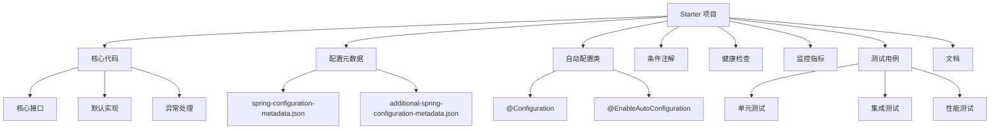
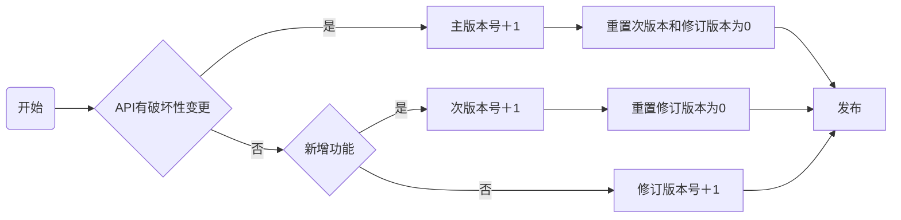

## ✨ 摘要 ##

Spring Boot Starter是企业级微服务架构的基石。本文从实战出发，完整解析Starter的开发全流程：从Maven配置、自动装配原理、条件注解使用，到配置元数据、健康检查、监控集成。通过多个真实企业级Starter案例（分布式锁、ID生成器、审计日志），提供可复用的代码模板和最佳实践。最后分享Starter治理、版本兼容、性能优化等高级话题。

## 别急着写代码，先想清楚这几个问题 ##

### 什么样的组件适合做成Starter？ ###

不是所有组件都适合做成Starter。我总结了三个判断标准：

#### ✅ 标准一：跨项目复用性强 ####

比如：Redis客户端、消息队列、分布式锁、ID生成器。这些每个服务都要用。

#### ✅ 标准二：配置复杂但模式固定 ####

比如：数据库连接池配置、线程池配置、SSL证书配置。手动配容易出错。

#### ✅ 标准三：需要统一管理和升级 ####

比如：监控上报、链路追踪、安全组件。需要全公司统一。

反面教材：我见过有人把业务层的DTO做成Starter，这就属于走火入魔了。

### Starter的命名规范：别瞎起名 ###

命名看起来是小问题，但很重要。Spring官方有明确的命名规范：

```xml
<!-- 好的命名 -->
<artifactId>spring-boot-starter-data-redis</artifactId>
<artifactId>redis-spring-boot-starter</artifactId>  <!-- 第三方可以这样 -->
 
<!-- 坏的命名 -->
<artifactId>my-redis-starter</artifactId>  <!-- 没有spring-boot前缀 -->
<artifactId>redis-starter-spring-boot</artifactId>  <!-- 顺序不对 -->
```

企业内部的命名建议：

```xml
<!-- 公司级组件 -->
<artifactId>meituan-spring-boot-starter-distributed-lock</artifactId>
 
<!-- 团队级组件 -->
<artifactId>payment-spring-boot-starter-audit</artifactId>
 
<!-- 通用工具 -->
<artifactId>common-spring-boot-starter-id-generator</artifactId>
```

## Starter的核心架构：不只是@Configuration ##

### 一个完整Starter的组成 ###

很多人以为Starter就是几个Java类，太天真了！一个生产级的Starter至少包含：



### 自动装配的原理再深入一点 ###

我知道你肯定看过@EnableAutoConfiguration的原理，但我今天要说点不一样的。

关键点：Spring Boot 2.7之后，自动配置的注册方式变了：

Spring Boot 2.7之前：用spring.factories

```ini
// META-INF/spring.factories
org.springframework.boot.autoconfigure.EnableAutoConfiguration=\
com.example.MyAutoConfiguration
```

Spring Boot 2.7之后：推荐用 `@AutoConfiguration`

```txt
// src/main/resources/META-INF/spring/
//   └── org.springframework.boot.autoconfigure.AutoConfiguration.imports
// 文件内容：
com.example.MyAutoConfiguration
```

```java
// 对应的Java代码
@AutoConfiguration  // 新的注解
@EnableConfigurationProperties(MyProperties.class)
@ConditionalOnClass(SomeClass.class)
public class MyAutoConfiguration {
    // 配置内容
}
```

为什么这么改？因为 `@AutoConfiguration` 支持更多特性：

- 自动排序（通过 `@AutoConfigureBefore`、`@AutoConfigureAfter`）
- 更好的IDE支持
- 更清晰的元数据

## 实战：手把手写一个分布式锁Starter ##

### 需求分析：我们要解决什么问题？ ###

在做技术方案前，先明确需求。我们需要的分布式锁要：

- 支持多种实现：Redis、Zookeeper、数据库
- 可配置：超时时间、重试策略
- 监控：锁获取成功率、平均耗时
- 易用：注解式、编程式都要支持

### 项目结构设计 ###

先看Maven项目结构：

```txt
distributed-lock-spring-boot-starter/
├── pom.xml
├── src/
│   ├── main/
│   │   ├── java/
│   │   │   └── com/
│   │   │       └── meituan/
│   │   │           └── lock/
│   │   │               ├── LockProperties.java          # 配置属性
│   │   │               ├── DistributedLock.java         # 核心接口
│   │   │               ├── RedisDistributedLock.java    # Redis实现
│   │   │               ├── ZkDistributedLock.java       # ZK实现
│   │   │               ├── LockAutoConfiguration.java   # 自动配置
│   │   │               ├── LockAspect.java              # AOP切面
│   │   │               └── annotation/
│   │   │                   └── Lockable.java            # 锁注解
│   │   └── resources/
│   │       ├── META-INF/
│   │       │   └── spring/
│   │       │       └── org.springframework.boot.autoconfigure.AutoConfiguration.imports
│   │       └── application-lock.yml                     # 默认配置
│   └── test/                                            # 测试代码
└── README.md
```

### 核心代码实现 ###

#### 第一步：定义配置属性 ####

```java
@ConfigurationProperties(prefix = "meituan.lock")
@Validated
public class LockProperties {
    
    /**
     * 锁类型：redis、zookeeper、database
     */
    @NotEmpty(message = "锁类型不能为空")
    private String type = "redis";
    
    /**
     * 默认超时时间（毫秒）
     */
    @Min(value = 1, message = "超时时间必须大于0")
    private long defaultTimeout = 30000;
    
    /**
     * 默认等待时间（毫秒）
     */
    @Min(value = 0, message = "等待时间不能小于0")
    private long defaultWaitTime = 10000;
    
    /**
     * 重试次数
     */
    @Min(value = 0, message = "重试次数不能小于0")
    private int retryTimes = 3;
    
    /**
     * Redis配置（当type=redis时生效）
     */
    private RedisConfig redis = new RedisConfig();
    
    /**
     * Zookeeper配置（当type=zookeeper时生效）
     */
    private ZkConfig zookeeper = new ZkConfig();
    
    // 嵌套配置类
    @Data
    public static class RedisConfig {
        private String address = "redis://localhost:6379";
        private String password;
        private int database = 0;
        private int connectionPoolSize = 64;
        private int connectionMinimumIdleSize = 24;
    }
    
    @Data
    public static class ZkConfig {
        private String servers = "localhost:2181";
        private int sessionTimeout = 30000;
        private int connectionTimeout = 15000;
        private String namespace = "meituan-lock";
    }
    
    // Getter/Setter省略...
}
```

#### 第二步：定义核心接口 ####

```java
public interface DistributedLock {
    
    /**
     * 获取锁
     * @param lockKey 锁的key
     * @param timeout 超时时间（毫秒）
     * @param waitTime 等待时间（毫秒）
     * @return 是否获取成功
     */
    boolean tryLock(String lockKey, long timeout, long waitTime);
    
    /**
     * 获取锁（使用默认配置）
     */
    default boolean tryLock(String lockKey) {
        // 实际项目中这里会从ThreadLocal或配置中获取默认值
        return tryLock(lockKey, 30000, 10000);
    }
    
    /**
     * 释放锁
     */
    void unlock(String lockKey);
    
    /**
     * 续期锁（防止锁过期）
     */
    boolean renewLock(String lockKey, long expireTime);
    
    /**
     * 锁监控指标
     */
    LockStats getStats();
    
    @Data
    class LockStats {
        private long totalAcquireAttempts;      // 总获取尝试次数
        private long successfulAcquisitions;    // 成功获取次数
        private long failedAcquisitions;        // 失败获取次数
        private long averageAcquireTime;        // 平均获取时间(ms)
        private Map<String, Long> keyStats;     // 按key统计
    }
}
```

#### 第三步：实现Redis分布式锁 ####

```java
@Slf4j
public class RedisDistributedLock implements DistributedLock {
    
    private final RedissonClient redissonClient;
    private final LockProperties properties;
    private final ConcurrentHashMap<String, RLock> lockCache = new ConcurrentHashMap<>();
    private final LockStats stats = new LockStats();
    private final AtomicLong totalAcquireAttempts = new AtomicLong();
    private final AtomicLong successfulAcquisitions = new AtomicLong();
    
    public RedisDistributedLock(LockProperties properties) {
        this.properties = properties;
        Config config = new Config();
        
        RedisConfig redisConfig = properties.getRedis();
        config.useSingleServer()
              .setAddress(redisConfig.getAddress())
              .setPassword(redisConfig.getPassword())
              .setDatabase(redisConfig.getDatabase())
              .setConnectionPoolSize(redisConfig.getConnectionPoolSize())
              .setConnectionMinimumIdleSize(redisConfig.getConnectionMinimumIdleSize());
        
        this.redissonClient = Redisson.create(config);
    }
    
    @Override
    public boolean tryLock(String lockKey, long timeout, long waitTime) {
        totalAcquireAttempts.incrementAndGet();
        long startTime = System.currentTimeMillis();
        
        try {
            RLock lock = lockCache.computeIfAbsent(lockKey, 
                key -> redissonClient.getLock(key));
            
            boolean acquired = lock.tryLock(waitTime, timeout, TimeUnit.MILLISECONDS);
            
            if (acquired) {
                successfulAcquisitions.incrementAndGet();
                long costTime = System.currentTimeMillis() - startTime;
                
                // 记录监控指标
                synchronized (stats) {
                    stats.setAverageAcquireTime(
                        (stats.getAverageAcquireTime() * (successfulAcquisitions.get() - 1) + costTime) 
                        / successfulAcquisitions.get()
                    );
                    
                    stats.getKeyStats().merge(lockKey, 1L, Long::sum);
                }
                
                log.debug("成功获取锁: {}, 耗时: {}ms", lockKey, costTime);
            } else {
                log.warn("获取锁失败: {}, 等待时间: {}ms", lockKey, waitTime);
            }
            
            return acquired;
            
        } catch (InterruptedException e) {
            Thread.currentThread().interrupt();
            log.error("获取锁被中断: {}", lockKey, e);
            return false;
        } catch (Exception e) {
            log.error("获取锁异常: {}", lockKey, e);
            return false;
        } finally {
            stats.setTotalAcquireAttempts(totalAcquireAttempts.get());
            stats.setSuccessfulAcquisitions(successfulAcquisitions.get());
            stats.setFailedAcquisitions(totalAcquireAttempts.get() - successfulAcquisitions.get());
        }
    }
    
    @Override
    public void unlock(String lockKey) {
        try {
            RLock lock = lockCache.get(lockKey);
            if (lock != null && lock.isHeldByCurrentThread()) {
                lock.unlock();
                log.debug("释放锁: {}", lockKey);
            }
        } catch (Exception e) {
            log.error("释放锁异常: {}", lockKey, e);
        }
    }
    
    // 其他方法实现省略...
}
```

#### 第四步：自动配置类 ####

```java
@AutoConfiguration
@EnableConfigurationProperties(LockProperties.class)
@ConditionalOnClass(RedissonClient.class)
@ConditionalOnProperty(prefix = "meituan.lock", name = "enabled", havingValue = "true", matchIfMissing = true)
@AutoConfigureAfter(RedisAutoConfiguration.class)
public class LockAutoConfiguration {
    
    private static final Logger log = LoggerFactory.getLogger(LockAutoConfiguration.class);
    
    @Bean
    @ConditionalOnMissingBean
    @ConditionalOnProperty(prefix = "meituan.lock", name = "type", havingValue = "redis", matchIfMissing = true)
    public DistributedLock redisDistributedLock(LockProperties properties) {
        log.info("初始化Redis分布式锁, 地址: {}", properties.getRedis().getAddress());
        return new RedisDistributedLock(properties);
    }
    
    @Bean
    @ConditionalOnMissingBean
    @ConditionalOnProperty(prefix = "meituan.lock", name = "type", havingValue = "zookeeper")
    @ConditionalOnClass(value = {CuratorFramework.class, InterProcessMutex.class})
    public DistributedLock zookeeperDistributedLock(LockProperties properties) {
        log.info("初始化Zookeeper分布式锁, servers: {}", properties.getZookeeper().getServers());
        return new ZkDistributedLock(properties);
    }
    
    @Bean
    @ConditionalOnMissingBean
    public LockAspect lockAspect(DistributedLock distributedLock) {
        return new LockAspect(distributedLock);
    }
    
    @Bean
    public LockHealthIndicator lockHealthIndicator(DistributedLock distributedLock) {
        return new LockHealthIndicator(distributedLock);
    }
    
    @Bean
    public LockMetrics lockMetrics(DistributedLock distributedLock) {
        return new LockMetrics(distributedLock);
    }
}
```

#### 第五步：AOP切面支持注解式锁 ####

```java
@Aspect
@Component
@ConditionalOnBean(DistributedLock.class)
public class LockAspect {
    
    private final DistributedLock distributedLock;
    
    public LockAspect(DistributedLock distributedLock) {
        this.distributedLock = distributedLock;
    }
    
    @Around("@annotation(lockable)")
    public Object aroundLock(ProceedingJoinPoint joinPoint, Lockable lockable) throws Throwable {
        String lockKey = generateLockKey(joinPoint, lockable);
        
        try {
            // 尝试获取锁
            boolean acquired = distributedLock.tryLock(
                lockKey, 
                lockable.timeout(), 
                lockable.waitTime()
            );
            
            if (!acquired) {
                throw new LockAcquireException("获取锁失败: " + lockKey);
            }
            
            // 执行业务方法
            return joinPoint.proceed();
            
        } finally {
            // 释放锁
            distributedLock.unlock(lockKey);
        }
    }
    
    private String generateLockKey(ProceedingJoinPoint joinPoint, Lockable lockable) {
        MethodSignature signature = (MethodSignature) joinPoint.getSignature();
        Method method = signature.getMethod();
        
        // 支持SpEL表达式
        if (StringUtils.hasText(lockable.key())) {
            return evaluateSpel(lockable.key(), joinPoint);
        }
        
        // 默认生成规则：类名+方法名+参数hash
        String className = method.getDeclaringClass().getSimpleName();
        String methodName = method.getName();
        String argsHash = Arrays.hashCode(joinPoint.getArgs()) + "";
        
        return String.format("%s.%s.%s", className, methodName, argsHash);
    }
    
    private String evaluateSpel(String expression, ProceedingJoinPoint joinPoint) {
        // SpEL表达式解析实现
        // ...
        return expression;
    }
}
```

#### 第六步：健康检查 ####

```java
@Component
public class LockHealthIndicator implements HealthIndicator {
    
    private final DistributedLock distributedLock;
    
    public LockHealthIndicator(DistributedLock distributedLock) {
        this.distributedLock = distributedLock;
    }
    
    @Override
    public Health health() {
        DistributedLock.LockStats stats = distributedLock.getStats();
        
        // 计算成功率
        double successRate = stats.getTotalAcquireAttempts() > 0 ?
            (double) stats.getSuccessfulAcquisitions() / stats.getTotalAcquireAttempts() * 100 : 0;
        
        Map<String, Object> details = new HashMap<>();
        details.put("successRate", String.format("%.2f%%", successRate));
        details.put("totalAttempts", stats.getTotalAcquireAttempts());
        details.put("successCount", stats.getSuccessfulAcquisitions());
        details.put("avgAcquireTime", stats.getAverageAcquireTime() + "ms");
        
        if (successRate < 95.0) {
            return Health.down()
                .withDetail("message", "锁获取成功率过低")
                .withDetails(details)
                .build();
        }
        
        return Health.up()
            .withDetails(details)
            .build();
    }
}
```

### 配置元数据：让IDE智能提示 ###

在 `src/main/resources/META-INF/` 下创建：

```json
// additional-spring-configuration-metadata.json
{
  "properties": [
    {
      "name": "meituan.lock.enabled",
      "type": "java.lang.Boolean",
      "description": "是否启用分布式锁",
      "defaultValue": true
    },
    {
      "name": "meituan.lock.type",
      "type": "java.lang.String",
      "description": "锁类型：redis或zookeeper",
      "defaultValue": "redis"
    },
    {
      "name": "meituan.lock.default-timeout",
      "type": "java.lang.Long",
      "description": "默认锁超时时间（毫秒）",
      "defaultValue": 30000,
      "sourceType": "com.meituan.lock.LockProperties"
    },
    {
      "name": "meituan.lock.redis.address",
      "type": "java.lang.String",
      "description": "Redis地址",
      "defaultValue": "redis://localhost:6379"
    },
    {
      "name": "meituan.lock.zookeeper.servers",
      "type": "java.lang.String",
      "description": "Zookeeper服务器地址",
      "defaultValue": "localhost:2181"
    }
  ],
  "hints": [
    {
      "name": "meituan.lock.type",
      "values": [
        {
          "value": "redis",
          "description": "基于Redis的分布式锁"
        },
        {
          "value": "zookeeper",
          "description": "基于Zookeeper的分布式锁"
        }
      ]
    }
  ]
}
```

### 默认配置文件 ###

在 `src/main/resources/` 下创建 `application-lock.yml`：

```yaml
# 分布式锁默认配置
meituan:
  lock:
    enabled: true
    type: redis
    default-timeout: 30000
    default-wait-time: 10000
    retry-times: 3
    redis:
      address: ${REDIS_HOST:redis://localhost:6379}
      password: ${REDIS_PASSWORD:}
      database: 0
      connection-pool-size: 64
      connection-minimum-idle-size: 24
    zookeeper:
      servers: ${ZK_HOST:localhost:2181}
      session-timeout: 30000
      connection-timeout: 15000
      namespace: meituan-lock
```

## Starter的使用：简单到哭 ##

### Maven依赖 ###

```xml
<dependency>
    <groupId>com.meituan</groupId>
    <artifactId>distributed-lock-spring-boot-starter</artifactId>
    <version>1.0.0</version>
</dependency>
```

### 配置（可选） ###

```yaml
# application.yml
meituan:
  lock:
    type: redis
    redis:
      address: redis://prod-redis:6379
    default-timeout: 60000  # 生产环境可以设长一点
```

### 使用方式 ###

#### 方式一：注解式（推荐） ####

```java
@Service
public class OrderService {
    
    @Lockable(key = "'order:' + #orderId", timeout = 30000)
    public Order createOrder(String orderId, OrderRequest request) {
        // 业务逻辑，自动加锁
        return orderRepository.save(convertToOrder(request));
    }
    
    @Lockable(key = "'inventory:' + #productId", waitTime = 5000)
    public void reduceInventory(String productId, int quantity) {
        // 最多等待5秒获取锁
        inventoryService.reduce(productId, quantity);
    }
}
```

#### 方式二：编程式 ####

```java
@Service
public class PaymentService {
    
    @Autowired
    private DistributedLock distributedLock;
    
    public void processPayment(String paymentId) {
        String lockKey = "payment:" + paymentId;
        
        try {
            if (distributedLock.tryLock(lockKey)) {
                // 执行业务逻辑
                paymentProcessor.process(paymentId);
            } else {
                throw new BusinessException("系统繁忙，请稍后重试");
            }
        } finally {
            distributedLock.unlock(lockKey);
        }
    }
}
```

#### 监控查看 ####

启动应用后，可以访问：

- 健康检查：`/actuator/health`（查看锁的健康状态）
- 监控指标：`/actuator/metrics/meituan.lock`（查看锁的统计指标）
- 详细信息：`/actuator/lock-stats`（如果有自定义Endpoint）

## 企业级Starter的高级特性 ##

### 多版本兼容：向前向后都要考虑 ###

Starter一旦被多个服务使用，版本兼容就是大问题。我的经验：

#### 版本策略 ####

```xml
<!-- 版本号规范 -->
<version>主版本.次版本.修订版本-里程碑</version>
<!-- 例如：1.2.3-RELEASE -->
 
<!-- 实际例子 -->
<version>1.0.0</version>      <!-- 第一个稳定版 -->
<version>1.1.0</version>      <!-- 新增功能，向后兼容 -->
<version>2.0.0</version>      <!-- 破坏性变更 -->
```

#### 兼容性保证 ####

- 配置属性兼容：新增属性要有默认值，删除属性要提供迁移期
- API兼容：公共接口不轻易修改，用 `@Deprecated` 标记过时方法
- 依赖兼容：第三方依赖版本要谨慎升级

```java
public interface DistributedLock {
    
    // v1.0的方法
    boolean tryLock(String lockKey, long timeout, long waitTime);
    
    // v1.1新增的方法（默认实现保证兼容）
    default boolean tryLock(String lockKey, LockOptions options) {
        return tryLock(lockKey, options.getTimeout(), options.getWaitTime());
    }
    
    // v1.0的方法，v2.0计划删除
    @Deprecated(since = "2.0.0", forRemoval = true)
    boolean oldMethod(String param);
}
```

### 性能优化：Starter不能拖慢应用 ###

#### 优化点一：懒加载 ####

```java
@Bean
@Lazy  // 只有实际使用时才初始化
public DistributedLock distributedLock(LockProperties properties) {
    // 初始化逻辑
}
```

#### 优化点二：连接池复用 ####

```java
@Configuration
public class LockAutoConfiguration {
    
    @Bean
    @ConditionalOnMissingBean
    public RedissonClient redissonClient(LockProperties properties) {
        // 如果应用中已经有RedissonClient，直接复用
        // 避免创建多个连接池
    }
}
```

#### 优化点三：缓存优化 ####

```java
public class RedisDistributedLock {
    // 使用WeakHashMap，避免内存泄漏
    private final Map<String, WeakReference<RLock>> lockCache = 
        Collections.synchronizedMap(new WeakHashMap<>());
}
```

### 监控告警：出了问题要知道 ###

生产级的Starter必须有完整的监控：

```java
@Component
public class LockMetrics implements MeterBinder {
    
    private final DistributedLock distributedLock;
    
    public LockMetrics(DistributedLock distributedLock) {
        this.distributedLock = distributedLock;
    }
    
    @Override
    public void bindTo(MeterRegistry registry) {
        Gauge.builder("meituan.lock.success.rate", 
                () -> calculateSuccessRate())
             .description("锁获取成功率")
             .baseUnit("percent")
             .register(registry);
        
        Timer.builder("meituan.lock.acquire.time")
             .description("锁获取耗时")
             .publishPercentiles(0.5, 0.95, 0.99)  // 50%, 95%, 99%分位
             .register(registry);
    }
    
    private double calculateSuccessRate() {
        DistributedLock.LockStats stats = distributedLock.getStats();
        if (stats.getTotalAcquireAttempts() == 0) {
            return 100.0;
        }
        return (double) stats.getSuccessfulAcquisitions() 
               / stats.getTotalAcquireAttempts() * 100;
    }
}
```

告警规则示例（Prometheus）：

```yaml
groups:
  - name: lock_alerts
    rules:
      - alert: LockSuccessRateLow
        expr: meituan_lock_success_rate < 95
        for: 5m
        labels:
          severity: warning
        annotations:
          summary: "锁获取成功率过低"
          description: "锁获取成功率低于95%，当前值: {{ $value }}%"
```

## Starter的测试策略 ##

### 单元测试：保证代码质量 ###

```java
@ExtendWith(MockitoExtension.class)
class RedisDistributedLockTest {
    
    @Mock
    private RedissonClient redissonClient;
    
    @Mock
    private RLock rLock;
    
    private RedisDistributedLock distributedLock;
    
    @BeforeEach
    void setUp() {
        LockProperties properties = new LockProperties();
        properties.setType("redis");
        
        when(redissonClient.getLock(anyString())).thenReturn(rLock);
        
        // 通过反射设置redissonClient
        distributedLock = new RedisDistributedLock(properties);
        setField(distributedLock, "redissonClient", redissonClient);
    }
    
    @Test
    void testTryLock_Success() throws InterruptedException {
        // given
        when(rLock.tryLock(anyLong(), anyLong(), any())).thenReturn(true);
        
        // when
        boolean result = distributedLock.tryLock("test-key", 30000, 10000);
        
        // then
        assertTrue(result);
        verify(rLock).tryLock(10000, 30000, TimeUnit.MILLISECONDS);
    }
    
    @Test
    void testTryLock_Timeout() throws InterruptedException {
        // given
        when(rLock.tryLock(anyLong(), anyLong(), any())).thenReturn(false);
        
        // when
        boolean result = distributedLock.tryLock("test-key", 30000, 10000);
        
        // then
        assertFalse(result);
    }
}
```

### 集成测试：验证真实环境 ###

```java
@SpringBootTest
@AutoConfigureMockMvc
@Testcontainers  // 使用Testcontainers启动真实Redis
class DistributedLockIntegrationTest {
    
    @Container
    static RedisContainer redis = new RedisContainer("redis:6.2")
            .withExposedPorts(6379);
    
    @DynamicPropertySource
    static void redisProperties(DynamicPropertyRegistry registry) {
        registry.add("meituan.lock.redis.address", 
            () -> String.format("redis://%s:%d", 
                redis.getHost(), 
                redis.getFirstMappedPort()));
    }
    
    @Autowired
    private DistributedLock distributedLock;
    
    @Test
    void testDistributedLockInRealRedis() {
        // given
        String lockKey = "integration-test-key";
        
        // when
        boolean acquired = distributedLock.tryLock(lockKey, 5000, 1000);
        
        // then
        assertTrue(acquired);
        
        // 再次获取应该失败
        boolean acquiredAgain = distributedLock.tryLock(lockKey, 5000, 1000);
        assertFalse(acquiredAgain);
        
        // 释放后可以再次获取
        distributedLock.unlock(lockKey);
        boolean acquiredAfterRelease = distributedLock.tryLock(lockKey, 5000, 1000);
        assertTrue(acquiredAfterRelease);
    }
}
```

### 性能测试：确保不影响应用性能 ###

```java
@SpringBootTest
@Tag("performance")
class DistributedLockPerformanceTest {
    
    @Autowired
    private DistributedLock distributedLock;
    
    @Test
    @RepeatedTest(10)  // 重复10次
    void testLockAcquirePerformance() {
        // warm up
        IntStream.range(0, 1000).parallel().forEach(i -> {
            distributedLock.tryLock("perf-" + i, 1000, 100);
        });
        
        // actual test
        long startTime = System.nanoTime();
        
        IntStream.range(0, 10000).parallel().forEach(i -> {
            distributedLock.tryLock("perf-" + i, 1000, 100);
        });
        
        long duration = System.nanoTime() - startTime;
        double avgTime = duration / 10000.0 / 1_000_000.0;  // 转换为毫秒
        
        System.out.printf("平均获取锁时间: %.3f ms%n", avgTime);
        
        // 断言：平均时间应小于1ms
        assertTrue(avgTime < 1.0, "锁获取时间过长: " + avgTime + "ms");
    }
}
```

## Starter的发布与治理 ##

### Maven发布配置 ###

```xml
<!-- pom.xml 配置 -->
<project>
    <modelVersion>4.0.0</modelVersion>
    
    <groupId>com.meituan</groupId>
    <artifactId>distributed-lock-spring-boot-starter</artifactId>
    <version>1.0.0</version>
    <packaging>jar</packaging>
    
    <name>Meituan Distributed Lock Starter</name>
    <description>Spring Boot Starter for distributed lock</description>
    
    <!-- 许可证信息 -->
    <licenses>
        <license>
            <name>Apache License, Version 2.0</name>
            <url>https://www.apache.org/licenses/LICENSE-2.0</url>
        </license>
    </licenses>
    
    <!-- SCM信息 -->
    <scm>
        <url>https://github.com/meituan/distributed-lock-starter</url>
        <connection>scm:git:git://github.com/meituan/distributed-lock-starter.git</connection>
        <developerConnection>scm:git:ssh://github.com/meituan/distributed-lock-starter.git</developerConnection>
    </scm>
    
    <!-- 开发者信息 -->
    <developers>
        <developer>
            <name>Your Name</name>
            <email>your.email@meituan.com</email>
            <organization>Meituan</organization>
        </developer>
    </developers>
    
    <!-- 发布到Maven仓库的配置 -->
    <distributionManagement>
        <repository>
            <id>meituan-releases</id>
            <url>https://maven.meituan.com/repository/releases</url>
        </repository>
        <snapshotRepository>
            <id>meituan-snapshots</id>
            <url>https://maven.meituan.com/repository/snapshots</url>
        </snapshotRepository>
    </distributionManagement>
</project>
```

### 版本管理策略 ###

我推荐使用语义化版本（Semantic Versioning）：



实际例子：

- 1.0.0：第一个稳定版本
- 1.0.1：修复bug
- 1.1.0：新增功能，向后兼容
- 2.0.0：破坏性变更

### 依赖管理 ###

Starter的依赖管理要特别小心：

```xml
<dependencyManagement>
    <dependencies>
        <!-- 统一管理Spring Boot版本 -->
        <dependency>
            <groupId>org.springframework.boot</groupId>
            <artifactId>spring-boot-dependencies</artifactId>
            <version>${spring-boot.version}</version>
            <type>pom</type>
            <scope>import</scope>
        </dependency>
    </dependencies>
</dependencyManagement>
 
<dependencies>
    <!-- 必须的依赖 -->
    <dependency>
        <groupId>org.springframework.boot</groupId>
        <artifactId>spring-boot-starter</artifactId>
        <scope>compile</scope>
        <!-- 注意：不要带版本号，由dependencyManagement管理 -->
    </dependency>
    
    <!-- 可选依赖：用户想用Redis锁时才需要 -->
    <dependency>
        <groupId>org.redisson</groupId>
        <artifactId>redisson-spring-boot-starter</artifactId>
        <scope>provided</scope>  <!-- 关键！provided作用域 -->
        <optional>true</optional>  <!-- 标记为可选 -->
    </dependency>
    
    <!-- 测试依赖 -->
    <dependency>
        <groupId>org.springframework.boot</groupId>
        <artifactId>spring-boot-starter-test</artifactId>
        <scope>test</scope>
    </dependency>
</dependencies>
```

关键点：可选依赖用 `<optional>true</optional>`，这样用户的项目不会强制引入这些依赖。

## 企业级Starter架构演进 ##

### 从单一Starter到Starter套件 ###

当Starter多了之后，就需要考虑架构了。在美团，我们是这样组织的：

```txt
meituan-spring-boot-starters/          # 父项目
├── meituan-spring-boot-starter-parent # 父pom，统一管理
├── meituan-spring-boot-starter-lock   # 分布式锁
├── meituan-spring-boot-starter-id     # ID生成器
├── meituan-spring-boot-starter-mq     # 消息队列
├── meituan-spring-boot-starter-cache  # 缓存
├── meituan-spring-boot-starter-trace  # 链路追踪
└── meituan-spring-boot-starter-all    # 全家桶（可选）
```

### Starter的依赖关系管理 ###

复杂的Starter之间可能有依赖关系，需要仔细管理：

```xml
<!-- meituan-spring-boot-starter-cache 的pom.xml -->
<dependencies>
    <!-- 内部依赖：先于其他Starter发布 -->
    <dependency>
        <groupId>com.meituan</groupId>
        <artifactId>meituan-spring-boot-starter-lock</artifactId>
        <version>${project.version}</version>
        <optional>true</optional>
    </dependency>
</dependencies>
```

### 配置的统一管理 ###

多个Starter可能有相同的配置项（比如Redis地址），需要统一：

```java
// 公共配置类
@ConfigurationProperties(prefix = "meituan")
public class MeituanCommonProperties {
    
    /**
     * 公共Redis配置
     */
    private RedisCommonConfig redis = new RedisCommonConfig();
    
    /**
     * 公共Zookeeper配置  
     */
    private ZkCommonConfig zookeeper = new ZkCommonConfig();
    
    /**
     * 监控配置
     */
    private MonitorConfig monitor = new MonitorConfig();
    
    @Data
    public static class RedisCommonConfig {
        private String address = "redis://localhost:6379";
        private String password;
        private int database = 0;
    }
    
    // 其他配置类...
}
 
// 在各个Starter中引用
@ConfigurationProperties(prefix = "meituan.lock")
public class LockProperties {
    
    @Autowired
    private MeituanCommonProperties commonProperties;
    
    // 优先使用专属配置，没有则用公共配置
    public String getRedisAddress() {
        return StringUtils.hasText(redis.getAddress()) ? 
               redis.getAddress() : 
               commonProperties.getRedis().getAddress();
    }
}
```

## 故障排查与调试 ##

### 常见问题排查清单 ###

我总结了Starter开发中最常见的几个问题：

#### 问题1：自动配置不生效 ####

排查步骤：

- 检查 `META-INF/spring/org.springframework.boot.autoconfigure.AutoConfiguration.imports` 文件
- 检查条件注解是否满足
- 检查是否有其他Starter排除

```bash
# 启动时加参数查看自动配置报告
java -jar app.jar --debug

# 或者在代码中获取
@Autowired
private List<String> autoConfigurations;
```

#### 问题2：Bean冲突 ####

解决方案：

```java
@Bean
@ConditionalOnMissingBean  // 关键：用户有自定义时，不用我们的
public SomeBean someBean() {
    return new SomeBean();
}
 
// 或者用@Primary指定优先级
@Bean
@Primary
public SomeBean defaultSomeBean() {
    return new SomeBean();
}
```

#### 问题3：配置属性不生效 ####

排查：

- 检查 `spring-configuration-metadata.json` 格式
- 检查属性前缀是否正确
- 检查是否有其他配置覆盖

```java
// 在Starter中添加配置验证
@PostConstruct
public void validateConfig() {
    if (!isValid(config)) {
        throw new IllegalStateException("配置无效: " + config);
    }
}
```

### 调试技巧 ###

#### 技巧1：在IDE中调试自动配置 ####

```java
// 在自动配置类中加断点
@AutoConfiguration
public class MyAutoConfiguration {
    
    public MyAutoConfiguration() {
        // 这里加断点，可以看到什么时候被加载
        System.out.println("MyAutoConfiguration被加载");
    }
}
```

#### 技巧2：查看条件评估报告 ####

```java
@SpringBootApplication
public class Application {
    
    public static void main(String[] args) {
        SpringApplication app = new SpringApplication(Application.class);
        
        // 添加监听器，输出条件评估报告
        app.addListeners(new ApplicationListener<ApplicationPreparedEvent>() {
            @Override
            public void onApplicationEvent(ApplicationPreparedEvent event) {
                ConditionEvaluationReport report = 
                    ConditionEvaluationReport.get(event.getApplicationContext().getBeanFactory());
                
                // 打印报告到文件
                try (PrintWriter writer = new PrintWriter("condition-report.txt")) {
                    report.getConditionAndOutcomesBySource().forEach((source, outcomes) -> {
                        writer.println(source);
                        outcomes.forEach(outcome -> {
                            writer.println("  " + outcome.getOutcome());
                        });
                    });
                }
            }
        });
        
        app.run(args);
    }
}
```

#### 技巧3：使用Spring Boot Actuator端点 ####

```yaml
# application.yml
management:
  endpoints:
    web:
      exposure:
        include: conditions,beans,configprops
```

然后访问：

- `/actuator/conditions`：查看条件评估详情
- `/actuator/beans`：查看所有Bean
- `/actuator/configprops`：查看配置属性

## 最后的话：Starter开发的"道"与"术" ##

写了这么多年Starter，我最大的体会是：*技术是术，设计思想才是道*。

好的Starter不是代码堆砌，而是对开发者体验的极致追求。你看Spring Boot官方的Starter，每一个都经过精心设计：

- 开箱即用：默认配置就能工作
- 配置简单：几个属性就能满足大部分需求
- 扩展灵活：可以深度定制
- 文档完整：有明确的指导

所以，在你动手写Starter之前，先问自己几个问题：

- 🤔 这个Starter解决了什么痛点？
- 🤔 用户使用起来方便吗？
- 🤔 配置项是不是太多了？
- 🤔 向后兼容怎么保证？
- 🤔 出了问题怎么排查？

> 记住：*你写的不是代码，是生产力工具*。好的Starter能让团队效率翻倍，坏的Starter能让团队陷入泥潭。

