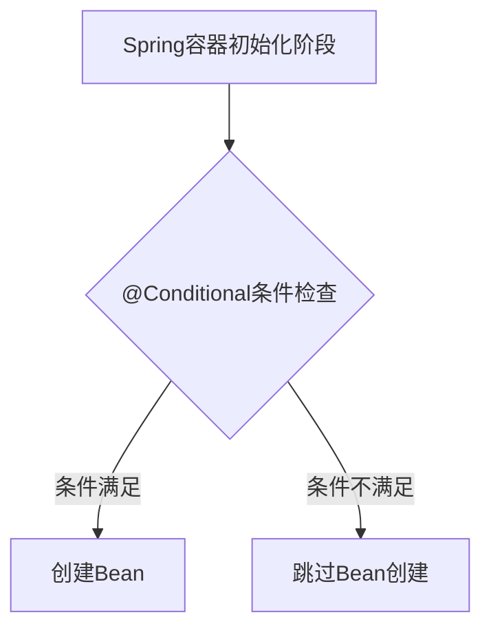
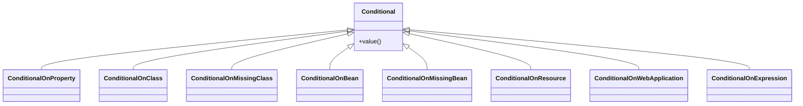
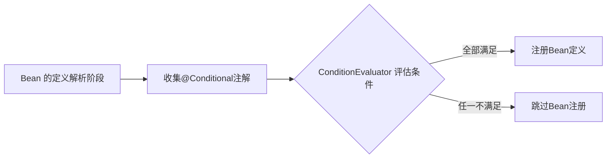

在日常开发中，你是不是经常遇到这样的场景：不同环境需要不同配置，测试环境要用内存数据库，生产环境必须连接 MySQL？或者某些功能只想在特定条件下才启用？Spring 的@Conditional 注解就是为解决这些问题而生的，它让你的应用变得更加智能。

## @Conditional 注解是什么？ ##

@Conditional 是 Spring 4.0 引入的一个核心注解，它可以根据特定条件决定是否创建某个 Bean 或启用某个配置。通俗点说，它就像一个"看门人"（条件匹配器），只有条件满足了，才允许相关 Bean 进入 Spring 容器。



## 基本用法 ##

@Conditional 注解的基本用法很简单，你只需要实现 Condition 接口，并在 matches 方法中编写判断逻辑：

```java
public class LinuxCondition implements Condition {
    @Override
    public boolean matches(ConditionContext context, AnnotatedTypeMetadata metadata) {
        // 获取当前系统名称
        String osName = context.getEnvironment().getProperty("os.name");
        // 如果包含Linux字样，就返回true
        return osName != null && osName.contains("Linux");
    }
}

public class WindowsCondition implements Condition {
    @Override
    public boolean matches(ConditionContext context, AnnotatedTypeMetadata metadata) {
        // 获取当前系统名称
        String osName = context.getEnvironment().getProperty("os.name");
        // 如果包含Windows字样，就返回true
        return osName != null && osName.contains("Windows");
    }
}

@Configuration
public class SystemConfig {

    @Bean
    @Conditional(LinuxCondition.class)
    public CommandRunner linuxCommandRunner() {
        return new LinuxCommandRunner();
    }

    @Bean
    @Conditional(WindowsCondition.class)
    public CommandRunner windowsCommandRunner() {
        return new WindowsCommandRunner();
    }
}
```

在这个例子中，Spring 会根据当前操作系统类型，自动选择合适的 CommandRunner 实现。

## Spring Boot 中的常用条件注解 ##

Spring Boot 在@Conditional 基础上，提供了一系列更便捷的派生注解：




### @ConditionalOnProperty ###

这个注解允许根据配置属性的值决定是否创建 Bean：

```java
@Configuration
public class CacheConfig {

    @Bean
    @ConditionalOnProperty(
        prefix = "app",
        name = "cache.enabled",
        havingValue = "true",
        matchIfMissing = false // 默认值为true，设置为false表示属性不存在时条件不满足
    )
    public CacheManager cacheManager() {
        return new ConcurrentMapCacheManager();
    }
}
```

在这个例子中：

- 只有当 `app.cache.enabled=true` 时，才会创建这个缓存管理器
- `prefix` 参数设置了配置属性的前缀
- `matchIfMissing = false`表示如果属性不存在，条件不满足（注意默认值为 true）

### @ConditionalOnClass 和@ConditionalOnMissingClass ###

这两个注解用于根据类路径（classpath）中是否存在特定类来判断：

```java
@Configuration
public class RedisConfig {

    @Bean
    @ConditionalOnClass(RedisOperations.class)
    public RedisTemplate<String, Object> redisTemplate(RedisConnectionFactory factory) {
        RedisTemplate<String, Object> template = new RedisTemplate<>();
        template.setConnectionFactory(factory);
        return template;
    }
}
```

这段配置会在项目依赖了 Redis 相关库时自动创建 RedisTemplate，如果没有引入 Redis 依赖，这个 Bean 就不会被创建。

### @ConditionalOnBean 和@ConditionalOnMissingBean ###

这两个注解根据容器中是否存在某个 Bean 来判断：

```java
@Configuration
public class DataSourceConfig {

    @Bean
    @ConditionalOnMissingBean
    public DataSource defaultDataSource() {
        return new EmbeddedDatabaseBuilder()
                .setType(EmbeddedDatabaseType.H2)
                .build();
    }
}
```

这个例子中，只有当容器中没有其他 DataSource 类型的 Bean 时，才会创建这个默认数据源。

### @ConditionalOnResource ###

这个注解用于检查类路径或文件系统中是否存在特定资源文件：

```java
@Configuration
public class AppConfig {

    @Bean
    @ConditionalOnResource(resources = "classpath:config/app-config.properties")
    public AppSettings appSettings() {
        return new AppSettings();
    }

    @Bean
    @ConditionalOnResource(resources = {"file:/etc/app/security.yml", "classpath:default-security.yml"})
    public SecurityConfig securityConfig() {
        return new SecurityConfig();
    }
}
```

#### 资源解析原理 ####

在底层，`@ConditionalOnResource` 使用 Spring 的 `ResourceLoader` 机制来解析和检查资源是否存在：

```java
// OnResourceCondition内部简化逻辑
public boolean matches(ConditionContext context, AnnotatedTypeMetadata metadata) {
    ResourceLoader loader = context.getResourceLoader();
    for (String resource : resources) {
        if (loader.getResource(resource).exists()) {
            return true; // 只要有一个资源存在，条件就满足
        }
    }
    return false;
}
```

值得注意的是，`resources` 数组是 OR 关系——只要有一个资源存在，条件就满足。这在提供默认配置时特别有用。

#### 支持的资源路径前缀 ####

`@ConditionalOnResource` 支持多种资源路径格式：

- `classpath`: - 类路径下的资源（如 JAR 包或 classes 目录中的文件）
- `file`: - 文件系统中的资源（如服务器磁盘上的文件）
- `classpath*`: - 类路径下所有匹配的资源（支持通配符）

#### 实际应用场景 ####

特定功能的配置文件检测：

```java
@Configuration
@ConditionalOnResource(resources = "classpath:features/payment-gateway.properties")
public class PaymentGatewayConfig {
    // 当存在支付网关配置文件时，才启用相关功能
    // ...
}
```

根据环境选择配置源：

```java
@Bean
@ConditionalOnResource(resources = {
    "file:/etc/myapp/config.yml",  // 先检查外部配置
    "classpath:config/default.yml"  // 再检查默认配置
})
public ConfigurationLoader configLoader(ResourceLoader resourceLoader) {
    Resource resource = null;
    // 按优先级顺序查找第一个存在的资源
    for (String path : new String[] {"file:/etc/myapp/config.yml", "classpath:config/default.yml"}) {
        Resource r = resourceLoader.getResource(path);
        if (r.exists()) {
            resource = r;
            break;
        }
    }
    return new ConfigurationLoader(resource);
}
```

结合其他条件注解使用：

```java
@Bean
@ConditionalOnClass(name = "io.micrometer.core.instrument.MeterRegistry")
@ConditionalOnResource(resources = "classpath:metrics-config.properties")
public MetricsCollector metricsCollector() {
    // 同时满足两个条件：
    // 1. 类路径中有度量库
    // 2. 存在度量配置文件
    return new MetricsCollector();
}
```

#### 注意事项 ####

- 资源路径无效（如格式错误）不会导致应用启动失败，但条件会被视为不满足
- 网络资源（如 `http:` 前缀）不受官方支持，可能导致不可预期的行为
- 对于大量资源检查，性能可能受影响，建议只检查关键资源

## 自定义条件注解 ##

除了使用 Spring 提供的条件注解，我们还可以创建自己的条件注解。只需两步：

- 实现 Condition 接口
- 创建自定义注解

```java
// 步骤1：实现Condition接口
public class OnEnvCondition implements Condition {

    @Override
    public boolean matches(ConditionContext context, AnnotatedTypeMetadata metadata) {
        Map<String, Object> attrs = metadata.getAnnotationAttributes(ConditionalOnEnv.class.getName());
        String[] envs = (String[]) attrs.get("value");
        String[] activeProfiles = context.getEnvironment().getActiveProfiles();

        // 增加非空检查，避免数组越界
        if (activeProfiles.length == 0) return false;
        String activeProfile = activeProfiles[0];

        for (String env : envs) {
            if (env.equalsIgnoreCase(activeProfile)) {
                return true;
            }
        }
        return false;
    }
}

// 步骤2：创建自定义注解
@Target({ElementType.TYPE, ElementType.METHOD})
@Retention(RetentionPolicy.RUNTIME)
@Documented
@Conditional(OnEnvCondition.class)
public @interface ConditionalOnEnv {
    String[] value() default {};
}
```

使用自定义条件注解：

```java
@Configuration
public class DataSourceConfig {

    @Bean
    @ConditionalOnEnv({"dev", "test"})
    public DataSource h2DataSource() {
        return new EmbeddedDatabaseBuilder()
                .setType(EmbeddedDatabaseType.H2)
                .build();
    }

    @Bean
    @ConditionalOnEnv("prod")
    public DataSource mysqlDataSource() {
        return DataSourceBuilder.create()
                .url("jdbc:mysql://localhost:3306/prod_db")
                .username("root")
                .password("password")
                .build();
    }
}
```

## 条件注解的底层机制 ##

Spring 框架如何处理@Conditional 注解的？来看看它的内部工作原理：



核心流程：

- 在 Spring 容器解析 Bean 定义时（而非创建 Bean 实例时），遇到带有`@Conditional` 注解的组件
- `ConfigurationClassPostProcessor` 处理配置类时，使用`ConditionEvaluator` 判断条件
- 调用每个 `Condition` 实现类的 `matches()` 方法进行条件检查
- 只有所有条件都满足，才会注册 Bean 定义到容器中

简化的 Spring 源码逻辑：

```java
// Spring内部逻辑简化示意
public boolean shouldSkip(AnnotatedTypeMetadata metadata) {
    if (metadata.isAnnotated(Conditional.class.getName())) {
        for (Condition condition : conditions) {
            if (!condition.matches(context, metadata)) {
                return true; // 跳过此Bean
            }
        }
    }
    return false; // 不跳过，正常注册Bean
}
```

## 条件注解的组合使用 ##

@Conditional 注解支持多种组合方式，增加了使用的灵活性：

多个条件注解组合（AND 关系）：

```java
@Bean
@ConditionalOnProperty(name = "feature.new-ui", havingValue = "true")
@ConditionalOnClass(NewUIRenderer.class)
public UIService newUIService() {
    return new NewUIServiceImpl();
}
```

在@Conditional 中使用多个条件类：

```java
@Bean
@Conditional({LinuxCondition.class, JDK11Condition.class})
public MyBean myBean() {
    return new MyBean();
}
```

自定义复合条件（如 OR 关系）：

```java
public class DevOrTestEnvCondition implements Condition {
    @Override
    public boolean matches(ConditionContext context, AnnotatedTypeMetadata metadata) {
        String[] activeProfiles = context.getEnvironment().getActiveProfiles();
        for (String profile : activeProfiles) {
            if ("dev".equals(profile) || "test".equals(profile)) {
                return true;
            }
        }
        return false;
    }
}
```

## 实战案例：动态切换缓存实现 ##

下面通过一个实际案例，看看如何使用条件注解灵活切换缓存实现：

首先，定义一个缓存接口：

```java
public interface CacheService {
    void put(String key, Object value);
    Object get(String key);
    void remove(String key);
}
```

然后，实现两种不同的缓存方案：

```java
public class RedisCacheService implements CacheService {
    private final RedisTemplate<String, Object> redisTemplate;

    public RedisCacheService(RedisTemplate<String, Object> redisTemplate) {
        this.redisTemplate = redisTemplate;
    }

    @Override
    public void put(String key, Object value) {
        redisTemplate.opsForValue().set(key, value);
    }

    @Override
    public Object get(String key) {
        return redisTemplate.opsForValue().get(key);
    }

    @Override
    public void remove(String key) {
        redisTemplate.delete(key);
    }
}

public class LocalCacheService implements CacheService {
    private final Map<String, Object> cacheMap = new ConcurrentHashMap<>();

    @Override
    public void put(String key, Object value) {
        cacheMap.put(key, value);
    }

    @Override
    public Object get(String key) {
        return cacheMap.get(key);
    }

    @Override
    public void remove(String key) {
        cacheMap.remove(key);
    }
}
```

最后，通过条件注解智能选择缓存实现：

```java
@Configuration
public class CacheConfig {

    @Bean
    @ConditionalOnProperty(prefix = "app", name = "cache.type", havingValue = "redis")
    @ConditionalOnClass(RedisTemplate.class)
    @Primary
    public CacheService redisCacheService(RedisTemplate<String, Object> redisTemplate) {
        return new RedisCacheService(redisTemplate);
    }

    @Bean
    @ConditionalOnMissingBean(CacheService.class)
    public CacheService localCacheService() {
        return new LocalCacheService();
    }
}
```

这样配置后，系统会根据配置和环境自动选择合适的缓存实现：

- 如果配置了 `app.cache.type=redis` 且引入了 Redis 依赖，使用 Redis 缓存
- 否则，使用本地内存缓存作为默认实现

## 条件注解使用技巧 ##

### 条件注解的执行顺序 ###

当一个组件上有多个条件注解时，Spring 会按照一定的先后顺序评估这些条件：

- 类路径检查（如 `@ConditionalOnClass`）通常优先于 Bean 存在性检查（如@ConditionalOnBean）
- 可以使用 `@Order` 注解控制自定义条件的执行顺序（数值越小优先级越高）
- 先满足基础环境条件，再检查依赖条件是一种常见模式

### 调试条件评估 ###

在开发过程中，如果发现条件没有按预期工作，可以通过以下方式进行调试：

方法 1：在 `application.properties` 中添加：

```ini
debug=true
```

Spring Boot 会输出详细的条件评估报告，帮助你找出问题所在。输出大概是这样的：

```txt
CONDITIONS EVALUATION REPORT
Positive matches:
-----------------
   CacheAutoConfiguration matched:
      - @ConditionalOnClass found required class 'org.springframework.cache.CacheManager' (OnClassCondition)

Negative matches:
-----------------
   RedisAutoConfiguration:
      Did not match:
         - @ConditionalOnClass did not find required class 'org.springframework.data.redis.core.RedisOperations' (OnClassCondition)
```

方法 2：在 IDE 中对 `Condition#matches` 方法设置断点，进行调试。

### @ConditionalOnWebApplication 的多种模式 ###

`@ConditionalOnWebApplication` 支持不同的 Web 应用类型：

```java
// 仅在传统Servlet环境中生效
@Bean
@ConditionalOnWebApplication(type = WebApplicationType.SERVLET)
public ServletFilter securityFilter() {
    return new SecurityFilter();
}

// 仅在响应式Web环境中生效
@Bean
@ConditionalOnWebApplication(type = WebApplicationType.REACTIVE)
public WebFilter reactiveFilter() {
    return new ReactiveSecurityFilter();
}

// 在任何Web环境中都生效（默认行为）
@Bean
@ConditionalOnWebApplication
public WebLogger webLogger() {
    return new WebLogger();
}
```

### 用好@ConditionalOnExpression ###

@ConditionalOnExpression 支持 SpEL 表达式，可以构建复杂的条件判断：

```java
// 基本用法
@Bean
@ConditionalOnExpression("${app.feature.enabled:false} and ${app.environment} == 'production'")
public FeatureManager productionFeatureManager() {
    return new EnhancedFeatureManager();
}

// 复杂示例：结合系统属性和容器引用
@Bean
@ConditionalOnExpression("#{systemProperties['java.version'].startsWith('17') && @environment.getProperty('app.mode') == 'advanced'}")
public AdvancedService advancedService() {
    return new AdvancedServiceImpl();
}
```

第二个例子演示了如何：

- 检查 Java 版本（`systemProperties['java.version']`）
- 引用 Spring 容器中的 bean（`@environment`）
- 组合多个条件判断

## @Profile 与@Conditional 的比较 ##

很多开发者会困惑什么时候该用 `@Profile`，什么时候该用`@Conditional`：

```java
// 使用@Profile
@Configuration
@Profile("dev")
public class DevConfig {
    // dev环境专用配置
}

// 使用@Conditional
@Configuration
@ConditionalOnProperty(name = "app.mode", havingValue = "development")
public class DevelopmentConfig {
    // 开发模式专用配置
}
```

二者的区别和选择：

- `@Profile` 更简单，专注于环境分组管理，通过 `spring.profiles.active` 激活
- `@Conditional` 更灵活，可以基于任何条件，不仅限于环境
- 复杂场景下可以组合使用：

```java
@Bean
@Profile("prod") // 仅在prod环境
@ConditionalOnProperty("app.metrics.enabled") // 且启用了指标收集
public MetricsCollector metricsCollector() {
    return new MetricsCollector();
}
```

## 性能注意事项 ##

条件注解是把双刃剑，用好了能大幅提升灵活性，用不好会影响性能：

- 避免重型操作：在matches()方法中避免执行耗时操作

```java
// 不推荐：条件检查中执行网络请求
public boolean matches(ConditionContext context, AnnotatedTypeMetadata metadata) {
    return httpClient.checkServerStatus().isOk(); // 可能导致启动缓慢
}
```

- 缓存条件结果：对于频繁使用的条件，考虑缓存结果

```java
// 优化：缓存检查结果
public class CachingCondition implements Condition {
    private static Boolean result = null;

    @Override
    public boolean matches(ConditionContext context, AnnotatedTypeMetadata metadata) {
        if (result == null) {
            // 计算结果（仅首次执行）
            result = computeResult(context);
        }
        return result;
    }
}
```

- 控制条件数量：过多的条件注解会增加启动时间，适度使用

## 常见问题与注意事项 ##

使用条件注解时，有几个常见问题需要注意：

- Bean 定义阶段 vs 实例化阶段：

```java
@Configuration
public class Config {
    @Bean
    @ConditionalOnMissingBean // 检查时还未创建其他Bean
    public Service defaultService() {
        return new DefaultService();
    }

    @Bean
    public Service customService() { // 此Bean定义已被注册，但可能未实例化
        return new CustomService();
    }
}
```

在这个例子中，由于 `customService()` 已被注册为 Bean 定义， `defaultService()` 的条件会失败，即使 `customService()` 还未被实例化。

- 避免循环依赖：

```java
// 避免这样的循环依赖
@Bean
@ConditionalOnBean(name = "beanB")
public BeanA beanA() { return new BeanA(); }

@Bean
@ConditionalOnBean(name = "beanA")
public BeanB beanB() { return new BeanB(); }
```

这种循环依赖的条件配置会导致两个 Bean 都无法创建。

## 总结 ##

| **条件注解**        |      **用途**      |    **应用场景**      |
| :------------- | :-----------: | :-----------: |
|   `@ConditionalOnProperty`   |  根据配置属性判断  |  功能开关、环境配置  |
|   `@ConditionalOnClass`   |  根据类路径判断  |  依赖检测  |
|   `@ConditionalOnMissingClass`   |  根据类路径不存在判断  |  依赖检测  |
|   `@ConditionalOnBean`   |  根据 Bean 存在判断  |  依赖其他组件  |
|   `@ConditionalOnMissingBean`   |  根据 Bean 不存在判断  |  提供默认实现  |
|   `@ConditionalOnWebApplication`   |  在 Web 应用中判断  |  Web 环境检测（SERVLET/REACTIVE/ANY）  |
|   `@ConditionalOnResource`   |  根据资源存在判断  |  配置文件/静态资源/证书文件等存在性检测  |
|   `@ConditionalOnExpression`   |  根据 SpEL 表达式判断  |  复杂条件判断  |
